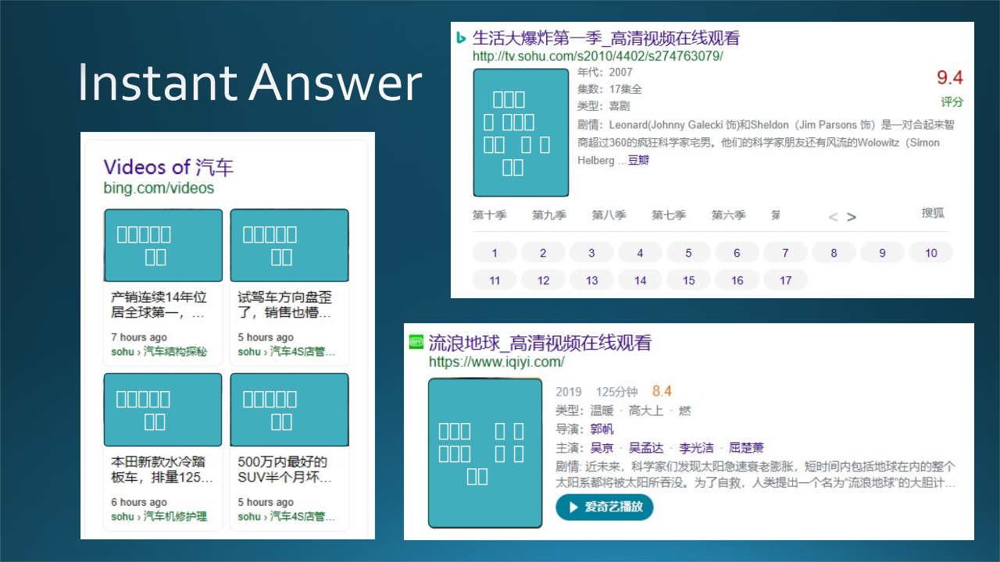

## 2.6 软件工程师的常见误区

软件工程师的常见误区如图 2.6.1 所示。

图 2.6.1 软件工程师的常见误区

### 2.6.1 重新发明轮子，浪费时间

这是个老生常谈的话题，“反复造轮子”（Reinvent The Wheel）。新程序员总是喜欢反复“造轮子”，其原因不外乎以下几点：

- 自认为当前的实现不够好，所以不得不从头重写整个东西；
- 对某个现有产品缺乏信任，怕在使用过程遇到麻烦；
- 不想花时间去学习别人给定的框架、约束、接口等等，认为自己写一个新的更快、更有趣；
- 想体现自己的价值。

很多年前，笔者的一个朋友认为 Windows Forms UI 控件实在是太简单了，不能满足复杂的应用，原始他想重新编写自己的 UI 控件，并花费了大量的时间。最后，他造的 GUI 工具被商业化成体系的 .Net UI 控件轻松打败，他唯一能获得的只是经验，当然还可以和儿子吹一吹当年与微软竞争的故事（虽然微软并不知道有这么一位竞争者存在）。

中国人民当年自己搞两弹一星，付出了艰苦卓绝的努力；但是 1999 年直接花钱从乌克兰买来一艘完成度为 68% 的瓦良格号，后经过 13 年时间改造成为辽宁号航母，但这也比零基础从头制造一艘航母要快很多。

### 2.6.2 过于乐观自信，严重超期

年轻的程序员一般都比较乐观，而且表现在表面上，比如“您放心，这件事我两天搞定！”，结果经历了停电、死机、重新安装系统和工具软件、一个 Bug 找了 2 个小时（结果是因为把“=”写成了“==”）、由于 API 技术文档参数顺序写反了而导致的结果不对......等等挫折，最后花了 5 天的时间才搞定。

同样，即便都是有经验的程序员组成的团队也是如此，软件开发会存在比如节假日休假，员工请假，成员内部配合默契不够好，进展方向错误等等一系列类似于上文事例中的现实因素，阻碍着我们项目的完成，延误项目完成日期。

这个现象在心理学上，称之为规划谬误，规划谬误这一概念是由诺贝尔经济学奖获得者，著名心理学家 Kahneman 和 Tversky（1979）首次提出的。

规划谬误是指人们在估计未来任务的完成时间时,，倾向于过度乐观，低估任务完成时间的一种现象。规划谬误的心理机制主要包括规划谬误理论和记忆偏差理论。规划谬误的影响因素主要有认知因素、动机因素、个体的经验水平、目标任务的性质等。

其实不只是我们个人，许多大的工程，也存在这样的规划谬误的问题：

- 悉尼歌剧院的建设就是一个说明这一谬论的著名例子。它最初估计于1963年完成，耗资700万美元，但该项目最终在预期日期后的10年内完成，且耗资1.02亿美元。
- 埃及博物馆新馆，2002 年立项，2012 年动工，预计 2015 年竣工。结果由于施工难度大、造价超预算等多方面原因，延迟到 2019 年；但是新冠疫情袭来，再次推迟到 2021 年；然后，埃及内乱，推迟到 2023 年春天。

所以，我们在估计项目的完成时间的时候，不应该以一种理想的非常顺利的想法来预测项目的进程，应当多考虑能够影响项目进程的因素，并参考历史经验。一般情况下，如果按照最顺利的情况估算出的时间，再 $\times 2$ 或 $\times 3$ 得到的时间，会和实际的花费时间差不多。

### 2.6.3 过于谨慎周全，动手太晚

与 2.6.2 相反，有些生性谨慎的程序员会花较长的时间学习、比较各种技术方案的优缺点，结果因为要解决一个小问题，扯出来一大堆不相干的问题。秀才造反，三年不成。

在工作中，正确的学习方法，应该是针对问题的强指向性学习，而不是像在学校中那样的打基础性质的范范的学习。比如，应该先确定要解决的问题本身作为努力的目标，再进行有针对性的学习，并且要动手进行验证，尽早 make your hands dirty（把手弄脏），获得第一手经验。

### 2.6.4 依赖链条过长，不分重点

一个真实的例子是这样的：当时木头刚刚换岗位，老板让先熟悉一下工作环境，于是笔者想学习一下如何使用 PyTorch 训练一个简单的神经网络模型。

1. 看 PyTorch 文档，发现提到了 GPU，以前没接触过，觉得很有趣；
2. 去 NAVIDIA 网站看 GPU 的相关知识，太多内容了，绕在里面出不来了；
3. 要装 GPU 显卡驱动，不知道自己的显卡是什么型号，于是又搜索了一大堆资料，装错了好几回，不得不重装操作系统；
4. 然后又要装 CUDA 驱动，但是安装哪个版本呢？NAVIDIA 那个版本对照文档太烂了，木头一边骂选项太多，一边逐个排查；
5. 终于该装 PyTorch 了，发现与 CUDA 驱动版本对不上，还要降低一个版本才行；
6. 装好 PyTorch 后，从例子中找了一个神经网络的例子，用 GPU 几秒钟就训练完毕了，心里非常得意；
7. 然后用 CPU 又训练了一遍，想证明自己前面花的时间是值得的，结果用 CPU 训练只花了 10 几秒！

这让木头很尴尬：针对自己想训练一个简单的神经网络的目标来说，前面的努力显然是白费了。当然，这些知识以后在使用 GPU 时还是能用得上的，只是在当前这个阶段花这一周的时间做了些没啥大用的事还是有些心疼的，因为还有更重要的事情要做。

### 2.6.5 过早优化方案，改了又改

这个例子也是木头亲历的，在第五章中还会提到，这里先简单说一下。

使用 PyTorch 做大规模神经网络的分布式训练时，要每隔一段时间就保存一次训练结果，避免由于特殊原因导致在训练了一周后突然宕机而一无所获。但是，系统本地磁盘容量有限，而且一旦宕机，所有虚拟机将会被重置，保存的结果也会丢失。而保存训练结果到远程的 Azure 磁盘上又相当地耗费时间。

于是设计人员想到了三层解决方案：

1. 把训练中间结果从 GPU 中拷贝到 CPU 内存中，这个过程只需要花费毫秒级的时间；
2. 把内存中的数据再拷贝到本地硬盘中，这个过程需要花费几秒的时间；
3. 从本地硬盘再挪到云存储中，这个过程需要花费十几分钟的时间。

图 2.6.2 分布式神经网络训练中的硬件容错优化

以上过程2、3是异步的，实际的等待时间只是第一步，所以，相当于成千万倍地节省了保存中间结果的时间。

但是，设计人员想优化系统，于是在多个 Pod 的本地存储之间增加了一层复制机制，目的是在某个 Pod 宕机而新的 Pod 填补上来后，可以利用在其它 Pod 上的复制数据快速地恢复新 Pod 上的状态。

这听起来是一个非常完美的优化方案！但是问题也就出在这里：
1. 两个 Pod 之间的复制需要策略；
2. 复制时需要在 InfiniBand（网络硬件）上使用 C++ 进行特殊编程，而其它代码都是用 Python 写的；
3. 复制时需要占用网络带宽；
4. 复制可能存在失败的情况，要处理；
5. 本地存储要和云存储有正确的版本对应关系。

这就导致了第二层的优化设计带来了很多麻烦，需要花费很长的时间才能搞定。而且，最重要的是，经过统计使用记录后发现，第二层的恢复机制被使用的概率极小，而从第三层进行恢复花费不了很长的时间，相比于某个 Pod 宕机再恢复所花的时间可以忽略不计。

### 2.6.6 过早泛化方案，样本不足

这里有一个正例和一个反例，我们先说正例吧。

#### 正例：必应搜索中的 Instant Answer

所谓 Instant Answer，就是一种搜索结果，与普通的只有“一个标题+一个URL+一段简短的内容片段”组成的搜索结果不同。如图 2.6.3 所示。

图 2.6.3 必应搜索结果中的 Instant Answer

仔细分析这三个 Answer 的外观，它们基本上由几个部分组成：

1. 一张图片；
2. 一段简介；
3. 一个 URL；
4. 几个描述字段（左边那个没有）；
5. 电视剧多出一些“季”和“集”的选择。

所以，完全可以用一种可配置的界面设计来统一这些 Answer 的展示。

从 Answer 的 Trigger（触发词）情况来看，基本上都是“实体+关键字”的形式，“实体”就是“汽车”、“生活大爆炸”、“流浪地球”等词，关键字可以是“在线观看”、“电视剧”、“电影”、“视频”等等可以有明显搜索意向（intent）的词汇。

在美国的搜索团队中，每个 Domain（领域，比如汽车、电视剧、电影）的 Answer 都是由一个专门的团队来负责。但是，笔者和一些同事一起研究了一下，觉得完全可以用同一套 Pipeline 来生成 Answer，包括源数据加工、关键词提取、搜索触发逻辑、用户界面展示等等。而老板也同意我们的看法，但是要求我们先做 7 个不同 Domain 的 Answer 后，再回过头来泛化这个 Pipeline。

为什么是 7 个？而是不是 3、5、8？也没有严格的理论可以借鉴，只不过根据 Answer 的多样化情况来看，“7”是一个比较合适的数字，少一些的话怕有情况遇不到，多一些的话会有重复，但其实“5”也是可以的，再少就不行了。

最后泛化的结果是，我们用同一个 Pipeline 通过泛化做了 200+ 个 Answer，让美国的同行目瞪口呆。

#### 反例：多智能体强化学习优化平台

下面我们说一个反例，这个例子在第五章还会讲到。

研究员们在完成了一个多智能体强化学习的项目后，成功地解决了远洋空集装箱调配的问题，于是想把它做成一个平台，供有类似应用场景的用户使用。

但是面临的问题是：
1. 强化学习本身热度不够，知道的人不多；
2. 入门门槛较高，数据采集困难；
3. 如果奖励设计不合理，训练时算法不容易收敛；
4. 实际应用场景各不相同，如果是另外一个远洋运输公司倒是可以直接使用，但是换成一个物流公司，就需要修改或二次开发后才能使用，没有任何用户具备这样的实力，而具备这样实力的研究者也不会使用这个平台。

所以，这是一个典型的泛化失败的案例。

### 2.6.7 全栈工程师梦，多不如精

#### 全栈工程师

全栈工程师是指掌握多种软件开发技能，并能利用这些技能独立完成产品的人。

图 2.6.4 右侧的树状结构是一个全栈工程师要掌握的技术的示意图。

图 2.6.4 全栈工程师与全流程工程师

稍微努力一些的软件工程师，6 个月可以基本掌握一门开发语言或者一种开发工具或者是一个开发框架，那么我们可以大致计算一下成为全栈工程师的时间：

- Web 前端，假设需要会两种主流框架（Vue.js, React），则需要 1 年的时间掌握；
- 移动前端，假设需要会 iOS 和 Android 的开发，则需要 1 年的时间掌握；
- 胖客户端，假设需要会 Java 的 Eclipse 和 .Net 的 C#，需要 1 年的时间；
- 中间件、分布式等等，假设需要掌握 Java 的 Tomcat 和 ActiveMQ，需要 1 年时间；
- 后台开发，假设需要掌握网络通信和分布式容灾或扩容两种基本技术，需要 1 年的时间；
- 数据库，假设需要掌握 MySQL 和 MongoDB 两种，需要 1 年的时间。

当然，上面的时间都是粗略估计的，有些东西可能需要 1 个月或更短的时间即可掌握，那么成为全栈工程师需要 5~6 年的时间。看上去时间不长，但是，作为一个工薪阶层，哪里会有这么长的学习时间来掌握这些技能？

- 有些读者也许会说：“我可以在工作中边干边学！” 当然可以，但是哪个公司会有那么巧的机遇可以接触到各个层面去学习各种技术？
- 还有些人会说：“我业余时间自己学！” 也挺好！但是自学时一般不会遇到复杂的应用场景，相当于“单元测试覆盖率不足”，那么也就达不到“掌握”的目的。

另外，上面只是在说“掌握”而非“精通”。笔者的一个朋友说：“全栈工程师，就是一些创业公司搞出来的噱头，给你发一份工资当几个人用。就像我们 xx 项目成立之初，我作为一个 C++ 程序员开始搞 php、html5、css3、vue.js、uniapp、flutter，甚至自己用 PS（PhotoShop）做海报做轮播图做 logo......都是只会一点，不能称之为精通，已完成任务为目的，有点不求甚解的意思。你可以去招聘网站上看看招全栈的几乎都是创业公司！”

假设有全栈工程师的存在，其优点是显而易见的：减少了沟通时间，降低沟通成本，提高开发效率。一个人搞定一切，觉得前面有些代码影响了后面的开发，他随手就可以改掉。所有的逻辑都烂熟于心，排查 Bug 时非常容易。

**但是，全栈工程师的真正意义在于团队合作中，他可以有全局性思维，可以带领团队走最短路径，而不是一个人负责开发所有代码。**

#### 全流程工程师

其实，阻碍软件产品顺利发布的主要困难并非所采用的技术本身，而是如何利用软件工程知识把用户需求准确、快速地转换成为高质量的代码。学习一门技术不难，掌握产品转换的技巧才是关键。前者是“死的”，后者是“活的”。

在图 2.6.4 中的左侧，还列出了一些词，如：“需求、分发、设计、开发、测试、管理、运维、部署”等等，它们并不是针对右侧的特定技术层面而所需要的技能，而是在软件工程中的各个环节中所需要完成的“技术动作”。根据不同的用户需求，合理地使用这些“技术动作”，就可以成为“全流程工程师”，这也是本书的写作目的。

### 2.6.8 三十岁做管理，中年危机

#### 保持热情

一般来说女性成熟得较早，而男性在三四十岁的时候正值当打之年，可以大展宏图。

笔者在微软美国总部出差的时候，见过很多白胡子大叔仍然激情四射地在写代码。这些人一直是属于生龙活虎的人，一直保持着对工作和生活的热情，一直在追逐自己的兴趣爱好，一直在处理一些比较有挑战的技术工作，这样就不会觉得自己会步入中年，感觉还很年轻，自然不会有危机感。

#### 保持积累

笔者以前的一位在微软的领导，针对一些年轻人不断跳槽想尽快提高收入的现象，曾经这样说过：“让你得到财富的正确方法是积累，是每个月有稳定的收入汇入你的银行账户，而不是靠一夜暴富。”

在年轻的时候努力，有一些积累（无论是技术上的还是经济上的）的话到后面就不会觉得很困难，而随着经验的积累也会厚积薄发。如果说没钱买房子还可以靠银行贷款，那么知识储备可是没有“预支”或“透支”的说法，书到用时方恨少，债到还时方知多。

#### 保持好奇

要有新的追求的目标，学习新的知识，不吃老本儿，既可以让自己感觉到新鲜，也能够及时充电，也不会有什么危机感。

笔者到研究院工作之前，确实觉得继续在工程院工作已经有天花板的感觉了，好像没有什么可以突破的，既没有目标，也没有动力，更没有方法。到了研究院后接触了人工智能的知识，像是打开了一扇天窗，好奇心爆棚，利用一切时间贪婪地学习新知识。等再次回到工程院工作时，这些新知识又可以有用武之地。

