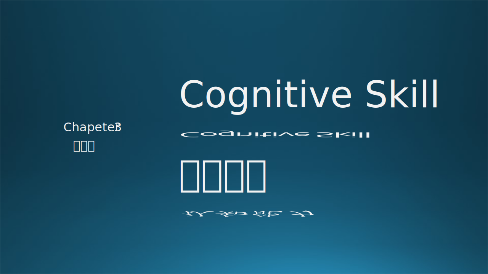

上一章我们讲的是专业能力，具备了那些专业能力就可以成为一个合格的软件工程师。但是，如果想往更高的地方走，就需要本章中所讲的认知能力的辅助。

在笔者看来，认知能力包括：
- 沟通能力
- 学习能力
- 解决问题的能力
- 系统化思维能力

### 参考资料

- https://www.freecodecamp.org/news/how-to-think-like-a-programmer-lessons-in-problem-solving-d1d8bf1de7d2/

- https://www.jianshu.com/p/0f46896ab4a0

Krathwohl, D.R. (2002) A Revision of Bloom’s Taxonomy: An Overview. Theory into Practice, 41, 212-218. http://dx.doi.org/10.1016/S0164-1212(98)10055-9

- https://zhuanlan.zhihu.com/p/539798401
