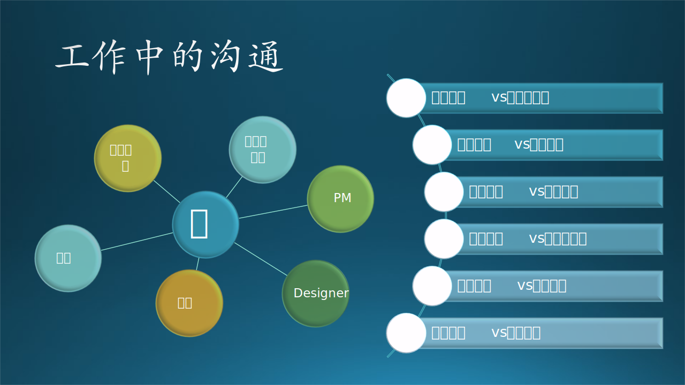

## 3.1 沟通能力

### 3.1.1 沟通的重要性

Nobody is an island. 没有人是一座孤岛。

微软很看重沟通能力，而且是在面试中的一个重点考察项目。为什么呢？因为大公司一般都是团队作战，不像小公司那样主要靠单打独斗，作为一个工程师会牵涉到：

- 和团队内其它工程师的沟通
- 和 PM 的沟通
- 和 Designer 的沟通
- 和其它团队的沟通
- 和老板的沟通
- 和客户的沟通

图 3.1.1 工作中的沟通

如果按照形式分类，又可以分为：

- 正式沟通与非正式沟通
- 垂直沟通与水平沟通
- 口头沟通与书面沟通
- 语言沟通与非语言沟通
- 内部沟通和外部沟通
- 单独沟通和集体沟通

一个不想沟通又不会沟通的人，很难融入到团队中与他人合作完成项目。所以，沟通，已经成为在职场中生存的基本手段了。

沟通是双向的，是一个编码、解码的过程，要求你既会说又会听。笔者认为不存在单向沟通，因为那不叫作沟通，叫做信息发布。

### 3.1.2 沟通的最佳实践

图 3.1.2 沟通的最佳实践

#### 1. 表达深思熟虑后的观点

表达观点时，要有理有据（虽然不能保证合情合理），不能道听途说地只说个结论，没有推理过程或者解释说明。

比如你想说服其它人采用你的技术建议，粗糙的沟通方式是：“这种技术很多大公司都采用了，我们也应该采用。” 这种观点拿出来很容易被 challenge（挑战）。

你可以找到两三条理由来支持的你的观点，比如：

“我建议采用一个消息队列来接在 Web 服务器后面，这样的好处是：

1. 松耦合，在设计、实现上都比较方便；
2. 异步方式可以处理高并发；
3. 集成测试或调试时，可以使用假数据单独针对接口测试，不需要架设庞大复杂的系统。

很多大公司都采用，所以应该是成熟可靠的技术，我们应该采用。”

这种方法有助于你养成想好后再说话的习惯，而不是像那些网络喷子一样只会发表不当言论。

乐队里有一位 C，自认为自己多弹了几年吉他，有一些演出经验，经常会长篇大论地写一些东西，搬出来一些不明觉厉的名词，最后总不忘加一句“这些都是我上学时就玩儿剩下的”。木头只好说：“大家看看老 C 的文字，观点完整、有理有据，请大家学习。” 确实，在“观点完整”上，C 确实做到了。有人私下问木头这件事，木头回答说：“我说观点完整，并没有说观点正确，我说有理有据，没有说合情合理。”

#### 2. 谨慎使用反问句

完整地表达观点，是一种思考成熟、具有知识体系的表现。微信的出现其实是为了普通大众服务的，往往是三言两语说完就走，因为不具备完整表达观点的能力。

还有些人，可能是在中学就养成的坏毛病，总是反问别人。比如大家在邻居微信群中担忧疫情防控放开的问题，有个年轻人就说：“你得过感冒吗？” 言下之意就是新冠病毒和感冒的危害一样轻，但后来的事实证明要严重很多，恨不得是两三种感冒加起来那么严重。这个年轻人后来在群里求药，但是没有人原意搭理他。

笔者看着他的反问句不舒服，就回答说：“年轻人可能还容易恢复，但是老年人就比较麻烦。” 没想到又有一个年轻人跳出来反问笔者：“你亲身经历过吗？” 言下之意是“不要听舆论的宣传，老年人没问题的”。笔者当时就以其人之道还治其人之身反问他：“你是老人吗？” 意思是“你不是老人就没有同理心，不会站在其它的人的立场上思考”。

但是，完整地表达观点经常会吃亏，因为言多必失，大概率会有漏洞。有些人就会抓住其中一个小漏洞，或者是一个语病、一个词汇来反驳。乐队里就有这么一个家伙，总是不好好说话，阴阳怪气的总用反问句，比如“这怎么会是性别问题？”、“你觉得这样做就是公平的吗？”，这些看似普通的反问句在上下文里的伤害极大，使得大家不能正常交流，最后被木头踢出了乐队群。

#### 3. 认清“角度”与“高度”

在人类所在的三维世界中，当然有“角度”的概念，同样看一个物理存在的巨大的物体，有的只能看到它的左侧，有的人只能看到右侧，由此会引申到对待一个问题的看法，不同的人会有不同的“角度”。

但是，当有人和你沟通时用了“角度”这个词，尤其是领导，大概率是在说你的思考层次“高度”不够，而不是“角度”。为什么呢？

对待项目或者技术问题，其实是存在上帝视角的，这和大家都站在地面观察普通的体积大的物体不同，领导很可能是站在“空中”观察这个物体的，甚至在观察那些观察物体的人。

比如，你建议：“这个项目比较复杂，我们应该先挑最难的部分做，集中优势兵力打歼灭战，这样做对项目进度是有保障的。” 没错，如果从一个纯技术“角度”看，你的这个建议是对的。但是，领导可能会说：“因为这是一个合作项目，能争取过来做 owner 不容易。为了让合作方能对我们建立信心，我们应该先做简单的部分，尽快出一些阶段性成果，同时抽出一小部分人力去啃硬骨头，明修栈道，暗度陈仓。”

你自认为从 360 度观察到了事务的本质，但是领导却是从 720 度（包括上下两个维度）做了更多的思考。所以，说“角度”这个词，只是给你一个面子，其实是“高度”的差别。

#### 4. 基于事实的讨论，而非立场

- 利益：隐藏起来的真正的需求。
  
  每个人都会不自觉地维护自身利益，有可能是实际的经济利益，也有可能是地位、面子、形象等这些看似虚无的东西。

- 立场：形成的思想。
  
  利益决定了立场，两个人具有共同利益时，就会很容易达成共识，形成相似的观点或态度。

- 行为：表达出来的具体形式。
 
  行为可以是具体的动作，大多数时间是语言/言论。

当两个人沟通不畅导致争论时，要分析清楚对方的利益是不是与自己不一致，自己是不是无意中触犯了对方的利益。要想分辨这一点很容易：当你想尽办法证明自己是对的，而对方对此态度冷漠口气坚定时，你很可能踩人家脚了。

很典型的情况是，面对一个关键技术问题，两个人各持己见互不相让，其背后的原因很可能是采用了谁的建议，谁就会在 promotion 的路上向前迈进了一步。有个实际的例子，木头在 Windows 组时，常听到很远的隔壁的两个同事 A 和 B 因为在 Edge 浏览器上做银行插件时究竟应该采用哪种技术方案而进行讨论，A 是一个 Senior Dev，B 是一个 SDE II。后来 B 得到了 promotion 到 Senior 级别，在邮件通告中的罗列的一条理由就是：B 在该项目上贡献突出，在技术方案的选择上与同组的一名 Senior 级别的员工竞争而胜出。

#### 5. 简洁不发散

沟通时，每个观点完整是必须的，但是在其它方面要简洁吗，不要过于发散。

有个同事在每次开 Scrum meeting 时都特能说，你要是仔细听吧，他大部分时间都是在持续不断地补充自己的观点，力图证明是正确的，甚至用一些关系不密切的证据。听起来像是“政治正确的白开水”，特别没有营养。

但是有一些人又过于简洁，茶壶煮饺子，心里有话但是倒不出来。笔者听说有个同事在 Machine Learning 上很有功底，就跑去请教，结果对方说了一些不是关键点的信息，听得云里雾里的。可能在对方看来，“有些基本的信息我都不用说你自然应该明白”，于是直接进入了细枝末节。

#### 6. 婉转表达否定

假设你和领导进行 1:1 的年终总结谈话，领导说：“你在这个项目里承担了一些重要的工作，技术能力很不错，但是在与同事进行技术讨论时，在说话技巧上还有一些进步的空间。”

“有进步的空间”这句话很艺术，它并没有直接说你现在做得不好，而是很委婉地说你可以做得更好。没有人愿意在和别人比较时甘拜下风，但是如果说自己有潜力可以做得更好的话，当然是可以欣然接受的事实。

在《星际迷航》电影里，经常会看到这样的对话：船长说“把动力系统全部移到船头进行形成能量网保护”，操作员可能会说“Negative（不行），我们需要至少10%的能量储备用于随时做光速跃迁逃逸。”，用 Positive/Negative 就会比较客观婉转，给船长留了面子。

#### 7. 注意语气语调

俗话说“有理不在声高”。有些人说话的音量很大，像是在吵架；有些人语速特别快，通常需要听者在脑子里把话在重复一遍才能明白；还有些人语气比较强硬，不太会用词。

木头的老板是一个反例，他说话时：

1. 音量低，这反而能让别人都安静下来仔细听他在说什么。
2. 速度慢，还稍微有些结巴（当然这不是优点），不过反而能让人明白他在说什么。
3. 不和别人争吵，有不同意见时，他表达完自己的观点后，如果对方不同意，他就会说“行，那再回去研究研究吧”，这样不管最终谁对谁错，都给双方留了余地。

#### 8. “一会儿回复您”

如果需要较长时间的思考，也可以回复说“让我先想想，一会儿回复您”。

曾经有一位朋友（微软中国 ARD 的韦青老师）请笔者去给一个合资公司讲讲“微软的工程师文化”，因为笔者当时很忙，一时不能确定能不能讲好，或者是需要多长时间的准备，所以就在第一时间回复说“让我想想”。两个小时后，给予了对方肯定的答复，然后就在业余时间开始准备演讲内容，大部分内容都是本书中的实践中的软件工程，最后的演讲效果非常好，这才启发、激励笔者继续写完这本书，相信会得到很好的读者反馈。

#### 9. 面对面的讨论更加有效，慵懒的文字会产生误解

以前在办公室里听到打字速度很快（而且还大胆地使用了机械键盘）时，就知道这个家伙一定在用电脑微信聊天，因为写代码的速度不可能那么快。现在面对疫情，大家都采用了线上办公，每天进行大量的文字交流。有的人文字表达能力非常差，而且懒，自己头脑中是有上下文信息的，但是不在文字中表达出来，往往造成对方误会。

有一个同事在和老板文字交流时，越来越觉得领导的态度不对，赶紧要求和老板进行语音通话交流，及时弥补了误会。而更多的时候，那些不善于文字表达的人，写出来的东西看上去一副“态度冷漠语气生硬”的嘴脸，比如领导交代你一件事，你回复“好”、“好~”、“好吧”、“好的”、“好滴”、“好的呢”、“好吧呀”，里面隐藏的情感细节非常丰富。如果不会细腻表达，表情包可以帮你大忙。

还有一个特点是，一般的实习生在写字时都会带上一个“啊”字，比如：“是啊”、“我也不知道啊”、“就是那样啊”，听上去像吵架。因为“啊”字本身在说出来时是一个轻声的后缀，没有实际含义，但是写出来就变成了一个强调的语气词，看上去很不舒服。

#### 10. 少用对抗思维，多用平行思维

同事之间，如果没有上述的立场问题作怪，就尽量“先扬后抑”，或者“多扬少抑”。

比如，针对一个技术问题的选择，A 的理由是：1. 开发速度快；2. 容易测试；3. 可以多人并行开发。而 B 与 A 的后两点理由相似，但是第一点理由的差别较大。此时，如果 B 一上来就说：“我认为你的第一点理由根本不成立，我们要的是质量而不是速度！”，那么 A 肯定不能接受。这就是对抗思维。

如果采用平行思维，B 可以这样说：“我非常同意你的第二点和第三点理由，这对项目的帮助很大。我只是在第一点上和你有一些小的差异。” 此时 A 的反应很可能是眼睛一亮好奇地问：“哦？那你说来听听”。然后 B 再娓娓道来。

这种技巧，是 B 先给了 A 一个较强的心理暗示：咱俩是一个阵营的。这样 A 就会表现出合作的态度。

#### 11. 说话不要绕弯子

比如，有个同事建议：“到了年底，因为美国那边要休圣诞节假期，所以我们不如等他们都休假回来后再一起讨论后续的安排。” 其实是这个同事的年假没用完，他想在 12 月底休两周的假，他不直说，却把美国人搬出来当挡箭牌。

木头的乐队里还有个例子：一个乐队的成员想在元旦时出去玩儿，但是新年音乐会定在了 1 月 6 日，他又怕到时候不能赶回来，所以他们队长就来找我说：1 月 6 日估计很多微软员工休假的还没回来，影响观众的上座率，不如我们延期举办音乐会吧？

这听上去就是很为演出效果考虑的感觉，但是这一个改变就要到春节后再开音乐会了，排练不好安排。员工们过完春节刚刚来上班，你来个“马后炮”，不论是观众和乐手，心气儿都差远了。木头看出来了是因为他们的乐手凑不齐，所以拒绝了这个队长的请求，说：你如果缺乐手可以向别的乐队借，没必要把自己乐队的困难绕个弯子转嫁到整个演出上。

#### 12. 相同的话不要重复说

在工程师层面的沟通，不需要像在大街上聊天似的，为了增加亲密程度和聊天长度而说“车轱辘话”。车轱辘话出现的原因是：

- 想强调某个理由，但是没有很好地组织语言。
- 或者是没有更好的理由，而只好说重复的话。

一旦出现车轱辘话，在说者看来好像是强调了刚才的观点，但是在听者看来会得到两个结论：这个人固执；他没别的理由了。这与说者想达到的目的正好相反。

#### 13. 不要乱用“沉默”的权力

笔者在写本书的“用户与需求”部分时，曾经想要求一位以前共过事的 PM 一起写，就发了一封邀请邮件，但是却石沉大海，也不好再追说，干脆自己写了。笔者感到很不可思议的是，曾经和那位 PM 在项目最艰难的时刻共同努力，最终令项目得到了总部的认可，相当于一起“扛过枪、负过伤”的交情，为什么对方会沉默呢？

不要怀疑他可能是漏看了邮件，因为他是一个非常细心的人，看邮件回邮件是他的本职工作。其实他完全可以说“工作繁忙、才疏学浅”等等来推脱，笔者是完全可以接受的，但是这种“沉默”是极大的不尊重，相当于断绝了以后交往的可能。

同样的问题经常发生在同事或朋友之间的微信通信上，有的时候甚至一句“新年快乐”发过去却得不到半点儿回音。笔者只是在对对方的行为或言语极为反感时，才会采用“沉默”这种手段。所以奉劝那些容易忘记回复消息的读者们，真正地把对方放在心上（这样对方才能把你也放在心上），在方便的时候第一时间回复对方。

#### 14. 不抱怨结果，要分析原因

无效的沟通往往是从对糟糕的结果的抱怨开始的。

最典型的是家长面对孩子的考试结果时，第一句便是：“你怎么不好好考试？！”，孩子听完后一脸懵弊，然后就是一言不发。

因为家长自身处于强势地位，不太注重沟通的方式。但是一般的公司领导会很注意这些细节，在上面那种情况下一般会说：“这次考试（项目）结果不太理想，应该还可以做得更好，你有没有自己分析过是什么原因造成的呢？” 这样拉开话匣子，会让对方可以接受。

#### 15. 不挑战别人的决定，而是提出建设性意见

比起上一条来，更进一步。

经常有一些带有情绪的对话，或者是下级面对上级时，会出现这个问题：“为什么这样做？”

如果是同级别的人谈话，对方的意思往往是“我有更好的方案”，但是他不直接说，而是以问句开始，这就容易拱火儿。如果是不同级别的人，劝你还是最好不这样问话，因为领导掌握的信息比你多，做出的决策也会更合理，让领导解释理由是很不礼貌的，这相当于是一种挑战。

不论哪种场合，如果直接了当地把自己的“具有建设性”的意见说出来，会得到领导的赏识和同事的赞许。“建设性”这个词还是木头在学习桥牌时第一次遇到的，叫做“建设性应叫”，意思是对方表达了完整的观点后，我应该在尊重对方观点的前提下，提出自己的一些局部或不同方向的补充，来共同完善这个观点。

### 3.1.3 沟通能力的培养

沟通的前提是你要有输出，别人才能理解你，才能达到沟通的目的；你也要有输入，才能正确地理解别人。一般人都可以做到输入（听），但是能力欠缺的人没有输出或者很少有输出，造成沟通障碍，据笔者观察，在一个团队中，这类人占比为 10%-20%，虽然他们不会影响整个团队的协作，但是却会影响个人的职业发展。

如果想提高输出的能力，从下面三点入手即可：

- 基本的信息沟通
- 工作中的职业沟通
- 高级的情感沟通

#### 1. 基本的信息沟通

【最佳实践】

- 工作餐尽量和大家一起吃，有说有笑。
- 不知道该说什么的时候，可以先听听大家说什么，然后就可以确定自己的话题是不是会得到响应。
- 可以先指定一个人，比如：“老李，你上次说买了个国产车，质量行吗？我最近也想每一辆。” 对方肯定会打开话匣子给你分享经验。
- 可以讲一些趣事或笑话，但不是从网上趸来的，而是自己亲身经历的。
- 就一个新闻或一个事件发表自己的简单看法，比如：“NAVIDIA 不能在中国卖 GPU，对它自己的利润有很多影响，中国是世界上最多使用 GPU 的国家。”

#### 2. 工作中的职业沟通

【最佳实践】

- 遇到疑难问题时，主动寻求他人的帮助。当问题较为严重时，寻求老板的帮助。
- 主动帮助他人，分享你的经验。
- 开会时主动发言，发表自己的看法。
- 主动承担任务池中的工作项，并努力完成，及时交付。
- 和 PM 搞好关系，耐心解答技术问题。
- 与外部团队合作时，态度要谦虚谨慎。
- 及时反馈，无论是答应了谁做什么事，都要及时反馈，不能等着别人来问你进度。

#### 3. 高级的情感沟通

即“情商”。

【最佳实践】

- 逢年过节给亲朋好友领导同事拜年，如果有人主动给你拜年，那么下次你要抢先一步回馈。
- 发了朋友圈收了赞和评论，记得回复朋友们的评论，也记得给朋友们的朋友圈点赞。
- 关心一下他人的遭遇，比如“上次你骑车摔倒了，没伤到骨头吧？”
- 收到别人的红包，要发一个快乐的表情表示感谢，但实际上你可能只抢到了 2.46 元，而别人都是好几十块钱。此时你可以炫耀地说：“看，二四六多吉利，好事成双！”
- 多参加团队活动，或者是社会团体活动，比如乐队、读书会、羽毛球俱乐部等等，认识工作以外的人。
- 分享自己最近读过的好书、看过的好影视剧，并附加自己的正面评论。