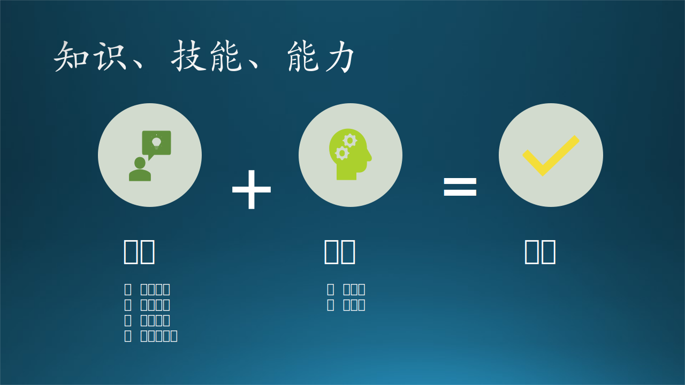

## 3.4 学习能力

### 3.4.1 元能力

**学习能力**是一项元能力。元能力，就是提升其它能力的能力。而学习能力所学习的目标是**知识**和**技能**。

图 3.4.1 能力

**知识**是人类从各个途径中获得的，经过提升总结与凝练的对客观世界的系统认识。包括“事实知识、概念知识、过程知识、元认知知识”，在 3.4.3 小节中讲解。

**技能**是在获得相关知识的基础上，通过一定练习或实践而获得的某一领域的经验与技巧。包括“硬技能（技巧）、软技能（经验）”。“弹吉他”是一种硬技能，需要头脑清楚、双手配合灵活，但不一定要懂得乐理知识；“编曲”则是一种软技能，需要懂得丰富的乐理知识，当然也需要掌握编曲工具的使用方法。

**能力**是运用相关知识和技能（组合）解决特定领域的问题的条件和素质。“条件”是“知识”的代名词，“素质”是“技能”的代名词。

所以我们得到如下等式：

$$
能力 = 知识 + 技能
$$

在大学中，除了一些必要的基础知识是用来帮助你建立对客观世界的基本认知的，而其它一些课程呢，你会发现在工作以后基本用不上，那为什么要学习它们呢？因为：

- 学习文学可以让你以人为本，口吐珠玑；
- 学习历史可以让你以史为鉴，与时俱进；
- 学习哲学可以让你辩证唯物，修身养性；
- 学习物理可以让你客观理性，触类旁通；
- 学习化学可以让你视微知着，达变通机；
- 学习数学可以让你胸有成算，数往知来；
......

除了数学是一切理工科的基础外，其它学科的学习除了帮助学生建立基本的世界观以外，还在帮助学生“学习”一种“学习的能力”。而同样都是大学毕业的人，参加工作后的职业发展道路有好有坏，也是因为“学习能力”在工作后一直在起作用。

另外，对于 IT 行业有其特殊性：新知识、新工具、新方法涌现的速度远远超过其他行业。保持好奇、终身学习，才能不落伍。

### 3.4.2 Bloom's Taxonomy - 布鲁姆分类

1956年，美国的教育心理学家 Benjamin Bloom 本杰明·布鲁姆发现，美国学校的测试题 95% 以上是在考学生的记忆力，就相当于文科中的历史、政治、法律，这些东西都是已经发生的事件或者已经规定好的条条框框，没有任何商量的余地。

但是，很多理工科的专业的学生，或者毕业后从事科学研究的人，他们需要的不是记忆力，而是创造力，而那些测试题是阻碍这些人受到良好教育的绊脚石。于是，布鲁姆提出了一个新的学习教育分类法，用于归类不同学习程度的认知框架。2000 年，他的学生 Lorin Anderson 修订过一些内容，这就是影响了两代美国人的“认知目标分类体系”。

图 3.4.2 布鲁姆分类

布鲁姆是根据人的“认知过程从简单到复杂，由具体到抽象”这一规律来作为其教育目标分类理论依据的。教育目标分类强调指导教学过程和对结果进行评价，用来判断学生对一个知识点的精通程度，从低层次的“记忆、理解、应用”，到高层次的“分析、评价、创造”。

#### 1. 记忆（Remember）

死记硬背，照本宣科。

学习的对象包括：特定名词、术语、事实、趋势、顺序、分类、标准、方法、原理、概念，理论和结构等。比如：乘法口诀、法律条文、历史知识等等。

其表现是：可以通过回忆、有线索地查询，回答或记住事实、术语、基本概念或答案，而不必理解其含义。

对于一个软件工程师来说，就是要熟悉软件开发和工程中的各种名词定义、语法、函数、工具等等。

例子：

- 什么是面向对象的继承和多态？
- 按优先级列出算数运算符。求一个数的平方的对数值的表达式如何写？
- Python 中的 slice 切片如何使用？
- 如果想对一个数组进行排序，都有哪些排序算法？哪个最快？哪个最慢？
- Azure 里有哪些存储技术可以使用？

这也是一个刚毕业的学生需要达到的基本技能。

#### 2. 理解（Understand）

分星擘两，融会贯通。

对事物的领会，但不要求深刻的领会，而可以是初步的，可能是肤浅的。其表现是通过翻译、解释、推断、组织、描述信息来表达自己的主要观点，还可以通过分类、总结、推论、比较等方法来解释概念。

对于一个软件工程师来说，Ctrl+C/Ctrl+V（Copy/Paste）拷贝粘贴大法是最喜欢做的事，它即节省了自己的时间，又增加了代码量，哈哈！但是笔者提醒大家要注意职业道德，Copy/Paste 以后，起码要改一改变量名称再提交，哈哈哈！

但是总会有很多情况不尽人意，比如：

- 有一段用 Java 实现的算法，从描述和输入输出看，正好是自己想要的功能，不巧的是自己的项目用 Python 语言写代码，需要把 Java 代码用 Python 重写。

- 好不容易找到了一个 Python 语言实现的算法，但是它的输出只有对样本的分类结果，而自己的项目要求不仅要输出分类结果，还要改代码输出具体的分数值。比如分数值为 [0.23, 0.18, 0.59] 时输出分类结果为 [0, 0, 1]。

- 稍微花了些力气终于加上了输出分类的分数值，但是发现在测试时不同的样本时有 bug 出现，明明是属于第一类的样本却被分成了第三类。所以还需要硬着头皮 debug。

- 一切都搞定了，领导很满意，要求你给大家讲一下这段精妙的算法设计原理。

- 经过性能测试发现这个算法被调用了很多次，但是已经无法继续优化额。为了提高系统性能，领导决定要把这个算法写成 C++ 的组件，供 Python 代码调用，于是你又把 C++ 的一些基本概念复习了一下，对照着 Python 实现又写了一遍。

以上这些都是软件工程师的日常行为，它要求必须理解算法、代码、结构、系统、协议等等，才能正确地工作。在可以自己独立写代码之前，先学习一下别人的代码，深刻理解。

#### 3. 应用（Apply）

举一反三，熟能生巧。

对所学习的概念、法则、原理的运用。它要求在没有说明问题解决模式的情况下，学会正确地把抽象概念运用于适当的情况。这里所说的应用是初步的直接应用，而不是全面地、通过分析、综合地运用知识。使用知识来解决问题，确定事物之间的联系以及它们在新情况下的应用方式。

一个刚刚结束了照猫画虎写代码的软件工程师，正洋洋得意地觉得自己已经理解了软件开发的真谛，突然又遇到了下面的问题：

- 刚刚学习的数据库设计的三范式，能够应用到这个企业信息管理的项目中吗？
- Azure 中有很多存储服务，比如 Disk、Shared File、Blob、Data Lake 等等，哪一个最适合这个企业信息管理项目呢？
- 上个月学习了 Web 开发的三个常用框架，也做了简单的比较测试，但是当前的项目要求能支持 500 个用户的并发访问，哪一个框架更适合呢？
- 上次写的 C++ 的组件可以在这个项目中重用了，简直是太好了，节省了很多时间。但是上次使用 Python 调用，有现成的例子，这次要用 Java 调用，据说是可以的，但是还没有试过，不知道两种语言之间的交互性能会不会出问题。

学到的一些技术，也通过简单的测试程序理解了其工作原理，但是能够正确地应用到实际项目中，还是需要一些努力的。这是软件工程师能够独立工作的前提。

#### 4. 分析（Analyze）

抽丝剥茧，阐幽显微。

把知识分解成各个组成要素，从而使各概念间的相互关系更加明确，组织结构更为清晰，详细地阐明基础理论和基本原理。包括：元素分析、关系分析、组织分析。

一名有经验的软件工程师经常要给新手以必要的帮助和指导。有经验的 mentor 会这样做：

- 现在咱们做的这个模块要求性能好、速度快，因为它是个核心模块，从系统架构图中，你们应该也能看到它所处的地位。
- 核心算法如果用哈希表支持查询的话，当然是速度很快了，可以快速搭建原型，演奏 e2e 的效果。
- 但是，在实际应用中，由于数据量很大，哈希表占用的内存空间太大，对机器的内存配置要求较高，所以我们不能使用这种技术。
- 所以，我们要是用 Trie-Tree 来完成信息检索部分的核心算法，它实际上就是一个多层哈希表，但是索引数量会成几何级别减少。
- 在 C++ 中没有这种数据结构的实现，所以需要我们参考一下其它语言的实现，用一个小的数据集在 Java 的实现上做一个 Debug，就很容易理解了。
- 你们两个人分工，一个人找 Java 实现，另一个人准备数据集，然后一起 Debug。搞清楚原理后，一个人写代码，另一个写测试用例。争取一周内搞定这件事。

听完以上的一系列分析后，新手们会得到 What, Why, How, When 等重要信息，从而可以立刻开始工作，而那位有经验的 mentor 就可以去喝杯便宜的速溶咖啡并和朋友聊聊股票行情了，毕竟他被套牢了一大笔资金，如果被老婆发现可是不得了。

#### 5. 评价（Evaluation）

拨云见日，玉尺量才。

要求能够通过倾听、观察、思考、判断等过程给出自己的意见，评判一件工作、一条信息、一个想法的价值和质量，不是凭借直观的感受，而是理性的、深刻的、对事物本质作出有说服力的判断，其背后有一定的原则（criteria）和标准（standards）。

通常是在某个领域内有多年经验的从业者才可以做到这一点，并且有自信可以发表类似如下的评价意见：

- 通过对甲和乙两名毕业生的面试，我发现：甲是研究生学历，计算机基础知识扎实，参与的校外公司的实习项目较多，沟通顺畅；乙是博士生学历，偏理论方向，在校时间较长，大多数时间是跟着导师做项目，自我意识较强。如果咱们想物色一名可以很快融入团队并做出贡献的人，那么甲比较合适。

- 如果比较阿里云与微软云的话：前者比较接地气，后期服务好，在国内数据中心多，而且便宜；微软云技术先进可靠，安全性很高，同类服务的可选择性多，但是比较贵。如果我们想扬帆出海面向全球用户的话，建议使用微软云。

- 这个架构设计方案比较全面，在可用性、可靠性、可维护性、安全性等几个方面都有考虑，并且使用可一些成熟可靠的框架，性能和可扩展性上也应该不是问题，只是在一些细节上还需要后续做具体实现之前，再和相关的小组讨论并完成详细设计。

- 这篇论文提出的想法比较清奇，剑走偏锋，避开了一些公知的难点，从另一个角度通过增加多层误差直传的方法来解决循环神经网络训练不容易收敛的问题，并且试验方法、数据、结论都比较可信，相比较其它的那些在一个小单元内做修修补补的论文不可同日而语，可以说是为后续的研究工作打开了思路。

评价的能力是日积月累练就的。作为一名新手，当领导征询你对一件事情的意见时，最好不要给出一些片面的、主观的评论，而应该用一种谦虚的态度在局部上补充一些细节。

#### 6. 创造（Create）

独具匠心，别开生面。

是以分析为基础，全面加工已分解的各要素，并再次把它们按要求重新地组合成整体，以便综合地创造性地解决问题。它涉及具有特色的表达，制定合理的计划和可实施的步骤，根据基本材料推出某种规律等活动。它强调特性与首创性，是高层次的要求。想到解决问题的新方法，把大的问题化成小的块，用一种新的组合方式把算法结合起来，或者是创造一个新的算法。

比如：

- 写一篇关于解决物流效率的问题的强化学习方面的论文。
- 设计一个系统来满足在特定时刻对网站的大规模突发访问，比如双十一购物节。
- 制定一个新的工作手册，来适应疫情期间很多员工需要在家远程办公的情况。
- 把已有的一些传统的机器学习算法创新性地用于脏数据处理，然后再在干净的数据上做回归或分类的学习，将会得到更好的混淆矩阵评估值。
- 在已有的缓冲区的基础上，再设计一个二级缓冲区，可以容纳更多的数据，会成倍地提高查询的效率，但只付出很小的设备代价。

### 3.4.3 Knowledge Dimensions - 知识的难度分类

这一分类体系直译为知识的维度，但其实四个维度之间是有继承关系的，所以笔者把它翻译成知识的难度。四种难度的知识依次是：

1. 事实知识
2. 概念知识
3. 过程知识
4. 元认知知识

图 3.4.3 知识的难度

#### 1. Factual Knowledge 事实知识

与知识领域相关的基本要素，解决简单问题所必须的知识。

包括：
  - 术语知识
  - 具体细节和组成元素

任何领域中的术语、具体细节和基本元素都可以定义为事实知识。比如软件和软件工程领域中的编程语言的语法知识、关于算法的名词知识（KNN、DNN、RNN、CNN......）、关于测试的各种名词知识（单元测试、集成测试......）等等。

是一种非常具像的知识形式，属于纯静态的问题。如图 3.4.3 中的子图 1，有 A、B、C 三个看上去独立的点，表示三个基本的事实知识。

学习这些静态知识最好的办法就是翻阅教科书，一般的书的作者都会比较严谨，在书中列出的名词及其解释会比较的准确和全面。然后再从其它渠道（比如互联网）获得更多的关于这些名词的实际应用的介绍，而不是机械地背诵它们的定义。

常用的信息当然要熟记于心，但是人类的大脑记忆不是存储事实知识的最佳场所。虽然我们经常见到律师可以博闻强记地准确背诵法律条文，算命先生也可以把六十四卦记得滚瓜烂熟，但请记住这是他们赖以生存的饭碗，他们必须记住。

我们可以用一些更聪明的现代化的办法：首先要在脑海中留存这些知识的名词（名字），然后在需要这些知识的细节时，知道在哪里获取，比如查找书籍、在线资料、笔记等等，或者干脆问你身边的专家（如果专家不嫌你烦的话）。

#### 2. Conceptual Knowledge 概念知识

描述一个大的结构内的各基本要素之间的相互关系，这种关系可以使得这些要素有机地结合起来展现一些功能。

包括：
  - 分组和类别
  - 原理和概括
  - 理论、模型和结构

如图 3.4.3 中的子图 2，A、B、C 三个点扩展了其外延，使得本来独立的点连接到了一起，形成多个概念知识。

概念知识与低级别的事实知识相关，可以理解为是一种上下文相关的知识，而不是局限在某一个点（事实）上。比如我们知道了软件测试包括单元测试和集成测试这个事实（包含两个元素），但是还应该进一步知道它们分别侧重于哪个方面，区别和联系是什么。再比如算法名词，应该知道 KNN 是一种聚类算法，而 DNN、RNN、CNN 其实是深度神经网络中的一些名词，把它们结合起来可以形成强大的深度学习模型。

#### 3. Procedural Knowledge 过程知识

偏向具体动作及过程的知识。如何做一件事，具体的实施方法，以及如何使用技能、算法和技术、方法的准则。

包括：

  - 专业技能（skill）和算法（algorithm）
  - 专业技术（technique）和方法（method）
  - 了解何时使用最合适的过程

注意，技能（skill）指的是人所具有的能力，不是所有人都有；技术（technique）指的是客观存在的东西，任何人都可以使用。具有这些知识并能够灵活运用是这个级别所要求的。比如如何实施单元测试，设计测试用例来覆盖各种情况是一种技能；而使用开发工具提供的单元测试的接口就是一种技术。

如图 3.4.3 中的子图 3，本来是静态联系，在 A 旋转起来后，发现 B、C 也跟着旋转起来，形成了齿轮组。同理，旋转 B 或 C 时，另外两个齿轮也跟着旋转。

#### 4. Meta-cognitive Knowledge 元认知知识

自我认知的意识和知识。

包括：

  - 全局或战略知识
  - 关于认知任务的知识，即上下文和条件
  - 自知之明

这个级别要求我们在充分掌握前面所说的三个层次的知识的前提下，你应该有自知之明，了解自己掌握了多少编程语言的知识、机器学习的知识、测试的知识，你在某个项目中还需要哪些技能才能胜任领导给予你的角色，你距离可以做一次讲座或者指导他人工作的能力还有多远。如果有差距的话，你可以准确地估计出还需要多长时间在哪个方向上的努力才能够达标。

如图 3.4.3 中的子图 4，在了解了前三层知识后，应该可以从它们“一生二、二生三、三生万物”地分解、模仿、理解、解释、甚至创造出一个齿轮箱。

### 3.4.4 当层次遇上难度

3.4.2 小节和 3.4.3 小节是两个不同维度的的分类或分层，那么当这两个维度组合在一起，会发生什么事情呢？

图 3.4.4 二维知识/学习分类

图 3.4.4 就是二者结合的产物：
- 在横向上，是知识学习的六个层次，从低级到高级；
- 在纵向上，是知识本身的难度，从具象到抽象。

在表格中用一些关键动词来表示具体行为，但是不够详细，所以表 3.4.1 是具体的解释。由于篇幅原因，把横表变成了纵表。

表 3.4.1 二维学习/知识分类

||事实知识|概念知识|过程知识|元认知知识|
|-|-|-|-|-|
|**记忆**|列出著名流行乐队 的名字|听歌识别出它的 作者|回忆如何给 电吉他调音|鉴别某种古筝 演奏学习方法的缺点|
|**理解**|总结一下Windows11 的主要功能|按用途对各种 算法进行分类|详解组装要领|解释软件工程 方法的原理|
|**应用**|回答用户在使用 Azure存储服务时 经常被问到的问题|给新入职的 程序员提供建议|对水的样本 做酸碱度测试|使用与个人实力 相匹配的编程技巧|
|**分析**|根据难易程度给各种 分类算法做一个排序|区分优质代码 和劣质代码|把敏捷开发模式 集成到工作流中|消除对传统机器 学习的偏见|
|**评价**|评价一篇论文 的优缺点|确定各种采样 结果之间的相关性|判断各种采样 技术的效果|给一种负载分配 策略评分|
|**创造**|写一篇短文介绍刚刚 学习的神经网络知识|设计一个分类 体系把各种用户 需求区别开来|设计出有效的 项目工作流|提出学习深度学习 理论的方式|

有了表 3.4.1 的指导，我们可以准确地判断一个具体问题所处的层次、难度，也可以判断自己的能力所在的层次、难度。

