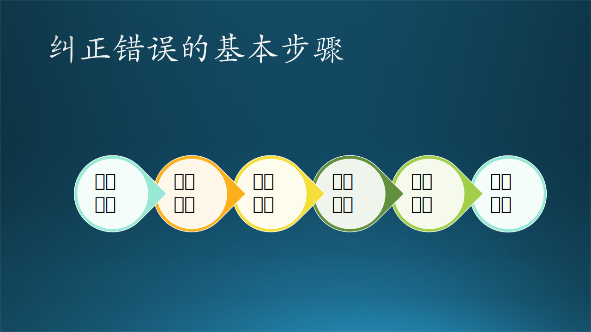

## 3.2 解决问题的能力

关于“问题”这个词的定义有很多，在这里我们特指三类技术问题：

1. 要达到的目的，比如：用聚类算法处理数据、建立合理的拓扑结构、搭建模型预测趋势等等。
2. 要纠正的错误，比如：软件的输出和预期不一致、开发时间超过计划太多、用户量大时导致系统崩溃等等。
3. 要解决的疑问，比如：为什么在贪吃蛇游戏设计中应该使用链表、为什么很多程序员到了 30 岁就不愿意再写代码等等。

### 3.2.1 能力的评级

解决问题的能力高低可以有五级评价标准，下面我们采用倒序方法**从能力高到能力低**的顺序来讲述。


图 3.2.1 解决问题的能力评级

#### 阶段五：啥都不给

这样的领导最省心了，开会的时候喊一句：同学们，数据到了，大家分工处理一下吧。然后木头、石头、铁头等小组成员需要自己去讨论方案，最后汇报给领导。

这一阶段需要个人能力达到了一定的高度，领导充分信任，才有可能发生。

#### 阶段四：只给目标

比如，木头在刚开始工作时，需要处理一个地图数据中的聚类问题：在一条 50 米长的路上，零零散散地分布了很多公交车的站牌。有些站牌相距只有 5 米，而有些站牌却距离 20 米远。那么，哪些情况下这些站牌可以认为在地理位置上是同一个“点”呢？

这个阶段（对领导来说）也很简单：木头同学，你需要在一个月的时间内，把所有中国重点城市的公交车的站点按名称和地理位置做聚类，这样后续的换乘算法可以利用你给出的拓扑结构。

但是有时候领导可能说得不太准确：木头同学，你需要在一个月的时间内，把所有中国重点城市的公交车的站点处理一下，后面才能写换乘算法。


图 3.2.2 公交站点的聚类

这里面就有很多坑需要木头自己填平，比如：

1. “苏州街”是个站名，北京、上海、苏州都有这个站名，但是不同城市的站是不能合并的。
2. 处于街道两侧的相同名称的站是不能聚类到一起的，因为是分别属于上下行站。
3. 距离多远才算是符合聚类条件，这个需要木头自己摸索。
4. 地铁站与公交站名称相同时，是不能聚到一起的，因为虽然经纬度可能相近，但是海拔不同，一个在地面，一个在地下。
5. 如果用经纬度计算距离，那么原始数据的经纬度数值精度至少在小数点后五位数以上，否则误差将会很大。
6. 夜班车站要和白天正常运营的公交车站聚类在一起吗？

#### 阶段三：给目标，给范围

如果还用上面的例子，那么领导会是这样说：

- 目标是做公交站牌的地理位置聚类；
- 用 scikit-learn 的 Python 库里提供的聚类算法应该可以搞定。

或者是这样说：

- 目标是做公交站牌的地理位置聚类；
- 木头同学，你和石头同学一起讨论一下具体实现方案，如果需要帮忙就去找铁头同学咨询一下。

这两种说法中的第二条都是指定了范围，前者是技术范围，后者是资源范围，都会有助于木头继续开展工作。

#### 阶段二：给目标，给例子

有的时候，针对一个新问题，不能确定使用什么方法能够解决，但是以前有过类似的问题和对应的解决方案，此时不妨拿出来参考。

领导告诉木头：
- 你的目标是要做公交站牌聚类；
- 我不知道现有的聚类算法是否可以直接使用，我们以前有个例子，是这样的：

    如图 3.2.2，统计了几十个人的身高体重，但是粗心的统计员忘记记录性别了，此时，可以用聚类的办法来大致把这些点分成两类，一类是男性，一类是女性。具体的数据和代码你可以在咱们的代码仓库里 (https://github.com/microsoft/ai-edu)找到，当时我们使用 DBSCAN 算法实现的。

    但是，与公交站牌聚类的例子比较，可以看到二者的区别是：一个是在二维空间里的聚类，一个是在一维空间里的聚类，能保证聚类算法的效果是可信的吗？你需要做一些试验，来验证这一点。


图 3.2.3 人类性别聚类问题

所以，领导即告诉了目标，又告诉了相似的例子，木头需要写代码做试验，这比“给目标，给方法”的难度要稍微高一些。

#### 阶段一：给目标，给方法

如果木头本身没接触过聚类算法，而只是朴素地思考如下：

假设相距小于 15 米的两个站牌可以认为是同一个点，那么 A 和 C 就不能聚在一起。但是如果 A 和 B 聚在一起，它们的中点就会距离 C 只有 15 米，那么 A、B、C 就会聚在一起，然后 D 又会加入......所以这种朴素的聚类思想是不可取的。

领导告诉木头：

- 首先，你的目标是要把这些站牌做一个聚类，距离很近的站牌可以让它们在拓扑结构上是同一个点，便于后面的算法执行。
- 其次，你用 KNN 算法就可以完成科学的聚类了。

所以，领导即告诉了目标，又告诉了方法，木头只需要写代码实现就好了。

总结一下，一个人解决问题的能力是需要培养的，基本上要经历以下几个阶段：
- 在阶段一，需要给定“目标 + 方法”，才能够解决一个问题；
- 在阶段二，需要给定“目标 + 例子”，举一反三，即可完成任务；
- 在阶段三，需要给定“目标 + 范围”，自己在该范围内寻找解决问题的方案；
- 在阶段四，只给“目标”，需要自己确定“范围”，通过寻找前人留下的“例子”来确定最终“方法”。
- 在阶段五，除了必要的资源以外“啥都不给”，“目标”靠自己来研究挖掘，能力高下立现。

### 3.2.2 木头遇到的技术问题

有一个用户给木头报了一个 bug：在把 ONNX 模型从 32 位浮点精度转换成 16 位浮点精度的过程中，当使用单个样本做转换过程的测试时，很容易通过；但是当使用 32 个样本（作为一批）做测试时，基本上不能通过。因为转换过程会使用 GPU 以及内存资源，所以该用户猜测是多个样本带来了更多的资源占用，从而导致失败。

#### 1. 复现问题

木头拿到了用户的真实环境（模型、测试代码、样本）后，首先在自己的 GPU 环境中复现（repro），32 个样本果真会导致转换失败；然后又用 16 个、8 个、4 个、2 个样本做测试，最后得到的结果是只有 2 个或 1 个样本时，转换才会成功。


图 3.2.4 培养解决问题的能力


#### 2. 排查疑点

其次检查样本的正确性，通过对比几个样本的字段，除了数值有差异外，没有别的不同，这就避免了字段个数不同或者有些字段为空值带来的插值误差。

那么不同样本的数值的差异会带来问题吗？于是木头把一个样本复制 3 份，得到 4 个样本，输入给转换程序，但还是失败。

在此过程中，木头观察计算机的内存占用情况、CPU 使用情况，以及 GPU 的内存占用情况，都没有发现有异常发生，系统各项资源使用一直很平稳，说明与资源无关。

Debug! 通过 debug 大法，木头定位到在验证转换结果时，如果使用：

```
np.allclose(x, y, rtol=1e-2, atol=1e-3)
```

这个函数返回 False，表示 32 位模型的推理结果 $X$ 与 16 位模型的推理结果 $Y$ 在数值上相差比较大。把 4 个不同样本的 32 位结果与 16 位结果打印出来如下：

```
---- 32 位模型推理结果 ----
[[0.46224755 0.53775245]
 [0.4538362  0.5461638 ]
 [0.39781117 0.6021888 ]
 [0.44377536 0.55622464]]
---- 16 位模型推理结果 ----
[[0.46289062 0.5371094 ]
 [0.44677734 0.55322266]
 [0.40039062 0.5996094 ]
 [0.44604492 0.5541992 ]]
```

以上面的两组数据中的第一个数为例，$(0.46289062-0.46224755)/0.46224755=0.00139118$，确实不满足 atol=1e-3 的精度。

是不是因为在模型中有一些随机因素造成了推理结果不准确呢？于是，木头检查了一遍模型，并没有返现有 dropout 等算子（操作符）出现，所以排除了这种情况。

【最佳实践】产生一个问题的原因有很多种，可以认为是星形结构（如图 3.3.3），把这些原因罗列出来，一个个地去试验，即可找到根本原因（root cause）。

#### 3. 定位原因

如果只用一个样本，获得到什么结果呢？木头发现，在一个样本的情况下，转换程序在尝试过几次之后，可以完成模型转换，但是并不稳定。此时，如果把验证精度宽限到：

```
np.allclose(x, y, rtol=1e-1, atol=1e-2)
```
就可以轻松通过验证。由此可以得知就是精度问题导致验证失败。但是，如果就此得出结论“16 位的模型精度有问题”，那就为时过早了。

如图 3.2.4 所示，我们一直把怀疑集中到转换的过程，在 16 位精度的模型中，一个样本 S 做两次推理得到的结果 $Y$ 和 $Y'$，它们有时候和 $X$ 非常接近，有时候又不是很接近，而 $Y$ 和 $Y'$ 两者之间也会有精度差。


木头忽然想到：如果用 32 位模型做两次推理，得到的结果 $X$ 和 $X'$ 一样吗？于是得到试验结果如下：

```
---- GPU 第一次推理结果 ----
[[0.44895846 0.55104145]]
---- GPU 第二次推理结果 ----
[[0.45693502 0.54306495]]
```
哈哈，在 32 位模型上原来也是不稳定的！但是模型中没有任何随机因素，为什么会出现这种问题呢？于是木头咨询了领导，领导提示说看看是不是 GPU 出的问题。

于是木头在 CPU（不是GPU）上做了同样的试验，得到结果如下：
```
---- CPU 第一次推理结果 ----
[[0.45295522 0.5470447]]
---- CPU 第二次推理结果 ----
[[0.45295522 0.5470447]]
```
两次的推理结果完全一致！

【最佳实践】采用对比法是一个相对简单有效的办法，而检查代码逻辑就复杂得多。

#### 4. 解释现象

这就说明确实是 GPU 在做推理运算时不稳定，每次的结果都会有一些精度上的误差。当使用一个样本做多次验证时，总会有一次和 32 位模型的数值精度相差不大，所以很容易通过；但是当使用 32 个样本时，虽然偏差较小，但是方差就比较大，很难同时满足 32 个样本的精度差都很小的情况，所以就不能通过验证。

【最佳实践】这一步很关键，要把我们认为的 root cause（根本原因）和该 Bug 所产生的现象联系起来，看看是否有因果关系。

#### 5. 解决问题

最后如何 fix 这个 bug，并不是木头所在的小组的职责，而是由其它小组专门负责，所以木头就在 GitHub Issues 里给那个小组开了一个 bug，并告知了相关的 PM。

【最佳实践】如果是读者自己需要 Fix 这个 Bug，那么还需要增加相应的单月测试代码，避免再次发生。

#### 6. 小结

【最佳实践】

在上面的过程中，木头经过了以下步骤来复现与理解问题，如图 3.2.5 所示：

0. 熟悉环境，这是对一些来到新环境的陌生读者开说的。
1. 复现问题，可以联系用户，让他们提供实测环境。
2. 排查疑点，主要有：
    - 样本数量问题
    - 样本字段/值问题
    - 资源占用问题
    - 代码逻辑问题
    - 数值精度问题
    - 32位/16位模型精度问题
    - CPU/GPU问题
3. 定位原因，确定某个疑点。
4. 解释现象，避免误判断。
5. 解决问题。



图 3.2.5 纠正错误的基本步骤

这个步骤/过程可以作为框架应用于绝大多数问题。其中，在排查疑点的过程中，大量地使用了“对比法”来寻找差异，而差异往往就是问题之所在。另外就是使用“分析法”，比如检查代码逻辑，通过日志看资源占用问题等。

### 3.2.3 提高解决问题的能力

#### 多学习，多实践

拥有更丰富的知识是解决一切问题的基本前提，最简单的比喻就是：如果想搬起更重的石头，就需要有更大的力气。所以，保持好奇，多学习各方面的知识，从容面对快速发展的计算机软硬件技术，对一个软件工程师来说非常重要。

笔者在小时候也看动画片，但是更多的时间是在看《十万个为什么》，阅读了一套丛书二十多本，帮助笔者建立了基本的科学世界观，知道一切神奇的现象后面都有产生它的本质。

关于实践，软件工程师有一句常说的话叫做“make your hands dirty”，直译为“把手弄脏”，引申为“亲自动手与尝试，获得第一手资料”，你只有切身复现与体会到一个问题的 pain point（痛点），才能深刻理解它，这是解决一切问题的前提。

#### 分析静态结构信息

比如有面试官问：为什么井盖一般都是圆的？你可能会嗤之以鼻地反问到：那为什么房子都造成方形的呢？因为你可能会下意识地认为那就是一种习惯或者约定俗成而已，为什么非得要刨根问底儿呢？

其实每一种自然现象都有背后的科学道理，每一种人文现象都有背后的社会学原理，我们需要观察它的上下文信息后，再对齐做出判断。

井盖为什么是圆形的？

很多人会从圆形本身去思考，比如：容易制造、容易搬运、没有尖锐角不易伤人、周长一定时面积最大所以覆盖面积最大等等。但是却忘记了它是用来覆盖井口的，所以必须和井联系起来才行。为什么会经常听说有人不小心掉井里了，但是没听说过井盖掉入井中呢？因为它的直径大于井口的直径，所以掉不下去。

那为什么房子是方形的呢？

有人会抬杠了：鸟巢就是圆形的，很多迪拜的建筑也都是圆形的。但是这些都是非典型建筑，而是标志性建筑。典型建筑都是方形的，即使外部是曲面的，内部空间也一定会分割成方形的。一是因为设计和建造成本才会最低，二是可以更有效地利用内部空间，三是符合三维空间法则，人们不容易迷失方向。

#### 分析动态行为习惯

这里有两个关于做饭的有趣的故事。

第一个是关于烙饼的故事：有一位中年妇女，很擅长烙饼，她每次把生面饼擀成圆形后，都要把生面饼的外缘切掉一厘米左右的宽度，在把缩小了直径的生面饼放入锅中。别人就问她：为什么要切掉一圈？她回答说：我母亲就是这么教我的。别人就去问她母亲，她母亲答道：因为以前家里的案板大但是锅小，所以要把生面饼切掉一圈再下锅烙。

第二个关于煮饺子的故事：木头从小就爱吃饺子，妈妈总会在周末的时候包饺子吃。木头不会包饺子，就事先在锅里放上水，放在煤气炉子上烧开水。在煮饺子的时候，木头在旁边等着饺子出锅。在煮到一半的时候，沸水会成泡沫状溢出锅外，妈妈总会用一个大勺子盛满凉水兑入锅中，水就不会溢出了。这样反复三次，饺子就熟了，俗称“蜻蜓点水”。问妈妈为什么要点水？妈妈说以前姥姥就是这么教的。

木头觉得很奇怪，因为煤气开关明明可以关小，就可以不让水溢出。偶然看到电影里的情节，木头才想通：以前都是用煤球烧火，没有开关，煤球炉子产生的热量是无法控制的，所以只能用点水的办法控制锅内水温。之所以要点三次水，是因为祖辈的历史经验积累，点三次水后的时间大概就是 5 分钟左右，饺子刚好可以熟透。

点水据说还有其它的好处：

- 煮了一段时间后，水变成蒸汽，锅内的水量减少，面粉会导致粘稠，加水后会稀释；
- 水温保持太高的话，面皮会发软粘连，容易破皮；
- 面皮容易熟，里面的馅儿不容易熟，加凉水可以降低水温，同时保持馅儿的温度持续。

但其实上面这些好处都是可以通过用“关小火 + 盖锅盖”的方式来实现的。

有句话叫做“知其然知其所以然”，就是要告诉大家遇事要多思考，找出表面现象后面的根本原因，才能融会贯通，遇到问题才会有解决的方法。


