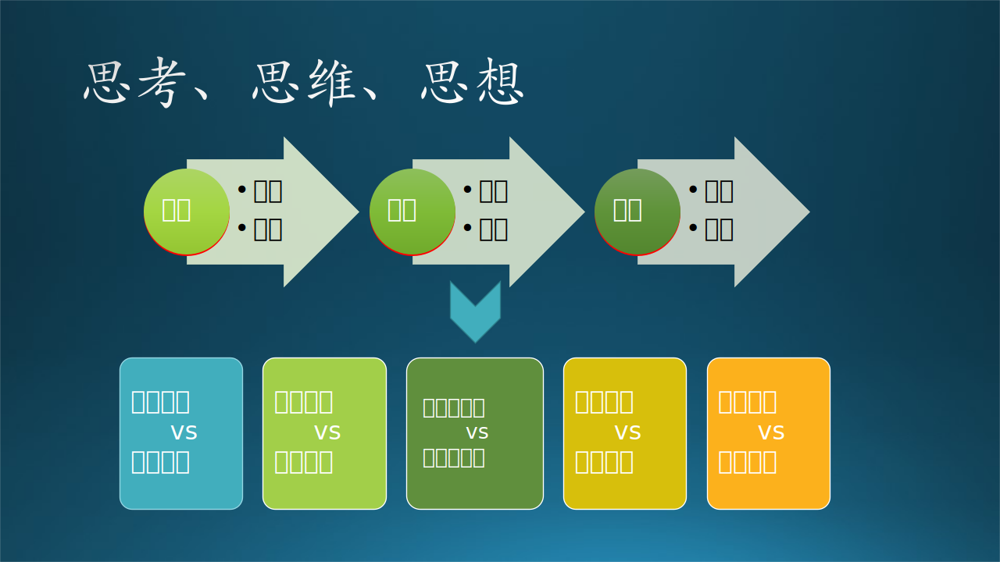
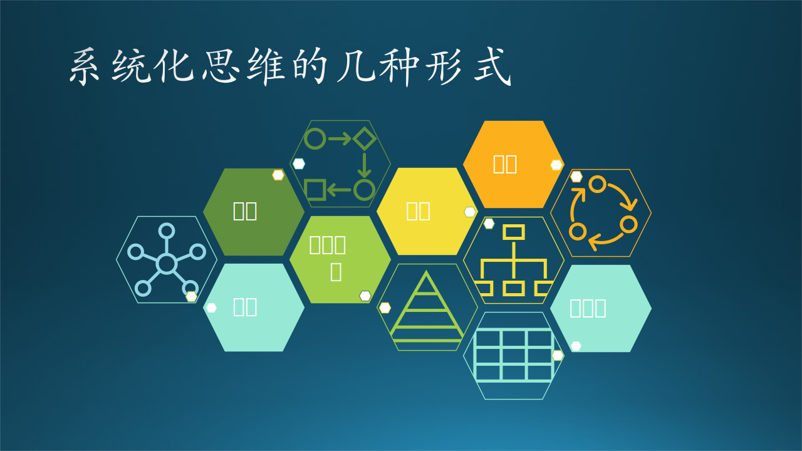
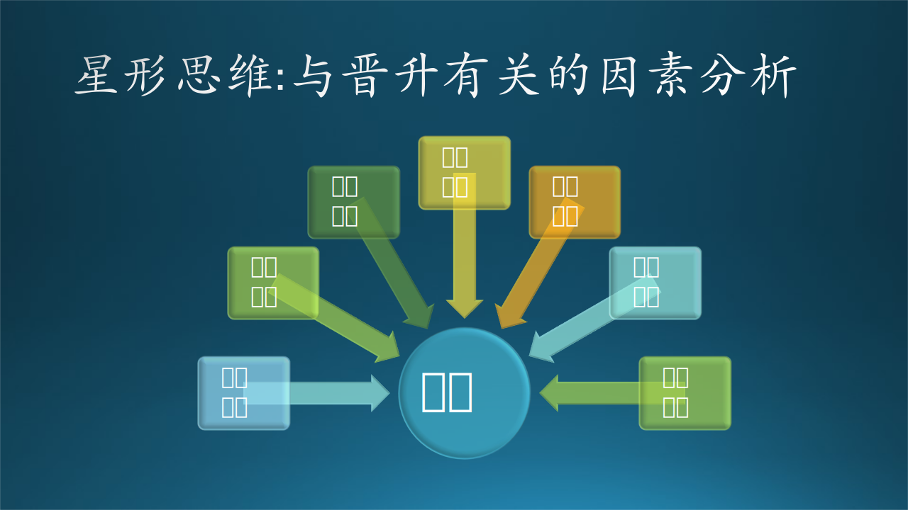
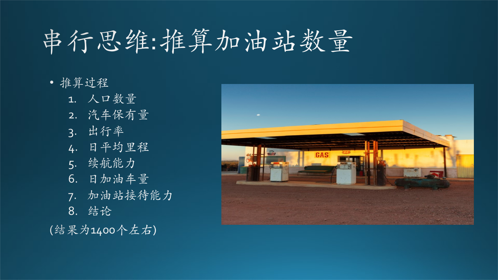
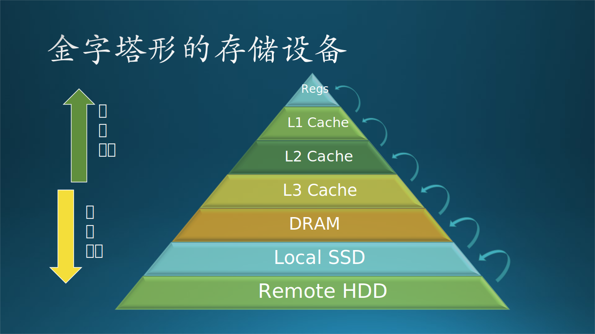
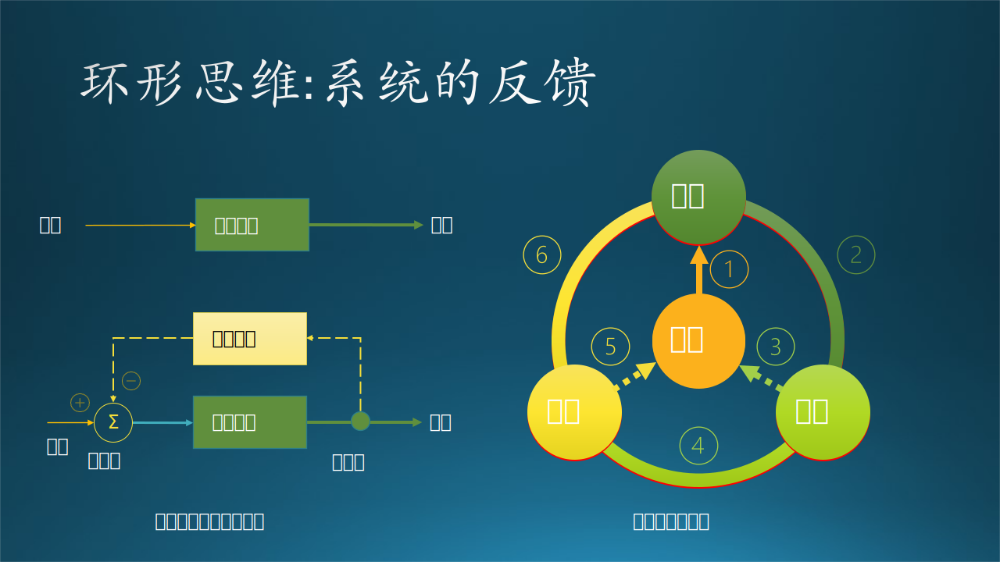
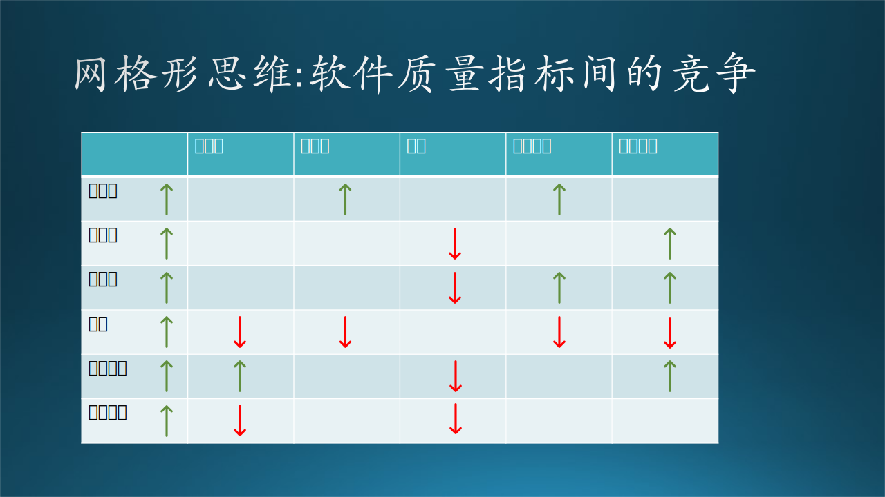

## 3.4 系统化思维能力

### 3.4.1 思维与系统化思维

#### 1. 三个名词

先理清三个名词：思考（Think），思维（Thinking），思想（Thought）。

图 3-12 三个名词的关系

**思考**，是一个动词，是人的大脑的一种能力和行为，就是程序员们常说的“等会儿！让我想想！脑子有点儿乱，这是我以前写的代码吗？这么丑！看上去很难理解......嗯，这个聚类算法并不适合于做有标签的数据分类学习，对吧？”

**思维**，是一个名词，是思考的方法和角度，也可以说是一种习惯。思维的生理基础是大脑，但是相同的生理基础可以产生不同的思维方式，这是人脑最神奇的地方。思维有很多种分类，下面具体解释。

**思想**，是一个名词，是思考的结果，它会形成两个层次的意识：认知、判断。“认知”是被动的，帮助人们认识世界；“判断”是主动的，帮助人们改造世界。成体系的认知叫做“知识”，伟大的认知一般才会称为“思想”，比如“毛主席是军事家、思想家、革命家”；渺小的判断叫做“主意”，大一些的叫做“决策”，商业化后叫做“解决方案”。

#### 2. 思维方式

以下是一些互相对立的思维方式或习惯。

（1）逻辑思维与逆向思维
  
  - 逻辑思维注重因果关系，无论对错。“因为你写了这段代码，所以才会产生bug”，这是一种不正确的推论。“因为你忘记给变量初始化为 0，所以才会产生bug”，这种说法听上去就合理多了。

  - 逆向思维把原因和结果倒置或者是颠倒主次关系，比如司马光砸瓮（不是缸），在其他小朋友都在想办法“让人脱离水”的时候，司马光选择了“让水脱离人”，事后如何赔偿水缸就不用担心了，因为上官尚光家会赔钱。

（2）线性思维与发散思维

  - 程序员大部是线性思维的，逢山开路，遇水搭桥，因为要解决问题，所以总会找最简单最直接的解决方法。

  - 发散思维是人脑天生的思维方式，测试人员大部分是这种思维方式，因为要制造问题，想办法用各种测试用例让代码暴露问题。

（3）结构化思维与碎片化思维

  - 结构化思维，面对复杂问题时，通过刨析其内部结构，找到引发问题的关键部分，制定有相对性的解决方案。庖丁解牛就是典型的结构化思维，他看到的不是牛，而是肌肉、筋络、骨骼结构。结构化思维有助于建设知识体系。
  
    比如遇到一个程序的性能问题，一个有经验的程序员应该从代码逻辑、硬件环境、运行环境、数据存取、网络吞吐、磁盘读写等多个方面进行分析思考。

  - 碎片化思维是指人们在长期接受各类不完整、缺乏逻辑性、支离破碎信息的过程中逐渐形成的一种表面化、片面化、简单化和情绪化的思维模式。现在人们从手机接受各种碎片化信息，这些信息的发布者大多具有商业目的，或欺骗利诱，或哗众取宠，不利于知识体系的建立。

    程序员们最喜爱的一个网站，恐怕就是 stackoverflow 了，因为里面有很多前人的经验总结，主要是针对某个具体问题的。如果需要解决一些比较直接的问题，比如一个 API 调用失败，或者一个 Python 包安装不上，通常用这种碎片化的信息就可以解决。
    
    如果想解决一些复杂问题，比如“深度神经网络如何调参”，那么 stackoverflow 通常不会给予直接的答案，即使有的话，也可能不是你想要的答案。

（4）平行思维与对抗思维
  
  - 平行思维要求聆听、理解他人的观点，赞扬与自己相同的观点，然后提出与自己不同的观点与对方讨论合作的可能性。
  
    比如，木头说：“这个系统现在运行得太慢了，我认为需要用 C++ 重写关键组件以提高性能"。石头说：”我非常同意要提高性能，咱们英雄所见略同（平行思维的典型特征），由于用 C++ 重写需要一个月时间并且有风险，咱们是不是可以先用更多的机器来分担负载，测试一周后再决定是不是要重写？” 木头欣然同意。

  - 辩论大赛的双方通常采用对抗思维，只要是对方说的论点就是不对的，想办法用一些反例来证明对方的错误，进而证明自己是对的。又可以叫做垂直思维。

    在平行思维的例子中，如果石头用对抗思维说：“用 C++ 重写需要一个月时间并且有巨大风险，所以根本不可行。用更多的机器来分担负载是一种最佳的解决方案。” 木头听到后肯定还要和对方争论，最后不欢而散。

    当年的“3Q大战”就是对抗思维，最后的结果是两败俱伤。

（5）零和思维与双赢思维

  - 零和思维（Win-Loss）是博弈论中的一个概念，博弈的双方，一方得益，另一方必然吃亏，此消彼长，二者相加总是为零。赌场中的庄家与赌客之间就是零和思维。在一个软件生态环境中的各路竞争对手也是零和思维。

  - 双赢思维（Win-Win）是双方合作的基础，在保持各自底线的前提下把竞争变成合作，获得各自的利益。微软放弃自己的 IE 浏览器，转而采用 Chromium 内核做 Edge 浏览器，是一种单方面的双赢思维，Google 对此当然是欢迎的，而微软得到的好处是站在巨人的肩膀上让自己看得更远。

#### 3. 从解决简单问题到系统化思维

先回忆一下 3.3 节中提到的“解决问题的能力”的主要内容。

通常来说，一个问题会包含有多个因素，这些因素都是**并列关系**，在拓扑结构上，如图 3-14 的**星形结构**。在某个特定条件下，只有一个因素会引发这个问题的出现。发现这个引发因素并加以解决，就是“解决问题的能力”体现。

而本节中的“系统化思维能力”所面对的问题，不仅仅是简单的一对一的因果关系，更多的是如图 3-13 中另外四种形式所示的复杂关系。所以，解决（简单）问题的能力也可以看作是一种简单的系统化思维能力。

图 3-13 系统化思维的几种形式

**这些思维形式的形成，是因为系统（问题）本身就是这种结构**，而并非无中生有。“读万卷书行万里路”是形成系统化思维的必经之路，简单说就是见多识广。读书是为了增加理论知识，行路是为了增加实践知识。

**最终，形成系统化思维能力的目的还是解决问题。**

### 3.4.2 星形系统与思维形式

举一个比较通俗的例子：木头在某个级别上很长时间不能得到晋升，如何解决这个问题呢？

图 3-14 星形系统与思维形式

和解决技术问题一样，我们需要排查疑点，也就是影响晋升的因素都有哪些，如图 3-14 所示，它是一个星形的因果关系图。

#### 1. 个人能力
  
个人能力是根本，这也是本章要阐述的重点。木头在这一方面还是很有自信的。

#### 2. 团队规模

在一个只有五个人的团队里，晋升的难度取决于你的老板是否受你的老板的老板重视（即你的老板的影响力），如果是的话，你很容易晋升，否则就很难，那么尽早离开是最好的选择。木头曾经在这个问题上用了一年多的时间才领悟到。

如果一个团队同一级别的人多，那么大家的竞争就会比较激烈，当然这种竞争不会直接表现出来，而是在老板那里做平衡，最常见的情况就是“风水轮流转，今年到我家”。

#### 3. 领导态度

领导是否认可你，是一个很关键的因素。木头曾经在一个部门中四年没有得到晋升，原因是木头的老板说：木头很不错。可是木头的老板的老板说：木头还需要努力。于是木头最终选择离开那个部门，到了另外一个部门后，就得到了很公平的待遇，晋升得很顺利，五年晋升了三级。

#### 4. 工作内容

在一个团队中，有些人工作在项目 A，而另外一些人为项目 B 工作。A 项目是一个新生的领域，发展很快，影响力大。但是 B 项目是一个维护已有系统的工作，不出错就可以了。显然 A 项目中的成员会有更多的晋升机会，大老板们也会偏向给 A 项目更多的 budget。
  
  比如微软小冰在脱离微软以前，成员们像坐着火箭一样地晋升，当然 ta 们经常加班也是不争的事实。但是在脱离微软单独成立一个公司时，每个成员都被告知会降薪（因为成员们的级别普遍太高了）。

#### 5. 积累效应

木头最近四年又一直没有得到晋升，但是心里却很平稳，因为这和上次的那个四年不一样，这一次的原因是在四年里换了四个老板：

  - 第一次是因为项目被总部拿走编到别的团队了，不得不换到新团队；
  - 第二次是因为整个团队都被砍掉了，不得不换到新部门；
  - 第三次是因为老板跑路了，不得不换组；
  - 第四次是因为上面所说的“团队规模”问题，又选择离开了，只有这一次是主动离开的，及时止损。

虽然在每个老板下的工作都很出色，但是每次都只有一年多的贡献积累，无法的得到晋升。在一个团队里，如果想得到高级别的晋升，无论如何也要两年左右，否则其它人会说闲话了：你看这个家伙刚来一年就晋升了，咱们干了三年多也没升职，不公平呀！

#### 6. 周边关系

不只是老板觉得你不错，其它同事也都觉得你不错，这样老板晋升你的决定才会服众。

还有就是你的工作成绩要有 Visibility（可见性，被大家知道），否则你的老板一说起要晋升你时，其它同级别或上级老板会有疑问：ta 都做过什么项目，我怎么一直不知道这个人呀？这就比较尴尬了。

#### 7. 公司业绩

公司的盈利情况，以及所在领域的大环境是否好，都决定了公司是否有更多的 budget 来支持员工的升职。如果利润微薄，那么晋升的概率就小；本满钵满，晋升的概率就大。

OK，如果你能够从以上几个方面分析好自己当前的境遇，判断出哪一个因素才是“四年没有得到晋升”的关键，抓住重点，就能够“解决”这个问题，提高自己的晋升概率。

### 3.4.3 串行化系统与思维形式

如果读者参观过现代化的汽车制造流水线，或者是任意一家现代化工厂，都会看到串行化系统的具体实例。我们常说的软件系统的数据处理 Pipeline，实际上就是借用这些串行化系统的概念。下面说说串行化思维形式。

解决单个问题，只需要线性思维就可以了，就是所谓“头疼医头脚疼医脚”。如果问题的依赖链条较长，就需要串行化的“系统思维能力”了，这是系统化思维中最简单的形式。

木头在做面试官时，首先会考察算法和编码能力，如果到后面还有时间的话，总会问下面这个问题：**北京城区需要有多少个加油站，可以达到加油排队时间不超过 10 分钟的服务质量？**

要解决这个问题需要一系列的假设数据支持，有些数据是可以从网上查到的，有些是常识，剩下的就需要靠推理了。

图 3-15 北京有多少个加油站

正确的解题思路如图 3-15 所示，详细解释如下：

#### 1. 北京有多少人口？

可以从官方的数据上得知，北京的常驻人口为 2100 万。

#### 2. 汽车保有量

从网上可以查到官方的统计数据，但是也可以这样推算：

（1）可以从官方的数据上得知，北京的常驻人口为 2100 万。
（2）假设是三个人组成一个家庭，那么一共有 700 万个家庭。假设每个家庭拥有一辆汽车，则一共有 700 万辆汽车。
（3）但是由于以下因素，会造成这一数字的不准确：
  - 摇号限制购买的措施，这个数字会减少
  - 很多年轻人还没有成家，但也可能有私家车，这个数字会增加
  - 北京还有很多企事业单位用车
  - 北京的出租车大概有 6 万辆

（4）上面几个因素有增有减，所以最后的汽车保有量大概就是 700 万辆左右。

#### 3. 出车率

不是每个有车的人都要开车，并且距离上班比较近的人不会开车上下班，还有限号措施（我们忽略电动汽车，因为它数量较少而且不需要加油）。据在木头居住的小区内观察，每天的出车率比疫情之前减少很多，大概只有 30%。这说明大家都有了节能环保绿色出行的理念，当然，也有可能是单位附近的停车费太高。

那么每天在马路上跑的车大概有 700 万辆 x 30% = 210 万辆

#### 4. 每天行驶多少公里？

北京的面积是 1.6 万平方公里，近似圆形，那么根据 $S=\pi r^2$ 公式，得到 $r=71$ 公里。由于此问题是估算北京城区的加油站数量，所以减去 2/3，可以认为半径为约 25 公里。也就是说人们上下班开车来回的平均距离为 25公里 x 2 = 50 公里左右。

#### 5. 一箱油可以跑几天？

- 大排量汽车越来越多，SUV 已经成为了购车首选，所以导致车辆每百公里耗油平均为 8 升。

- 一般的汽车的油箱容积为 50 升，按一周开5天（4天工作日 + 1天休息日开车出门办事或旅游）。

50 升 / 8升 x 100公里 = 625 公里，这是一个理想的里程。在城市里开，实际上是 500 公里左右就需要加油。

那么一箱油可以跑：500公里 / 50公里每天 = 10天

#### 6. 每天有多少车需要加油？

10天 / 5天每周 = 2周，即大概每个月加两次油，平均 15 天加一次油。
那么每天需要加油的车辆为 210万辆 / 15天 = 14 万辆。

#### 7. 加油站的服务质量

- 以 92 号汽油为例，加油站一般有至少 4 把油枪，可以同时加油，即可以同时服务 4 辆车。
- 每辆车的加油时长大概是 2 分钟。
- 我们要保证排队时间不超过 10 分钟，加上司机付费的时间，大概是每把油枪排 4 辆车。

那么每小时可以给 60分钟 / 10分钟 x 4把油枪 = 24 辆车加油，可以约等于 25 辆车。

全天 24 小时营业，但是司机一般会在早晚上下班的时段来加油，也就是峰值时段大约是 4 个小时。

每个加油站可以一天加油 25 辆车 x 4 小时峰值时段 = 100 辆车。

如果忽略了这个峰值时段，那么需要的加油站数量将会大大减少。就好比在双 11 购物节的时候，大量的用户涌入网站，需要 10000 台服务器才能处理，而在平时，只需要 1000 台服务器就可以搞定。

建设一个加油站要花很多钱，但是多加一把油枪不会花很多钱，所以可以用增加油枪数量的办法来缓冲峰值时段问题。

#### 8. 需要多少个加油站？

14 万辆 / 100 辆 = 1400 个加油站。

所以最后的答案就是 1400 个加油站。如果推算出 1000~1500 个，都是在合理范围内。

#### 9. 小结

以上 8 个问题，每个问题都不是很难，难的是可以把它们串起来，最后解决一个系统性的问题，那么市政府对加油站建设的规划就可以按照这个推断来进行。数量少的话，车主加油会等较长的时间；数量多的话，加油站的利用率较低，经济上不划算。

这种思维形式的常见误区是：

- 不容易找到合理的上游依赖问题，很容易发散。
- 不能正确地解决每个依赖的问题，差之毫厘谬之千里。
- 堆栈较深（依赖链条长）时，没有信心/耐心继续下去。

### 3.4.4 金字塔形系统与思维形式

在计算机硬件系统中，设计了各种各样的存储设备，这些设备成明显的层次结构，但是上小下大，介于串行系统与下面要讲的金字塔形系统之间，如图 3-16 所示。

图 3-16 金字塔形系统与思维方式

先简单解释一下图 3-16 中的名词，见表 3-2。

表 3-2 存储设备列表

|英文名词|中文名称|数量级|
|--|--|--|
|Regs|寄存器|几十个到几百个|
|L1 Cache|一级缓存|32K|
|L2 Cache|二级缓存|256K|
|L3 Cache|三级缓存|8M|
|DRAM|计算机内存|几个G|
|Local SSD|本地固态硬盘存储|几百G|
|Remote HDD|远程磁盘存储|几个T|

每个上级存储（小而快）都是下级存储（大而慢）的高速缓存，目的是把常用的数据保存在高速缓存中，加快数据的存取速度。对于思维而言，下层存储海量的碎片信息，上层存储经过加工、抽象后的信息。

1988 年，知名组织理论家罗素·艾可夫（Russell Ackoff）在就任国际一般系统研究学会（International Society for General Systems Research）主席的发言中，提出了数据—信息—知识—智慧（Data-Information-Knowledge-Wisdom，后文简称为 DIKW）的知识三角形（知识金字塔）。

这个 DIKW 和图 3-16 所示的系统，在原理上是相通的：把下层的东西提取出精华来放在上层。比如表 3-3 所示的几种进化过程：

表 3-3 从数据到智慧的进化

|Data$\rightarrow$|$\rightarrow$Information$\rightarrow$|$\rightarrow$Knowledge$\rightarrow$|$\rightarrow$Wisdom|
|-|-|-|-|
|一年中某地 下雨的数据|发现夏天午后经常下雨|于是夏天出门带雨伞|做出准确的天气预报|
|全国及地方的 人口数量数据|经过加工分析得到的统计 数据，比如地域性的差异、性别的差异、增长率的变化|建立人口模型，预测 未来人口数量的发展|辅助地方政府决策|
|姓别/年龄/职业/消费等零散数据|关联这些数据，得到它们 与消费金额的关系|年轻白领女性花钱最多 年长蓝领女性消费最少|不同消费群体的引导|

金字塔形系统有时可以被串行系统或树形系统所代替。

### 3.4.5 树形系统与思维形式

树形多用于组织结构，虽然外轮廓也和金字塔形系统一样是三角形，不同的是，处于低层的元素不是同质的。如图 3-17 所示。

图 3-17 如何举办一场音乐会

关于如何办一场音乐会，可以用以下步骤：

#### 1. 总体目标

木头有一个大乐队，50 多人，都是微软员工，来自各个部门，木头是这支乐队的队长。平时排练，但是没有什么合适的演出机会，于是，木头想自己举办一个音乐会。

怎么开始筹备呢？

#### 2. 要素分解

俗话说：没吃过猪肉还没见过猪跑吗？木头虽然没有举办音乐会的经验，但是看了那么多音乐会，也大概其知道组成一场音乐会的要素有三：表演部分、观众部分、场地部分。

#### 3. 解决方案

（1）表演部分

- 需要有演员（歌手乐手）和曲目（歌曲乐曲）。

- 人的因素是首位的，歌手乐手都有了，而且可以复用，即一个歌手可以唱多首歌，一个乐手可以在多首曲目中伴奏。

- 曲目也有很多可以选择的，国内的流行歌曲环境非常的好，另外乐队内还有古典乐手和民乐手。

（2）观众部分

- 需要让观众知道具体的时间和曲目，届时能够前来观赏。在公司内部有各种宣传手段，比如电子邮件、实时通信，最合适的形式就是“演出海报”。

- 由于是内部演出，就免去了票务部分。

（3）场地部分

- 公司内部有两个大的会议室，可以容纳百人以上，作为演出场地非常合适。

- 但是平时排练也要有场地，好在公司相关领导很支持木头的计划，排练场地就放在大会议室里，一般都是晚上排练，不会影响白天开会。

#### 4. 执行计划

- 先把歌手乐手们分成多个小组，或者自由组合，每个小组负责一个曲目。
- 曲目选择好以后，要进行编曲，然后大家开始排练。
- 排练用的乐器有“吉他、贝斯、键盘、鼓”四大件儿，其它的一些特殊乐器，比如小提琴、口琴、笛子等等由乐手自己准备。
- 由于排练场地只有一个，要事先安排好每个组的排练时间不能冲突。
- 海报部分，乐队内恰巧有 designer（设计师），当仁不让地负责设计海报。
- 海报设计完成后，一是形成 16:9 的电子版在楼内的各个演示屏上滚动播出，二是可以拿出去印刷，便于张贴。当然还需要中英文两个版本。
- 舞台搭建在演出日期前一天完成，各个小组按演出顺序进行彩排。
- 音响在一场音乐会里至关重要，木头特地找领导购买了调音台、线材、功放、音箱等设备。

#### 5. 小结

- 一个复杂的问题（目标）由多个要素组成，也就是子目标。
- 而完成这些子目标需要完成一个或几个任务。
- 每个小任务都需要在时间或空间上进行周密的部署与持续的努力才能达成。
- 从时间上看，以海报任务为例，设计、印刷、张贴、回收，是前后阶段顺序，每个阶段都需要有人、有场地、有方法、有工具才能完成。排练场地本身是一个空间，但是也需要时间的计划才能安排好很多组的排练。
- 从空间上看，以场地为例，舞台搭建的位置、音响布置的覆盖面、调音台中控的地点、有长度限制的线材的连接方式、观众的座椅位置、录音录像师的机位、乐器在舞台上的摆放位置、麦克风的排列形式，等等等等，都是需要联动考虑的问题。

### 3.4.6 环形系统与思维形式

环形系统，在生活中貌似不常见，但是其实人类本身就生活在一个环形的大自然环境中，虽然封闭但是可以自我修复，以达到最平衡的状态。古人总结出来的太极和五行理论就是环形系统。

图 3-18 环状系统的负反馈

先看一种比较简单常见的环状反馈（feedback）系统。其原始系统如图 3-18 左上所示，只有“输入、信号处理、输出”三个环节。

但是经常有这种需求：当输出端电平太高时，需要输入端智能地调低电平，所以就在输出端增加一个采样点，把输出信号反馈给输入端，并在结合点上与输入信号电平相减（因为是负反馈），这样在输出端最终得到的就是一个相对平稳的信号。

在思考时，通常人们会认为自己的思想无比正确，主意无比美妙。但是当你说出你的主意并得到一些反馈后，会纠正你的一些错误想法，把这些信息加入到输入端重新思考，才会得到大家都认可的好主意。

还有一种比较复杂的形式，一个输入通常是经过了很多个环节处理，最后反馈回来，对最初的输入做矫正。如图 3-18 的右图所示的一个例子：

（1）用户：“现在的系统运行有些慢，希望能够提升一下整体效率。”
（2）需求人员：“好的，我们马上和开发部门商量。”
   需求人员：“攻城狮们，咱们如何才能提升一下系统的整体效率，以便让用户高兴？”
（3）开发人员：“想整体提升的话，需要提升每一个组件的效率，要花很长时间。不如我们先提升一下关键组件的效率吧？但是这也会花几周的时间，会造成其它任务的延迟，用户不会高兴的。”
（4）开发人员：“另外，如果重写关键组件，会用空间换时间，运行快，但是占内存较大，希望最终产品的工程部署人员要注意。”
（5）产品人员：“果真如此的话，那么以前运行关键组件所在机器上的其它组件就必须部署到其它地方运行。我们需要用户另外购买几台设备来运行其它组件，这样用户不会高兴的。”
（6）产品人员：“需求大哥，你们再和用户确认一下吧？”

本来是一个好的出发点，但是经过一个环状的系统走下来，反而事与愿违。用户在得到一个好处（运行性能提高）的同时，可能会等待更长的时间获得新功能，或者花更多的钱来购买设备。

### 3.4.7 网状系统与思维形式

网状系统（或者说是表格形式）思维是最复杂的一种形式，因为它涉及到了横向思维和纵向思维两个方向，甚至是多维的。而其它的思维形式都是单向的。

图 3-19 网状系统的负反馈

在软件开发过程中，如图 3-19 所示，从纵向看，通常是多个小组分别完成各自的子系统，每个子系统又包含一系列的模块。从横向看，不同子系统的模块组成一个端到端的功能。项目管理者在纵向上需要协调各个小组的进度，这样才能在横向上把不同子系统的功能串联起来，尽早得到一个可运行的系统。

在机器学习中，通常有很多参数需要调节，比如深度神经网络中的步长值、样本批大小、卷积核的尺寸、正则化的参数等等，这些参数互相影响，网格状的参数搜索可以帮助我们找到最佳的参数组合。

在软件质量控制过程中，如图 3-20 所示，需要软件可以达到很多种质量指标，如：正确性、可靠性、易用性、高效率、可维护性、可移植性等等。但是其中的某些指标是相克的，一个指标的提升会带来另外一个指标的下降。

图 3-20 质量指标之间的竞争

在足球场上，教练会强调两点：一是全队三条线在横向上的步调一致，一起压上进攻，或者一起收缩防守；二是在纵向上，同一边的后卫、中场球员、前锋要协调进攻。在排球场上，六个队员形成 2x3 的网格阵型，兼顾进攻与防守。

以上这些都是网状思维的典型应用场景。

网状系统经常被星形系统和环形系统所代替，就是把网格中的每个节点做为中心点（星形）或起点（环形）来处理。
