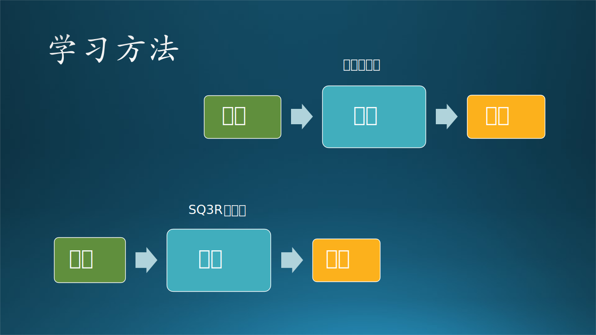

## 3.5 认知能力的培养

认知能力的关键说起来很简单，就是**理论$\leftrightarrow$实践**的循环体。培养认知能力的基本步骤：

1. 互通有无，用沟通能力打开封闭的世界。
2. 保持好奇，不断学习，保持和提高学习能力。
3. 学以致用，用学到的知识去解决实际问题，提高对细节的理解能力。
4. 洞达事理，培养系统化思维能力，建立知识体系，激发创造能力。

其实就是本章中的前四个小节所讲的内容。接下来笔者用一些亲身体会到的最佳实践来分享一些学习方法和技巧，以此来提高认知能力。

### 3.5.1 学习方法

#### 1. 费曼学习法

这个学习方法是诺奖获得者费曼提出来，然后由后人总结发展出来的。其核心就是先阅读大量资料，然后找出其中的知识，再把这个知识用自己的方式讲给一个完全不懂的人。如图 3.5.1 所示，可以表示为通过输入、输出来控制学习行为，验证学习效果。

【最佳实践：知识共享】

在微软的团队中，老板一般会组织大家进行技术交流，无论是与工作相关的还是无关的都可以。每个人根据自己的兴趣爱好在业余时间学习新的技术知识，然后把它们组织成 PPT 形式，在每周的开发人员组会时（不是 Scrum Meeting）讲给大家听，时间在半小时左右，每周一人。大家可以任意时间打断演讲提出问题。

【最佳实践：小黄鸭调试法】

另外一个极端的例子是小黄鸭调试法：程序员总是在桌子上放一只橡皮小黄鸭，在调试代码的时候详细地向鸭子解释每行代码。如果没有小黄鸭玩具，找一个同事临时充当也行，千万不要用尖叫鸡代替。你会发现在讲解的过程中，可以突然发现一些隐藏的问题，从而帮助你快速解决 Bug。其原理是：你如果只是盯着代码看，大脑会忽略一些重要细节；而当你试图讲出来时，为了让对方听明白，就会揪出这些细节来。从而发现问题。

图 3.5.1 两种推荐的学习方法

【最佳实践：如何做好小黄鸭】

如果某个读者不幸被同事当作小黄鸭，一定要拿出程序员的基本素养来，面带微笑认真地听，时不时地点头，也可以提出一些疑问，但是不要打断同事的思路。当同事忽然发现隐藏的 Bug 时，通常会立刻陷入深度思考而置你于不顾，此时默默地离开即可。

#### 2. SQ3R 阅读法

SQ3R 代表着五个单词：

1. **S**urvey（浏览），浏览学习内容。比如：拿到《智能之门》（笔者的另外一本书）后，先看章节目录，第四章是单变量线性回归。
2. **Q**uestion（提问），对一些知识点提出初步的问题。比如，训练数据长得是什么样子？回归的数学模型是什么（公式）？最小二乘的数学原理是什么？梯度下降的公式是如何得到的？又是如何变成代码执行的？
3. **R**ead（阅读），带着问题深入阅读并找到答案。
4. **R**ecite（背诵），把书合上，或者只看标题，来默写最关键的梯度下降公式推导，并写代码实现。
5. **R**eview（复习），过几天后，重复 4，看看是不是能记住。

如图 3.5.1 所示，可以理解为带着问题学习，最后得到答案。

#### 3. 西蒙学习法

笔者认为，对于理工科读者而言，这不是一个靠谱的学习法，但是不妨拿出来供大家参考。

这是诺贝尔经济学奖获得者西蒙教授提出来的。其理论基础是：

1. 一门学问大概有 5 万个信息块（知识点）；
2. 一个人记忆（remember）一个信息块需要 90 秒；
3. 5 万个信息块需要 1250 个小时；
4. 一周学习时间为 35 个小时，复习 5 个小时；
5. 1250 小时 / 35 小时 = 36 周 = 9 个月。

在原理论中的一些不妥之处：
- 5 万个信息块需要 1000 小时，这与 50000 x 90 秒 / 3600 秒 = 1250 小时相差太多，需要精确一些。
- 每周学习时间为 40 小时，但笔者认为不复习 5 个小时的话，会出现“狗熊掰棒子”的情况。
- 知识点有难有易，不能平均。
- 知识点之间有联系，需要读者自己组成知识体系。

西蒙教授的结论是：一个有一定基础的人，只要肯花时间下功夫，在最多 9 个月内可以掌握任何一门学问。

这听上去很疯狂，并且也没有定义“掌握”是如何定义的，但是笔者认为大学本科甚至研究生的课本，在 3 个月内就可以读完（remember），然后再花几个月理解（understand）并应用（apply）。

### 3.5.2 学习画图

人们在描述一个复杂问题时，通常会用画图的方式来表达，一图胜千言。为什么呢？因为人脑理解语言的过程如图 3.5.2 所示。

图 3.5.2 从语言序列重建模型

讲述一个复杂的问题时，如果用语言方式表达，则是一个序列结构，如图左侧所示。对于听者来说，如果只有一两句话，那理解起来很容易，但是当这个序列很长时，人们不得不在头脑中建立起右侧子图的结构来帮助理解，还有可能产生误解。所以，如果说话的人一开始就在纸上画出图来然后解释，会到达事半功倍的效果。

我们举个例子：当有一个人对你说“有一个系统，它的输入是文字，输出是图片”时，你的脑海中一定会快速建立起类似图 3.5.1 所示的模型（输入文字$\rightarrow$系统$\rightarrow$输出图片），然后大脑可能会把它立刻擦除，但是当再次需要的时候，又可以立刻把它从“垃圾桶”中捡回来而无需重建。

画图是抽象思维$\leftrightarrow$具象思维来回转换的结果，善于画图，说明你对这种转换掌握得淋漓尽致。我们在平时写技术文档的时候，通常会配上几张图来说明系统框架、基本流程、状态转换、交互关系等设计理念，让文档审阅者一目了然。

画图和写字一样，也有好看与不好看的区别，笔者提供一些体会供大家参考。

【最佳实践】

- 大小统一：同一级别的所有方框都尽量保持大小统一，里面的字体字号也要一致。
- 横平竖直：方框之间要对齐，像打麻将时自己的手牌一样，不能像打扑克牌一样。
- 配色讲究：要有基本的美学概念，不能使用大红大绿，而是要用一个色系的颜色做配色。
- 生动形象：绘图工具一般都很丰富，可以选择用图标表达各种含义。
- 连线清晰：尽量避免有交叉线的出现，重叠的连线要保持拓扑清晰。
- 妙用线型：巧妙使用“粗细虚实弯直”等线型来表达不同的含义。

图画得漂亮的人，一般长得也漂亮。

在本书中，所有的插图都是笔者亲手在 Microsoft PowerPoint 上绘制的，SmartArt 功能帮了大忙，帮助笔者对各种概念的理解更为深刻，相信对读者在阅读本书时也有同样的效果。

还有一种叫做“思维导图”的东西，是英国人托尼·博赞发明的，他是世界记忆锦标赛和世界快速阅读锦标赛创始人，曾经帮助英国查尔斯王子提高记忆力，被称为记忆力之父。于是，很多人把思维导图推崇至上，甚至升级为一种学习方法。对此笔者有不同看法。

其实，思维导图的方法和罗列多级列表的方法，在内容上没有任何区别，只不过思维导图工具具有特别的**形状、颜色、位置、关系连线**等信息，可以根据这些不同于纯文字的额外信息来辅助记忆。另外，思维导图最好是**读者自己绘制**，这样对绘制的过程（也就是思考和归纳的过程）有很深刻的记忆。

所以，绘制思维导图收益最多的是绘制者自己，而不是其它读者。

### 3.5.3 学习写字

笔者回忆了一下上学的经历以及自学新知识的过程，大概经过了如图 3.5.3 所示的几个阶段，下面详细介绍这几个阶段的【最佳实践】。

图 3.5.3 构建知识体系

#### 1. 写笔记

**主要作用：机械记录，随时记录知识要点。给自己看。**
**留存率：10%。** 意味着基本会忘得一干二净。

“好脑子不如烂笔头！” 小学老师总是在课堂上向坐在那里发呆的同学吼出这句话。确实，写笔记是一个帮助记忆的过程，回忆那些在小学、中学时学习成绩好的同学，他们的笔记都是非常工整完备的，主要是记录老师的板书，以及老师口头讲的但书中没有的知识点。

但是到了大学，没有老师要求你记笔记，最方便的笔记其实是直接标出书中的重点或者写在书的空白处，就像《哈利波特与混血王子》中的那本魔法书一样。

#### 2. 写短文

**主要作用：拾遗补缺，自我弥补技术盲区。给朋友看。**
**留存率：30%。** 很长时间以后还能记得自己写过这东西，但具体内容忘记了。

这里所说的“短文”，可以是一篇简短的记录，或者是一个简单的设计文档，甚至可以是 PPT 文档。

正如同费曼学习法所说的，我们如果把学习到的知识经过消化后用自己的语言再给同事们讲解出来，就会有深刻的理解。因为在准备讲解的过程中，你会发现有一些细节没有搞清楚，还有一些环节没有连接上，最糟糕的是结论和原因可能对不上，这都是没有透彻理解而导致的。如果想弥补这些问题，你必须深入地学习、透彻地理解。

在中学时代的语文课要求写 800 字的作文，对于所有学生来说都是一个噩梦，包括那些语文成绩好的学生，写作文对他们来说也不是轻而易举的事情，尤其是在考试的时候，时间有限，还要兼顾其它的小分题目。现在看来，一本 16 开版面的书的一页就是 800 字左右，可以算是一篇短文了。如果那时打好基础，以后遇到码字的工作时会轻松一些。

#### 3. 写案例

**主要作用：经验转播，深入实际动手实践。给学生看。**
**留存率：50%。** 在需要的时候可以方便地通过查询得到，重温知识，并再次使用。

这种案例的内容比较宽松，可以是各种层次或方向的技术内容，比如：

- 如何安装配置 GPU 显卡驱动和 CUDA 开发包。
- 如何使用 VS Code 利用 Linux 做远程服务器来开发 Python 代码。
- 如何使用 UWP 中的 GroupList 控件来完成炫酷的用户交互界面。
- 如何使用 Azure 上的 Cognitive Service API 来完成 Text-to-Speech 调用。
- 如何使用 PyTorch 搭建并训练简单的神经网络模型。
- ......

这种文章不要求很强的文字功底，只需要一板一眼地把步骤写出来即可，但最好是图文并茂，避免使用过多的文字还说不清楚。另外，作者自己的试验环境可能和读者的机器不同，比如 Python 版本，所以要想正确全面，需要多做些试验。

#### 4. 写博客

**主要作用：知识普及，分享探讨技术问题。给从业者看。**
**留存率：70%。** 可能会忘记一些细节，但方法不会忘记，而且会融会贯通地应用于实践。

一些技术博客（比如 CSDN 或 cnBlogs）、知乎上的技术问答、小红书上的技术讲解、微信公众号上的技术文章等等，都属于这个范畴。

《构建之法》的作者邹欣老师，就非常看重写技术博客的作用。当年在邹老师手下一起做 Windows 10 的生态环境建设时，整个开发小组都在一边开发一边写博客，每周定期对外发布一篇，内容是在 Windows 10 的 UWP 应用开发过程中遇到的问题及解决办法，很受广大粉丝的欢迎，最佳记录是一篇博客可以到达几万的阅读量和上百个点赞。

由于是对公众发布，比在团队内部做分享要严肃得多，内容要有代表性，篇幅要有保证，技术含量不能太低，用词也需要正式些，确实是很锻炼人的逻辑思维和表达能力的。

#### 5. 写教程

**主要作用：体系建设，讲解知识广泛传播。给广大读者看。**
**留存率：90%。** 意味着基本不会忘记，而且可以用于指导他人。

这里的教程，主要指的是书籍、教材、课件等等，还有一些特殊的视频类教程。教程的主要特点是：

- 知识点准确
  写作者对自己的文字产出高度负责，白纸黑字印出来的东西不能误人子弟，所以力求完整、正确，每一个概念都有出处可查，每一个试验都有代码有结果，每一行公式都反复核对，每一张图都认真推敲......
- 有完整体系
  一本书不会只讲几个知识点，而是把这些知识点串起来形成一个体系，其体系结构有可能是 3.4 节中所讲的五种结构中的一种或几种混合。这种知识体系帮助读者在阅读完后，利用其中的一个或几个知识点来解决实际问题。
- 理论加实践
  写作者一般都是在该领域有丰富的实践经验，把这些经验总结出来，结合已有的理论知识，变成循序渐进、深入浅出的文字、图片、公式、代码，以写作者认为读者最容易接受的方式来传播知识。

写书时不能人云亦云，比如很多人说 SVM（支持向量机）中的高斯核函数可以用泰勒展开来解释其工作原理，但是经笔者试验后，根本不是那么回事儿。

写一本书要看十本书，写作者必须有严谨的治学态度，克服长期的孤独寂寞，并具备舍己为人的品质才有可能成功，因为写书真的不挣钱（除非是畅销书）。

如果最开始时自己没有能力写出完整的一本书，那么与有经验的作者合作也是一个办法，前提是那位作者愿意带新人并分享著作权。一般情况下在 40 岁以后才有可能有写作的基础和动机，二、三十岁时可以暂时不考虑写书，但是可以用前面 4 个阶段的方法逐步积累素材。

#### 6. 写论文

**主要作用：创新引领，开拓新的知识领域。给研究者看。**
**留存率：95%。** 不会忘记自己写过的论文，从思路到过程，从文字到数据，都会记忆犹新。

笔者是一名软件工程师，对研究领域并不熟悉。但是在研究院工作的一段时间内，接触了很多研究员，也了解了他们的一些工作过程。

笔者的一位研究员朋友小 H 对此有一番感慨：“写论文太难了，从开始学习时就难，只能跟着 mentor 一步步走，让你干什么你就干什么。自己亲身经历过一遍全过程后，就假装算学会了。但是当要自己独立选择方向、立题、搜集素材、设计试验、总结结论、构思结构、润色文字时，每一步都需要艰苦的努力，无论你是新手还是老手，都不能保证每一篇论文都可以入选。”

在笔者看来，论文和教材的主要区别是：

- 读者不同
  论文读者一般都是领域研究人员（否则根本就读不懂）。而书的读者可以是任何有一定基础知识的人。
- 目标不同
  论文讲究的是知识的创新，不需要赘述已有知识。而书讲究的是知识的传播，要有知识点的铺垫，不能只定位在前沿知识讲座，否则就成了论文集了。
- 篇幅不同
  每篇论文只讲一两个创新点，篇幅上能短则段，把问题讲清楚即可。每本书要讲一个体系的知识，力求完整准确。
- 方法不同
  论文一般要求在几个月内完成，抓住一个创新点深入挖掘。书一般是需要几年的时间才能完成，每个知识点都要深入挖掘。

所以，一般写论文的人写不了书，写书的人写不了论文。但是写论文的人可以在积累了一定数量的创新后，把它们组织成为一个全新的知识体系变成书。

小 H 还向笔者透露了一个做研究写论文的关键点：批判性思维。于是笔者做了一番信息调查和知识梳理：在 3.2 节中讲到的布鲁姆分类体系中的高阶认知范畴：“分析、评价、创造”，即，批判性思维是高阶认知范畴的一部分。批判性思维的英文 Critical Thinking 并非像中文的“批判”这么尖锐，而是在一股脑接受一些信息、理念、观点之前，有四个动作可以做：

- 先根据高阶认知能力进行分析、评价，如果合理则接受，作为写论文的基础；
- 如果发现有不合理的地方，则可以作为创新点深挖一下，作为写论文的立意；
- 如果都合理，但是感觉有不充分的地方，可以在现有基础上做进一步的创新扩展，也可以写出论文来。
- 如果都合理，但是解决不了某个特定问题，那么必须创造一套新的方法，这自然可以成为论文的基础。

#### 总结

其实布鲁姆分类体系的六个层次，与本节中所讲的建立知识体系的六个阶段也可以有比较模糊的一一对应关系的，请读者自己分析理解。所以，掌握了本节中的六个阶段的学习方法，自然也就达到了布鲁姆分类体系的六个层次。

