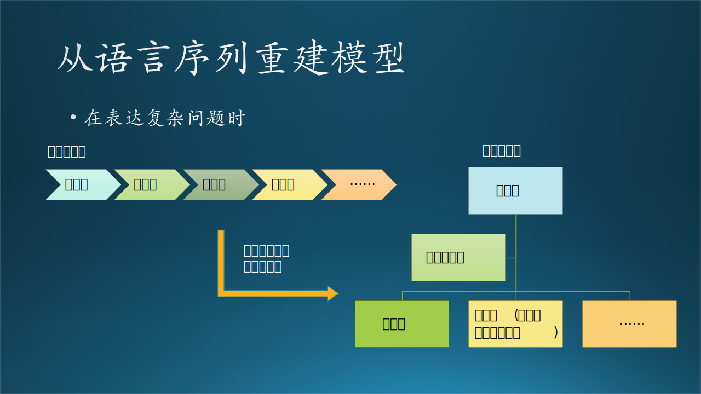

## 3.5 认知能力的培养

培养认知能力的基本步骤：

1. 互通有无，用沟通能力打开封闭的世界。
2. 保持好奇，不断学习，保持和提高学习能力。
3. 学以致用，用学到的知识去解决实际问题，提高对细节的理解能力。
4. 洞达事理，培养系统化思维能力，建立知识体系，具有创造能力。

其实就是本章中的前四个小节所讲的内容。接下来笔者用一些亲身体会到的最佳实践方法来分享一些学习方法和技巧。

### 3.5.1 学习方法

#### 1. 费曼学习法

这个学习方法是诺奖获得者费曼提出来，然后由后人总结发展出来的。其核心就是先阅读大量资料，然后找出其中的知识，再把这个知识用自己的方式讲给一个完全不懂的人。如图 3.5.1 所示，可以表示为通过输入、输出来控制学习行为，验证学习效果。

在微软的团队中，老板一般会组织大家进行技术交流，无论是与工作相关的还是无关的都可以。每个人根据自己的兴趣爱好在业余时间学习的技术知识，然后把它们组织成 PPT 形式，在每周的开发人员组会时（不是 Scrum Meeting）讲给大家听，时间在半小时左右，每周一人。大家可以任意打断演讲而提出问题。

另外一个极端的例子是小黄鸭调试法：程序员总是在桌子上放橡皮一只小黄鸭，在调试代码的时候详细地向鸭子解释每行代码。如果没有小黄鸭玩具，找一个同事临时充当也行。你会发现在讲解的过程中，可以突然发现一些隐藏的问题，从而帮助你快速解决 Bug。其原理是：你如果只是盯着代码看，大脑会忽略一些重要细节；而当你试图讲出来时，为了让对方听明白，就会揪出这些细节来。从而发现问题。

图 3.5.1 两种学习方法

#### 2. SQ3R 阅读法

SQ3R 代表着五个单词：

1. Survey（浏览），浏览学习内容。比如：拿到《智能之门》（笔者的另外一本书）后，先看章节目录，第四章是单变量线性回归。
2. Question（提问），对一些知识点提出初步的问题。比如，训练数据长得是什么样子？回归的数学模型是什么（公式）？最小二乘的数学原理是什么？梯度下降的公式是如何得到的？又是如何变成代码执行的？
3. Read（阅读），带着问题深入阅读并找到答案。
4. Recite（复述），把书合上，或者只看标题，来默写最关键的梯度下降公式推导，并写代码实现。
5. Review（复习），过几天后，重复 4，看看是不是能记住。

如图 3.5.1 所示，可以理解为带着问题学习，最后得到答案。

#### 3. 西蒙学习法

笔者认为，对于理工科读者而言，这不是一个靠谱的学习法，但是不妨拿出来供大家参考。

这是诺贝尔经济学奖获得者西蒙教授提出来的。其理论基础是：

1. 一门学问大概有 5 万个信息块（知识点）；
2. 一个人记忆（remember）一个信息块需要 90 秒；
3. 5 万个信息块需要 1250 个小时；
4. 一周学习时间为 35 个小时，复习 5 个小时；
5. 1250 小时 / 35 小时 = 36 周 = 9 个月。

原理论中：
- 5 万块需要 1000 小时，这与 50000 x 90 秒 / 3600 秒 = 1250 小时相差太多，需要精确一些。
- 每周学习时间为 40 小时，但笔者认为不复习 5 个小时的话，会出现“狗熊掰棒子”的情况。
- 知识点有难有易，不能平均。
- 知识点之间有联系，需要读者自己组成知识体系。

结论是：一个有一定基础的人，只要肯花时间下功夫，在最多 9 个月内可以掌握任何一门学问。

这听上去很疯狂，并且也没有定义“掌握”是如何定义的，但是笔者认为大学本科甚至研究生的课本，在 3 个月内就可以读完（remember），然后再花几个月理解（understand）并应用（apply）。

### 3.5.2 学会画图

#### 画图的能力

人们在描述一个复杂问题时，通常会用画图的方式来表达，一图胜千言。为什么呢？因为人脑理解语言的过程如图 3.5.2 所示。

图 3.5.2 画图的能力

如果用语言方式，是一个序列结构，如图左侧所示。对于听者来说，如果只有一两句话，那理解起来很容易，但是当这个序列很长时，人们不得不在头脑中建立起右侧子图的结构来帮助理解，还有可能产生误解。所以，如果说话的人一开始就在纸上画出图来然后解释，会到达事半功倍的效果。

我们举个例子：当有一个人对你说“有一个系统，它的输入是文字，输出是图片”时，你的脑海中一定会快速建立起类似图 3.5.1 所示的模型（输入文字->系统->输出图片），然后立刻擦除。

画图是抽象思维$\leftrightarrow$具象思维来回转换的结果，善于画图，说明你对这种转换掌握得淋漓尽致。我们在平时写技术文档的时候，通常会配上几张图来说明系统框架、基本流程、状态转换、交互关系等设计理念，让文档审阅者一目了然。

画图和写字一样，也有好看与不好看的区别，笔者提供一些【最佳实践】供大家参考。

- 大小统一：统一级别的所有方框都尽量保持大小统一，里面的字体字号也要一致。
- 横平竖直：方框之间要对齐，像打麻将一样，不能像打扑克牌一样。
- 配色讲究：要有基本的美学概念，不能使用大红大绿，而是要用一个色系的颜色做渐变。
- 生动形象：绘图工具很丰富，能用图标表达各种含义。
- 连线清晰：尽量避免有交叉线的出现，重叠的连线要保持拓扑清晰。
- 妙用线型：巧妙使用粗细虚实弯直等线型来表达不同的含义。

图画得漂亮的人，一般长得也漂亮。

在本书中，所有的插图都是笔者亲手在 Microsoft PowerPoint 上绘制的，SmartArt 功能帮了大忙，这样帮助笔者对各种概念的理解更为深刻，对读者也有同样的效果。

#### 思维导图

这是英国人托尼·博赞发明的，他是世界记忆锦标赛和世界快速阅读锦标赛创始人，曾经帮助英国查尔斯王子提高记忆力，被称为记忆力之父。

标准的思维导图，是一个由中心向四周发散的层次逐级递减的图，可以认为是分类逐渐细化，如图 3.5.3 所示。

图 3.5.3 思维导图

其实，思维导图的方法和罗列多级列表的方法，在内容上没有任何区别，只不过思维导图具有特别的**形状、颜色、位置、关系连线**等信息，记忆时可以根据这些不同于纯文字的额外信息来辅助。另外，思维导图最好是**读者自己绘制**，这样对绘制的过程（也就是思考和归纳的过程）有很深刻的记忆。

### 3.5.3 学会写文字

笔者回忆了一下上学的经历以及自学新知识的过程，大概经过了如图 3.5.4 所示的几个阶段，下面详细介绍这几个阶段的【最佳实践】。

图 3.5.4 构建知识体系

#### 1. 写笔记

主要作用：机械记录，随时记录知识要点。给自己看。

“好脑子不如烂笔头！” 小学老师总是在课堂上向坐在那里发呆的同学吼出这句话。确实，写笔记是一个帮助记忆的过程，回忆那些在小学、中学时学习成绩好的同学，他们的笔记都是非常工整完备的，主要是记录书中的一些重点，以及老师口头讲的但书中没有的知识点。

但是到了大学，没有老师要求你记笔记，最方便的笔记其实是直接标出书中的重点或者写在书的空白处，就像《哈利波特与混血王子》中的那本魔法书一样。

#### 2. 写短文

主要作用：拾遗补缺，自我弥补技术盲区。给朋友看。

这里所说的“短文”，可以是一篇简短的记录，或者是一个简单的设计文档，甚至可以是 PPT 文档。

正如同费曼学习法所说的，我们如果把学习到的知识经过消化后用自己的语言再给同事们讲解出来，就会有深刻的理解。因为在准备讲解的过程中，你会发现有一些细节没有搞清楚，还有一些环节没有连接上，最糟糕的是结论和原因可能对不上，这都是没有透彻理解而导致的。如果想弥补这些问题，你必须深入地学习、透彻地理解。

#### 3. 写案例

主要作用：经验转播，深入实际动手实践。给学生看。

这种案例的内容比较宽松，可以是各种层次或方面的技术内容，比如：

- 如何安装配置 GPU 显卡驱动和 CUDA 开发包。
- 如何使用 VS Code 使用 Linux 做服务器来开发 Python 代码。
- 如何使用 UWP 中的 GroupList 控件来完成炫酷的用户界面。
- 如何使用 Azure 上的 Cognitive Service API 来完成 Text-to-Speech 调用。
- 如何使用 PyTorch 搭建并训练简单的神经网络模型。
- ......

这种文章不要求很强调文字功底，只需要一板一眼地把步骤写出来即可，但最好是图文并茂，避免说不清楚。另外，你自己的试验环境可能和读者的机器不同，比如 Python 版本，所以要想正确全面，需要多做些试验。

#### 4. 写博客

主要作用：知识普及，分享探讨技术问题。给从业者看。

一些技术博客（比如 CSDN 或 cnBlogs）、知乎上的技术问答、小红书上的技术讲解、微信公众号上的技术文章等等，都属于这个范畴。

《构建之法》的作者邹欣老师，就非常看重写博客的作用。当年在邹老师手下一起做 Windows 10 的生态环境建设时，整个开发小组都在一边开发一边写博客，每周定期发布一篇，内容是在 Windows 10 的 UWP 应用开发过程中遇到的问题及解决办法，很受广大粉丝的欢迎，最佳记录可以到达几万的阅读量。

由于是对公众发布，比在团队内部做分享要严肃得多，内容要有代表性，篇幅要有保证，技术含量不能太低，用词也需要正式些，确实是很锻炼人的。

#### 5. 写教程

主要作用：体系建设，讲解知识广泛传播。给广大读者看。

这里的教程，主要指的是书籍、教材、课件等等，写作者对自己的文字产出高度负责，白纸黑字印出来的东西不能误人子弟，所以力求完整、正确，每一个概念都有出处可查，每一个试验都有代码有结果，每一行公式都反复核对，每一张图都认真推敲......

写一本书要看十本书，写作者必须有严谨治学的态度，克服长期的孤独寂寞，并具备舍己为人的品质才有可能成功，因为写书真的不挣钱（除非是畅销书）。

如果最开始时自己没有能力写出完整的一本书，那么与有经验的作者合作也是一个办法，前提是那位作者原意带新人并分享著作权。

#### 6. 写论文

主要作用：创新引领，开拓新的知识领域。给研究者看。

笔者是一名软件工程师，对研究领域并不熟悉。但是在研究院工作的一段时间内，接触了很多研究员，也了解了他们的一些工作过程。
