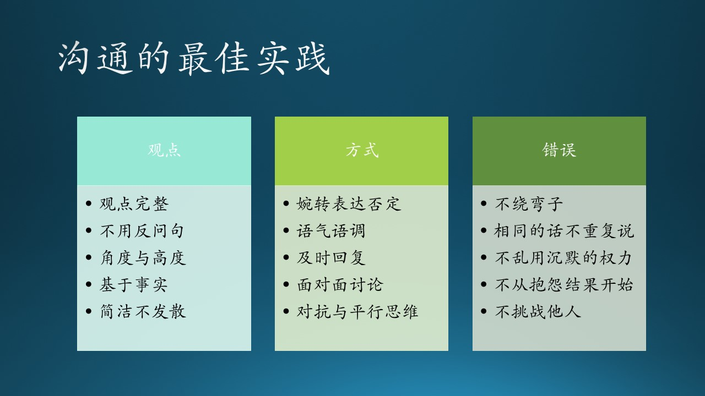

## 2.3 沟通能力

### 2.3.1 培养基本的沟通能力

Nobody is an island. 没有人是一座孤岛。

微软很看重沟通能力，而且是在面试中的一个重点考察项目。为什么呢？因为大公司一般都是团队作战，不像小公司那样主要靠单打独斗，作为一个工程师会牵涉到：

- 和团队内其它工程师的沟通
- 和 PM 的沟通
- 和 Designer 的沟通
- 和其它团队的沟通
- 和老板的沟通
- 和客户的沟通

如果按照形式分类，又可以分为：

- 正式沟通与非正式沟通
- 垂直沟通与水平沟通
- 口头沟通与书面沟通
- 语言沟通与非语言沟通
- 内部沟通和外部沟通
- 单独沟通和集体沟通

如果按信息内容和目的分类，可以是：

- 基本的信息沟通
- 工作中的职业沟通
- 高级的情感沟通

一个不想沟通又不会沟通的人，很难融入到团队中与他人合作完成项目。所以，沟通，已经成为在职场中生存的基本手段了。

沟通是双向的，是一个编码、解码的过程，要求你既会说又会听。笔者认为不存在单向沟通，因为那不叫作沟通，叫做信息发布。

### 2.3.2 沟通的最佳实践

图 2.3.1 沟通的最佳实践

#### 表达深思熟虑后的观点

表达观点时，要有理有据（虽然不能保证合情合理），不能道听途说地只说个结论，没有推理过程或者解释说明。

比如你想说服其它人采用你的技术建议，粗糙的沟通方式是：“这种技术很多大公司都采用了，我们也应该采用。” 这种观点拿出来很容易被 challenge（挑战）。

你可以找到两三条理由来支持的你的观点，比如：

“我建议采用一个消息队列来接在 Web 服务器后面，这样的好处是：

1. 松耦合，在设计、实现上都比较方便；
2. 异步方式可以处理高并发；
3. 集成测试或调试时，可以使用假数据单独针对接口测试，不需要架设庞大复杂的系统。

很多大公司都采用，所以应该是成熟可靠的技术，我们应该采用。”

这种方法有助于你养成想好后再说话的习惯，而不是像那些网络喷子一样只会发表不当言论。

#### 注意语气语调

俗话说“有理不在声高”。有些人说话的音量很大，像是在吵架；有些人语速特别快，通常需要听者在脑子里把话在重复一遍才能明白；还有些人语气比较强硬，不太会用词。

木头的老板是一个反例，他说话时：

1. 音量低，这反而能让别人都安静下来仔细听他在说什么。
2. 速度慢，还稍微有些结巴（当然这不是优点），不过反而能让人明白他在说什么。
3. 不和别人争吵，有不同意见时，他表达完自己的观点后，如果对方不同意，他就会说“行，那再回去研究研究吧”，这样不管最终谁对谁错，都给双方留了余地。

#### 说话不要绕弯子

比如，有个同事建议：“到了年底，因为美国那边要休圣诞节假期，所以我们不如等他们都休假回来后再一起讨论后续的安排。” 其实是这个同事的年假没用完，他想在 12 月底休两周的假，他不直说，却把美国人搬出来当挡箭牌。

木头的乐队里还有个例子：一个乐队的成员想在元旦时出去玩儿，但是新年音乐会定在了 1 月 6 日，他又怕到时候不能赶回来，所以他们队长就来找我说：1 月 6 日估计很多微软员工休假的还没回来，影响观众的上座率，不如我们延期举办音乐会吧？

这听上去就是很为演出效果考虑的感觉，但是这一个改变就要到春节后再开音乐会了，排练不好安排。员工们过完春节刚刚来上班，你来个“马后炮”，不论是观众和乐手，心气儿都差远了。木头看出来了是因为他们的乐手凑不齐，所以拒绝了这个队长的请求，说：你如果缺乐手可以向别的乐队借，没必要把自己乐队的困难绕个弯子转嫁到整个演出上。

#### 相同的话不要重复说

在工程师层面的沟通，不需要像在大街上聊天似的，为了增加亲密程度和聊天长度而说“车轱辘话”。车轱辘话出现的原因是：

- 想强调某个理由，但是没有很好地组织语言。
- 或者是没有更好的理由，而只好说重复的话。

一旦出现车轱辘话，在说者看来好像是强调了刚才的观点，但是在听者看来会得到两个结论：这个人固执；他没别的理由了。这与说者想达到的目的正好相反。

#### 婉转表达否定

假设你和领导进行 1:1 的年终总结谈话，领导说：“你在这个项目里承担了一些重要的工作，技术能力很不错，但是在与同事进行技术讨论时，在说话技巧上还有一些进步的空间。”

“有进步的空间”这句话很艺术，它并没有直接说你现在做得不好，而是很委婉地说你可以做得更好。没有人愿意在和别人比较时甘拜下风，但是如果说自己有潜力可以做得更好的话，当然是可以欣然接受的事实。

在《星际迷航》电影里，经常会看到这样的对话：船长说“把动力系统全部移到船头进行形成能量网保护”，操作员可能会说“Negative（不行），我们需要至少10%的能量储备用于随时做光速跃迁逃逸。”，用 Positive/Negative 就会比较婉转，给船长留了面子。

#### “角度”与“高度”

在人类所在的三维世界中，当然有“角度”的概念，同样看一个物理存在的巨大的物体，有的只能看到它的左侧，有的人只能看到右侧，由此会引申到对待一个问题的看法，不同的人会有不同的“角度”。

但是，当有人和你沟通时用了“角度”这个词，尤其是领导，大概率是在说你的思考层次“高度”不够，而不是“角度”。为什么呢？

对待项目或者技术问题，其实是存在上帝视角的，这和大家都站在地面观察普通的体积大的物体不同，领导很可能是站在“空中”观察这个物体的，甚至在观察那些观察物体的人。

比如，你建议：“这个项目比较复杂，我们应该先挑最难的部分做，集中优势兵力打歼灭战，这样做对项目进度是有保障的。” 没错，如果从一个纯技术“角度”看，你的这个建议是对的。但是，领导可能会说：“因为这是一个合作项目，能争取过来做 owner 不容易。为了让合作方能对我们建立信心，我们应该先做简单的部分，尽快出一些阶段性成果，同时抽出一小部分人力去啃硬骨头，明修栈道，暗度陈仓。”

你自认为从 360 度观察到了事务的本质，但是领导却是从 540 度做了更多的思考。所以，说“角度”这个词，只是给你一个面子。

#### 不要乱用“沉默”的权力

笔者在写本书的“用户与需求”部分时，曾经想要求一位以前共过事的 PM 一起写，就发了一封邀请邮件，但是却石沉大海，也不好再说，干脆自己写了。笔者感到很不可思议的是，自己曾经和那位 PM 在项目最艰难的时刻共同努力，最终令项目得到了总部的认可，相当于一起“扛过枪、负过伤”的交情，为什么对方会沉默呢？

不要怀疑他可能是漏看了邮件，因为他是一个非常细心的人，看邮件回邮件是他的本职工作。其实他完全可以说“工作繁忙、才疏学浅”等等来推脱，笔者是完全可以接受的，但是这种“沉默”是极大的不尊重，相当于断绝了以后交往的可能。

同样的问题经常发生在同事或朋友之间的微信通信上，有的时候甚至一句“新年快乐”发过去却得不到半点儿回音。笔者只是在对对方的行为或言语极为反感时，才会采用“沉默”这种手段。所以奉劝那些容易忘记回复消息的读者们，真正地把对方放在心上，在方便的时候第一时间回复对方。

#### “一会儿回复您”

如果需要较长时间的思考，也可以回复说“让我先想想，一会儿回复您”。

曾经有一位朋友（微软中国 ARD 的韦青老师）请笔者去给一个合资公司讲讲“微软的工程师文化”，因为笔者当时很忙，一时不能确定能不能讲好，或者是需要多长时间的准备，所以就在第一时间回复说“让我想想”。两个小时后，给予了对方肯定的答复，然后就在业余时间开始准备演讲内容，大部分内容都是本书中的实践中的软件工程，最后的演讲效果非常好，这才启发、激励笔者继续写完这本书，相信会得到很好的读者反馈。

#### 不抱怨结果，要分析原因

#### 少用对抗思维，多用平行思维
#### 基于观点的讨论，而非立场
#### 面对面的讨论更加有效，文字会产生误解
#### 尽量完整地表达自己的观点
#### 不挑战别人的决定，而是提出建设性意见
