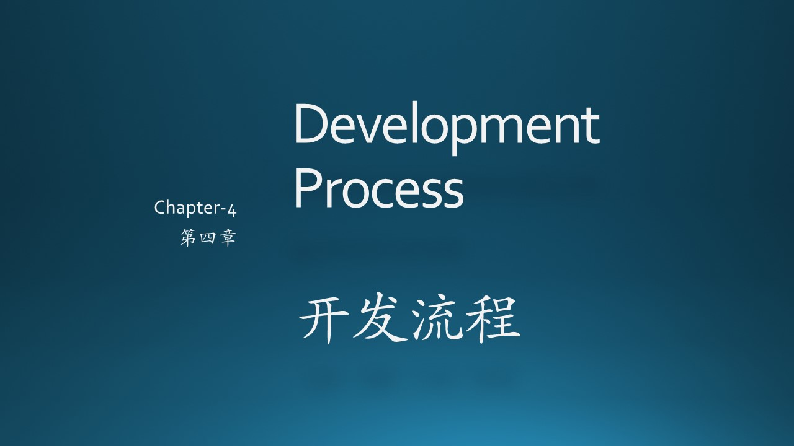
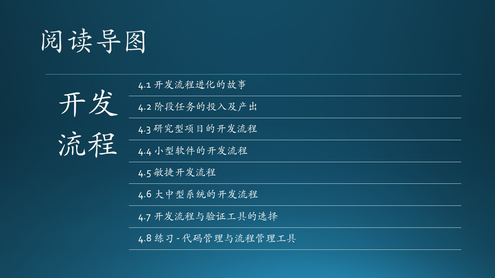

注意我们使用了“流程（Procedure）”，而非“过程（Process）”，强调的对是软件工程的过程中的各个环节的事无巨细的掌控和对关键点的监督。而过程是一种点到为止的叙述，最后注重的是结果。

- 通过对书本知识（比如本书）的学习，读者可以了解到软件工程的**过程**；
- 而**流程**必须通过动手实践才能得到切身体会。

比如那个家喻户晓的笑话：“如何把大象放到冰箱里？” 答曰：“1. 把冰箱门打开；2. 把大象牵进去；3. 把冰箱门关上。” 这其实就是一种对**过程**的描述，它可以通过忽略具体细节而混淆视听。

还有一个例子，就是木头如何鼓励新手上台表演：“你就背着吉他，眼睛不用看台下以免紧张，然后弹和弦 1645,1645,1645......，鞠躬下台，多简单的**过程**！” 但实际上，吉他手上台表演，要考虑站位、站姿是否符合舞台要求，吉他连接到调音台后音量、音色的调节，和弦进行 1645 要克服大横按的一些操作难点，还要听鼓的节奏避免错拍，还要根据歌手的情绪来调节扫弦的力度，等等。这一系列**流程**能顺利走下来都是必须经过长期练习才能做到。

### 参考资料

- The Chicken and the Pig, Wiki Pedia, https://en.wikipedia.org/wiki/The_Chicken_and_the_Pig
- 《构建之法》，邹欣，人民邮电出版社
- RASCI Responsibility Matrix, https://managementmania.com/en/rasci-responsibility-matrix
- 《卓有成效的敏捷》，史蒂夫·麦克康乃尔，人民邮电出版社

- 什么是MVP? https://tsh.io/blog/mvp-app-and-the-other-validation-methods/

- 《实用软件工程》第二版，郑人杰，清华大学出版社

- Scrum 中文网，https://www.scrumcn.com/agile/scrum-knowledge-library/scrum.html

- Azure DevOps 文档，https://learn.microsoft.com/zh-cn/azure/devops/boards/?view=azure-devops

- 敏捷网站，https://agilemanifesto.org/
