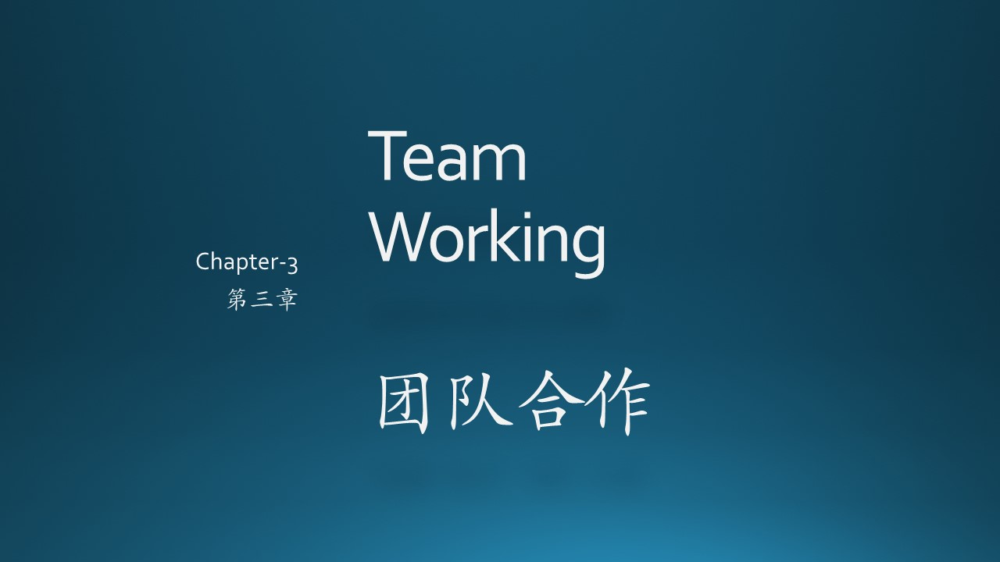

### 参考资料

- The Chicken and the Pig, Wiki Pedia, https://en.wikipedia.org/wiki/The_Chicken_and_the_Pig
- 《构建之法》，邹欣，人民邮电出版社
- RASCI Responsibility Matrix, https://managementmania.com/en/rasci-responsibility-matrix
- 《卓有成效的敏捷》，史蒂夫·麦克康乃尔，人民邮电出版社

- 什么是MVP? https://tsh.io/blog/mvp-app-and-the-other-validation-methods/

- 《实用软件工程》第二版，郑人杰，清华大学出版社
