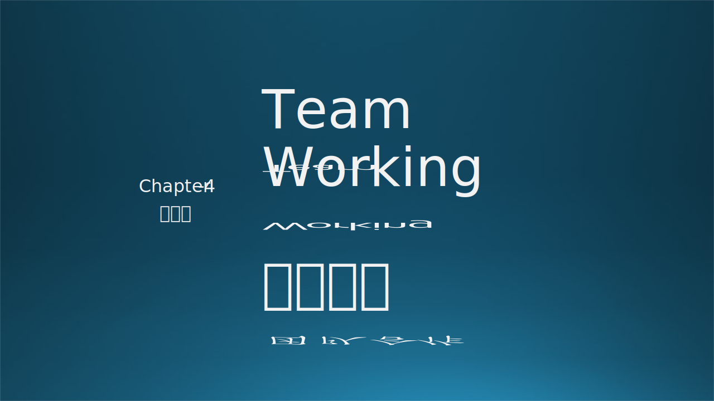

团队合作，主要指的是团队内部的成员之间的合作，双人的、多人的，同事之间的、上下级之间的，相同角色之间的、不同角色之间的，等等。本章中，描述了 6 种团队类型，木头会讲一个团队合作项目的故事，然后分析团队中的各种角色；接下来讲述了几种关系：个人与团队之间、团队与团队之间、实习生与导师之间的合作方法。

### 参考资料

- The Chicken and the Pig, Wiki Pedia, https://en.wikipedia.org/wiki/The_Chicken_and_the_Pig
- 《构建之法》，邹欣，人民邮电出版社
- RASCI Responsibility Matrix, https://managementmania.com/en/rasci-responsibility-matrix
- 《卓有成效的敏捷》，史蒂夫·麦克康乃尔，人民邮电出版社

- 什么是MVP? https://tsh.io/blog/mvp-app-and-the-other-validation-methods/

- 《实用软件工程》第二版，郑人杰，清华大学出版社

- 《卓有成效的敏捷》，史蒂夫·麦克康乃尔，人民邮电出版社
