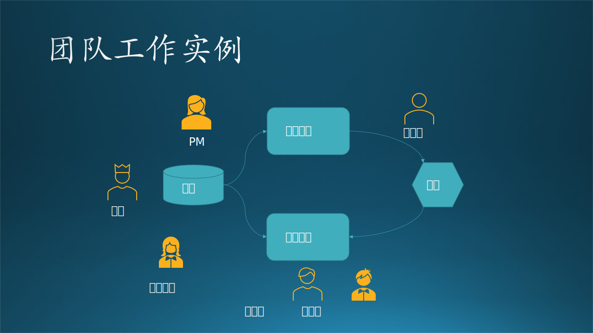

## 4.1 团队工作的故事

下面讲一个真实的小故事，通过这个故事，读者可以了解到团队的成员组成以及基本的软件工程流程。

图 4.1.1 团队工作实例

### 4.1.1 项目中的团队成员角色

前一段时间木头接手了一个小项目：某金融公司与 MSRA 的机器学习组的研究员合作量化交易的研究。木头的任务是在 Azure 上开发一个系统，把数据上传、训练、推理、模型管理等组织起来并部署到 Azure 上，方便客户、研究员、管理者使用。

- 研究员、研究员 Lead、研究员 Manager
- 实习生、工程师、工程师 Lead、工程师 Manager
- PM、PM Manager
- 微软方市场人员及商务管理人员
- 客户方技术人员和市场人员

微软方参与具体的 feature team 技术开发的成员是：

- 研究员“大肖”
- 工程师“木头”
- 工程师“石头”
- 实习生 x 2
- 技术指导（Tech Lead）“大齐”
- PM “小P”

因为疫情原因，所以我们每周一次的例会都是通过 Microsoft Teams 软件在线上开的。木头负责系统设计和技术文档，当然也要写代码和测试，所以每次都是木头发出最新的技术文档供大家评审。评审反馈可以通过邮件，也可以在线会议时口头给出。

下面的故事中列出了几个小的讨论细节，便于大家了解真实的团队合作过程。

### 4.1.2 需求分析

经过一周多的需求调研，木头列出了四个子系统的 Use Case（用例）：

- 用户界面子系统
- 模型推理子系统
- 模型训练子系统
- 模型管理子系统

1. 石头同学给了5条反馈，其中第2条反馈是：“应该设计一个训练ID，用于连接上下文的唯一ID。”

    *注：这个意见很重要，虽然不是需求阶段应该讨论的问题，但是说明石头同学已经开始思考实现细节了。*

2. 大齐同学给了一条反馈：“我比较倾向把推理子系统，合并进模型管理系统，作为一个子模块，因为他们的依赖性太强了。而且它很难独立开发或单独使用，尤其是模型历史和上下文信息都是由管理系统处理的。”

    *注：这个讨论的范畴是对的，针对需求用例阶段。但是木头不同意这个结论，不管依赖性有多强，这都是两个子系统，不应该合并。*

3. 小P 给的反馈是：“模型训练和选择是研究员的工作，工程师这边只负责制定接口。”

    *注：这也是对的，因为木头一开始就陷入了对训练和推理细节的学习和探讨，但后来发现重点不对，意识到这两个是独立子系统，是研究员负责的，只需要把它们当作黑盒子调用即可。果然得到 PM 的认可。*

经过这一轮的讨论，团队内部确定了系统架构和职责划分。

### 4.1.3 技术选型

这个系统中的技术点很多，每个点都有多种选择，需要团队讨论。木头印象较深的是推理机制触发的问题。

在以前的试验室系统中（利用熟悉的技术搭建的简单系统，可以工作但并不方便），客户上传完数据后，要通过微信通知研究员来启动推理系统工作。木头试图把它变成自动化的流程，即客户上传完数据后可以自动触发推理动作。两种方案：

- 在服务器端，检测 Azure Blob（云数据存储）上的文件变化，一旦有新数据上传，就启动推理；
- 在客户端，把原有的简单的 SFTP（安全文件传输协议）客户端改成有一定智能的脚本，上传完数据后，利用可执行程序给服务器发信号来启动推理。

经过团队好几轮的线上讨论，得到大家的反馈：

- 研究员认为可以减轻工作量，使得流程自动化，很好；
- 石头认为这是体现工程师设计水平的技术环节，很好；
- PM 认为这是改善服务质量的环节，很好。

只有大齐的顾虑较多，他认为：

1. 如果有可能尽量不 release 任何 binary 给用户，因为这会增加我方法律或安全上的风险。如果之后 scenario 上有变化，修改 server 上的程序也会比修改客户端简单，及时的多。

2. 完整性检查是必需的步骤，不管用户用什么工具上传。服务器端都应该重新检查一下, 因为我们最后还是要对结果负责。如果用户上传了不完整或过期的数据，给用户对应的错误提示，这样应该更加友好一些。

木头回复：

1. 我同意“修改 server 端的逻辑易行”这个 statement 是正确的，我的考虑是：
    - 即使服务器端有代码逻辑，我们也不能确定“用户上传数据的完整性”，除非有口头上的约定，我们根据这个约定来写代码；
    - 如果服务器端不需要关于数据完整性判断的代码逻辑，则是最理想的状态，这种情况下完整性由客户负责。

2. 如果告诉用户一些常用的 binary 程序的链接，由他们自己下载使用，那也不算是我们 release 给用户的，比如 AzCopy.exe 和 Curl.exe。而我们就要利用这些已有的 binary 来做系统集成。

*注：客观情况是，用户有可能本周只传了2天的数据，也可能传了5天的数据，这要根据股票工作日情况而定，我们不可能把这个逻辑也放在数据检查中。任何数据完整性检查都不能应对所有可能的异常情况，那我们只能让客户来保证数据完整性。*

小 P 也同意木头的意见。结果是，当客户听说可以自动化流程时，非常感兴趣，表示支持这个技术选型，下载使用那些 binary 文件也没有问题。

### 4.1.4 原型开发

实际上原型开发就是为了验证技术选型。木头把整个系统的关键技术点分解出来，让大家认领，然后分别去验证。两个实习生被直接指派任务，去自己写代码做试验，然后回来汇报。实习生当然有权力发表自己的看法，但是面对复杂工程问题的时候，他们的实际经验并不多。

由于受疫情影响，实习生都是远程（在家）实习，每周汇报，所以木头并不能掌握他们的实际工作量是否饱满。果不其然，发现了其中一个实习生的问题：对 Azure 技术不太感兴趣，进展缓慢，但同时却参加了很多其他的学术/社会活动，没有专心在实习上。于是木头劝退了这名实习生，当然还会根据以前的表现考虑给与前半段的实习证明。

需要验证的技术环节包括：
- 数据上传机制
- Azure Blob 的存储管理机制
- 用 Python 实现的 RESTful API 及 Web 监听机制
- VM（虚拟机）开关机制
- 远过程调用机制
- 邮件通知机制

### 4.1.5 产品开发

在原型中验证了上述各种技术环节后，进入了实际的开发阶段。实际的代码量并不大，而且可以复用原型中写的大部分代码。所以很快就完成了开发工作。

### 4.1.6 用户文档

开发完毕后，为了模拟真实的用户的客户端环境，木头特意找了一台 Windows 7 的机器，做数据上传和触发动作，没有发现任何问题。

然后木头写了一个用户文档，包括下载第三方软件并安装配置、路径设置、脚本运行方法等一系列操作的说明。小 P 根据这个文档做了一遍实际的操作，很顺利，就交给了用户。

### 4.1.7 系统切换

一旦新系统上线，就有与旧的试验室系统并行或切换的问题。工程师石头负责旧的推理系统升级，以适应新的应用框架。

- 大齐认为：应该在新框架下跑一下旧的推理系统，以便平稳过渡；
- 小 P 也不懂技术，只是单纯地觉得过渡越平稳越好；
- 木头不置可否，因为不是木头的责任范围，没有发言权；
- 石头只是在在线会议里“嗯”了一声。

过了几天，大齐被调到别的项目里去了，不再参加我们的团队讨论。当我问石头“旧的推理过程是否已经跑通”时，石头说“那只是大齐的意见而已，我并没有打算修改旧的推理过程使之适应新框架，而是直接写新的推理代码，因为跑通旧的推理过程对新系统帮助不大”。
