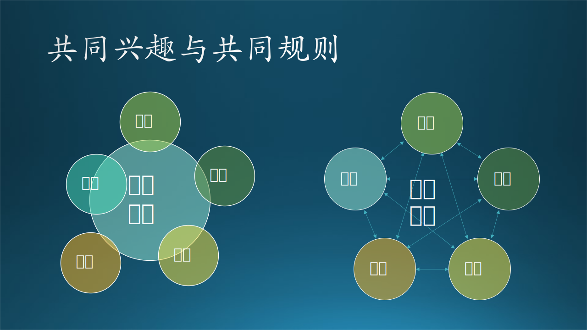
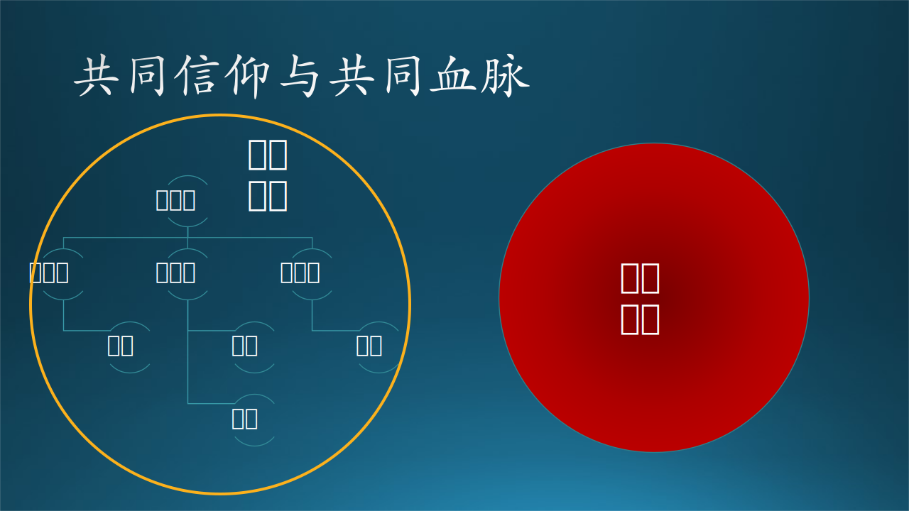

## 4.2 团队的类型

图 4.2.1 团队的阶层

### 4.2.1 共同兴趣

木头在小学时是上过音乐课的（不过好像所有人在小学时都有音乐课，所以木头也就失去了吹牛的资本，但那是木头唯一的一位音乐老师），每个同学都坐在一个右侧扶手即桌子的椅子上面，而音乐老师则坐在一架木制的旧钢琴后面，踩踏板发出的吱吱声音甚至比钢琴按键发出的声音还大。

音乐课本也很薄，大概十几页的样子，里面印了几首儿童歌曲，比如《我爱北京天安门》、《少年先锋队之歌》、《我们是共产主义接班人》、《小松树》等，都是简谱。期末考试的时候，让每个同学都唱一个歌曲的片段，老师一边钢琴伴奏，一边听同学唱歌，然后评分，做为期末考试的成绩。结果，木头只得到了 4+！这对于门门都是 5 分的木头来说，简直是奇耻大辱！郁闷了好几天，决定以后再也不唱歌了。

后来，木头的音乐经历包括：

- 家里祖传了一架琴，不知道叫什么名字，所以被称作“快乐琴”，两根金属弦，一粗一细，中间有很多金属按键，标着音符，右手用拨片拨弦，左手按键压到琴弦上发出相应的音阶。父亲好像也只会一弹唱歌曲，名字不知道，前两句歌词是“王国仁儿真可笑，不让儿女上学校......”，大概意思是新中国成立以后，不重视教育就会亡国。
- 小学毕业的时候，父亲给木头买了一把口琴，上海牌，24 孔复音。
- 父亲带着去邻居家玩儿的时候，见过留声机和黑胶唱片。
- 初中的时候，开始听磁带，双卡翻录，听港台流行歌曲，也有现代京剧。
- 高中的时候，开始听 CD，古典和轻音乐居多。
- 大学的时候，宿舍老五买了把吉他，结果老五没学会，木头（是老大）和老八学会了。对，一个宿舍住八个人。
- 毕业后，姐夫送了木头一把吉他，红棉的，木头开始自学弹唱，很难听。但是每到逢年过节，公司都会组织新年晚会，木头总会幻想着上台演唱，就会拿出吉他来在家嚎几嗓子，被家人称为“嚎哥”，然后不了了之。
- 直到有一天，木头发现在微软的同一个 Org 中工作的同事之中：
  - 有一个学吉他的，买了把 800 多块的木吉他，（当时觉得）音色很不错；
  - 又发现一个吹小号的，以前是清华铜管乐队的；
  - 还发现了一个喜欢唱歌又可以弹钢琴的；
  - 以及一个吹笛子的。
  
  于是，木头把大家召集起来，排练了一个《梨花又开放》，有口琴、吉他、笛子、小号、非洲鼓、沙锤、人声，一共 7 个人，终于在 Org 的元旦联欢会上第一次上台演出了！而且效果非常不错，台下掌声雷动。

这就是木头的第一支乐队，由一群具有共同兴趣爱好的人组成，每周的周四都会定时排练，然后在每个月底 Org 组织的 Happy Hour 上演出，因此叫做“星期四乐队”。

如图 xx 左子图所示，共同的兴趣吸引了这些个人组成了临时团队（中间的大圆代表团队），如果没有了兴趣，则会离开团队，并且个人并不完全处于团队内部，有的人投入多，有的人投入少，也就是个人的圆圈与共同兴趣的圆圈的重叠面积。ta 们的大多数时间属于其它领域，因为靠兴趣并不能养家糊口。

如果以软件行业为例，这种组织形式大概就是一个兴趣小组，几个朋友在在 GitHub 上开一个项目，业余时间贡献一下自己的力量，不需要什么规矩，也没有收入，大家都心照不宣，做事全凭热情。

另外一些临时的组织形式，比如学校中的社团，学生流动频繁，但社团始终存在。再比如微软的一个文化叫做 Hackathon（黑客松），每年都会定期举办，有人提出一个新奇的想法，按照模板写成项目文档放在内部公开的网站上，如果有人觉得很感兴趣并且可以贡献力量，就会要求加入该项目。项目的发起人可以在中国北京，而参与者可以在英国伦敦或者美国华盛顿。

《构建之法》一书中的“一窝蜂团队、业余剧院团队”属于这个级别。

图 4.2.2 共同兴趣与共同规则

### 4.2.2 共同规则

“星期四乐队”这帮人不靠这个组织挣钱，只是想发挥特长，活跃气氛；也没有太多的规则，想排一个歌，大家同意就排，用什么乐器也没什么讲究，自己会什么就用什么。只是大家商量好，知道哪个同事过生日的话，就当天到 ta 的座位旁唱一首生日歌，以便发挥音乐的魅力来团结、感染每一个人。

后来，木头所在的这个 Org 被 lay off 了，木头还在可惜好不容易组织起的星期四乐队就这么没了吗？结果，Transfer 到 MSRA 后，正赶上 MSRA 成立三十周年的庆典活动准备，木头自告奋勇说要成立一支乐队，写一首 MSRA 研究院院歌，在庆典上演出。结果受到了领导的热情支持，给出经费买了一堆排练用的乐器、音响设备等等，再加上木头从星期四乐队带来的人马、乐器、设备，成立了 MSRA 乐队，后来改名为火星乐队（因为 MARS 和 MSRA 很相似）。

在庆典上的演出是一首原创歌曲，一首流行歌曲，也很成功，增加了木头的信心。微软北京西的其它 Org 中热爱音乐的同事们纷纷来加入，最终达到了 70 多人规模的微软乐队，在第二年就举办了第一届“微软乐队新年音乐会”。

人多了，需要有一些规矩，不然这么多人的排练和组织会是一个大问题。最开始，有几个合得来的人自发组成了一个小乐队，也没有名字。木头说：你们带带其它人一起玩儿呗？他们回答说：带不动呀，我们就找几个有时间有激情有基础的就足够了。木头想了想，也对，他们只顾自己的小团体玩儿的高兴，那就随他们去吧。于是，木头找了几个有一定音乐基础和领导能力的人当队长，制定了如下规则：

- 分成 6 支小乐队，一支古典乐组，一支民乐组，三支流行乐队，一支合唱团；仍然有一支乐队叫做 T4，意思为星期四，以纪念最初的“星期四乐队”。
- 每个队员参加一个小乐队，并可以在乐队间合作；
- 队长负责编排曲目，安排乐手，并照顾到每个队员，让 ta 们都有演出的机会；
- 合唱团在一号楼一个会议室排练，其它五支乐队分别在周一到周五在二号楼一个会议室排练；
- 每次排练完务必把乐器、线材、音响设备复位，保持会议室整洁；
- 每支乐队出 2~5 首歌曲，参加下一次的音乐会汇演，演出顺序抓阄决定，每个队的演出时长最多为 30 分钟；
- 民间可以自由组织排练曲目；
......

有了这些规则后，这支 70 多人的大乐队就正常运转起来了。

所以**规则**比**兴趣**有更强的团队运行执行力，这是显而易见的，两个人虽然可以兴趣相同，但是行为习惯可能不同，必须用规则来约束。

如图 xx 右子图所示，看不见的规则像一条条纽带，把大家连接在一起形成一个团队，这些人之间没有明显的上下级关系，一般适合于比较小的团队。

在软件行业中，这相当于在 GitHub 上建立了一个开源项目，一些不认识的人基于对项目的共同兴趣来贡献代码，建立社区。由于 Contributor 来自天南海北，所以有必要建立一些规则，比如：
- 公平讨论，技术领域没有长幼之分。
- 谨慎发言，要有理有据且尊重他人。
- 严控质量，代码整洁可用，有注释有文档，有测试用例。
- 精英治理，谁的贡献大，谁的话语权就大。虽然在讨论时是“民主”的，但在决策时是要“集中”的，很多人分不清这两者的区别，一味地叫嚣着要平等权利。

《构建之法》一书中的“社区团队”属于这个级别。

### 4.2.3 共同利益

随着乐队的壮大，成员的身份也是五花八门，性别大概是一半一半，角色有工程师、PM、Designer、HR、行政助理、合同工等等，各人的背景经历、语言行为习惯也各不相同，这就会产生一些问题。

- 在组织排练某个曲目时，木头想让一个队员来帮忙弹 bass，但是那个队员可能是从心里觉得没意思，就推辞说只想参加另外一个曲目的排练。这让木头很诧异，因为 ta 明明表达过自己喜欢 bass 的。
- 有一个歌手参加的两个曲目，由于某些原因排练效果不好，木头想砍掉曲目 A 不参加本次演出，但是那个歌手由于自己的喜好想保留曲目 A 而砍掉曲目 B，由此产生了一些矛盾。因为从木头看来，曲目 B 的编曲成熟度比曲目 A 好很多。
- 在一个公司层面的演出上，木头告诉大家要穿乐队服装，有个队员就质疑“这是你的规定还是组委会的规定”，其实他是想穿女装上台演出，但是绕来绕去地拿公司的 D&I 文化当作自己的理由，在大群里与大家争论，最后搞得不欢而散。
- 在同一个演出上，木头把某个小乐队的歌曲排在了最后一个，理由是“最好的在后面压轴”，但是那个小乐队觉得后期的观众没有前期的多，想排在第一顺位演出，为此还派了两个人来和木头长谈一番，说实话很可笑。这就违背了基本的节目安排原则：第一个节目要热闹，最后一个节目要精彩，中间的节目要强弱情绪混搭，梅花间竹，整体形成一个情绪波动曲线。
- 在一次新年音乐会汇演中，有个队长因为自己的某个队员由于个人安排可能不能及时参加演出，就提出想推迟新年音乐会到春节后举办，这个队长还绕了个圈子说考虑到由于出游和疫情管控不能回京导致观众数量下降；另外一个队长自己想出游而担心疫情管控无法回京，也赞成推迟，还想让大家投票决定是否推迟。

以上这些行为在一个商业化的乐队里是根本不可能发生的，但是因为微软乐队的定位本身就是一个民间的非营利性的组织，并没有经济利益关系，全靠大家的理解和配合才能正常运转。ta 们为了自己的个人利益而忽略了小乐队的利益，或者因为自己的小乐队的利益而忽略了整个微软乐队的共同利益。尤其是最后两件事，因为几个人的私事而影响其它 70 多人的排练演出计划，这是一种不忽视团队利益的要求。所以木头语气平缓但态度坚决地拒绝了：音乐会按原计划定期举办，参加不了的乐队或个人可以下次再参加。

为什么利益比规则约束力强？因为利益一般都是指经济利益，人们为五斗米而折腰，不然就要饿死了。富二代不在此列。除了经济利益以外的那些不可衡量的“利益”，可以用后面所说的文化或信仰来解释。

如图 xx 左子图所示，团队中所有的个人都是围绕着共同的利益而行动，而个人与个人之间没有利益连接或利益冲突，适合于比较小的团队。根据个人贡献的不同，有的利益连接线比较粗，有的比较细，甚至是虚线连接。

一些比较小的商业化乐队满足这种形式，租场地排练 -> 演出挣出场费 -> 养家糊口，如此循环。挣不到钱的话，又不具备后面所说的信仰的，那就会直接脱钩了。

在软件行业中，到了这一层，已经可以开办公司了：
- 公司老板先根据共同的**兴趣**找来几个朋友入伙，成为合伙人，注册公司。在软件这个行业与纯商业公司不同，有些商人对任何赚钱的机会都有**兴趣**，但是软件人员首先要对目标软件及其所在的领域感兴趣才行。
- 然后几个人共同制定公司的运行**规则**，开始招聘；
- 和员工谈好工作内容和福利待遇，承诺将来的股权等等，确定员工成为公司的**利益**共同体；
- 根据客户需求执行软件工程，发布产品并获得收入。

个人对公司的贡献越大，公司的收入就越多，个人的收入也就越多，形成了一个正向循环。有这种利益链关系，就不会产生像微软乐队的那些问题。

1975 年，Bill Gates 先生纠集了几个志同道合者开始做 DOS 操作系统的时候，就是这种情况。而到了 2000 年以后，才会产生下面所说的共同文化。

《构建之法》一书中的“主治医师团队、明星团队、功能小组、爵士乐队”属于这个级别。

图 4.2.3 共同利益与共同文化

### 4.2.4 共同文化

俗话说：小公司靠老板（以身作则，即规则执行）、中公司靠制度（规则 + 经济利益驱动），大公司靠文化（实际上是规则 + 利益 + 文化）。

一个团队、一个组织或一个公司，运行到一定的阶段，都会建设自己的企业文化，即运营的指导思想。

- 一个人要有基本的文化素质，才能在社会立足，这可以称为硬文化；
- 一个团队由一群由基本文化素质的人组成（依靠面试来保证这一点），会逐渐产生一个群体文化，也可以叫做潜规则；
- 对这种群体文化进行归纳、抽象、升华，就可以形成企业文化，可以叫做软文化；
- 企业文化的另外一个来源是领导者，ta 们根据自己对市场的研判和对公司的理解来制定企业文化，成为公司员工的共同文化。

靠文化来治理团队、组织和公司，比起规章制度来更加有效，也更聪明。因为文化本身不会强迫你做什么，而是潜移默化地让大家具有共同的思维方法和行为模式。你如果不同意公司的规章制度，你就必须离开团队；你如果不同意团队的文化，你可以继续留在团队，但是和大家没有共同语言。

如图 xx 右子图所示，它是一个树形的组织结构，外延是一个近似圆形的虚线圈，其含义是：

1. 虚线表示对团队内部有一定的约束力，但是不能避免个别人在边界上出圈儿，比如左侧的小老板和右侧的个人，都在边界上；
2. 不规则的圆形表示它可能在局部有些根据具体情况而做的调整，但整体上看是 OK 平滑的，没有毛刺。

《构建之法》一书中的“商业开发团队、交响乐团”属于这个级别，人数众多，乐器种类繁杂，个人素养较高，需要长时间的排练磨合才能产生出一首好的曲目。

一些大的软件公司的企业文化如下：

- 阿里：客户第一；团队合作；拥抱变化；诚信、激情、敬业。
- 百度：为人们提供最便捷的信息获取方式；永葆创业的激情；每天都在进步；容忍失败、鼓励创新；充分信任、平等交流。
- 腾讯：通过互联网服务提升人类生活品质；正值、尽责、合作、创新；锐意进取，追求卓越；关心员工成长、强化执行能力、追求高效和谐、平衡激励约束。
- 谷歌：开放、自由、民主；以用户为中心，其他一切自然水到渠成；专心将一件事做到极致；越快越好；认真不在着装；追求无止境。
- 苹果：重视设计，重视创新，重视人才；坚信自己、永不服输。

忽然发现可以做大的企业的名称都是两个字的，三个字的名字念着别扭，四个字的名字别人就记不住了。

微软文化在这里！

**Our mission is to empower every person and every organization on the planet to achieve more.**

**我们的使命是予力全球每一人、每一组织，成就不凡。**

- Growth Mindset

    成长型思维，鼓励员工多听取他人意见，突破思维定势，不断学习，提高自身能力。

- Diversity and Inclusion

    多元和包容，被很多人（也包括微软员工）误解为“允许任何不和谐的声音和行为存在”。
    
    微软做为一个跨国公司，有很多来自不同国籍的员工，在不同的时区以及地点工作并有密切合作。大家说着不同口音的英语，有着不同的文化背景，所以语言习惯和行为方式都有不同。如果不强调多元和包容的话，很容易产生民族主义倾向，互相排斥。这种多元和包容的最终导向是员工之间的紧密合作产生的软件系统以及产品设计可以面向更广大的用户。

    多元和包容不是任何人都可以拿来当作借口做任何事的，但是太容易让别有用心的人钻空子了，所以笔者建议要改成“有组织的多元，有原则的包容”。

- One Microsoft

    一个微软。即各个部门之间不要产生相互竞争，而是要相互合作，共享信息资源、生产资源、产品资源和客户资源。这与某公司的 A/B 团队 PK 的做法完全不同。
    
    微软在面试时对面试官强调：不是为了某个职位而面试，而是全方位考察面试者，以便 ta 将来可以在微软的任何组织的同类岗位上工作。比如，想招聘一个做前端的工程师，合格者不应该是只会做前端的，对后端开发也应该熟悉或了解才行。

    木头所经历的一件事，让人深信“一个微软”的重要性。微软以前在内部的跨部门的 Transfer 时有个规定：必须经原部门领导批准后方可去新的部门参加面试（注意，面试都需要批准，不是正式调离）。木头提出申请，但是原部门领导 V 以各种理由推托不予批复，拖了一个月。最终木头不得已上报了 HR，HR 出面说服 V 给与批复。拿到了 3+1 轮通过的内部面试结果后，V 以面试不够全面为由，要求增加两轮面试，一轮是专门针对测试技能的面试，另一轮是要求与用人经理没有 report 关系的面试官主持的面试。木头也都通过了。后面的事情很有意思：
    - 一个月后，木头终于可以到自己喜欢的新部门工作；
    - 两个月后，公司颁布了新的政策：员工参加别的部门的面试前可以不经本部门的领导同意，只需要在正式 Transfer 前一个月告知领导即可；
    - 三个月后，那位原部门领导 V 退休回台湾省了。

### 4.2.5 共同信仰

宗教组织、党政团体是属于这种类型的，信念坚定，精神力量强大，可以忍受肉体的疼痛而赴汤蹈火，万死不辞。

首先，这些人肯定是组织、有规则的；其次，ta 们所追求的利益不是个人利益，而是团体利益。文化在这类团体中并不重要。

如图 xx 左子图所示，如果与“共同文化”的图比较的话：

1. 外围是个标准的圆形，而不是局部可以扭曲的不规则边界，这表明了它的严格的约束力；
2. 本图的外延是一个实心体，基本没有空子可钻。

很多音乐人和商业化乐队在创办初期，入不敷出，凭着对音乐的热情与信仰，不顾亲人的劝阻，愣是可以坚持到出名。像朴树、许巍、赵雷、李健、汪峰，这些木头所敬仰的才华横溢的音乐人都是不到 30 岁时就已经崭露头角，但是更多的音乐人和乐队是为了信仰而殉葬的，ta 们的名字没人知道。正如朴树在《白桦林》里唱的：“天空依然阴霾依然有鸽子在飞翔，谁来证明那些没有墓碑的爱情和生命，雪依然在下那村庄依然安详，年轻的人们消逝在白桦林”，把歌词中的“爱情和生命”改成“音乐和信仰”就行了。

图 4.2.4 共同信仰与共同血脉

具有共同信仰的软件团队在软件行业很常见，比如很多的创业公司，他们跳跃了前面的“兴趣、规则、利益、文化”，直接拿“信仰”出来说事儿，和有共同信仰的人一同创业。
- 信仰是做事的宗旨、做事的目的、是企业的价值观。还记得那句“让天下没有难做的生意吗”？，就是这句话点燃了多少70、80后的热血，成就了一个网络王国。
- 信仰也是企业员工之间的黏合剂，在创业路上员工间多多少少有一些摩擦和碰撞。但是如何化解这样的那个矛盾呢？只有共同的信仰，员工就会为信仰自发解决矛盾。
- 信仰就是团队战斗力，创业本来就是一件破釜沉舟的事情。
- 信仰是投资人的测量金尺。只有企业有信仰，团队才具有狼性精神。投资人更看好这样的团队。

《构建之法》一书中的“官僚模式、秘密团队、特工团队”属于这个级别。

### 4.2.6 共同血脉

这是团队的最高形式，这一点只有家族企业可以做到，企业内的领导者来自同一个家族，身体内流淌着相同的血脉，一荣俱荣，一损俱损。但是小企业还可以做到共同血脉，大企业中不可能要求员工也是共同血脉，那就灌输共同文化即可。

另外一种可能就是所话说的“土地庙里一起上过香的、庄稼地里一起插过秧的、抗日战争一起扛过枪的、解放战争一起受过伤的、战地医院互相输过血的、祖国建设一起运集装箱的”，这些人不但信仰相同，而且共同经历过生死考验，也可以看作是具有共同血脉。

这是一种最可怕的团队存在，无坚不摧，但有可能走向极端。如图 xx 右子图所示，它从外面看上去就是铁板一块，毫无空子可钻，团队规模通常比一般的团队要小（在图中表示为圆的半径较小），团队越大越有松散的可能。

迄今为止，在软件行业中没有见过这类团队的存在，或者是存在但不著名。
