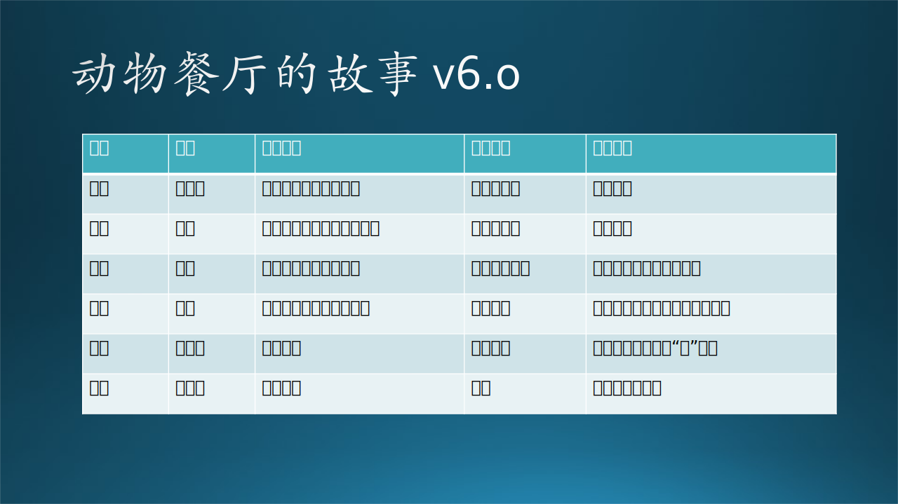
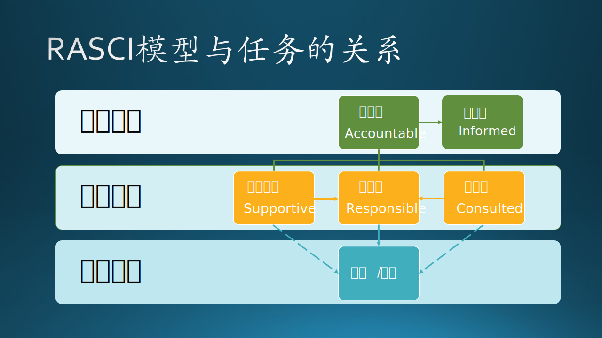
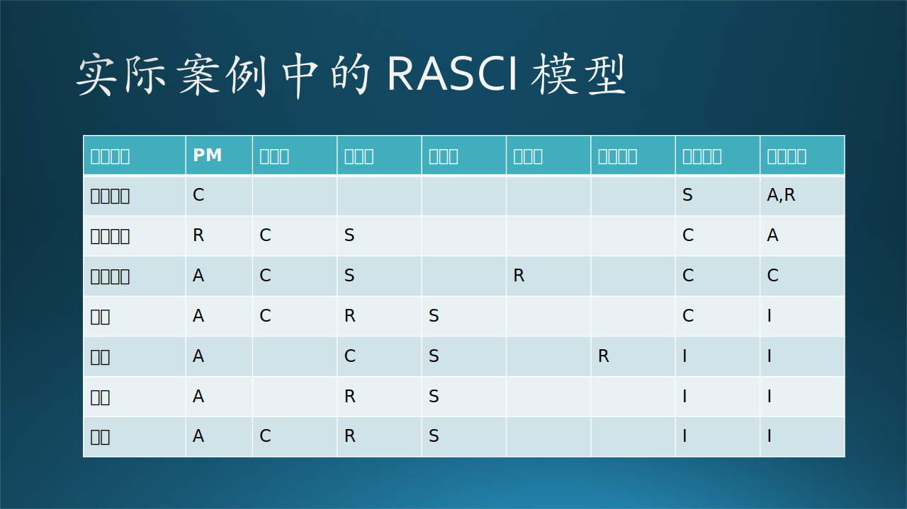

## 4.3 故事分析-团队中的角色

### 4.3.1 故事分析

我们先简单看一下人数问题。与技术工作相关的有 6 人（1 名研究员，2 名 工程师，1 名 PM，2 名实习生），其它 6 人属于管理团队。而实际写代码的人只有 4 人，即 2 名工程师和 2 名实习生。

这样看起来，是不是微软的组织管理太过冗余了呢？我们看看下面的分析就知道了。

#### 1. 研究员

研究员在前期的研究工作成果决定了这个项目是否可以通过工程化来履行合同，提供给最终用户。但是在软件工程实施阶段，他们处于顾问的地位，不会参与到设计与编码工作中。

#### 2. 工程师

工程项目实施的主力，解决软件工程中所有的技术问题。在一段时期内（比如半年或两年），他们的主要时间都会花在这个项目上。质量好，速度快，下一年得到升职的机会就比较大。

#### 3. 管理者

其实大家可以看到，在故事中各个管理者并没有参与技术讨论，实际上他们掌管的项目很多，没有时间精力参与到某个项目的细节讨论中来，只是在项目启动的时候定个方向，给成员们打打气。

在微软，这是司空见惯的，一线管理者不会参与到细节讨论。在一些小公司，有可能管理者直接参与到细节讨论，这也可能是因为中层力量薄弱，或者层级较少。

#### 4. PM

PM 做项目管理，协调资源，掌控进度，与客户沟通，与公司内其它组织沟通，向上汇报等等。

#### 5. 实习生

实习生在 Mentor（导师）的指导下，做一些被分解成单元的小任务，按照微软实习生的衡量标准，应该是可以完成的。但是实习生能不能写 Production（生产、上线）的代码，就不一定了，一般是导师把实习生的代码按照标准“包装”成生产代码。

#### 6. Tech Lead 技术指导

实际上这个角色在微软不常见，大家可以看到 Tech Lead 只是提出意见，并没有动手写代码。在这个项目中，Tech Lead 确实提出了很多自己的见解，有些是有用的，可以帮助提高产品质量的；但有些却是节外生枝的考虑，让每个环节的决策都特别困难，增加了工程师的工作负担。

但如上所述，最终的重大决定权在工程师，工程师可以参考 Tech Lead 的意见，但是不一定采纳，只要拿出理由来即可。

#### 7. 市场和商务人员

他们在开始接触联系客户，签订合同，到后期执行时，不需要提出意见，除非是客户需求与合同不符。但是项目的任何进展都应该让他们知道，当他们有意见时，通常会直接给予管理团队，而不是给与工作团队。

### 4.3.2 动物餐厅的故事 v6.0

猪和鸡的故事$^{[1]}$，想必大家不会陌生，中文有很多版本，在《构建之法》$^{[2]}$一书中也有提及，还有原始的英文的版本，只不过大家讲故事的细节有细微差别。笔者认为这个故事在团队建设中有很重要的指导作用，所以在本章中再次拿出来一个**升级版 v6.0**与大家分享。

蚂蚁、大猪、母鸡、狐狸、老虎、鹦鹉合伙开了一个饭店，具体分工见图 4-6。

图 4-6 动物餐厅的故事

- 蚂蚁

    家族人数庞大，提供一道叫做“蚂蚁上树”的菜的原材料，每次都牺牲不少兄弟，算是用身家性命投入。一窝蚂蚁只能为一个餐厅服务，否则会入不敷出。

- 大猪
    
    身强力壮，老成持重，提供“鱼香肉丝”的原材料，身上满是伤口。一头猪只能为一个餐厅服务，否则会失血过多而失去恢复能力。

- 母鸡
    
    勤劳勇敢，日产一蛋，从不间断，提供“鸡蛋”的原材料，因为很多菜品里都需要鸡蛋。母鸡的生蛋能力是个法宝，它可以从日常食物中补充营养物质，身体迅速恢复。如果餐厅的“苜蓿鸡蛋”翻牌数不多，它的鸡蛋还可以卖给其它餐厅。

- 狐狸

    聪明伶俐，眼明手快，是餐厅经理，全权负责餐厅经营。餐厅业务繁忙，一只狐狸也只能为一个餐厅服务，但是它积累的经验和人脉可以令它有随时跳槽的能力。

- 老虎

    身宽体胖，不怒自威，是董事长，投入资金建设餐厅、招募员工。老虎有钱，在森林里开了好几个餐厅，还有其他一些产业，比如“猛虎俱乐部狩猎园”和“乖乖虎洗浴中心（池塘）”。一个餐厅的营业状况并不会很大地影响它的总体年收益。

- 鹦鹉

    老虎的朋友，能说会道，消息灵通，给老虎提供消息。鹦鹉每天自由地飞来飞去，随便吃几个虫儿喝几滴露水就饱了，餐厅经营得好坏与它没有什么紧密联系。

所以，对于我们每个人来说，都有如下规则：

- 有可能在无数的地方做鹦鹉，只要他有这个精力；
- 可以在很多的地方做老虎，只要他有这个财力；
- 只能在一个地方做狐狸，但是可以随时换到另外一个地方，只要他有这个人脉；
- 可以在一个以上的地方做母鸡，只要他有这个生产力；
- 不能同时在一个以上的地方做大猪和蚂蚁，除非他有超能力。

【最佳实践】

- 有一个原则: 重大决定由 “大猪” 来定夺。
- 我们初入公司，公司肯定希望我们都是大猪这类的，全身心投入到项目中去。我们的任务也就是做好“大猪”的角色。

### 4.3.3 RASCI 模型

RASCI$^{[3]}$ 是以下单词的缩写：**R**esponsible, **A**ccountable, **S**upportive, **C**onsulted, **I**nformed.

其中，各个角色的描述如下：

(1) Accountable 负责人

对项目任务及其相关资源具有最终控制权，他们通常会分配和委派任务。强烈建议一项任务只有一个负责人。

(2) Responsible 执行者

任务执行者，允许多人共同执行一项任务，任务的主要实际贡献者。负责人与执行者不一定是上下级关系，而只是不同角色而已。

（3）Supportive 支持人员

支持人员能够为团队的任务提供附加资源，与执行者合作，以确保任务顺利完成，二者目标相同，但是可能属于上下级关系。

（4）Consulted 顾问团

咨询者将帮助执行者成功完成任务。这些人可以是各自领域的顾问，为项目带来宝贵的主题专业知识。

（5）Informed 权益人

这些人需要保持在在项目的整个生命周期中。由于他们作为项目利益相关者的身份或他们将受到项目影响的事实，他们需要在项目所包含的所有阶段（任务）了解进展情况。

图 4-7 RASCI 模型

图 4-7 展示了 RASCI 模型。具体到动物餐厅的故事里，各个动物和角色的对应关系如表 4-1 所示。

表 4-1 RASCI 模型

|名称|角色|动物|
|--|--|--|--|--|
|A - Accountable|管理，掌管全局|狐狸|
|R - Responsible|负责，具体执行|蚂蚁，大猪|
|S - Support|支持，配合工作|母鸡|
|C - Consulted|顾问，决策支持|鹦鹉|
|I - Informed|知情，参考指导|老虎|

间接地，RASCI 模型还可以达到以下目的：

- 快速决策：角色为 R 的人负责提供决策依据（谁干活谁的发言权就大），角色为 A 的人负责最终决策。

- 工作协调：大家都明确自己的角色，角色为 A 的人来监督执行。

- 风险规避：由于该模型要求把项目分解成很多可执行的任务，并且由不同的人分担，所以从整体上降低了依赖风险。

- 管理变化：一旦有任何变化，可以立刻从角色安排中确定哪个人和哪个任务会受影响，从而做出改变。这也是敏捷开发的要求。

### 4.3.4 团队成员及其角色

前面我们一直强调的是任务，而不是项目。因为在软件工程中，在不同的阶段各类人员的角色是不同的。如图 4-8 所示。

图 4-8 RASCI 模型的应用

- 合同敲定阶段：商务人员全权负责，即是 A 又是 R；技术管理人员（各种 lead 和 manager）提供技术支持，以便敲定技术细节；PM 提供咨询，主要是关于人员及时间的细节。

- 需求分析阶段：商务人员要把控好方向，PM 做具体的需求分析工作，但是当技术成分较多时，也可以由工程师来完成需求分析。研究员负责咨询。

- 原型设计阶段：Designer（视觉设计师）是主角 R，工程师负责支持，共同来完成这个任务。PM 在以后的阶段任务中都是 A 的角色，负责协调资源、监测进度、向领导及客户汇报。

- 开发阶段：工程师是主角 R，实习生负责支持，技术管理者负责咨询建议。从此往后，商务人员都是 I 的角色。

- 测试阶段：测试人员是主角，工程师和实习生负责支持与咨询，在测试遇到问题是帮助解决。从此往后，技术管理人员都是 I 的角色。

 - 部署阶段：工程师是主角，实习生负责支持，技术管理者不在负责咨询，因为此阶段他们对产品的细节并不了解。

- 维护阶段：基本同开发阶段。

RASCI 模型明确了团队中的各个角色及其相关责任，为了在一个复杂的项目中明确团队成员的职责划分，以达到以下几个目的：

- 人 $\rightarrow$ 任务：确定团队内每个人的工作负荷不多不少。
- 任务 $\rightarrow$ 人：确定每个任务分配给特定人避免踢皮球。
- 人 $\rightarrow$ 人：简化团队中各成员之间的沟通，减少不必要的沟通。
- 任务 $\rightarrow$ 任务：避免重复的任务或流程，有序安排有依赖的任务，有时还可以并行工作。

所以，在各个阶段，每个团队成员要认清自己的角色，该责无旁贷时就不要推三阻四，该献计献策时就不要沉默寡言，该作壁上观时就不要指手画脚。
