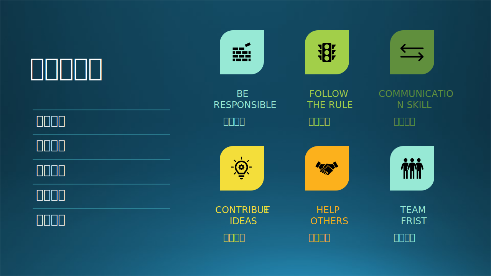

## 4.4 个人与团队

### 4.4.1 木头的故事

木头先后在微软的不同产品团队中工作，比如 Bing 必应搜索团队，Windows China 团队，MSRA 研究院（部门）、创新研发（ARD Incubation）部门，最后回到了工程院（部门）的 AI Platform/Framework 团队。

在团队中的工作经历让木头得到成长

#### 1. 没有固定的工作时间限制

不像其它公司，在微软并没有明确的工作时间的规定，这让木头相当的惊讶！后来渐渐地想明白了其中原委：

  - 微软招聘流程很严格，所以能进入微软工作的员工平均素质都很高，没有人会偷懒儿。
  - 个人在团队中工作，如果交给你的任务你不能按时完成，拖了团队的后腿，你自己都会觉得不好意思见人。
  - 不努力工作取得成绩就得不到晋升，吃亏的还是自己。
  - 在工作日有时候身体状况不佳，或者需要照顾家人，不能工作，那就干脆休息。周末时条件允许了就在家工作，把进度补回来，这也是一种灵活的办公方式。

总之，这就好比两个人打交道，甲非常信任乙，乙如果足够聪明的话也会投桃报李。这是一种比雇佣关系更高级的相互信任关系，是一种文化。

#### 2. 大家都很聪明

木头在进入微软之前，曾经在几个小公司工作过。加入微软后，最大的感受就是这里的同事们都很聪明，思维活跃，你简单地说一句话，别人也都可以领会并加入讨论或给予反馈，你不需要把一些思想掰开了揉碎了像老师一样灌输给学生，而是一种平等的、流畅的交流。

交流起来没有障碍，这是构成一个强大团队的基本要素。在 3.1 节中讲述了沟通能力，而且也是微软面试过程中考察的重点之一。

聪明可以体现在几个方面：

- 知识渊博，熟读“诗书”，记忆力超强，可以引经据典。
- 思维灵活，举一反三，擅长应用，动手能力强。
- 善于倾听，快速理解，乐于助人，共情能力强。
- 勇于进取，敢于开拓，创造力强，钻研能力强。

以上这四个方面是层层递进的，不论有那一层的能力，都可以帮助团队完成任务。

#### 3. 老板与团队风格

木头的几个朋友几乎是同一时间入职微软，在一个团队固定工作了十几年，有好处也有遗憾。好处是他们熟悉自己长期从事的业务，渐渐地成为业务骨干，进而得到稳定的升职。遗憾地是没有见识到更多的领域、知识、文化。

如本节开头所述，木头曾经在五个团队中工作过，这并不是说木头是一个不稳定的人，回想起这几次工作变动，哪一次不是被动发生的？在此简单总结一下：

- 任何团队中当然都是老板说了算，尽量客观地评价所有员工的工作表现，并最终决定一个员工是否可以升职。但是老板也是人，也有喜怒哀乐，由于个人好恶和视野原因，他们有时候并不能做到完全公平。比如，木头以前的一个老板就特别欣赏懂机器学习的员工，恨不得一年就给升一级，而其它员工两、三年也得不到机会，尽管他们也很努力地为项目做贡献。遇到这种情况时，尽早离开这个团队，这是一种隐形的歧视。

- 在团队中如果已经成家立业的员工居多，那么这个团队加班的风气就比较弱，晚上六点后办公室就空了。相反，如果单身较多，那么上午办公室人比较少，越到晚上人越多，而且业余活动也比较丰富。老板当然也会注意到这个因素而做出相应的工作安排。但是，如果老板自己是单身，那他/她的考虑可能就不会那么全面了。比如木头自己是个丁克，悠闲自在，就不会懂得当父母的责任与辛苦。

- 老板如果是那种比较严谨细致的人，那么整个团队的气氛就会比较拘谨，很少有人开玩笑。如果老板非常注重进度、质量等等，那么员工们就会比较“苦”，当然这也是应该做到的，只不过在情绪上不是那么乐观豁达而已。

- 有些老板比较会保护员工不受外界干扰，而是自己事情都扛下来，不会把外界压力透传给下面干活儿的人，这是最好的领导。而有些老板生怕得罪上面的人或外面的人，会根据风吹草动而不断地进行内部调整，搞得大家都很累，这是最差的领导。而当一个老板说“咱们自己不能说自己好，你得让别人说你好才是真的好，不然别人会挑战你”时，建议尽早离开这个团队。这是多么奇怪的逻辑！自己不说自己好，指望别人替你说，别人哪里有那多么闲工夫来帮你说话？当老板的不为自己的团队成员争取利益，怎么还能指望大家为团队利益着想呢？

领导是一个团队里的重要角色，几乎代表了团队的行事风格，他/她可以很公平，当然也可以“说你行你就行不行也行”或者“说你不行你就不行行也不行”。如果一不小心有一件事做得不好，很有可能会给领导留下一个不好的印象，很难翻盘。做对一件事是本分，做错了就需要用十件事来弥补。

#### 4. 工作性质与团队风格

（1）在 Windows China 团队

木头在 Windows China 团队一干就是 5 年，晋升得也很顺利。忽然总部一个命令下来，让这 20 多号人去做手机上的 Edge 浏览器，而且是基于 Google 的 Chromium。我们只好放弃了手头将要完工的关于 Cortana（微软小娜）的工作，立刻开始学习 Android 和 iOS 上的移动开发。后来才知道，总部是在用我们这个小团队做试验，看看基于 Chromium 的浏览器开发是否可以达到令人满意的效果，以便决定是否要在 PC 上放弃旧的 Edge 浏览器引擎，采用 Chromium 做内核，开发新一代 Edge 浏览器。

木头带着自己的 7 个兄弟负责 Andriod 上的开发，并且负责建立从没有接触过的手机测试体系，包括自动化测试和手工测试。说实话，木头非常不喜欢这个角色，但还是硬着头皮完成了这个任务，带着 5 个 V-Tester（外包测试人员）建了 700 多个测试用例，保证了这款产品的质量。

半年后，成功地完成了移动端的 Edge 浏览器开发并发布到市场上，受到用户的好评。但是总部又是一道命令，把这 20 多号人从 Windows China 团队拆出去成为了浏览器团队的一部分。木头不想做浏览器，所以还是回到了 Windows 组继续前期未完成的 AI 相关工作的开发。

又是半年后，总部决定解散 Windows China 团队，因为它已经完成了“在中国建立 Windows 10 生态系统”的使命，团队成员要么拿着 N+2 走人，要么在公司内自己找职位跳槽。木头只好选择跟着老板去研究院做普通员工，职位是 RSDE（研发工程师）。

这本来也是一个好团队。不管一个团队过去的功绩如何，当遇到公司商业影响时，决策是无情的，决定产品团队命运的是上级产品部门。在这个团队中，木头逐渐从普通员工变成了技术领导，可谓一帆风顺。但是命运的安排会让人走上另外一条道路，塞翁失马焉知非福。

（2）在研究院的团队

刚到研究院几周后，木头就感觉不对劲儿：因为这里都是研究员，而木头是工程师，大家的文化差异比较大，工作性质不同，职业道路也不同，很难在这个组织中站（出）稳（人）脚（头）跟（地）。在这段时间里，木头有时间去学习 AI 知识了，像是打开了一个新的窗户，看到了一个新世界。

木头的主要精力放在了项目 A 上，做设计写代码，带着一个 FTE 和四个 V-Dev 把一个三年没人敢动的主服务器上的逻辑摸清楚后彻底重建，所有训练和推理过程都自动化。

一年多后，老板在财年结束时并没有帮助木头晋升，这让木头感觉投入和回报不成正比。木头和老板谈了一次，老板说：“研究员对工程项目的反馈是：工程师们只做了一些修修补补的工作。” 木头顿时无语，再一次充分认识到了研究员文化和工程师文化的不同，工程师的工作成绩怎么可能让研究员来评头论足，正确的评判应该来自同行，外行只是看热闹而已。

这不能称之为团队，只是一个小组而已。遇到这种团队时，应该尽快离开。但是在研究院学习的 AI 知识是一笔宝贵的财富，很少有人可以有这种机会在繁忙的工作中有专门的时间可以学习，就好比在一座高山上砍柴时发现了一本武功秘籍。

（3）在工程院的团队

木头回到了工程院的一个二十多人的团队。入职当天，新老板给挨个儿介绍了一下新同事，但是根本记不住那么多人名儿啊！中午 12:30 大家一起吃饭，是最放松的时候，木头可以借机听听大家感兴趣的话题，互相间的称呼是什么，都有什么业余爱好和习惯，少说多听。

通过一段时间的接触，木头感觉像是回到了家（因为 8 年前木头就是从工程院出去的），浓浓的工程师文化很令人舒服。木头给大家讲强化学习基础知识，给大家弹琴唱歌，休息时和几个人一起打台球，很快就融入了团队。

在一个项目中遇到 F 哥，他以前也是研究院的，后来出去到外面的公司任职，因为外面的公司的薪水较高，等他回来时就拿到了 Principle SDE 的职位。F 哥人很善良，乐于助人，所以木头和他还很说得来。在团队中，F 哥也不是很爱说话，吃饭总是最后一个才吃完。但是 F 哥不是很灵活，比较固执，遇到不感兴趣的东西就不喜欢去研究，这让老板很失望。很快，半年后 F 哥就待不下去了，他也不愿意继续混下去看别人脸色过日子，所以就又离开了微软。

在外面闯荡了一圈，还是要回到最适合自己的地方。木头是这样，F 哥也是这样。F 在研究院的习惯没有改（凭兴趣干活），那么在工程院就呆不下去。对于木头来说，干什么都可以，工作与兴趣无关。

#### 5. 小结

经过了这 4 年多的辗转，木头不但职级没有升迁，而且积累又回到了零，在新的团队中必须重新积累才有可能获得晋升。但是一个朋友告诉木头：“看上弯曲的路也许能通向更远的地方。” 确实，木头在研究院自学了很多 ML/AI 相关的知识，对以后的职业发展有很大的帮助。

如何决定应该离开一个团队？有三点可以参考：

（1）是否有成就感？
（2）是否收入与付出成比例？
（3）人际关系如何？
  
如果这三点中有两点是否定的答案的话，立刻拍屁股走人；如果只有一点不满足，那就尝试着适应一下，或者改变自己的心理预期。

### 4.4.2 个人在团队中如何做

个人与团队的关系在图 4-9 中展示。

图 4-9 个人与团队的关系

马克思说：“人是最名副其实的社会动物”。团队就是社会的一个缩影，所以马斯洛的需求层次论在这里依然具有指导意义，表 4-2 就标记出了个人行为守则在马斯洛需求层次论中的作用。

表 4-2 个人在团队中行为守则与需要

||生存的需要|安全的需要|归属的需要|尊重的需要|自我实现的需要|
|-|-|-|-|-|-|
|恪守己任|$\surd$|$\surd$||||
|遵守规则|$\surd$|$\surd$|$\surd$||
|善于沟通||$\surd$|$\surd$|||
|集体利益||$\surd$|$\surd$|$\surd$||
|献计献策|||$\surd$|$\surd$||
|帮助他人||||$\surd$|$\surd$|

#### 1. 恪守己任（Be Responsible）

在社会中，人们需要食物、水分、空气、睡眠等才能生存下去；在团队中，基本的生存法则就是恪守己任，保质保量完成领导或团队指派的任务，在别人眼里获得真实的存在价值或虚幻的存在感，而在自己心中则满足自我实现的需要。

不能像 F 哥那样挑肥拣瘦，领导最不喜欢那样的成员。因为这个任务如果你不去完成，就要找另外一个人去完成，为了不让你闲着，还要另外给你再找一个新任务。这会拉低整个团队的效率。

#### 2. 遵守规则（Follow the Rule）

自己生存没有问题后，人们需要稳定、安全、受到保护、有秩序的环境，能免除恐惧和焦虑等；在团队中，就是避免你与大家格格不入因而被“攻击”，所以要遵守（团队）规则。

一个团队的规则有两类：

- 硬规则，又称组织规则，有明文规定的，比如：
    - 工作时间，比如 996、007；
    - 办公室纪律，比如不许使用机械键盘，不许带宠物，不许嗑瓜子儿，手机不许外放音乐；
    - 公司的 HR 规定，比如薪资保密，请假，不许乱发与公司事务无关的邮件；
    - 工作流程，比如要写技术文档，按时提交代码，要经过代码审核，即时修复严重的 bug 等。

- 软规则，又称民间规则，没有明文规定的，比如：
    - 互相的称谓，比如大家都直呼老板的名字，你就别一口一个“王总”地叫了。
    - 聊天的话题，比如大家对政治问题和 A 股市场不感兴趣，那就聊聊 AC 米兰和幼儿教育。
    - 微信群里的显示名称，比如是用身份证上的名字，还是网络昵称；
    - 大家吃饭的时间，最好按照大家已有的习惯一起吃饭，有助于快速融入新团队。

遵守规则，就不会给自己和别人带来麻烦，从而带来持续的安定团结，尽管这种安定团结有可能是表面上的。
像 L 博士那种性格，不愿融入团队并不会给团队带来损害，但是时间久了没人原意和他说话，在关键时刻也不会替他说话，这会给他自己带来损害。

#### 3. 善于沟通（Communication Skill）

安全没有问题后，要寻求与其他人建立感情的联系或关系：结交朋友、追求爱情等等；在团队中，就是需要有一定的沟通技巧。

在加入一个新团队初期，如果你突然问大家“你们谁开宝马车呀？为什么我的车刹车时后轮总有异响？”，或者是“你们谁住别墅呀？楼梯一般用什么材料的比较容易保养？” 这听上去就是赤裸裸的凡尔赛。但是时间长了以后，至少你能叫上每一个人的名字了，就可以主动和大家多交流了。

上面提到的女生 J，给别人的感觉就是她关心自己的宠物比团队成员更多，和团队成员包括和老板沟通时，都还饱含学生时代的青涩味道。不融入团队，就学不会沟通技巧；不善于与人沟通，就只能和宠物说话了。

木头在 研究院 那个小团队时，可以招三名实习生。最开始时，老板还要为实习生面试把关，质疑木头的选择：“这个实习生的学校不是很知名呀” 等等。英雄不问出处，木头自己有自己的评判标准。如果是一个比较简单的工作，找一个清华北大的博士生来，人家还不乐意干呢；如果是一个比较难的工作，清华北大的学生缺乏动手能力的话也未必能完成。后来，木头把这些实习生所在的学校为这些实习生写的“优秀毕业生”的文章发到群里，老板就改口风了：“以后实习生的面试你全权负责！”

#### 4. 集体利益（Team First）

既然是团队的一份子，应该多为团队着想。在某些情况下个人利益要服从于集体利益的。

比如领导说：“咱们决定本周五组织一次团建，希望大家都参加。” 如果你跳出来说：“能不能换个时间再组织呀，我本周五正好有事。” 这就叫做不懂事，领导和团队最烦的就是你这种人。如果你自己的事情非常重要，可以私下和领导商量是不是可以不参加，不要自我感觉良好地当着很多人的面在那里喊：“哎呀！我去不了呀！”

当年包括木头的那 20 多号人去做手机 Edge 浏览器，就是为了公司的大利益而牺牲了 Windows China 团队的小利益；而木头去虽然不喜欢测试工作（繁琐、没有技术含量、不引人注目），但还是为了保证产品质量而牺牲了自己的利益。最后产品成功，功劳全归到开发，苦劳全归测试。

#### 5. 献计献策（Contribute Ideas）

初来乍到一个团队，有很多情况不了解，你肯定插不上话，最好也不要插话，避免闹笑话。当熟悉了情况之后，你就可以在自己有知识存储的领域或者有熟练技能的领域发表意见了，为团队分享自己的想法和建议。可以带来的好处是：
- 你的建议有价值，别人会对你刮目相看，你会得到更多的尊重，以后有类似的事情还会咨询你。
- 相关的人会把你当成“自己人”或是“能人”，拉近你们的关系，获得归属感。

#### 6. 帮助他人（Help Others）

如果献计献策只是利用已有的知识和技能口头上帮助他人，那么这里就需要真的花时间、花精力来动手帮助他人了，带来的好处是巨大的：
- 帮忙成功了，别人会对你尊重有加；即使不成功，也会心存感激。
- 你自己也会获得成就感。
- 帮助别人，短期看是花了自己的时间和精力，但它是一种长期投资，相当于在帮自己，除非你遇到那种没有丝毫感恩之心的人。

能帮助他人的时候，就要主动伸出手来，不要等着别人问。能够感知他人需要帮助，也是一种能力，自私自利者是绝对不具备这种能力的。如果你意识到这件事只有你能做的时候，一定要主动地跳出来出手帮忙（比如其它人都在加班加点儿赶一个产品发布，或者是其它人都没有相关的知识储备），因为老板心里也很清楚这一点。

一个有趣的建议是：作为一个团队新人，你也可以厚着脸皮主动寻求他人的合理帮助，这样可以快速拉近双方的关系。万一对方拒绝帮助，你也可以迅速认清谁可以成为你的朋友。你当然不能让他人帮你写代码，但是请对方分享一下如何搭建开发环境，或者是如何使用一个工具，都算作合理的帮助请求。

还有一点是要提醒老板的：作为老板，帮助团队成员进步（获得晋升）是老板的职责；因为害怕别人质疑而不去为自己的团队成员争取利益的，是老板的失职。

### 4.4.3 独行快，众行远

木头又要讲乐队的故事了，因为作为一个团队合作的典范，乐队太具有代表性了。

图 4-10 乐队就是典型的团队合作

乐队里有个民乐组，组长 D 是一位女生，琵琶弹得非常好。有一天，D 忽然说她不继续带队了，还出了一个视频，内容是《这两年我在微软乐队做了什么》，讲得很好，分析了民乐和流行乐的区别，以及自己为什么不再继续带队的原因。木头总结如下：

#### 1. 为什么不继续带队了

D 第一年编了一个《十面埋伏》，叫做“武曲”；第二年编了一个《春江花月夜》，叫做“文曲”。非常有代表性。后来又参与了《元神》的创作和演出，以及其它几支民乐曲目。她认为该玩儿的项目都玩儿遍了，可以离开游乐场了。可惜的是民乐组没有人原意站出来接班当组长的。

还曾经有一次木头问 D：“为何上次那个曲目不拿出来在另一个场合（不同的听众）再演一回？挺好听的。” D 回答说：“演过一遍的曲目我就不想再演了。” 木头就明白了：她演出是为了纯娱乐，自己高兴就行，不考虑观众。这在微软乐队这种非商业化的民间组织中是可以理解的。

#### 2. 民乐和流行乐的区别

D 从小练琵琶，据说老师也很有名。琵琶独奏，讲究得是演奏者的自我情感表达，忽快忽慢，所以谈不上固定的节奏。在《十面埋伏》中，为了增强效果而配了鼓手，但是鼓手是要看琵琶的手部动作来打鼓，这与鼓手在流行乐队中的统治地位恰巧相反。

流行乐中的旋律、和声（准确地说和弦）、节奏、音色，到了 D 这里就只剩下了旋律，因为琵琶和吉他一样，可以自带和声（当然 D 认为那是旋律的一部分）；节奏自己掌握，不需要跟着其它乐器跑；音色更没得说了，只有琵琶的声音才是好的。

D 认为：在琵琶与流行乐的配合中，琵琶与歌手不能同时发声，否则就二者冲突了，所以琵琶不能是 C 位，那也就找不到自己的位置了。而且一旦要跟随节奏与其它乐器合奏时，琵琶就丧失了其自由性，而只是展示乐手的专业性了，毫无乐趣。

可以总结为：

（1）D 认为所有的民乐风格都玩儿了一遍，够了；
（2）演出是为了自己高兴，与听众无关，所以不愿意重复；
（3）玩儿琵琶玩儿独了，不愿意受多人合作时的节奏限制；
（4）不能接受自己不在 C 位的待遇，所以感觉无法和流行乐合作。

拿到团队理论上说，用户和团队的利益与我无关，不愿意受限制，不能跟随团队的节奏，而且不愿意在团队里当配角儿。

一支流行乐队中，每个乐手都可以是大神级别的，但是编曲要求他们只能在正确的时间发出正确的声音，这确实是考察人们的团队合作精神的最佳场所。团队的整体成功才是他们所追求的，而不是个人在场上很帅地 Solo（独奏）一段（当然如果编曲需要的话也可以 Solo）。李荣浩曾经说过：一个吉他手在台下练了几个月，但是在台上可能只有那么几秒钟的时间是属于吉他的（其他时间都在伴奏），那你就要保证做好。

规则是静态定义的，节奏是动态执行的，都是团队合作的要素，二者都要不折不扣地遵守，才能有团队项目的成功。现在的软件工程规模不像十几年前那样了，想依靠一两个英雄的力量根本搞不定。当你觉得自己有实力的时候，你当然可以单枪匹马独闯天下，去获得一些经验。但是不要忘记一句话：**独行快，众行远**。走得再快又有什么用？遇到困难时一个人根本扛不住，还是需要团队的力量才能一起克服困难走得更远。

在现代化的大团队中，做一个善于团队合作的人（Team Worker）很重要。
