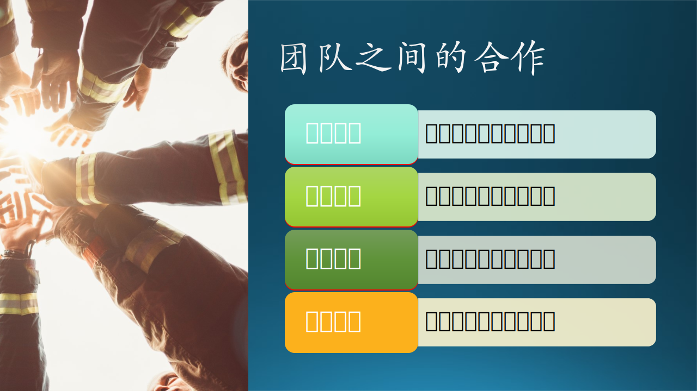

## 4.5 团队之间的合作

### 4.5.1 建立通信

我们假设团队 A 已经在一个项目上工作了一段时间了，此时团队 B 主动想和 A 合作，而且 A 也需要额外的力量来帮助项目快速发展。此时 B 要做的事情是：**先要和 A 建立通信**。

建立第一印象非常重要，所以当 B 向 A 介绍自己时，需要一些基本的信息：

- 我们是谁？
  这并不是要把团队成员的名字都列出来，而是把自己的组织结构说清楚，隶属于谁，内部结构如何，主要领导是谁，等等。
- 我们团队有多少人？
  包括开发人员和 PM 的人数，以及一些额外的资源，比如合同工（vendor）。
- 我们在哪个地理位置工作？
  这在跨国公司中很重要。北京团队与苏州团队的合作是很容易建立的，但是北京团队与西雅图团队的合作就比较难一些，因为时区、语言、文化的不同。
- 我们都有哪些项目经验？
  这一点在个人面试时很重要，但是在团队合作时不是非常重要，因为一个团队的能力是不受限的。比如，木头的所在的团队以前一直做操作系统相关的工作，忽然有一天上级要求全体转到手机开发上，这对于大家来说其实是一件好事，可以多学一种开发技能。而且由于团队成员的能力普遍较高，学习能力强，这种转型的时间不是很长。
- 我们可以投入的力量是多少？
  不能说我们有 20 个人，但是只有 2 个人空闲着，可以考虑参与其它项目。如果要参与的话，至少投入 50% 以上的资源才算做有诚意。或者说在未来的一个月内可以投入 10%，三个月内可以投入 50%，半年后可以投入 80% 等等，也是可以接受的。

当然，通信是双向的，B 介绍了自己，A 也应该考虑是否和 B 合作，有哪些任务可以分给 B 去独立的完成。也许可以先分出一些不那么重要的任务，看看 团队 B 的能力，然后再决定时候继续合作。

### 4.5.2 建立互信

### 4.5.3 建立自信

### 4.5.4 建立威信

