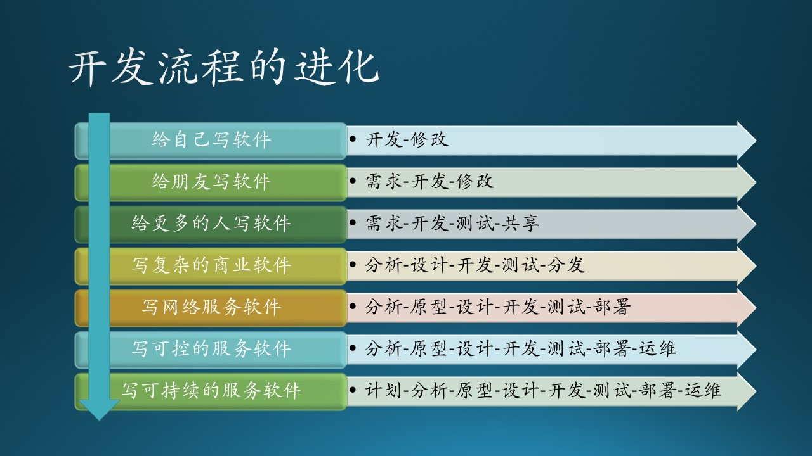

## 5.1 开发流程进化的故事

现代软件工程的开发流程已经非常成熟了，但是读者可能会产生的问题是：这些阶段真的都有必要存在吗？会不会很浪费时间？

在一些小的软件公司中，由于资源的限制，可能会免除其中一个或几个环节；但是在大的软件公司中，还需要在经典的划分方法上更加细化，才能适应复杂软件或复杂团队的需要。

从下面的故事中，读者可以感同身受，从小到大逐步领会到经典划分方法的必要性。

图 5.1.1 软件工程中的开发流程的进化过程

### 5.1.1 开发-修改

给自己写软件。Build for Self。

最开始，写软件的人都是为自己写的，为了完成某项繁琐的重复的任务，所以只有“开发-修改”两个步骤。

比如，木头想做一个计算器工具给自己用，因为这个应用场景已经烂熟于心了，所以很快就用 XAML + C# 写了一个粗糙的版本，只能做“加减乘除”。把编译好的可执行程序 Pin 到 Windows 11 的桌面工具条上，双击即可运行，如果发现 bug 就立刻改一改，自己能用就行。

在软件工程还没有出现之前，大家都是处于“开发-修改”的状态，当时的软件也不复杂，代码量不大，所以还是可行的。很多年前，做一个“个人开发者”很时髦，因为很多传统领域都需要软件，那时随便写个软件都能挣钱，木头也确实干过“私活儿”，用挣到的“外快”买了自己的电脑（然后开始打游戏）。

### 5.1.2 需求-开发-修改

给朋友写软件。Build for Friend。

坐在木头旁边工作的小 D 是个女生，温柔体贴，人也聪明。她觉得那个计算器工具很好，让木头给她拷贝一份。木头心想：“既然是给朋友用，就不要太简陋了吧，别丢脸。” 于是问小 D 都需要什么功能，小 D 想了想，说：“我经常需要用到平方开方计算，你把这两个功能加上吧。” 

这就是**需求**的原始形态，面对面简单说两句就能搞清楚了。如果有了 bug 的话，小 D 也是直接和木头说一下，当时花两分钟就改好了。

如果给公司内部做软件或者给团队内部做一个工具，基本上就是这种形式。不太在意什么性能、易用性等等，所以在即使是在微软，内部使用的一些工具类软件也都特别难用。

### 5.1.3 需求-开发-测试-共享

免费给更多的人写软件。Build for Relationship。

中午大家一起吃饭的时候闲聊，小 D 说起了木头的计算器工具，大家都很感兴趣，都想要一个能满足自己特殊需要的版本。木头也很高兴能帮到大家，而且小 D 也想帮忙一起开发，木头乐得都发芽儿。

两个人简单分了工：
- 小 D 一个一个地询问了同事们的需求，综合到一起；
- 木头写好软件；
- 小 D 按照需求仔细**测试**了每个功能，不然每个人都来报 bug 就太丢脸了；
- 然后木头把这个测试好的统一版本放到一个**共享**文件夹中，大家免费下载使用。

到了这一阶段，出现了多人合作开发的情况，并且出现了测试环节，是一种团队流程的萌芽。由于是免费的，所以没法要求开发者可以提供更多的维护和技术支持，现在很多 GitHub 上的开源项目就是如此，使用的时候需要特别小心，遇到 bug 得自己去解决，不要指望开源者帮你。

### 5.1.4 分析-设计-开发-测试-分发

写复杂的商业软件。Build for Business。

木头的计算器工具受到了很多人的欢迎。有一个同事的老公的同学的弟弟 B 所在的公司 A 觉得这款软件如果功能再丰富、界面再美观一些，变成一个基于数据库的复合型统计、计算软件，可以做成商业化软件卖钱。所以公司 A 通过弟弟 B 的哥哥的同学的老婆联系到了木头讨论这件事。

木头觉得自己一个人完成不了这件事，就和老板说明了情况，老板也觉得机会很好，就成立了一个项目组，和木头一起完成这个项目。

首先是需求部分，和以前的简单需求不同，需要进行需求**分析**了，要出需求分析文档。

其次，项目结构复杂，涉及到数据库等技术，需要做系统**设计**；而且界面也复杂，需要一个 designer 来做界面**设计**。设计好后，写出系统设计文档，大家才能并行工作。这和木头一个人单枪匹马的情况完全不同，那时设计都在脑子里。

然后，测试也有单独的人来完成，尤其是界面+功能测试，比较繁琐，在发布出去之前需要系统化地测试。

最后一步的**分发**，严格来说不属于软件工程的范畴，但是为了配合后来发展的商业化软件的加密或 Licence 需求，也变得越来越复杂，需要在开发阶段给与配合。形式上，也经历了磁带、磁盘、光盘、远程下载、互联网共享等媒介，变成了一件很复杂的工程。尤其是加密，最初都是用加密盒，接在计算机的串口上，软件定时读取串口中的密钥，检测合法性。

到了这一步，已经正式进入团队开发流程了，形成了传统（经典）的阶段划分方法。很多初创团队或小的软件公司都是处于这种阶段，他们有自己的技术实力和积累，但是需要紧密地结合市场需求才能赚钱。

### 5.1.5 分析-原型-设计-开发-测试-部署

写商业化的网络服务软件。Build for Service。

上面那个商业软件发布了，公司挣了些小钱儿，老板觉得还可以再挖掘一下商业潜力，就找了几个业务骨干一起商量，觉得如果把这款软件变成一个服务，放在互联网上供大家使用，并收取一定的服务费，这样可以扩大用户范围，更新速度快，还省去了分发的麻烦。

这也是第一次做网络服务软件，木头的团队为了确保能够正确理解需求，先做了一版**原型**，里面除了界面以外，后台的功能都是模拟的，并不进行真正的计算。老板和业务骨干看完后，提了些改进意见和更新的想法，木头又出了一版原型，这才开始后续的开发。

做好软件后，先在本地的 TEST bed（测试环境）进行测试；然后在电信的机房申请了几个机架，自己配好硬件，把软件**部署**到 INT bed（集成环境）中，进行真实环境测试；最后再部署到 PROD bed（生产环境）上，开放给公众使用。

这一步已经用“私有云”的方式来代替传统软件了，好处就是上面所说的“更新快、免分发、用户广、易收费”等。软件公司到了一定规模，就可以用这种方式赚钱了，当然还可以把故事讲得大一些，以便得到风险投资。

### 5.1.6 分析-原型-设计-开发-测试-部署-运维

写可控的商业化服务软件。Build for Life。

上面的服务发布后，赚了大钱，老板给木头升职加薪。用户量大了，赚钱的压力大了，工作也会更辛苦。木头在公司附近租了一个条件好一些的大房子，免去一些通勤上的辛苦。

运行了一段时间后，也发现了一些小问题，但是由于是网络服务，不能停机，debug 的困难很大。另外，每逢周五，就会发现有很多用户蜂拥而至登录使用，服务器有些承受不住了，而到了周末基本没有用户使用。后来木头才知道那是因为大家都要在周五写总结报告，需要统计数据。

木头和大家商量，在每个关键的业务环节都增加了日志，在硬件资源的使用上也增加了监控，这样就形成了完整的运行维护体系，故障排查时定位很精确。定期检查日志，或通过实时监控**运维**数据，就可以针对资源不足给与报警，再进行人工处理。

针对资源缩放问题，老板觉得自己买很多硬件设备放到电信机房，一个是购买费用高，一个是租金也高，而且一到周末，服务器基本没人用，太浪费了。木头也觉得总跑电信机房做软硬件维护很麻烦，所以建议使用微软的云服务，租用服务器，可远程操作，可自由缩放，不用的话就不花钱。

有了这些基本的运维手段后，系统变得越发的可控，工程师们的日子都好过了些。在工作之余，也可以一起打打台球儿、玩玩儿乐队了，做到 Work Life Balance。一个拥有上百人的中等规模的软件公司可以达到这个程度。

### 5.1.7 计划-分析-原型-设计-开发-测试-部署-运维

写可持续的商业化服务软件。Build for Future.

在运营过程中，用户经常会发邮件提出一些问题和建议，每天收集整理这些邮件很麻烦。木头就在软件中开通了一个舆情频道，用户可以在里面吐槽。木头的团队还需要对这些舆情进行梳理，分成“问题”和“诉求”两类，是问题的赶快解决，是诉求的记录在团队内部的 DevOps 系统的 backlog 里。另外，团队自己也会经常有一些想法，改善现有的用户体验，或是增加新的功能，同样写在 backlog 里。

与其被用户催着走，不如自己引领方向。积累一段时间后，backlog 里就有了很多内容，木头和同事们把它们都看一遍，挑出其中重要的条目变成新的需求，做出下一轮的开发**计划**。

在这一阶段中，已经进入了自己控制产品方向和开发节奏的良性**循环**，是软件工程的最高级阶段，像微软的 Windows、Office、Azure 等产品都是如此。但是针对不同的公司，或不同规模/性质的软件产品，这个阶段划分还可以进一步细化，我们在“发布与维护”一章中再讨论。

读者可以初步体会到，软件工程不是一个单向的行为，而是像车轮一样向前循环滚动进行的。关于循环流程我们在 5.5 节中再讨论。
