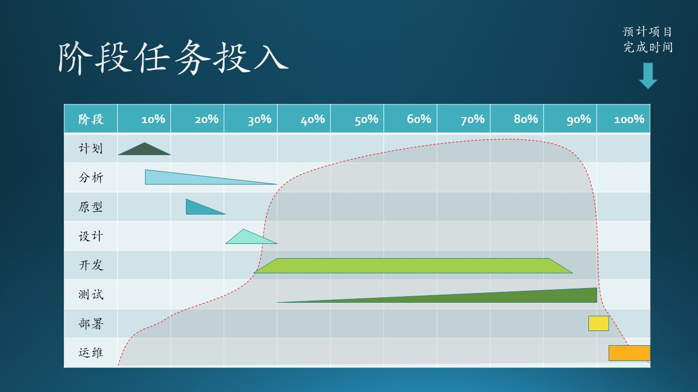
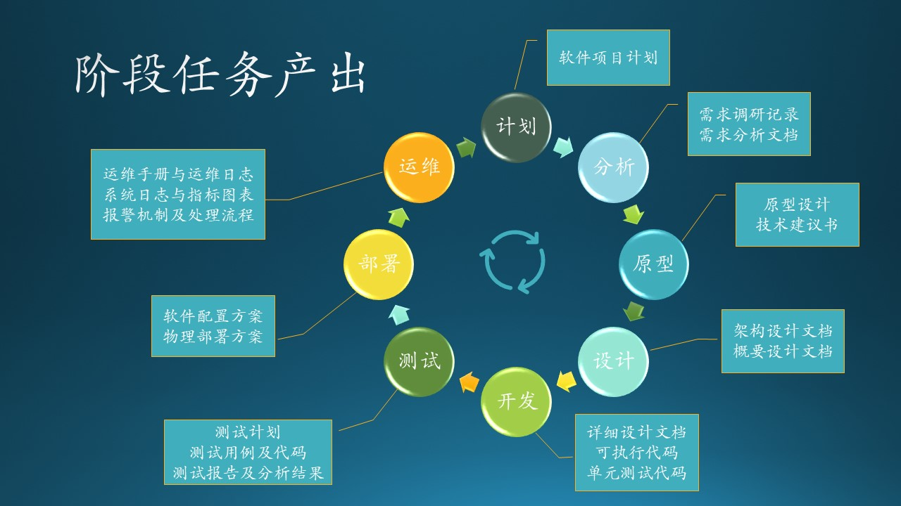

## 5.2 阶段任务的投入与产出

从 4.1 节的故事中，我们最终得到了最理想的阶段划分方法，这种方法可以满足绝大多数软件工程的需要。但是，有可能给读者留下一个误区：“计划结束后做需求分析，需求分析结束后做原型开发，原型开发结束后做系统设计......” 但其实没有一个交割点来绝对地分开前后两个阶段，甚至在某个时间段内，有多于 2 个阶段任务的重叠情况。见图 5.2.1。

图 5.2.1 阶段任务投入密度曲线

投入密度：关于投入的劳动资源随着时间而形成的密度曲线，越高表示此时刻共同工作的人越多或者劳动强度越大。可以用概率密度曲线做类比理解。

- 斜腰三角形
  逐步热身，积累想法，到尖顶儿时形成初步文档，后期逐步补充完善。

- 左直角三角形
  开始就全部投入，后期工作量逐步减少。

- 右直角三角形
  开始时处于跟随阶段，慢慢熟悉，后期工作量逐步增加。

- 梯形
  短期内熟悉，然后立刻全员投入并持续。

- 矩形
  熟悉时间极短，立刻全员投入并持续。

红色虚线所覆盖的阴影部分，是项目组所有人员的投入密度。

### 5.2.1 计划

软件项目计划（Software Project Planning）。
人员：商务人员、项目经理、技术负责人。
产出：项目计划书。
时间：不能超过整体的 10%，在 5% 时应该形成初步的文案。

一个简单的 idea 就可以让人躺着赚钱的日子已经不复存在了，现代社会要想成功必须依赖团队力量，而想要说服一个团队一起为一个目标而努力，就要拿出一个看上去漏洞不多的方案来，这个方案就是软件项目计划。

软件项目计划应该包括的主要内容有：

- 目标
  包括软件提供的服务内容、目标用户、预期进度、最终目的。
  比如：
  - 我们要提供一个叫做“必应词典”的英汉词典手机软件；
  - 目标用户是帮助在校学生背单词，帮助想提高英语能力的社会用户练习口语和听力；
  - 预期用半年时间完成大部分功能；
  - 最终在人群中建立“必应词典”的品牌。
- 可行性分析
    - 经济可行性
      需要做成本-效益分析，投入多少人力物力，盈利方案及预期收益。
      比如：在 Android 和 iOS 上各投入三名开发人员，两名后台服务开发人员，一名界面设计人员，两名测试人员，一名项目经理。在软件发布初期不盈利，积累了一定的用户量后，可以在关键模块上按使用量收费，或者增加必应广告。预期收益为每个月 xxx 人民币。
    - 法律可行性
      比如在中国，不能做涉赌涉黄的软件，不能侵权等等。
    - 技术可行性
      所需要的技术与自己所具备的技术之间的差距是否可以弥补，包括软件技术和硬件设备。
      比如：口语练习模块，需要在服务器端部署语音识别服务，把用户上传的口语与标准发音相比对，打分并给出反馈。所以，语音识别技术就是关键技术，目前已经有 xx 公司和 yy 公司提供了服务，我们可以集成。

在图 5.2.1 中的第一行，此项任务的投入密度是一个三角形，开始时大家零散地贡献想法，积累到一定程度后开始形成文案，后期逐渐补充完善。

### 5.2.2 分析

即软件需求分析（Requirement Analysis）。

人员：项目经理（PM），需求分析人员。
产出：需求调研记录，需求分析文档。
时间：从项目计划书初稿形成开始，投入密度逐步降低，持续时间较长，但是不能超过总时间的 30%。

一个中大型软件系统需要完整的需求调研、需求分析过程，并形成文档并经过共同评审，避免做出来的东西和想要的东西不一致。在初期尽快、尽多地明确需求，在后期可以逐步补充缺失或者不明确的地方，但是不能对已经开始的系统设计产生大的影响。详见第 3 部分。

### 5.2.3 原型

即原型系统设计及确认（Prototyping）。

人员：视觉设计师（designer）、系统设计师。
产出：原型设计，技术建议书。
时间：在需求分析进行到 1/3 时就可以开始了，越快越好，不要超过总时间的 20%。

力争在较短时间内发布原型，包括设计图或者可执行的软件，并与需求方确认主要流程和关键细节，避免遗漏或误解。该原型系统可以浏览，甚至可以交互（mock up，随机的输入和预定的输出）。系统设计师要给出概念验证原型和技术选型建议。详见第 5 部分。

### 5.2.4 设计

即系统分析与架构设计（System Analysis and Architect Design）。

人员：系统设计师，视觉设计师，主要的开发人员。
产出：架构设计文档，视觉/交互设计文档，或概要设计文档。
时间：从原型确认后开始，尽量短，不要超过总时间的 30%。

对于大中型系统，需要架构设计，因为要考虑框架的灵活性、可维护性等。在架构设计文档中要包括 4+1 视图：
- 场景视图
- 逻辑视图
- 进程视图
- 开发视图
- 物理视图

任何规模的系统都需要概要设计，详见第 5 部分。有时候概要设计可以放在下一个阶段（开发）。

图 5.2.2 每个阶段的任务产出

### 5.2.5 开发

即软件编码、单元测试（Coding and UnitTest)。

人员：软件开发工程师。
产出：概要设计文档、详细设计文档、可执行代码、单元测试代码。
时间：从架构设计初稿形成后即可开始，开始时间不要晚于 40%，结束时间不要晚于 85%，要给后期的工作留出空间。

在开发初期，根据项目需求做概要设计或详细设计，一般情况下，把概要设计写得稍微详细一些，就可以代替详细设计文档。详见第 5 部分。

在整个开发阶段，软件工程师全力以赴地持续工作，需求不能再做任何较大的修改。那么在前面的 25% 和 后面的 15% 的时间内，软件工程师是处于空闲状态吗？当然不是！他们可能处于以下几种状态：

- 在别的项目内工作；
- 协助做概念验证或原型；
- 协助解决部署或运维中的问题；
- 充电积累，参加培训，学习新技术，为新项目做准备。

### 5.2.6 测试

即集成测试（Integrated Testing）、系统测试（System Testing）。

人员：测试人员。
产出：测试计划、测试用例、测试代码、测试报告、静态分析、动态分析结果。
时间：随着开发的开始，测试越早借入越好，结束时间不能晚于 90%。

从开发阶段刚开始的时候，测试任务就要启动，只不过开始时密度不大，但是大头在后面，尤其是到了压力测试、可靠性测试等阶段，更是要 24 小时地运行测试代码。

所谓静态分析、动态分析，是用一些工具对程序的安全性进性分析，避免已知的安全漏洞，比如使用了那些已经发现有安全隐患的第三方库。

### 5.2.7 部署

人员：工程师。
产出：软件配置方案、物理部署方案（包括回滚方案）。
时间：在测试接近确认时就可以开始准备部署。但是，实际的部署方案其实早在系统设计阶段就已经给出了。

部署环境包括两个：集成环境、产品环境。首先在集成环境中部署，经过测试成功后再迁移/切换到产品环境。如果能做组件级别的回滚，就可以直接在产品环境中部署局部节点。如果不能，就要准备独立的产品环境，用于一次性的切换。

### 5.2.8 运维

人员：运维人员，项目经理。
产出：日志、图表、报警机制、backlog。
时间：从系统上线开始，一直持续到产品生命周期结束。

运维人员要随时监控系统的运行情况，有问题即时处理，定期向上级提供运行情况的总结图表（比如总用户量、并发量、系统负载情况等）。产品经理要引导大家在运维阶段把一些想法和改进意见写入 backlog 中。
