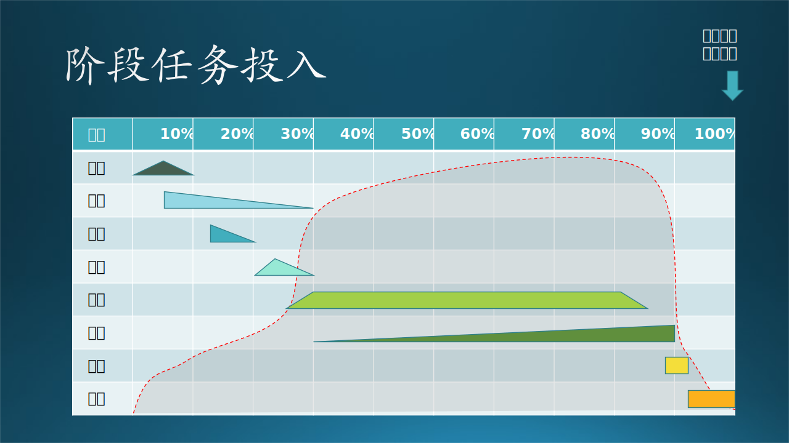
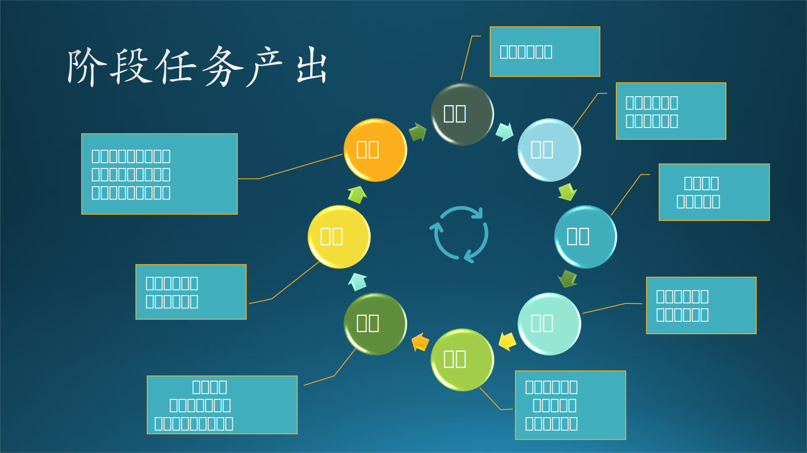

## 5.2 软件开发过程说明

### 5.2.1 流程与过程

请注意我们本章的标题使用了“流程”，但是本节的标题是“过程”。前者强调的对是软件工程的过程中的各个环节的事无巨细的掌控和对关键点的监督。而后者是一种点到为止的叙述，最后注重的是结果。

- 通过对书本知识（比如本书）的学习，读者可以了解到软件工程的**过程**。
- 而**流程**必须通过动手实践才能得到切身体会，要在实际工作中解决遇到的具体问题。

比如那个家喻户晓的笑话：“如何把大象放到冰箱里？” 答曰：“1. 把冰箱门打开；2. 把大象牵进去；3. 把冰箱门关上。” 这其实就是一种对**过程**的描述，它可以通过忽略具体细节而混淆视听。

还有一个例子，就是木头如何鼓励新手上台表演：“你就背着吉他，眼睛不用看台下以免紧张，然后弹和弦 1645,1645,1645......，鞠躬下台，多简单的**过程**！” 但实际上，吉他手上台表演，要考虑站位、站姿是否符合舞台要求，吉他连接到调音台后音量、音色的调节，和弦进行 1645 要克服大横按的一些操作难点，还要听鼓的节奏避免错拍，还要根据歌手的情绪来调节扫弦的力度，等等。这一系列**流程**能顺利走下来都是必须经过长期练习才能做到。

所以，可以认为过程是比流程更大更粗略的概念。

在英文中的 Procedure 和 Process 也是如此：流程（Procedure）是指关于如何执行构成流程一部分的特定任务的详细说明。过程（Process）是指实现特定目标的一系列事件。那么我们本章的英文标题为什么是 Development Process 呢？

软件开发是指使用计算机程序代码实现软件功能的**过程**，包括软件的总体结构、模块的组成、功能的设计、程序的编译、调试、联调、测试等过程。软件开发通常分为以下 6 个阶段：

（1）商业计划：分析软件开发的目标、需求、成本、风险等，确定软件开发是否可行。
（2）需求分析：详细地分析客户的软件功能需求，制定需求变更计划，保证软件开发过程的顺利进行。
（3）系统设计：根据需求分析结果进行软件设计，涉及到软件设计框架结构、软件系统模块和软件系统的数据库，主要分为总体设计和详细设计两部分。
（4）软件开发：根据软件设计用编程代码实现软件功能。
（5）测试分析：对完成的软件程序进行单元测试、组装测试、系统测试等，检查程序的正确性，客户要求功能的充分性，以确定软件是否满足开发要求，这也是一个发现问题、纠正问题的过程。
（6）运行维护：将完成的软件系统交付给客户，并向客户提供软件安装程序、数据库的数据字典、用户安装手册、用户使用指南等文档，指导客户安装软件及使用技巧。同时提供售后服务，维护软件，或者根据用户的新需求修改应用软件程序，不断满足客户的实际需求。

所以，从上面的描述可以看出，**软件开发既是一个过程，也是一个流程**。该过程中包括对 6 个阶段的一般步骤和规范的说明，每个阶段中有具体的流程描述，包含具体的软件开发活动和实践。流程和过程相辅相成，共同保证了软件开发的质量和效率。

### 5.2.2 阶段任务的投入与产出

从 5.1 节的故事中，我们最终得到了最理想的阶段划分方法，这种方法可以满足绝大多数软件工程的需要。但是，有可能给读者留下一个误区：“计划结束后做需求分析，需求分析结束后做原型开发，原型开发结束后做系统设计......” 但其实没有一个交割点来绝对地分开前后两个阶段，甚至在某个时间段内，有多于 2 个阶段任务的重叠情况。见图 5-3。

图 5-3 阶段任务资源投入曲线

图 5-3 中的图例如下：

- 斜腰三角形
  逐步热身，积累想法，到尖顶儿时形成初步文档，后期逐步补充完善。

- 左直角三角形
  开始就全部投入，后期工作量逐步减少。

- 右直角三角形
  开始时处于跟随阶段，慢慢熟悉，后期工作量逐步增加。

- 梯形
  短期内熟悉，然后立刻全员投入并持续。

- 矩形
  熟悉时间极短，立刻全员投入并持续。

投入率：关于投入的劳动资源随着时间而形成的曲线，越高表示此时刻共同工作的人越多或者劳动强度越大。

红色虚线所覆盖的阴影部分，是项目组所有人员的投入率，其某一横坐标点上的高度是具体的投入率值。比如，在初期（10%进度内），投入率最高低于 25%，在 80% 进度区间内为 95% 以上。

另外，细心的读者可以发现在图 5-3 中，列出了 8 个阶段，而不是上文中的 6 个，这是为什么呢？一是增加了“原型”阶段，这一点经常被忽略；二是增加了“部署”阶段，这在相当于传统软件中的“分发”，相当于现代软件工程中的云端物理部署，需要专门的设计工作支持。

各个阶段的产出在图 5-4 中展示。

#### 1. 计划

软件项目计划（Software Project Planning）。
人员：商务人员、项目经理、技术负责人。
产出：项目计划书。
时间：不能超过整体的 10%，在 5% 时应该形成初步的文案。

一个简单的 idea 就可以让人躺着赚钱的日子已经不复存在了，现代社会要想成功必须依赖团队力量，而想要说服一个团队一起为一个目标而努力，就要拿出一个看上去漏洞不多的方案来，这个方案就是软件项目计划。

软件项目计划应该包括的主要内容有：

- 目标
  包括软件提供的服务内容、目标用户、预期进度、最终目的。
  比如：
  - 我们要提供一个叫做“必应词典”的英汉词典手机软件；
  - 目标用户是帮助在校学生背单词，帮助想提高英语能力的社会用户练习口语和听力；
  - 预期用半年时间完成大部分功能；
  - 最终在人群中建立“必应词典”的品牌。
- 可行性分析
    - 经济可行性
      需要做成本-效益分析，投入多少人力物力，盈利方案及预期收益。
      比如：在 Android 和 iOS 上各投入三名开发人员，两名后台服务开发人员，一名界面设计人员，两名测试人员，一名项目经理。在软件发布初期不盈利，积累了一定的用户量后，可以在关键模块上按使用量收费，或者增加必应广告。预期收益为每个月 xxx 人民币。
    - 法律可行性
      比如在中国，不能做涉赌涉黄的软件，不能侵权等等。
    - 技术可行性
      所需要的技术与自己所具备的技术之间的差距是否可以弥补，包括软件技术和硬件设备。
      比如：口语练习模块，需要在服务器端部署语音识别服务，把用户上传的口语与标准发音相比对，打分并给出反馈。所以，语音识别技术就是关键技术，目前已经有 xx 公司和 yy 公司提供了服务，我们可以集成。

在图 5-3 中的第一行，此项任务的投入密度是一个三角形，开始时大家零散地贡献想法，积累到一定程度后开始形成文案，后期逐渐补充完善。

#### 2. 分析

即软件需求分析（Requirement Analysis）。

人员：项目经理（PM），需求分析人员。
产出：需求调研记录，需求分析文档。
时间：从项目计划书初稿形成开始，投入密度逐步降低，持续时间较长，但是不能超过总时间的 30%。

一个中大型软件系统需要完整的需求调研、需求分析过程，并形成文档并经过共同评审，避免做出来的东西和想要的东西不一致。在初期尽快、尽多地明确需求，在后期可以逐步补充缺失或者不明确的地方，但是不能对已经开始的系统设计产生大的影响。详见第 3 部分。

#### 3. 原型

即原型系统设计及确认（Prototyping）。

人员：视觉设计师（designer）、系统设计师。
产出：原型设计，技术建议书。
时间：在需求分析进行到 1/3 时就可以开始了，越快越好，不要超过总时间的 20%。

力争在较短时间内发布原型，包括设计图或者可执行的软件，并与需求方确认主要流程和关键细节，避免遗漏或误解。该原型系统可以浏览，甚至可以交互（mock up，随机的输入和预定的输出）。系统设计师要给出概念验证原型和技术选型建议。详见第 5 部分。

#### 4. 设计

即系统分析与架构设计（System Analysis and Architect Design）。

人员：系统设计师，视觉设计师，主要的开发人员。
产出：架构设计文档，视觉/交互设计文档，或概要设计文档。
时间：从原型确认后开始，尽量短，不要超过总时间的 30%。

对于大中型系统，需要架构设计，因为要考虑框架的灵活性、可维护性等。在架构设计文档中要包括 6 个视图：
- 应用场景视图
- 逻辑功能视图
- 运行过程视图
- 数据存储视图
- 软件开发视图
- 物理部署视图

任何规模的系统都需要概要设计，详见第 5 部分。

图 5-4 每个阶段的任务产出

#### 5. 开发

即软件编码、单元测试（Coding and UnitTest）。

人员：软件开发工程师。
产出：概要设计文档、详细设计文档、可执行代码、单元测试代码。
时间：从架构设计初稿形成后即可开始，开始时间不要晚于 40%，结束时间不要晚于 85%，要给后期的工作留出空间。

在开发初期，根据项目需求做概要设计或详细设计，一般情况下，把概要设计写得稍微详细一些，就可以代替详细设计文档。详见第 5 部分。

在整个开发阶段，软件工程师全力以赴地持续工作，需求不能再做任何较大的修改。那么在前面的 25% 和 后面的 15% 的时间内，软件工程师是处于空闲状态吗？当然不是！他们可能处于以下几种状态：

- 在别的项目内工作；
- 协助做概念验证或原型；
- 协助解决部署或运维中的问题；
- 充电积累，参加培训，学习新技术，为新项目做准备。

#### 6. 测试

即集成测试（Integrated Testing）、系统测试（System Testing）。

人员：测试人员。
产出：测试计划、测试用例、测试代码、测试报告、静态分析、动态分析结果。
时间：随着开发的开始，测试越早借入越好，结束时间不能晚于 90%。

从开发阶段刚开始的时候，测试任务就要启动，只不过开始时密度不大，但是大头在后面，尤其是到了压力测试、可靠性测试等阶段，更是要 24 小时地运行测试代码。

所谓静态分析、动态分析，是用一些工具对程序的安全性进性分析，避免已知的安全漏洞，比如使用了那些已经发现有安全隐患的第三方库。

#### 7. 部署

人员：工程师。
产出：软件配置方案、物理部署方案（包括回滚方案）。
时间：在测试接近确认时就可以开始准备部署。但是，实际的部署方案其实早在系统设计阶段就已经给出了。

部署环境包括两个：集成环境、产品环境。首先在集成环境中部署，经过测试成功后再迁移/切换到产品环境。如果能做组件级别的回滚，就可以直接在产品环境中部署局部节点。如果不能，就要准备独立的产品环境，用于一次性的切换。

#### 8. 运维

人员：运维人员，项目经理。
产出：日志、图表、报警机制、backlog。
时间：从系统上线开始，一直持续到产品生命周期结束。

运维人员要随时监控系统的运行情况，有问题即时处理，定期向上级提供运行情况的总结图表（比如总用户量、并发量、系统负载情况等）。产品经理要引导大家在运维阶段把一些想法和改进意见写入 backlog 中。
