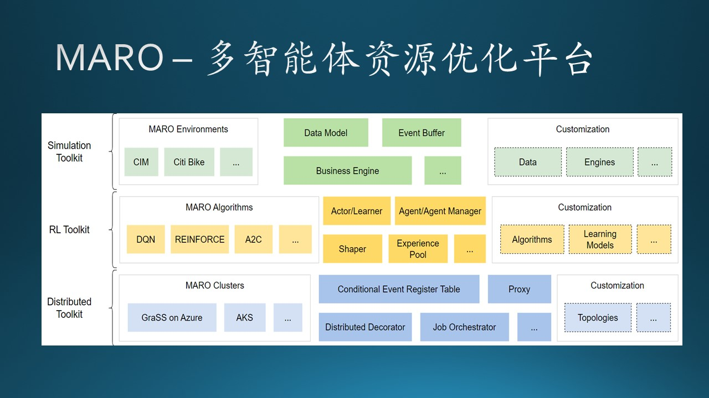
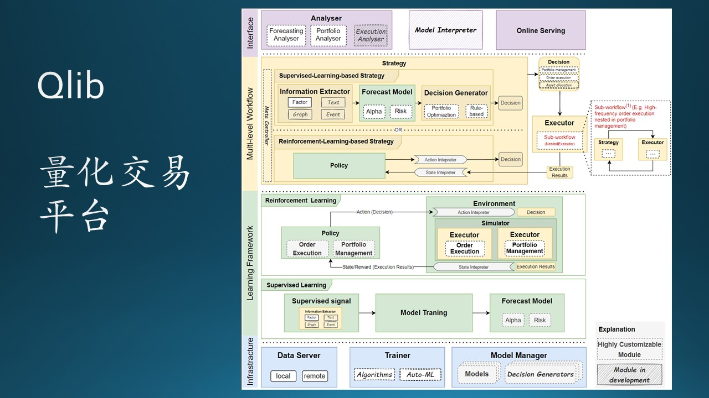
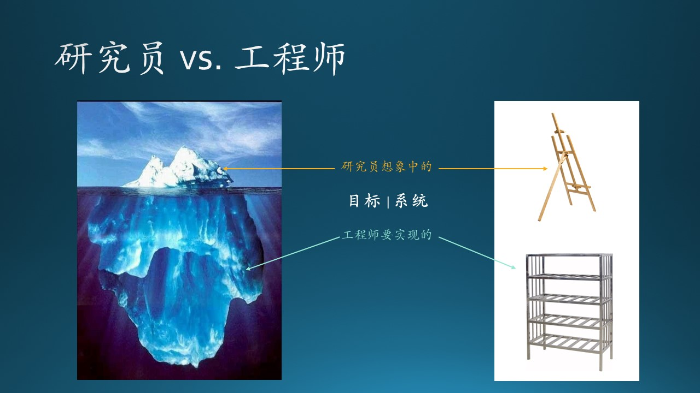

## 5.3 研究型项目的开发流程

所谓“研究型项目”，就是研究员主导的项目，通常是使用一种新的技术或算法解决用传统方法解决不好或者不能解决的问题。

### 5.3.1 项目 A

MARO - Multi-Agent Resource Optimizaiton 多智能体资源优化平台

图 5.3.1 多智能体强化学习平台架构图

#### 项目规模

这是一个研究型的项目：一个 dev manager，一个 tech lead，六个 dev（2 FTE + 4 Vendor），两个研究员，一个 vendor designer，没有 PM。

#### 项目背景

一个跨国海运公司在世界各地的港口都有空的集装箱，需要及时地转运到所需要的港口装载货物。如果用传统的优化算法，每次计算需要花费好几天的时间，而且还不能克服一些临时的因素造成的误差，造成空集装箱没有正确地达到需要的港口。

所以研究员们用多智能体强化学习算法，成功地解决了这个问题。

和这个海运公司的合同结束后，研究员和工程师们想把这个算法发展成为多智能体强化学习平台，以便可以方便地解决类似问题。为此，建立了一个开源项目：MARO（Multi Agent Resource Optimizaiton）。

但是只有海运这样一个实例的话，是无法泛化的，于是研究员和工程师们又找了共享单车搬运、虚拟机管理、仓储库存管理等几个例子。

#### 资源调整

这个平台开发了一年多后，那个 tech lead 要离职，老板让木头接替他。一进来就发现 tech lead 定的例会是每周一、三、五，这就很尴尬：因为周五以后就是周末，如果每个 dev 想在周一的例会上说出点儿什么来，就必须在周末花时间做出进展来。大家轮一圈儿后大概要花 30 分钟，而且那个 tech lead 特能说，每次都讲很多。除此之外，在例会之外他还会经常和每个 dev 单独联系，一讨论就是一个小时，语气很强硬。

这位 tech lead 把摊子铺得很大，所以每天都很忙的样子。他和研究员的关系比较密切，对研究员是言听计从。他在离职和木头的交接期间，在他的授意下，有个研究员跳了出来主持例会，给各个 dev 安排任务，还给木头安排了一个文档任务，木头只是不置可否地笑了笑。木头和老板汇报了这件事，老板觉得是不可接受的：“我们虽然开放合作，但是还没有开放到可以让别的组的人来指挥我们的 dev 工作。” 

所以，木头接手后的第一件事就是把以前的例会取消，然后重新建立了每周二、四两天的例会，每次例会大概 15 分钟左右。没有邀请研究员参加，因为这是个 dev 的例会。

很快，木头发现其实这是个画饼充饥的项目，没有明确的用户，没有产品化目标，没有明确的计划，相当于是一个工程团队在搞研究，只是在 GitHub 上开源了一个项目。

于是木头和领导建议，把部分人力调配到了量化交易的项目上，这边只留三个 dev（1 FTE + 2 Vendor），继续支持研究员关于仓储管理的项目研发。

两个月后，领导和木头说，把这个项目交给 3.4 节中提到的女生 E，木头很痛快地答应了，但是每周的两次 sync 还是几个项目一起开，因为人员上有交叉。木头发现女生 E 作为 tech lead，她自己很少写 code，只做 code review。但这与木头无关，索性忽略。

#### 项目分析

从用户需求上看：

- 没有明确的用户需求，所有需求场景都是研究员和工程师们自己想的，是“伪需求”。这是一个致命的问题。在这一点上不成立的话，就决定了这个项目不会有什么好结果。

- 这是存在于研究员群体的一个通病。在完成了一个研究项目并有了实际的成果转换后，大家都想复制这种成功，于是想把“项目”变成“产品”，把“产品”变成“平台”，把“平台”变成“服务”。这种试图“泛化”的努力是违背了软件项目的基本规律的：还没有找到规律，就想建立模型。

从问题领域上看：

- 基于统计的机器学习，和基于特征的深度学习，都已经被广泛地接受并落地于实际应用场景中。强化学习对于大多数人来说还很陌生，虽然它能解决很多传统机器学习与深度学习不能解决的问题，但是数据如何收集整理，算法如何使用，都是需要专业指导的。所以用户对这个平台的认知程度很低。

- 虽然强化学习的应用范围也很广，但是这方面的领域专家太少了。一方面，我们的研究员没有领域知识，不知道强化学习应该用在哪里；另一方面，有领域知识的人没有强化学习知识，而是寻求传统的优化求解思路，或者把目光转向机器学习和深度学习技术上，强化学习的入门门槛很高。所以，很多人对强化学习的了解还仅限于 Alpha Go 上。

- 即使用户真的熟悉强化学习，而且又有领域知识，这类用户也不会考虑使用这个平台的。因为了解这个框架本身就需要花时间，而且万一这个框架有什么潜在的问题的话，如何能判断出是框架的问题还是问题领域本身的数据或算法问题？所以使用这个框架的风险太大。

从团队组成上看：

- 没有 PM 就代表了没有需求、产品目标、商业计划；
- dev 的配置很齐全，有开发目标，但目标是否正确，全凭 tech lead 一个人说了算；
- 居然还有一个 designer，尽管视觉设计工作非常少。举个例子来说，你觉得在 SK-Learn、PyTorch、Tensor Flow 这种框架上需要有 designer 帮忙吗？

从开发流程上看：

- 因为与前面所说的跨国海运公司签的合同是挣了钱的，所以在那个光环的照耀下，这个项目得以“轰轰烈烈”地进行了一年多。
- 例会在时间上安排得很不专业。
- Tech lead 没有 design doc，不写 code，只做 code review，这是不对的。
- 没有定义时间节点明确说明要有哪些 milestone 发生。
- 实际上是由研究员指定的软件开发相关的工作内容，这是前所未闻的。
- 其实最关键的还是团队的老板，看不清这个项目的未来发展，即不懂技术又不懂管理，被人家画了个饼，却始终吃不到嘴里。
- 还有一点很可笑，所有的文档都是英文的，虽然所有参与人员都是中国人（让木头想起了在美国的墨西哥人为了谋生而开中餐馆）。英文可以有，但是写中文文档不是手到擒来的事情吗？用中文来降低入门的门槛是不是一种合理的考虑呢？

#### 最终结果

这个项目开源三年多了，至今虽然还在有人维护，但是处于半死不活的状态，在 GitHub 上只有 660+ 颗星。

做这种决策一定要经验丰富且小心谨慎，因为这种项目是不能快速试错的，花了一年时间，没有用户，会觉得是功能不完善；于是再花一年时间，还是没有用户，会觉得是因为没有好的例子帮助用户理解；于是再花一年时间补充很多例子，仍然没有用户，才发现是个伪需求——我们正在试图生产/销售火车的方向盘。

### 5.3.2 项目 B

Qlib - Quantitative Library 量化交易平台。命名为一个 Library，意为用户只要调用 API 就可以完成指定的任务。但实际上，它是一个 Framework。也就是说：用户必须按照 Qlib 所规定的流程

图 5.3.2 Qlib 量化交易平台架构图

#### 项目规模

这是一个研究型的项目：一个 Dev manager，一个 Tech lead，五个 dev（3 FTE + 2 Vendor），三个研究员，一个 PM，两个商务人员，一个外部的长期合作的客户（某基金公司）。

#### 项目背景

研究员们研究股票的量化交易很多年了，并建立了一个开源项目：Qlib。可是缺少实盘的机会。某基金公司考察后决定合作，基金公司提供数据，由研究员们提供算法、模型、预测结果，基金公司参考预测结果再结合以往的投资经验来操盘。

#### 要解决的问题

每个交易日，基金公司都要手工上传昨天的交易数据，用微信叫醒熟睡的研究员，研究员去下载交易数据，处理后用模型做预测，然后微信通知基金公司取结果。整个过程基本没有自动化。

每过 60 个交易日，基金公司就要求研究员使用最近的历史数据重新训练模型，在历史数据上比较新旧模型的差异，然后切换模型。这个过程也都是手工完成，很繁复。

木头的任务就是把上述过程工程化、自动化，省去手工操作的麻烦和误操作。

#### 开发流程

- 每周二、四，木头会安排组内会议，大家 sync 一下当前进度。

- 每周五收盘后，和客户开一次例会，由研究员分享最新的研究成果。开会时客户那边一般是两三个人，我们这边三个工程师、两个研究员、两个商务人员、一个 PM 都要参加。

- 每两周，开发团队要和研究员们做一次内部例会，工程师们汇报系统设计及开发的进展。

- 木头作为 Tech lead 负责开发团队，安排一个 dev 做推理预测部分的工程化，两个 dev 接手改造陈年失修的数据处理 pipeline，两个 dev 做训练部分的工程化。

- 在正式开始之前，木头先把任务做了粗粒度的分割，估算每个部分所需开发时长，并用此时间来对内对外宣布，一是给内部人员一个明确的时间/任务安排，二是给外部人员一个预期。

- 木头自己画了很多图，并配以较少的文字，来说明整个系统的架构，一是用于对内统一思想，一是用于对外汇报。

- 每次做一个新模块，木头会要求相关人员写一个简单的设计。因为木头发现，某些 dev 很快就能做出一个功能模块来，但是在 sync 时发现设计太复杂，不利于理解和后期维护。

- 所有工作都在 Microsoft Azure 上进行，因为客户买了 Azure 的订阅。

#### 项目分析

从用户需求上看：

- 每天的预测要在数据上传后 90 分钟内完成；每隔 60 个交易日要使用历史数据重新进行模型训练；要求在 2 天内训练完 160 个神经网络模型；最新模型的预测结果应该与旧模型匹配程度极高才能上线。

- 用户只有一家，用户说什么就是什么，没有讨价还价的余地。因为涉及到上亿的投资规模，所以用户很谨慎，每上一个新功能都要严格把关，要求我们能够做到自验证。

- 甲方强势，乙方必然弱势。微软这边投入了大量的人力，但是合同金额并不大，只是为了能够把研究成果市场化。因此，甲方会时不常地提出一些临时需求，我们这边就需要从正常的开发流程中抽出人手来帮助分析数据和模型行为。

- 用户才不关心我们用什么平台框架，但是研究员们一心想推广 Qlib，所以想让工程师们使用 Qlib 完成工程任务。这里就会有问题：以往的模型都是用那个陈年失修的 pipeline 来完成数据处理的，然后去训练模型。如果用 Qlib 做数据处理，新训练出来的模型与旧模型差异较大的话，如何向用户解释？基于此，木头拒绝了使用 Qlib 的要求（这令研究员们很不满意），先满足真实的用户需求。

从问题领域上看：

- 量化交易，其实只有大户才能用得上，因为它并不是靠对个股预测的准确性来获利，而是靠对股票组合的抗干扰性预测来指导大户投资的。但是散户往往对此有更浓厚的兴趣，希望通过预测个股来赚钱，但实际上是不可能的，否则研究员们为什么不闷声发大财？

- 大户虽然更合适，但是这种项目有个致命的问题：不能推广。比如，客户 A 已经使用了我们的量化交易系统，我们又找到了客户 B，人家会问：有别的客户使用你们的系统吗？如果你说“还没有其它客户使用”，那客户 B 会觉得不放心；如果你说“已经有客户使用了”，那客户 B 会质疑：如果我们也使用，那么和客户 A 的算法就是完全一致的，在股票市场上就会造成严重的买卖同质性。

- 所以，完成该基金客户的实际需求，是我们工程师应该追求的目标；而使得 Qlib 发扬光大，成为众多量化交易研究者的平台，是研究员才关心的目标。

从团队组成上看：

- 商务人员在整个开发流程中只是处于 RASCI 模型中的 informed 角色，并不实际做事情。

- 虽然有 PM，但是由于这是一个技术导向的不平等的合作项目，所以 PM 的大多数工作都是在组织会议，发会议记录，对于产品的方向没有发言权。

- 研究员想一方面推出 Qlib，另一方面想在实盘交易上有突破，因此在实际的工程项目中也是 informed/Consulted 角色。

- 工程师是完成用户需求的主要力量。

从开发流程上看：

- 每周两次的内部 sync 是必要的，这是项目流程的基本需要。
- 每周一次的和客户交流也是未尝不可的，但是没必要这么频繁，这主要是研究员们过于 push 自己了，其实对于客户来说，每两周一次也没有问题，因为合同的周期是半年。
- 每两周一次的内部交流，纯属是工程师对研究员的单方向汇报，笔者认为跑偏了，相当于工程师是研究员的下属，而不是合作关系。但如果是双方互相交流的话，那就是另外一番融洽的合作场景了。
- 从与客户的关系看，由于以前研究员们对客户过于“尊重”了，真的把客户当成“上帝”了，搞得 PM 根本拦不住也不敢拦客户的随机要求，这会打乱软件工程活动的正常进行。

#### 最终结果

工程师们用了四个月的时间，终于把所有的训练系统、推理系统、模型管理系统做到了自动化，圆满地完成了第一次模型切换，客户很满意。

### 5.3.3 总结

经过上面两个项目，我们总结一下工程师与研究员合作一些研究项目时需要注意的事项。

图 5.3.3 研究员与工程师对软件系统的不同理解

#### 目标不同

在强化学习项目中，研究员的目标是做一个能让大家使用的做多智能体强化学习研究的平台，但是它的泛化能力太差，以至于无人问津。而工程师在这个项目中处于辅助位置，在领域知识上处于劣势，基本上要听从研究员的安排。这种项目，成功的概率很小。

在量化交易项目中，研究员的目标是让工程师使用 Qlib，而工程师的目标是要切实完成用户的需求。如果使用 Qlib 的过程遇到什么问题而不能完成需求，那么要承担责任的是工程师，而不是研究员。况且学习 Qlib 还需要时间，而距离下一次模型切换只有 60 个交易日。

#### 背景不同

在量化交易项目中，第一次开会时，研究员提出了上述任务，要求两个工程师 + 两个实习生来完成这些任务。木头心里估算了任务量后，当时就提出：你们的资源要少了！第一，我们工程师和你们研究员不一样，research 领域中主要是实习生写 code，而工程领域中实习生是不能写 production code 的。第二，这些任务的实际工程工作量远超出你们的想象，两个人是不可能完成的，至少需要五个人。

研究员什么时候有能力估算工程师的工作量了？

#### 做法不同

在量化交易项目中，用户买了 100 万的 Azure 订阅，用于训练模型。但是以前的研究员并没有充分使用，而是使用公司内部的 GPU 平台来训练模型。导致用户认为根本不需要购买很多的订阅额。

木头在工程化过程中，充分使用 Azure 上的 GPU 订阅额（quota）建设自动化训练系统，经过了多轮的测试以验证其稳定性，结果用爆了用户的订阅额，促使用户在下一期合同的时候购买了翻倍的订阅额，商务部门很高兴。

研究员在数年的研究过程中积累了一些数据处理代码，都放在一台运算能力超强的计算机上，并不断地以打补丁的方法添加新的功能。这台计算机没有人敢关机，也不敢修改里面的代码。这就是一个典型的研究型黑盒子。

木头在工程化过程中，专门指派了一个 dev 复制了这台计算机，包括环境和代码，然后在副本计算机上做各种探索，终于搞清楚了每一步的输入输出和整个流程，让黑盒变成了白盒，为后期使用 Qlib 成为可能。

#### 最佳实践

- 如果是一个项目处于刚开始的研究阶段，研究员和工程师需要积极配合，研究员是 R 的角色（负责），工程师是 S 的角色（支持），以研究为导向。

- 但是一旦项目成熟了，就应该进入正式的系统开发阶段，以工程为导向，工程师是 R 的角色，研究员是 C 的角色（顾问），就不要再指手画脚了。

- 研究员应该有深度的领域知识传播，而工程师应该有宽度的工程知识介绍，双方各取所长，并非谁领导谁的问题，而是在项目的不同阶段谁主导的问题。在量化交易项目中，每两周一次的内部例会只是工程师单方面输出，搞得气氛很怪异。

- 工程师在与研究员合作的过程中，切记自己的使命，保证代码质量，确保最终产出的不是脆弱的试验室产品。

- 不要轻易去搞什么研究平台，研究员往往陷于“自恋”中不能自拔，这是他们的工作性质所决定的。对于工程师来说，能够判断出哪些需求是真实的，不要拿起来就做。学会正确地做事，也要学会做正确的事，别浪费自己的时间。

- 研究员要给与工程师的合作充分的肯定。在量化交易项目中，工程师们忙活了好几个月，研究员的评价却是“他们只做了一些修修补补的工作”，这是不够负责任的评价。

- 在研究院这种组织中，工程师往往没有 credit，而 research manager 也往往不懂得如何评价工程师的工作绩效。所以工程师们要有心理准备，并且可以用适当的方式给与你的 research manager 一些 education。“教育老板”是微软的一种文化。
