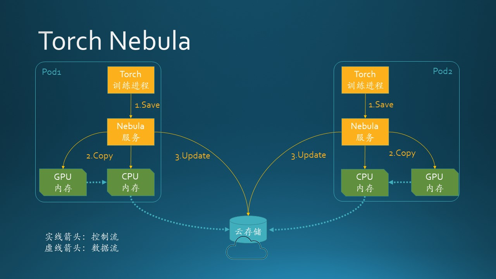
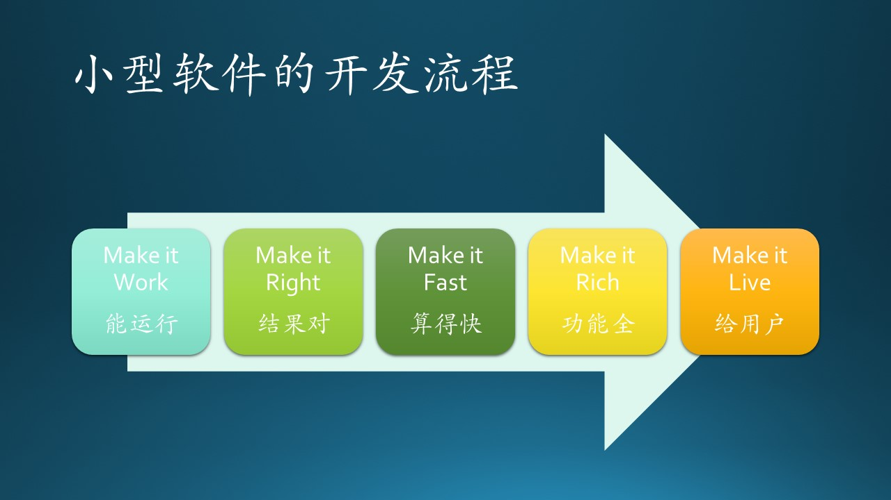
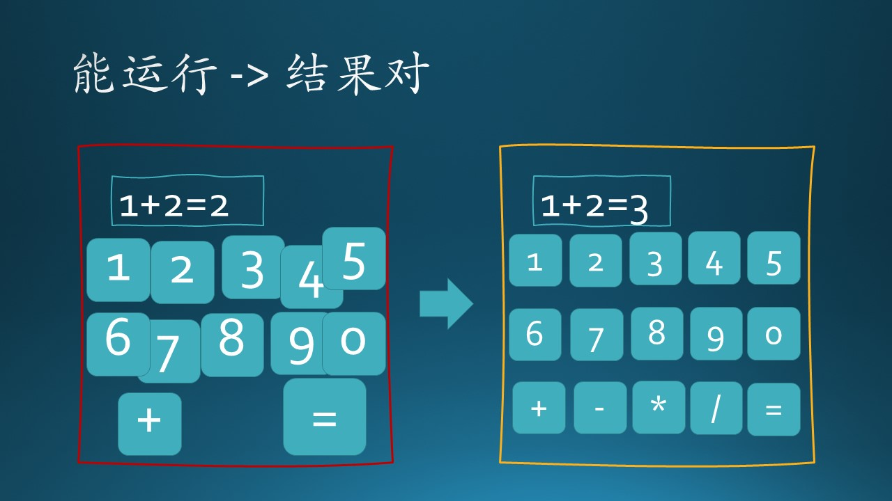
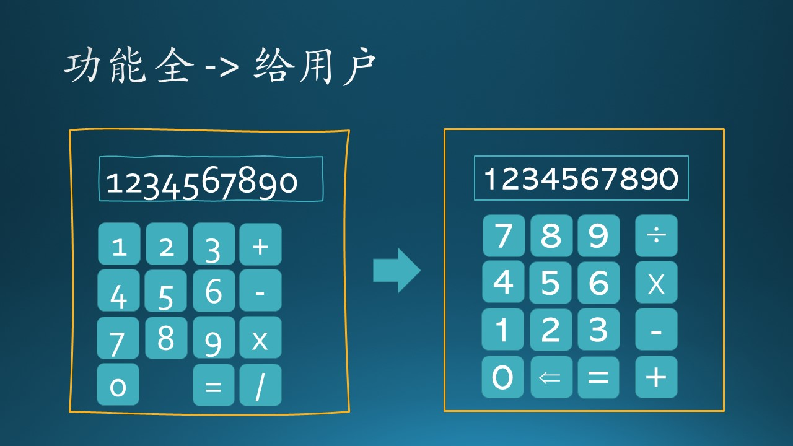

## 5.4 小型软件的开发流程

### 5.4.1 项目 C

Torch Nebula，基于 PyTorch 的分布式训练进度的云缓存。

图 5.4.1 Torch Nebula 项目工作原理图

#### 项目规模

这是一个小型项目：一个 dev manager，一个 tech lead，四个 dev，没有 PM 和 Designer，first party（内部）用户。

#### 项目背景

在使用 PyTorch 训练大型神经网络模型时，往往使用分布式训练，以数据分布式居多。这种模型往往需要几天甚至几周的时间才能训练完毕，这就需要在训练过程中间歇性地保存当前的训练进度，以备万一机器掉电或框架软件错误造成中断时，可以把最近一次的保存进度加载进来继续训练。

#### 要解决的问题

由于网络参数过大，调用 torch.save() 函数保存进度写入硬盘往往需要一个多小时，然后才能继续训练，是一种阻塞式的行为。我们的目的就是要提供一个可导入的 python 包，当用户调用这个包提供的 nebula.save() 函数时，可以用异步的方式在后台保存进度，只需要 1 分钟左右的延迟就可以继续训练任务。

#### 关于例会

刚一加入这个项目，就发现他们每天上午 11 点都有例会，通过 Teams 开的在线会议，大家 sync 进度，scrum master 是 Tech Lead。他会询问每个人的进度，有问题的话就讨论以下解决办法，或者提醒要注意的关键点。经常进行一些发散性的讨论，造成了一轮 sync 下来会花 40 分钟以上的时间。

初来乍到，木头也不好说什么，就听着呗，轮到自己时就简单说两句。这种每天 sync 的好处就是：Tech Lead 可以清楚地知道每个人的进度及当前状态，而每个 Dev 如果想在第二天的会上说出点儿什么来，必须在前一天花时间完做出质性的进展，很大程度上杜绝了“摸鱼”现象。

但是，每天花 40 分钟有点儿太耽误大家的时间了。另外，项目本身的难度不是很小，所以每天不一定有实质性进展。

#### 开发流程

- 木头是以帮忙的身份来加入这个项目的，从零开始建立一个 CI Pipeline，可以把 dev 们提交的 code 在 Pipeline 里自动编译、打包、部署到测试环境，如果测试成功则允许 merge。

- 团队除了每天上午开一次例会以外，每周五下午向上层的老板做一次回报，本周做了什么，下周准备做什么，用户有什么反馈等等。老板关心的问题就是：有多少用户在用了，使用情况如何。

- 在日常工作中，如果用户或者我们自己发现了什么 bug，就记录在 Azure DevOps 上面；如果有什么新想法，也会以 Feature 的标签记录在 DevOps 上，作为 backlog。

- Tech lead 在例会上看每个人的进度，如果没有任务积累，就会从 backlog 中拿出一项优先级比较高的任务来分配给这个人。当然，像木头这种比较资深的 dev，会自己主动挑任务：或者是自己感兴趣，或者是对了解全局有帮助，或者是自认为比较重要的。

- 每个人要做新功能时，都需要先写一个设计文档，可简可繁，tech lead 找相关人员评审后方可继续。

- 日常的 1:1 的讨论比较多，有时候会直接跑到对方的座位旁对着屏幕讨论。

- 大家都很友善，会帮助新来的同事答疑解惑，这让木头感到很舒服，比起上一个团队来可是强多了。

- 没有外部的需求要求我们做什么功能，都是自己想出来的。

- 每两周会总结一下进度，作为一个 Sprint，但是并不严格，因为很多时候计划的任务两周做不完，就会用三周时间。老板也不会催促。

#### 项目分析

从用户需求上看：

- 需求是客观存在的，而且是刚需，但并不是由用户提出来的，而是由 feature team 自己发掘的。

从开发流程上看：

- 每天的例会是很必要的。
- 每两、三周作为一个 Sprint 是正确的。
- Tech lead 和 Scrum master 是同一个人，这是不正确的做法，导致每天的 Scrum meeting 太长。
- 在项目早期建设了 CI Pipeline 是正确的，但是没有及时建立有效的 Unit Test 机制是不正确的，导致新代码 merge 到主分支的风险很大。
- 实现每个功能前都需要一个简单的设计文档及评审，这是正确的。
- 每周向上级老板汇报一次未尝不可，但是如果能和 Sprint 周期同步就会更好。
- 没有明确的进度要求，只有一个大的方向。

所以，这是一个比较成功的团队流程。

#### 最终结果

当木头离开这个项目组时，已经有不少内部用户使用了 Nebula，反响很好，也得到了领导的夸赞。下一步是想开源这个项目，但不是必须的。

### 5.4.2 小型软件的开发流程

我们以做一个计算器软件为例，说明开发一个小型软件的开发流程的最佳实践（Best Practice）模型，如图 5.4.2 所示。

图 5.4.2 小型软件开发流程的最佳实践

#### 1. Make it Work - 能运行

首先，我们做一个比较粗糙的原型，只要能运行就行，结果可以是不正确的。

从功能上看：
1. 提供基本的输入功能，包括数字和运算符，但是只有“0~9,+,=”等 12 个按键，而且排列得七扭八歪；
2. 提供输出显示功能，能把输入显示在屏幕上，但是目前阶段只能显示“1,2,+,=”四种字符；
3. 输入“1+2”后，按“=”键，在屏幕上可以显示结果，但是结果可能是错误的“2”，而不是预期的“3”。

从界面上看：
1. 几个按钮的大小和位置不整齐，但不影响使用；
2. 显示框歪歪扭扭，但还能看清楚数字；
3. 外边框也不是很美观，用了很不协调的红色。

如图 5.4.3 左子图所示。

图 5.4.3 从“能运行”到“结果对”

#### 2. Make it Correct - 结果对

本步中的关键是要求结果正确。

1. 原型可以工作了，但是结果并不正确，所以需要 debug 来排查错误。
2. 顺手把几个按钮的大小和位置调整得好看一些，补全了四则运算的按键，再把边框改成搭配的黄色，显得稍微懂一些美学，别太给咱们程序员丢脸。
3. 再次输入“1+2=”后，可以得到正确的结果“3”了。
4. 能显示更多种类的字符了，但是显示区长度还比较短，只能有 6 个字符。

如图 5.4.3 右子图所示。

#### 3. Make it Fast - 算得快

本步中的关键是要让结果迅速地出现。

结果虽然正确了，但是发现再输入“=”后，要等 3 秒钟以上才得到结果。这是怎么回事呢？

经过代码检查和 debug 发现：

1. 输入的数字，首先被变成了字符串，在接收到“=”号输入后，从屏幕显示缓冲区把字符串取出来，解析成两组数字“1,2”和“+”号，再进行实际的数学计算。这个设计糟糕透了。
2. 不知道哪一位程序员脑洞大开，把本来可以在本地进行的计算设计成调用网络服务，还号称是可扩展的 B/S 模式，将来可以调用任何新实现的数学运算。
3. 最气人的是，为了显示美观，有人引入了一个巨大的第三方库，而且对该库没有进行任何安全性检查，不知道它都跑了哪些逻辑。
4. 最难以发现的是，每次运算都会触发一次日志记录操作，由于开发过程中的自动测试用例也写日志，导致日志文件变得越来越大，打开、寻址、写入、关闭文件的操作变得很慢。

当然，以上这些都是在原型阶段发现的问题，还有可以纠正的机会。

#### 4. Make it Rich - 功能全

本步中的关键是要实现所有设计的功能，并保证性能没有明显下降。

在经过需求评审和设计评审后，这个项目进入了正式的实现阶段。已知的功能有：
1. 支持按键数字从0-9；
2. 操作符支持“加减乘除”；
3. 显示区可以显示 10 个字符了，在超过 10 个字符时，用户输入时会有“滴滴”的报警声；
4. 由于还没有收到 Designer 的设计图，界面上还是有些歪歪扭扭的，而且字体的选择也有些问题，上下边界没有对齐。

如图 5.4.4 左子图所示。所以虽然功能都已经实现了，还是没法交给最终用户使用。

图 5.4.4 从“功能全”到“给用户”

#### 5. Make it Live - 给用户

终于收到 Designer 的设计图了：

1. 0-9 十个数字的排列顺序让程序员们讨论了半天，为什么 “789” 在上面？找到了一个实际的计算器一看，确实是这样排列的；
2. “加减乘除”四个按钮的顺序也是颠倒过来的，并且与左侧数字去拉开了距离；
3. 字体统一使用等宽形式，上下边界也对齐了；
4. 按键区与显示区的中线对齐，上下左右的边界间距也都合理；
5. 增加了“删除”按钮，可以随时修改输入错误，而在此之前，程序员们测试时都是一通乱按，无所谓对错；
6. 界面边框不再是七扭八歪的了，很规矩。

如图 5.4.4 右子图所示。这样修改之后，再次经过回归测试，功能性能都没问题，这个简单的应用终于可以发布给用户使用了。

