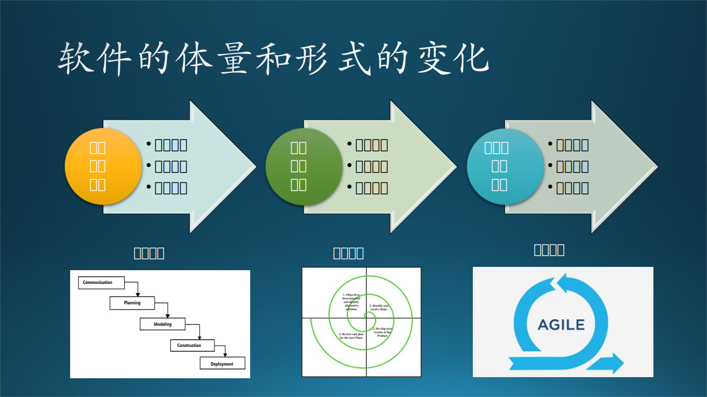

## 5.5 敏捷开发流程

### 5.5.1 软件体量和形式的变化

在 5.4 节中的例子中，我们采用的就是敏捷开发流程，这种流程是软件开发者在长期的工程实践中通过无数的失败案例总结出来的，虽然它不一定能保证未来的每个软件工程项目都成功。

下面我们来看一看敏捷模型的产生基础。

计算机的应用可以追溯到第二次世界大战前，是名副其实的“国家机器”。真正的商业计算机及软件，应该是从上个世纪 50 年代开始的，最初用于构建大型的复杂商业应用，后来发展成为个人计算机，又发展到移动设备。终端设备的变化导致软件的变化，而软件体量、内容、形式上的变化，必然会导致软件开发团队的理念和流程的变化。如图 5-12 所示。

图 5-12 软件体量和形式的变化

#### 1. 大型系统软件

50 年前，软件系统是为了解决大型企业的应用场景的刚性需求，比如航空航天系统、金融股票系统、操作系统等，结构复杂，投入巨大，开发周期长，维护时间也长。这些系统不是所有软件公司都能做的，所以才出现了微软、IBM、Oracle等这些大型软件厂商。像 Windows 操作系统，就是这种类型，虽然它出现的比较晚（大概是 30 年前）。

这时的软件开发流程一般采用瀑布模型，上游的任务全部完成后，再开始下游的任务。

#### 2. 桌面应用软件

30 年前，个人电脑普及到办公室，需求场景下移到了中小企业的应用上，比如办公软件、企业管理软件，还有面向大众的游戏软件。这类软件需求多样，需要定制，一般的中型软件公司经过一定的积累后也可以完成。可以用微软的 Office 这类运行在 PC 上的办公套件作为代表。

这时的软件开发流程一般采用螺旋模型，通过对某一阶段的多次重复来保证其完整性、正确性。

#### 3. 互联网应用软件

10年前，随着互联网的全面普及以及智能手机的发展，需求场景进一步下沉到了个人用户上，成百上千的网站、手机应用，以及其它 IoT 设备（如GPS、智能手表、智能手环、智能监控）上的移动应用出现在应用市场上。

此时，一般采用敏捷模型来应对市场的快速变化。

### 5.5.2 敏捷宣言

敏捷宣言（Mainfesto for Agile Software Development）。

2001年2月11日至13日，在犹他州瓦萨奇山的雪鸟（Snowbird）滑雪胜地洛奇酒店，17位软件开发领域的领军人物聚在一起聊天、滑雪、放松、并试图找到共同点 。

参会者们包括来自于极限编程、Scrum、DSDM、自适应软件开发、水晶系列、特征驱动开发、实效编程的代表们，还包括了希望找到文档驱动、重型软件开发过程的替代品的一些推动者。所有这些方式都是“轻量版”的框架，因为这些方法使用更少，更简单的规则来适应快速变化的环境。不少与会者都觉得“Agile”这个术语非常适用。

经过为期三天的讨论，他们在价值观和原则层面上达成共识，选择了 Agile 一词并为其赋予了特殊的意义，制定并发布了软件行业历史上最为重要的文件之一：敏捷宣言。

参会者将自己命名为“敏捷联盟（The Agile Alliance）”，希望能够帮助软件行业中的其他人以新的、更敏捷的方式思考软件开发、方法和组织。而“敏捷宣言”则被展示在一个网站上，到目前已被翻译成了60多种语言，并作为一种信仰被推广至全球以及非软件行业。

敏捷宣言的原文如下：

----

**我们一直在实践中探寻更好的软件开发方法，身体力行的同时也帮助他人。由此我们建立了如下价值观：**

**1. 个体和互动高于流程和工具**
**2. 工作的软件高于详尽的文档**
**3. 客户合作高于合同谈判**
**4. 响应变化高于遵循计划**

**也就是说，尽管右项有一定的价值，我们更重视左项的价值。**

----

不熟悉软件工程的新手，或者是一些资源紧缺的小公司，看到上面的文字后经常会产生一些误解。

#### 1. 误解1：强调个人英雄主义

要是在上个世纪 90 年代以前，个人英雄主义还可以大放异彩，因为当时的个人电脑上的应用比较短缺，有能力的一些开发者完全可以独立承担规模比较小的应用开发。

但是现代的软件规模已经不是几个人就能搞定的事情了，团队合作需要的流程和工具在日常开发管理和大规模作战时很重要。

当然，也可能有些刚起步的小企业需要一些小规模的软件，它们可以在市场上找到各式各样的现成的软件来直接（购买）使用，个人开发者的发挥余地越来越小。在 GitHub 上仍然存在着很多个人开发者，他们的作用一般是开发一些插件、一些算法，真正强悍的开源软件还是由大公司来支持的。

#### 2. 误解2：多写代码少写文档

有两类文档是非常重要的：设计文档、产品手册。

设计文档是为了形成共识，避免人员流动造成的上下文缺失和误解，从而影响软件质量。这对于一个中大型软件来说是必不可少的。缺乏设计文档的代码，往往是可读性极差的代码，因为后来者不会明白这段代码为什么制造出了那么一个奇怪的逻辑，其背后的原因往往是一个特殊的用户需求。比如，用户要求 $1+5=6，1+6=10$，因为应用领域是七进制。

产品手册是给用户阅读的，复杂的企业软件需要培训才可以用得好。当然，好的产品设计可以降低对用户手册的依赖，而是自带流程。笔者去给私家汽车做保养时，看到接待员在电脑上熟练的操作，就感觉眼花缭乱，总怕接待员点错了一个按钮而多算了工时费。这些软件设计得并不好，屏幕上布满密密麻麻的表格文字数字，经常会在一个不起眼的地方点出来一个二级菜单或者列表，没有手册或者不经过培训是无法操作的。而那些在 GitHub 上开源的工具软件，往往就提供一个简单的 Readme 文件，这也说明了它的交互复杂程度并不高。

#### 3. 误解3：让合同见鬼去吧！

合同可以保护开发团队的基本利益，维持正常的进度，避免接受不合理的需求变更。

因为用户不懂软件，否则他也不会聘请软件公司来为他开发软件了。再加上软件公司销售人员的各种吹嘘，所以他会理所当然地认为软件是无所不能的，“稍微”改改也不会费多大事。

“客户合作”的真实含义是：
- 软件公司来帮助客户理清需求，并转换成代码实现。
- 软件公司帮助客户来调整一些界面元素，使得业务逻辑更加合理、容易使用。
- 告诉客户什么是可以做到的（比如用人工智能来绘艺术画），什么是做不到的（比如用人工智能来画结构图）。
- 什么是可以后期改动的（比如统计结果用的计算公式），什么是一点儿都不能改的（比如得到原始统计数据的代码逻辑）。
- 软件公司帮助客户做使用培训，并调查后续的升级需求。
- ......

说得直白一些，就是在不损害软件公司利益的前提下，尽量地帮助客户。

#### 4. 误解4：不需要制定什么计划，反正到时候也不遵守

计划可以给团队和客户基本的进度预期，当然是在预先谈好的需求范围内，这样可以避免客户每天都催促，也可以避免客户天马行空的想法变化。

那么什么是真正的“响应变化”呢？

- 当客户挖掘出了自己的真实需求后，前面的伪需求确实可以推翻。
- 当市场出现变化后，以前的真实需求可能过时了，这时软件公司要及时调整设计，帮助用户应对这种变化。
- 软件上线使用后，从最终用户（客户的客户）那里得到反馈，对一些极不合理的环节进行改进。
- ......

总之，在软件的生命周期里，如果软件本身不再能满足当下的需求，就可以改变计划及时调整设计和开发方向。

### 5.5.3 敏捷宣言遵循的 12 条原则

原文中的 12 条原则是按照一个不规则的顺序列出的，笔者把它们归纳到四大核心价值中，并附加了一些解释，便于大家理解。

图 5-13 敏捷宣言及其 12 个原则（分类）

#### 1. 个体与互动高于流程和工具

- **激发个体的斗志，以他们为核心搭建项目。提供所需的环境和支援，辅以信任，从而达成目标。**
  重点词：个体。
  误解：项目成功全都靠一两个大佬儿。
  【最佳实践】在团队中提倡以老带新的优良传统，调度积极性，发挥主观能动性。
- **不论团队内外，传递信息效果最好效率也最高的方式是面对面的交谈。**
  重点词：交谈。
  误解：君子动口不动手。
  【最佳实践】进行必要的谈话避免误解。注意谈话的范围不要太海阔天空。在谈话完成后，形成有效的结论文档，告知整个团队，避免一件事说很多次。
- **最好的架构、需求和设计出自自组织团队。**
  重点词：自组织团队。
  误解：找合得来的人一起工作。
  【最佳实践】在现有人选中，让合适的人承担合适的角色，形成和谐的团队工作模式。所有的功能、特性由团队决定。

#### 2. 工作的软件高于详尽的文档

- **经常地交付可工作的软件，相隔几星期或一两个月，倾向于采取较短的周期。**
  重点词：经常交付。
  误解：经常更新会让用户更满意。
  【最佳实践】根据软件的规模、当前的阶段、用户使用场景，决定更新的频率。一个商业软件用户并不希望不断地得到更新，这反而会降低对软件质量的信任。

- **可工作的软件是进度的首要度量标准。**
  重点词：可工作的软件。
  误解：软件好用就行了，文档无所谓。
  【最佳实践】在交付时，对于用户来说文档和软件同样重要，只是使用的频次不同。联机文档可以作为软件的一部分同期发布。

- **以简洁为本，它是极力减少不必要工作量的艺术。**
  重点词：简洁。
  误解：先把代码完成，测试和文档以后有时间再补。
  【最佳实践】设计和实现要简洁，但是该有的测试和文档一个都不能少，养成良好的工作习惯，简洁不等于缺失。少开一些不必要的会议，减少不必要的流程。

#### 3. 客户合作高于合同谈判

- **我们最重要的目标，是通过持续不断地及早交付有价值的软件使客户满意。**
  重点词：客户满意。
  误解：用户满意度高于一切。
  【最佳实践】满足客户的合理需求，而不是那些异想天开的、改了又改的需求，对额外的需求适当地收费也是合理的。
- **业务人员和开发人员必须相互合作，项目中的每一天都不例外。**
  重点词：合作。
  误解：业务人员必须盯紧开发人员的一举一动。
  【最佳实践】开发人员当遇到模糊的需求时，应该找业务人员核实，挖掘出客户的真实需求。
- **敏捷过程倡导可持续开发。责任人、开发人员和用户要能够共同维持其步调稳定延续。**
  重点词：可持续。
  误解：加个班把进度向前赶一赶，后面还有很多事情要做。
  【最佳实践】正确估算开发时间，制定好计划，每天以 90% 的负荷工作，可以持续地、精力充沛地工作。尽量不要在工作日加班，否则第二天就废了。如果必要的话，可以在休息日加班半天。

#### 4. 响应变化高于遵守计划

- **欣然面对需求变化，即使在开发后期也一样。为了客户的竞争优势，敏捷过程掌控变化。**
  重点词：变化。
  误解：需求发生了变化，前面的工作成果要推倒重来。
  【最佳实践】首先要分析为什么会有这种变化发生，其次要检查现有的架构是否可以接受这个变化，再次要分析哪些模块是可以重用的，哪些必须重写。

- **团队定期地反思如何能提高成效，并依此调整自身的举止表现。**
  重点词：反思与调整。
  误解：以后还要一起工作，低头不见抬头见，所以有些不愉快的事情就让它过去吧。
  【最佳实践】对事不对人地分析造成项目拖期或影响软件质量的主要因素是什么，提出改进意见。

- **坚持不懈地追求技术卓越和良好设计，敏捷能力由此增强。**
  重点词：技术和设计。
  误解：发现有不理想的设计时，随时修改架构及代码。
  【最佳实践】如果设计有缺陷，应立刻改进。但是如果现有设计不影响当期的软件功能，可以先按下不动，下一个阶段再重构。

### 5.5.4 敏捷开发流程

图 5-14 敏捷开发流程

#### 1. 三个角色

（1）Product Owner 产品负责人
  
一般是 PM，在没有 PM 时可以是 Dev manager 或者 Tech lead。

（2）Scrum Master 流程管理员

是产品负责人以外的任何人。
在 4.4 节的故事中，产品负责人是 tech lead，但他同时又是 Scrum master，这会造成他在每日例会时没有专注在流程执行上，而是陷入了技术细节讨论，最终导致例会时间过长。

（3）Developers 开发团队

团队中的开发人员。开发人员可以轮流当 Scrum master。

#### 2. 三个工件

（1）Product Backlog 产品（长期）待办事项

  - 最初由产品负责人填写原始需求（Requirement），比如：“我们需要一系列数字化工具来提高员工的工作效率”。
    这一般无法实施，需要经过进一步加工。
  
  - 经过粗加工后可以变成史诗（Epic），比如：“我们需要一个能力超强的计算工具来帮助员工省去用纸笔计算的负担”。
    但是这还不够具体，而且过于宏大，无法在屈指可数的时间内完成。
  
  - 把史诗经过分析后，变成特性（Feature），比如：“提供一个可手工操作的电子计算器，和一个可以用程序控制的超级计算模块，可大并发使用”。
    这一级别的产品方向比较明确了，在“计算”这个数字化产品中，需要两个大的特性。

  - 把特性经过分解后，变成故事（Story），比如：“作为一个物理研究员，我想要一个手工操作的科学计算器来计算一些物理量，这与就可以降低计算错误率，加快研究的进程。另外还需要一个可编程的计算模块，可以计算微分方程”。
    故事已经可以描述程序员能够看懂的功能了。
  
  - 把故事变为任务（Task），并分配给每一个开发人员，或者由开发人员自己认领。比如：“实现四则运算模块”、“实现三角函数计算模块” 等等。
    开发人员领到任务后，估算开发时间，填写到任务中。如果任务还是太大（超过 5 天），就继续分解成更小的任务。

图 5-15 Backlog 待办事项中的内容项的层次关系

  在这个backlog中，也可以没有特别具体的任务，到特性或者故事级别就可以。另外，在开发过程中，可以随时向里面填写新的事项，比如新的需求，或者列出已发的布产品中需要修补的问题，还可以是一些试验性的想法。所有事项必须有优先级。

（2）Sprint Backlog 冲刺期待办事项

团队开计划会议时，把产品待办事项按照优先级提取出来，细化为冲刺期待办事项，必须细化到故事和任务级别，并确定这些冲刺期待办事项可以在一个 Sprint 内完成。

（3）逐步完善的产品

这是一个 Sprint 的增量输出，满足软件质量要求和功能需求后，叠加在已有的产品框架上，发布给用户。

#### 3. 五个事件

（1）Sprint 冲刺期

一般为 2-3 周，太长了不好控制进度，太短了不容易完成可交付的产品增量。但是这个冲刺不是一次性的，而是头尾相连的，所以不需要在一个 Sprint 里玩儿命向前冲，而是考虑可持续的开发。

冲刺期可以事先制定好，注意避开节假日（或者相应地缩短），也可以在上一个冲刺期结束后再确定下一个冲刺期的长度。

（2）计划会议

在一个 Sprint 开始时要做的事情。

产品负责人招集大家开会，通过讨论把 Production Backlog 变成 Sprint Backlog，并最终变成任务分配给每个开发人员。

在这个会议中还需要推举 Scrum master。

（3）每日 Scrum

在一个 Sprint 中每个工作日都要做的事情。

在 Scrum master 的主持下，每个人需要说明三件事：
- 昨天干了啥；
- 今天要干啥；
- 有啥困难。

不需要特别多的细节，如果需要别人帮助分析细节的话，可以会后单独讨论。

在微软的工程实践中，绝大部分项目不需要做 Daily Scrum，而是每周两三次的频率，这样就不会显得很“卷”。另外，在跨地区的合作中，大家可以协商开会的时间，如果把会议订在了某个时区的早晨 8 点之前，是可以拒绝的，并要求调整时间。

（4）评审会议

在 Sprint 结束前要做的事情。

产品负责人邀请上级领导或其它利益相关者甚至用户参加评审，阐述在本 Sprint 中完成的任务，演示新添加的功能，得到反馈。然后确定哪些已完成的任务（功能）可以加入到增量交付中。会后由开发人员打包发布，产品负责人写发行说明（release notes）。

（5）回顾会议

在 Sprint 结束时要做的事情。

回顾会议只有团队内部成员参加。需要讨论几件事：

- 哪里做得好，是否需要继续发扬？
- 哪里做得不好，是否需要改进？
- 是否需要做资源、流程调整？如果需要，制定出事项和计划。

也可以叫做 postmortem（事后检讨）。

【最佳实践】2、4、5三个会议有点儿罗嗦，可以合并成一个或两个会议，只要大家能分清楚开会时在讨论什么主题即可。

【最佳实践】敏捷开发流程是一把双刃剑，已经有过严格的软件工程规范训练的团队可以考虑使用，而新手尽量避免使用，避免“萝卜快了不洗泥，最终用户嘴啃泥”的情况发生。
