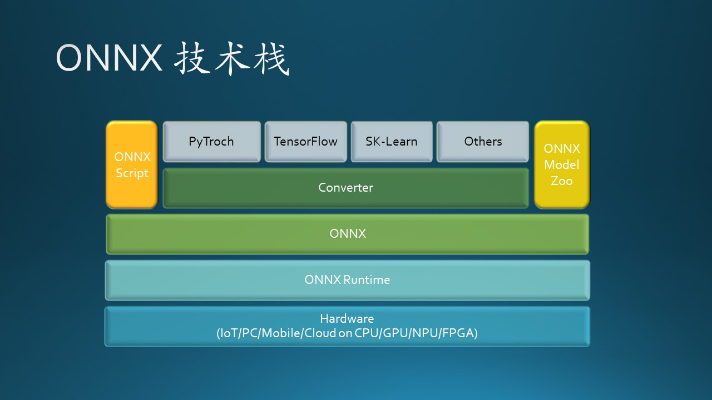
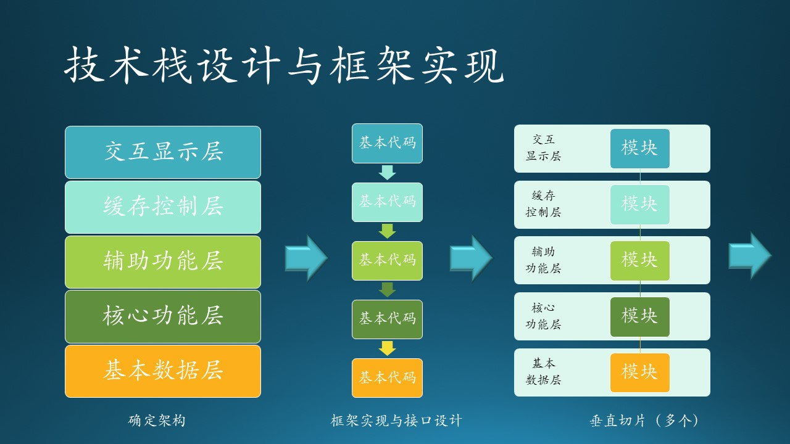
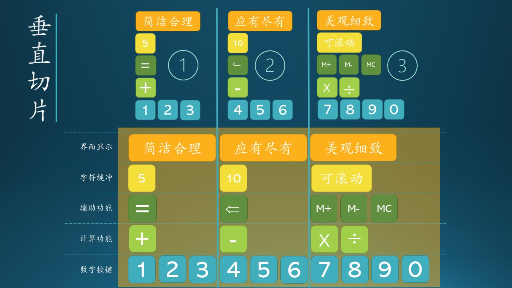

## 5.6 中大型系统的开发流程

### 5.6.1 项目 D

ONNX Converter。



图 5.6.1 ONNX 技术栈

#### 项目规模

这一次的项目个大家伙：ONNX 其实是一个产品，全部的开发人员大概有 200 多人。木头参与的是其中一个子项目 ONNX Converter，算是中等项目吧。一个 dev manager，没有 tech lead，10 几个 dev，而且分布在美国东西部、法国、中国等四个办公地点。

#### 项目背景

ONNX（Open Neural Network Exchange）开源项目，开放的神经网络模型交换格式。作为框架共用的一种模型交换格式，使用 protobuf 二进制格式来序列化模型，可以提供更好的传输性能我们可能会在某一任务中将 Pytorch 或者 TensorFlow 模型转化为 ONNX 模型(ONNX 模型一般用于中间部署阶段)，然后再拿转化后的 ONNX 模型进而转化为我们使用不同框架部署需要的类型，ONNX 相当于一个翻译的作用。

在微软，所有训练出来的模型，最后都会用 ONNX 格式做线上推理，以简化环境部署，提高推理速度。

#### 要解决的问题

用户使用各种深度学习框架搭建的模型，互相之间不能互相转换，而且各个框架着重于训练，而在推理方面则速度较慢。ONNX 作为模型推理平台，可以提升速度，简化环境部署依赖。

木头负责其中的 Scikit-Learn 模型到 ONNX 模型的 converter 的维护，也接触了 PyTorch 模型到 ONNX 模型的 converter。还有人负责 TensorFlow 模型到 ONNX 的 converter。主要框架早已经搭建好了，但是在用户使用过程中会发现不少 bug，以 GitHub issue 的形式记录下来，大家认领属于自己领域的 bug 去修复，而这些 bug 绝大多数是前面的开发者遗留下来的。

#### 关于例会

Dev manager 在美国，每周一下午（中国时间是周二早晨）开例会，有美国人（分布在东部和西部两个时区）、印度人、中国人、法国人，大家用英语，每个人简单说一下自己在干什么，而且要有 GitHub issue 或者 PR 的 link 来证明。

#### 开发流程

- 每半年会重新调整一下工作重点。

- 在这半年中，至少会有 2 次 milestone（里程碑），用于把积累的功能发布为新版本。

- 每周写一次汇报，内容是：上周做了什么，遇到什么困难，本周打算做什么。

- 除了 dev 自己找任务外，Dev manager 也会根据每个人的 workload 分配一些任务。

- 每周例会时，先是很快地 sync 完进度，然后会有一个人（轮班制）讲他是如何解决一个问题的经历，供大家学习参考。

- 代码评审都是找与自己同时区的 dev 来做，避免跨洋交流。至少有一个人做了 code review 并 approve 后才能 check in 代码。

- 有已经搭建好的 CI Pipeline，里面有大量的 UnitTest，每次 check in 代码必须经过 pipeline 的检验，所有 test case 都通过了才能继续。

#### 项目分析

从用户需求上看：

- 这个需求也是需要一种战略性的眼光才能发现的，弥补了微软在 AI Framework 方面的缺憾。

- 在满足了推理方面的需求后，可以向模型训练和优化方向扩展。ONNX Model Zoo 可以提供常用的神经网络模型。

- 在可以训练模型后，可以使用 ONNX Script 来作为 Python 的前端，直接手写自定义模型，这样微软就相当于有了自己的深度学习框架的前端，从而与 PyTorch/TensorFlow 媲美。

从开发流程上看：

- 这是一个维护型项目，框架已经定型，主要的任务是解决 bug，提高 user experience。
- 团队人员分布比较散，没有明确的进度要求，工作全靠自觉。
- 半年一次方向性调整是对的，这种体量和性质的项目，不能像项目 C 那样频繁操作，所以团队流程是正确的。
- 每周一次的 sync 频率也是对的，因为大家时区不同，任务的复杂度也是需要3-5天左右才能完成。
- 在初期采用瀑布式开发，搭建图 5.6.1 中所示的技术栈的各个层面。在中期采用版本升级的方式，不断地添加新的运算符（Operator）和新的平台/硬件支持。
- 每次的 milestone 大概为三个月，符合这个体量的产品的特点，因为用户也不想总跟着升级。
- CI Pipeline 保证了分散开发的灵活性与可靠性。


#### 最终结果

- 现在这个项目还在处于发展与维护阶段，解决了用户的大量典型问题，并不断地增加新的组件，让 ONNX 更好用。

### 5.6.2 中大型系统的开发流程

面对中大型软件，不可能采用敏捷开发流程，

- 结构复杂，不可能在短期内有大的变动来支持新功能，这种变化大概半年发生一次。
- 功能繁杂，不可能因为新增加了一个局部功能就发布一个版本。
- 团队庞大，人员众多，需要团队间的同步合作，不可能以快节奏前进。
- 用户多为商业用户，而非个人用户，不会经常升级基本支撑软件，避免带来风险。

而且要有不同团队直接的合作，所以工作步骤与小型软件完全不同。基本步骤如下：

#### 确定架构

如图 5.6.2 左子图所示，经过系统分析后，架构师认为应该把系统的技术栈分成以下五层：

- 交互显示层
- 缓存控制层
- 辅助功能层
- 核心功能层
- 基本数据层

并且有了相应的原型代码来验证其可行性。



图 5.6.2 中大型系统的开发流程最佳实践

#### 框架实现与接口设计

如图 5.6.2 中子图所示。

- 首先把各个层的基本框架代码写好，可以不做具体实现；
- 然后定义相邻两层之间的接口，可以先按照做原型程序的步骤实现一两个接口。

面向接口的设计可以实现契约式设计，每一层只需要关心对上层提供的接口和需要调用的底层接口。

#### 垂直切片

如图 5.6.2 右子图所示。

- 选择一个功能，依次在技术栈的五个层内做具体的模块实现，并根据实际需要随时调整框架和接口的设计。
- 必要的模块实现好后，把它们从上到下串起来，应该可以形成一个完整的功能。

在做垂直切片的实现时，可以考虑使用大粒度的敏捷开发流程。

#### 后续步骤

重复“垂直切片”的步骤，逐步增加功能。

在开发新的垂直切片功能时，需要注意以前的模块是否可以复用。如果需要修改，切记要经过充分测试，不要破坏已有的垂直切片的功能。

每一块垂直切片就相当于一块电池板，有正负极，有外壳容器，有化学反应剂等等。如果只有一块电池的话，可以提供 12V + 1A 的直流电功率。当电池逐渐多起来时，根据串并联方式，放到一个大盒子（框架）内固定，可以提供更高的电压或更大的电流，整个电池组的输出功率就提高了。

### 5.6.3 举例

我们仍然用计算器应用这个简单的例子来做说明，并假设它是一个非常复杂的软件，每增加一个按键、一个功能、一个显示字符都很花时间。



图 5.6.3 中大型系统中的垂直切片

如图 5.6.3 所示，其中：
- 上半部分圆圈内的数字 1,2,3 表示三个阶段的垂直切片的实现。
- 两条竖线严格分开了代表垂直切片的三个阶段的实现功能集。
- 下半部分暗色的矩形内的功能是最终要实现的功能全集。
- 下面的五条横向虚线代表了该系统的技术栈的五层，在表 5.6.1 中描述。

表 5.6.1 垂直切片内容表

|技术栈|第一阶段<br>（简易加法计算器）|第二阶段<br>（加减法计算器）|第三阶段<br>（四则运算计算器）|
|--|--|--|--|
|界面显示|简洁合理|应有尽有|美观细致|
|字符缓存|只能显示5个字符|能显示10个字符|可以显示任意多字符，横向滚动|
|辅助功能|等号|等号、删除|等号、删除、M+、M-、MC|
|计算功能|加|加、减|加、减、乘、除|
|数字按键|123|123456|1234567890|


技术栈一共有五层：

- 界面显示

    即最终用户可以看到的界面，包括各个界面元素的颜色、尺寸、线宽、间距、位置等等，这些都需要 Designer 的精心设计。
    举个例子，0~9 这 10 个按键在界面上应该如何排列？想当年贝尔实验室设计电话按键时，其实排在第一位的按键布局是下面这个：
    ```
    1 2 3 4 5
    6 7 8 9 0
    ```
    但是太宽了，所以最终设计成这样：
    ```
    1 2 3
    4 5 6
    7 8 9
      0
    ```
    原因是最初人们在公共电话亭站着打电话时，“1 2 3”距离人的视线较近。但是计算器的键盘设计却都是相反的：
    ```
    7 8 9
    4 5 6
    1 2 3
      0
    ```
    原因相同：人们坐着按计算器时，“1 2 3”距离人的视线较近。

- 字符缓冲

    即可以在输出区域显示的字符数量，这涉及到输出缓冲区的设计，及界面的设计。缓冲区的大小不是什么问题，因为计算机的内存足够大。但是如果界面输出框宽度为 8 厘米，字号为 24pt 时只能有 10 个左右的字符可以显示。

- 辅助功能

    包括等号键、回退删除键、存储加键、存储减键，存储清空键。

- 计算功能

    包括“加、减、乘、除”四种操作。当然对于复杂的计算器来说，还会有指数、对数、乘方、开方等操作符，可以在后期继续增加垂直切片。

- 数字按键

    从 0 到 9 的按键输入，属于输入功能界定，并非指的这 10 个按键如何在界面上呈现。更加复杂的功能是可以输入二进制或十六进制的数字。

#### 第一阶段：简易加法计算器

- 数字按键只支持“1,2,3”；
- 计算功能只支持“加法”；
- 辅助功能只有“等号”；
- 显示字符数量最多 5 个；
- 界面显示以“简洁合理”即可。

这个计算器可以给学龄前儿童使用，用于数学启蒙教育。

#### 第二阶段：加减法计算器

- 增加数字按键支持“4,5,6”；
- 增加计算功能“减法”；
- 增加辅助功能“回退删除”；
- 显示字符数量最多 10 个；
- 界面显示可以做到“应有尽有”。

这个计算器可以小学一年级学生使用。如果数字键增加到 “7,8,9,0”，就可以给任何只需要用到加减法的人使用。

#### 第三阶段：四则运算计算器

- 增加数字按键支持“7,8,9,0”；
- 增加计算功能“乘法,除法”；
- 增加辅助功能“M+,M-,MC”；
- 显示字符可以滚动；
- 界面显示“美观细致”。

至此，设计的功能全都实现了。这个计算器可以给会计、销售等行业人员使用。

好处：

1. 尽快出原型产品交付给用户并得到反馈，避免到了最后阶段才发现需求分析阶段出现的偏差。可以说是一种保险措施。

2. 每个开发周期都有明确的、可以实现的目标，做了这种任务分解后，开发进程变得清晰可控。对于负责技术栈中的各个层的软件工程师来说，每个开发周期只集中精力在一个功能上，其它时间可以用于框架优化，也有助于提高产品质量。

3. 验证各层之间的接口设计是否合理，可扩充性是否好。当然在产出第一个原型时，需要先把系统的基本框架搭建好，这需要花一定的时间。通常框架搭建的时间是构建整个产品的总时间的十分之一到五分之一，如果框架设计的好，接口制定得合理，后续的功能实现会非常的容易。

