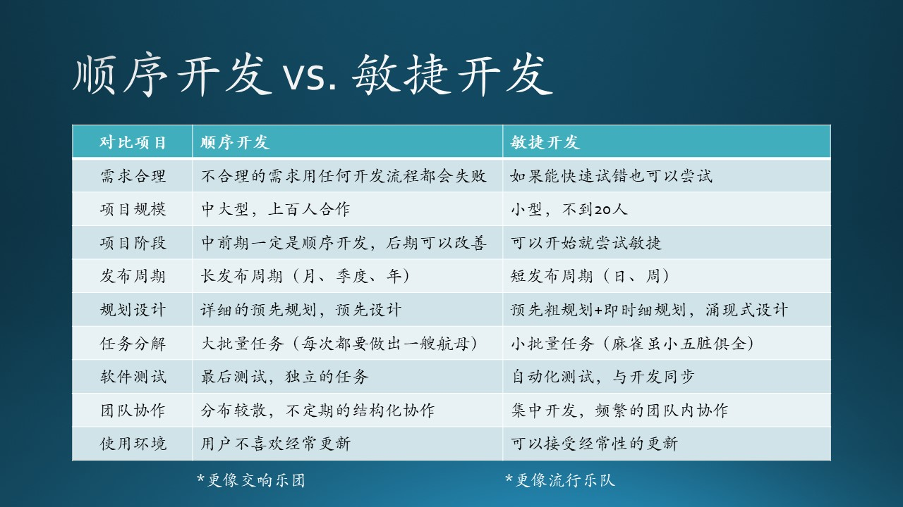
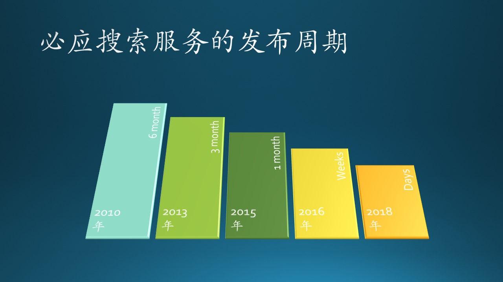
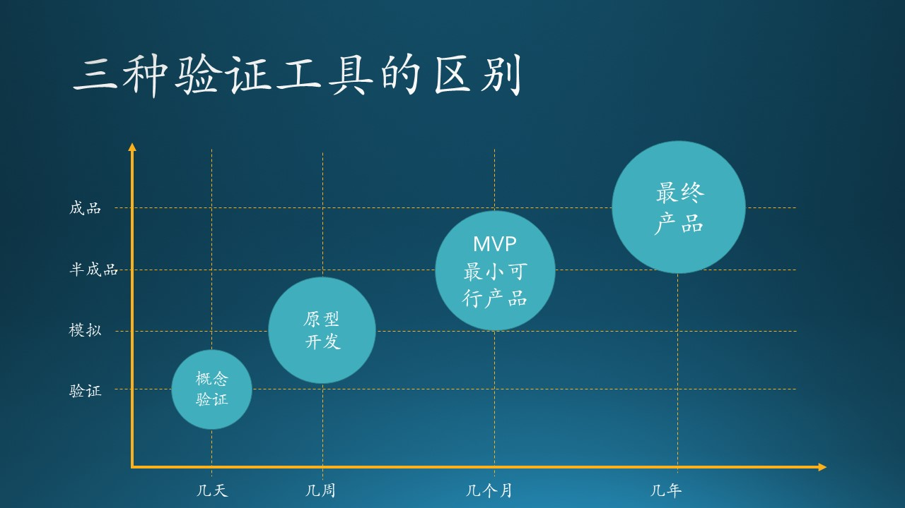
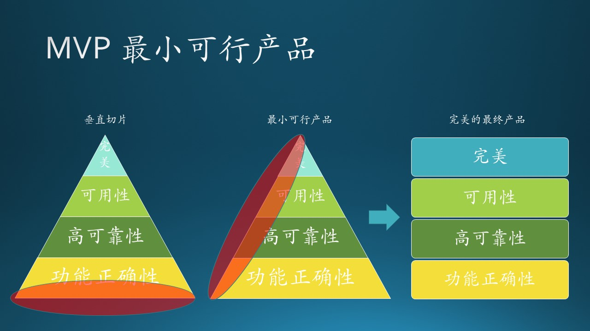

## 5.7 开发流程与验证工具的选择

### 5.7.1 采用合理的开发流程

#### 顺序开发与敏捷开发的对比

在前面的各节中我们看到，即使是在微软，也会有多种形式的团队流程。原因多种多样，在图 5.7.1 中用表格形式比较了选择传统的顺序开发流程（瀑布模式）和敏捷开发流程的条件。

顺序开发更像是一个交响乐团，需要严密的组织、严格的排练，而敏捷开发更像一个流行乐队，有时候甚至没有谱子，在排练中找感觉，随时调整编曲中的细节。

图 5.7.1 选择不同开发流程的条件

1. 需求合理性

   从 4.3.节的故事中，可以看到伪需求是在浪费大家的时间，真正的需求不是臆想出来的，真正的产品也必须是从广泛的用户需求中建模得到的。

2. 项目规模

   中大型系统很少采用敏捷方式，至少在中前期一定是顺序开发模式。

3. 项目阶段

   中大型系统到后期时可以采用敏捷模式，而小型软件从一开始就可以采用敏捷模式。

4. 发布周期

   面向企业的商业软件通常需要较长的发布周期，而面向个人用户的工具类软件可以采用较短的发布周期，当然需要生态环境（如应用商店）的支持，此时可以采用敏捷模式。

5. 规划设计

   预先规划和设计在两种模式中都需要做，只是粒度不同。前者是事无巨细，后者是适可而止。

6. 任务分解

   以制造航母为例，缺乏任何一个功能，都可能导致攻击能力或防御能力降低，此时，虽然可以做任务分解，但是不能小批量交付。而是用敏捷开发，每次交付可以制造出一只小麻雀，愤怒地去攻击猪头。
   另外，任务还有先后顺序，航母上的动力系统肯定需要先期完成，武器系统后期再安装，反过来的话无法安装。

7. 软件测试

   中大型系统的测试难点在后期的集成测试阶段。而无论是顺序开发还是敏捷开发，在前期都是要做好自动化测试机制的，以完成单元测试。

8. 团队协作

   地理位置上分布较散的团队，如果职能单一，就不适合做敏捷开发，因为局部敏捷是无效的。

9. 使用环境

   对于用户不喜欢经常更新的使用环境，比如操作系统和办公软件，就不应该使用敏捷方式，避免出现用户正在给领导做幻灯片演示时，忽然遭遇操作系统升级的尴尬场面。

#### 中大型软件中的敏捷

那么，是不是中大型软件就不能使用敏捷开发的思想呢？不是！以必应搜索服务为例，这是一个超大型的项目，最多时有 3000 多人合作开发：

- 2010 年，从 Live Search 改名为 Bing 后，发布周期是 6 个月；
- 3 年后，缩减到 3 个月整体发布一次；
- 再过两年，缩短到 1 个月整体发布一次；
- 质的变化发生在 2016 年，不再整体发布了，而是每个 feature team 可以自主发布，最短周期可以是星期。
- 到了 2018 年，随着系统的成熟，完全取消了发布限制，每个 feature team 可以随时发布新功能。

图 5.7.2 必应搜索服务发布周期的演进

所以，中大型软件想要做到敏捷并非不可能，而是需要一些前提条件。

1. 架构合理

   通过理解布鲁克法则和康威定律，在项目初期就要设计出合理的架构，非常鲁棒地将后续的工作彻底拆分成若干个小项目，使之可以并行工作。
   **敏捷和万马奔腾是两回事儿。**

2. 团队成熟

   团队具备专业的管理人员来驱动整个项目的开发进程，而普通团队成员的素质较高，接受过相关的培训。
   **敏捷和血气方刚是两回事儿。**

3. 文档完善

   人多，人员流动大，沟通成本高，所以一些关键性的文档一定要完善，便于所有人能明白上下文。
   **敏捷和心有灵犀是两回事儿。**

4. 时机恰当

   一开始就敏捷，肯定是行不通的。打好基础后，再实行敏捷。
   **敏捷和盲目冒进是两回事儿。**

5. 流程完备

   比如代码审查、单元测试，这些基本的流程可以保证软件质量，在此基础上敏捷才有意义。
   **敏捷和偷工减料是两回事儿。**

6. 工具先进

   好的工具可以帮助团队降低管理的复杂性，减少错误的发生频率。
   **敏捷和吃苦耐劳是两回事儿。**

### 5.7.2 采用合适的验证工具

在开发复杂的软件系统时，尤其是面对一些前所未有的功能时，没有前人的经验可以借鉴，并且没有人可以确定它能做还是不能做。这时就需要一些工具（方法）来帮助人们做快速的验证。经常用到的是：

- 概念验证（PoC，Proof of Concept）
- 原型开发（Prototyping）
- 最小可行产品（MVP，Minimum Viable Product)

其基本概念如图 5.7.3 所示。

图 5.7.3 三种验证工具的示意图

表 5.7.1 三种验证工具的比较

|比较项|概念验证|原型开发|最小可行产品|最终产品|
|--|--|--|--|--|
|生命周期|极短（日）|短（周）|中（月）|长（年）|
|成本|极低|较低|中等|最大|
|形式|简陋的几行代码|代码可沿用到产品|必须是可发布的代码|产品代码|
|发布|不发布，仅内部使用|定向发布后回收|阶段性发布|公开发布|
|作用|验证技术难点|确认用户需求|及时得到反馈|获得最大收益|
|风险控制|技术实现风险|需求理解风险|整体构建风险|需求、技术、人员、时间、过程等各种风险|

#### PoC（Proof of Concept）概念验证

**目标：验证某个想法是否在技术上是可行的。**

PoC 的主要目标是测试这个想法在技术上是否可行，是否值得追求。这不是为了发现用户需要什么，或者是否有解决方案的需求，而是从技术角度来看，是否有可能并且值得追求这个想法。

毕竟，你不想花费大量的时间在一个比你最初期望的要难10倍（而且更昂贵）实现的想法上，所以应该是一次快速的尝试，以开发风险最大的技术假设的测试版，或者只是对现有技术可能性的更深入分析。

比如，想实现的新功能强烈依赖的核心技术是 OCR，而自己临时做一个 OCR 是不可能的，那就需要：

1. 找到现有的商业化 OCR 解决方案去做试验；
2. 多找几个提供商，看看哪一家的识别率更好，价格更低；
3. 有条件的话后期自己做一个，以便降低费用。

概念证明通常不与最终用户共享，而是用作内部工具。

**特点：**
- 极短的生命周期；
- 极低的成本；
- 为后面的原型、MVP 提供参考；
- 内部使用，有时候也可以分享给甲方；
- 帮助估算后期的开发时间；
- 降低尝试去完成一个不可能完成的任务的风险。

#### Prototyping 原型开发

**目标：以最低成本收集早期反馈。**

原型开发方法试图向我们及客户展示产品开发好的样子。以汽车制造举例，PoC 更多地关注“引擎盖下”（用户看不见）部分，但原型设计更多地关注汽车的外观及内饰，即软件的 UX/UI 部分。它的目标是建立一个简单的、实验性的想法模型，以便在实际的产品开发之前测试和验证概念。

几乎任何东西都可以是原型：纸上的线框、数字演示、模仿网站的 PowerPoint 演示等等。尽早获得反馈和发现想法中的漏洞的能力可能是产品成功的决定因素。

有些原型开发也是需要代码的，这些代码可以是粗制乱造的，只要能完成任务即可，当然，也有些代码是可以直接用于最终产品的。

**特点：**
- 较短的生命周期；
- 低成本；
- 集中在朴素的想法实现和界面/交互部分；
- 可以对整个产品做原型，也可以只针对其中的一部分做原型；
- 分享给甲方，可以尽早得到反馈；
- 降低与预期需求不一致的风险。

#### MVP（Minimum Viable Product）最小可行产品

**目标：尽快、廉价地推出产品，验证假设，收集用户反馈，并迭代。**

MVP应用程序开发是关于构建一个产品版本，该版本将在市场上提供，真实用户可以与之交互。

其核心思想是在向最终用户提供价值主张的同时，尽可能少地包含功能，并满足尽可能多的市场需求。

它是关于构建产品的连续循环，然后测量和测试您的假设和猜想是否正确，收集用户的反馈，从中学习并改进产品，然后一次又一次重复。

专注于MVP开发而不是一些成熟的解决方案可以降低交付不需要的产品的风险，并允许您根据市场反应以低成本进行转向。

在真实市场上测试产品总是至关重要的，即使你已经验证了你的原型，主要是因为人们通常不知道他们想要什么，他们只是认为他们知道自己想要什么。

特点：
- 正常的功能开发生命周期；
- 中等成本，大于原型的成本；
- 可以发布到市场面向用户；
- 验证一些局部功能而无需构建整个产品。

MVP 最小可行产品与 4.6 节中讲的“垂直切片”的概念不完全相同：
- 垂直切片，要求**从系统角度看**，为了使得一个功能从上到下可以跑通，而在系统架构的各层提供必要的模块支持。
- MVP 最小可行产品，要求**从用户角度看**，为了使得一个功能令用户满意达到完美标准，而在正确性、可靠性、可用性三个质量维度做出的努力。

所以，最小可行产品是垂直切片的延申。

图 5.7.4 MVP 最小可行产品示意图

在图 5.7.4 中，用金字塔形状列出了 4 层，而其内容分别是：

1. 功能正确性（Functional）
2. 高可靠性（Reliable）
3. 可用性（Usable）
4. 完美（Delightful），用户满意

为什么列出了这四个层次呢？

因为 1,2,3 三个层次都是软件质量的评判标准，虽然在软件工程中还有其它一些质量特性，但是对于最终用户来说，只有这三点是可以明显感受到的。关于质量特性我们在第 6 部分再详细介绍。

首先要求功能正确性，并不是说一次性要提供 10 个功能，而是只提供 2 个功能时，要保证这个 2 个功能是完全可以工作的，从输入、计算到输出，都是符合预期的。

其次是高可靠性，即不分时间地点的多次输入，都可以得到预期的输出。

再次是可用性，即界面友好，用户基本上不需要经过特殊培训就可以使用。用户可以方便地输入，比如当打字不方便时可以用语音输入。并且可以得到明确可见的输出。

前三者都具备的情况下，就可以是令用户满意的完美软件。

垂直切片，如图 5.7.4 中的左子图所示，它强调功能的正确性。

最小可行产品，如图 5.7.4 中的中子图所示，在每个层次上都选取一部分进行打磨雕琢，然后发放给用户，而每个层次上的重要性是根据金字塔的形状由大而小的，可以解释为：
- 一定保证功能正确性；
- 有选择地保证其中一部分功能的可靠性；
- 再选择一两个关键的点来打磨其可用性；
- 看看用户在这一两个点上的用户体验是否满意。

而图 5.7.4 的右子图展示了最终的完美产品，它应该在软件质量的各个特性上都是平衡的，而非金字塔形。

从一定程度上来说，最小可行产品的概念更像是 4.4 节中的小型软件开发流程，所以，从中也可以看到，中大型软件和小型软件的开发流程其实是互通的，可以互相借鉴，或者是最终都可以通过系统分解而归结到小型软件上。
