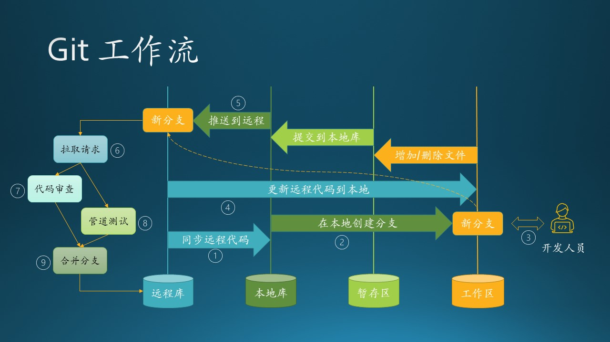
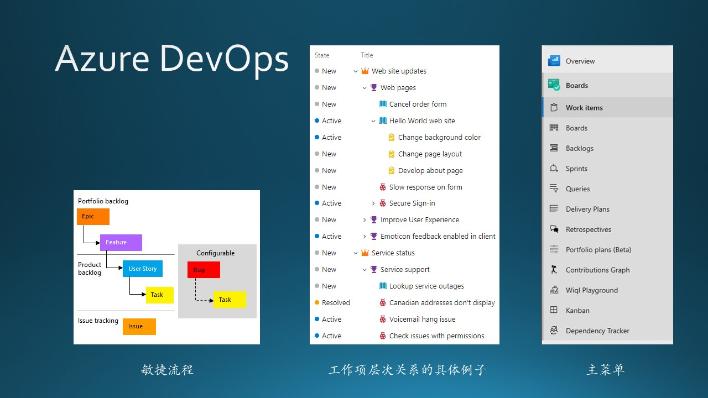
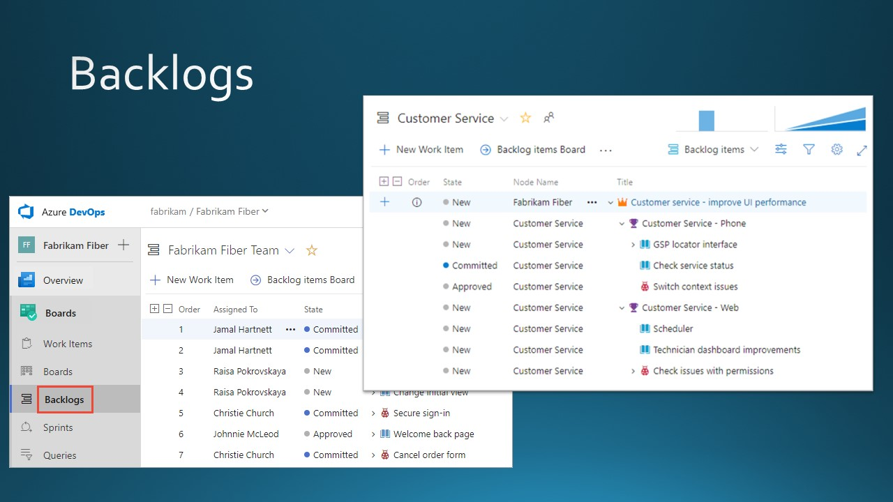
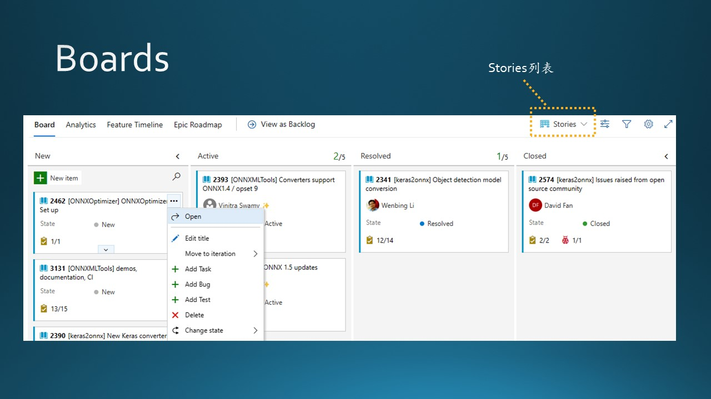
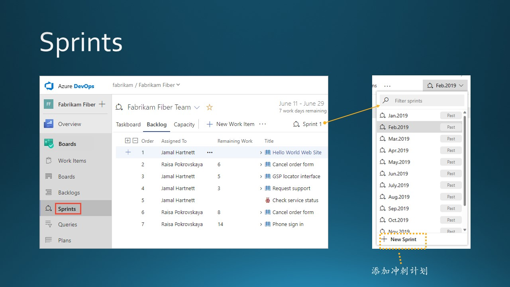
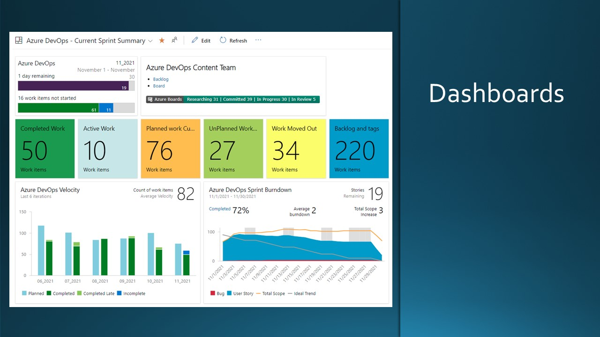

## 5.8 练习 - 代码管理与流程管理工具

### 5.8.1 团队开发流程代码工具

目前 Git 是绝对的代码管理工具首选。刚刚加入团队的开发人员需要对其有基本的了解。

基本概念：
- Remote 远程仓库
  就是类似 github，码云等网站所提供的仓库，可以理解为远程数据交换的仓库。

- Repository 本地仓库
  你执行 git clone 地址，就是把远程仓库克隆到本地仓库。它是一个存放在本地的版本库，其中 HEAD 指向最新放入仓库的版本。当你执行git commit，文件改动就到本地仓库来了。

- Index/Stage 暂存区
  一般存放在 .git 目录下，即 .git/index，它又叫待提交更新区，用于临时存放你未提交的改动。比如，你执行 git add，这些改动就添加到这个区域。

- Workspace 工作区
  你电脑本地看到的文件和目录，在 Git 的版本控制下，构成了工作区。

图 5.8.1 Git 工作流

Git 的使用流程如下：

1. 开发人员将源代码从远程存储库签出到本地存储库；
2. 创建一个新分支；
   - 注意每次一个新的任务开始前，都要创建新分支，避免使用旧分支或者与其它不同任务的代码混在一起，便于管理。
3. 开发：在本地编写、运行和调试你的代码；
   - 在本地搭建一个 OneBox 可以跑通系统的基本流程。如果不得不依赖远程运行环境，将会严重影响你的开发、调试进度。
   - 你的代码应该包括对新写的代码的单元测试。
4. 如果在开发期间，有团队内别的开发者提交了代码，开发人员需要从远程更新代码，避免将来的冲突；
   - 如果有很多人同时开发，这种情况将会经常发生，甚至会影响你在本地修改的代码逻辑。
5. 提交代码本地库保存，然后将其推送到远程存储库；
    - 此时的代码对他人没有任何影响。
    - 可以在另外一台计算机上下载代码并继续完善。
6. 创建一个 PR（Pull Request，拉取请求）以将分支合并到目标分支中；
   - 在一个成熟的团队开发环境中，CI Pipeline 和代码审查机制将会被自动触发。
7. 拉取请求由多个审阅者审阅，可以设置为至少有一个审阅者批准后方可；
   - 更严格的设置可以是至少两个人批准。
   - 如果有反馈意见，你需要解释或在本地解决这些质疑，再次推送到远程，此时不需要建立新的 PR，使用原有的 PR 即可。
8. 自动启动测试管道（CI Pipeline）验证该分支；
   - 如果你的代码不能通过自动单元测试，代码审查者将不会给与批准，因为有可能会 break 现有的逻辑。
9. 如果测试通过并且得到批准，可以合并分支到主分支，完成拉取请求。

在第 6 步中，明明是要把修改的代码合并入主分支（Push），为什么叫拉取请求呢（Pull）？这是相对于主分支说的，是在请求主分支把修改拉进去。

如果是在 Windows/Mac 环境下使用，建议下载 GitHub Desktop 版客户端软件，不需要记忆复杂的 Git 命令，使用鼠标即可轻松完成上述任务。

### 5.8.2 团队开发流程管理工具

在微软一般使用 Azure DevOps 来做开发流程管理工具，只需要用浏览器访问，所有服务都部署在云端。利用这个工具，开发团队可以方便地把本章中所学到的关于开发流程的知识应用到实践中。

主要步骤如下：

#### 1. 选择流程类型

先登录 Azure DevOps 网站，建立团队和项目。

图 5.8.2 项目流程类型与主菜单

一共有四种类型可选：敏捷流程、基本流程、Scrum 流程、CMMI 流程。如果选择“敏捷流程”，则 Backlog 中的层次关系将如图 5.8.2 的左子图所示，具体的例子如中子图所示，而右子图展示了 Azure DevOps 的左边栏的主菜单，我们只关心 Boards 下面的 Boards, Backlogs, Sprints。

#### 2. Backlogs - 创建产品计划

图 5.8.3 待办事项 Backlogs

在 Backlogs 里面，都可以添加以下四种类型的工作项：

- 史诗 Epic
- 特性 Feature
- 用户故事 User Story
- 代码缺陷 Bug

这与图 5.8.2 中左子图的层次关系是对应的。

首先创建 Epic，但是在一个比较小的项目中，也可以没有 Epic，因为整个项目都只为一个 Epic 服务。

其次，创建特性 Feature，有些资料中也称之为功能。特性一般对应系统中的一个子系统。

然后在特性下面创建用户故事 User Story，就是常说的 Scenario（用户场景）。

#### 3. Boards - 添加具体工作内容并管理

图 5.8.4 工作版内容管理 Boards

Backlogs 和 Boards 是可以相互切换显示的，内容一致，只是显示方式不同。Boards 的显示方式如图 5.8.4 所示。

切换到 Stories 列表（相当于最底层的工作项），就可以为每个 User Story 添加具体的任务（Task）、缺陷（Bug）、测试（Test），然后就可以给每个 Task、Bug、Test 分配 owner 了。在 User Story 及以上级别的项中，一般不分配 owner。

Board 中有四列分栏，分别是 New、Active、Resolved、Closed，状态变化后用鼠标把工作项拖到相应的列即可。

#### 4. Sprints - 制定冲刺计划

图 5.8.5 冲刺计划 Sprints

在添加好具体工作内容后，点击 Sprints，就可以开始制定冲刺计划了。最开始时没有任何记录，点击【+New Sprint】按钮添加新计划，然后把工作项赋给每个 Sprint。

#### 5. 其它

- Work items - 工作项
  浏览并可以根据条件快速查找工作项。
- Queries - 查询
  用于定义一组筛选条件来列出工作项，便于与他人共享、执行批量更新或导入/导出操作。
- Delivery Plans - 交付计划
  用于查看团队计划交付的故事或功能的计划。
- Dashboards - 仪表板
  在主菜单的 Overview 下面。

图 5.8.6 仪表板 Dashboards

- Burndown - 燃尽图
  关于燃尽图，几乎所有的资料中都有提及并且建议使用，但是笔者在实际工作中的体会是：这个东西没必要存在。原因如下：
  1. 能够绘制出燃尽图的条件是：每个 task 都需要给出估算时间，这种估算即使是按天估算也是不准确的。而且每个开发人员需要每天更新当前进度，一忙起来就忘记了。
  2. 一个 5-10 人的团队，如果是两周的 Sprint，实际的 task 也没多少，每个人最多两三个。这种短期且粗粒度的统计，没有必要进行。如果具体实践起来，你会发现那个燃尽图根本就不是你想看到的平滑向下，而是有很多断崖。
  3. 如果想显示长期的燃尽图，就需要长期的计划任务及估算，这和敏捷的思想是有矛盾的。
  4. 这东西是给领导看的，对于敏捷团队内部没有多大的指导意义。
