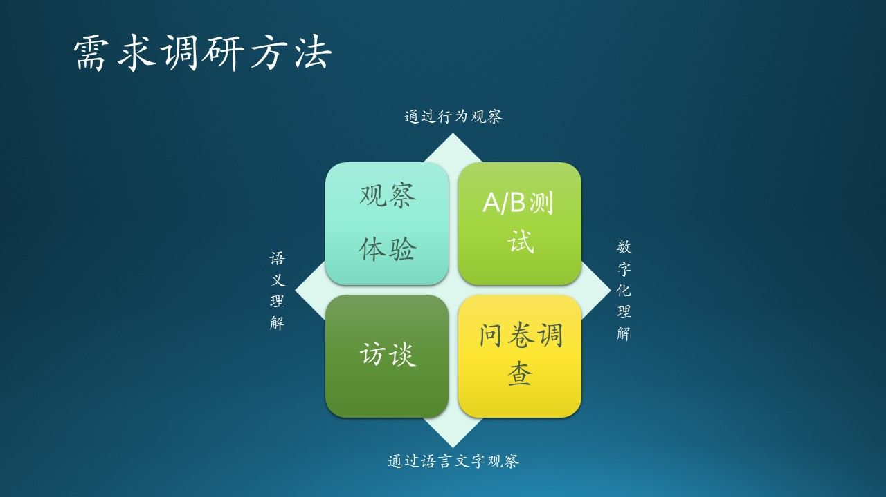
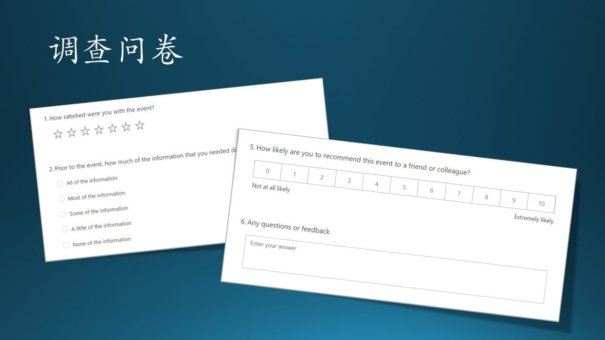
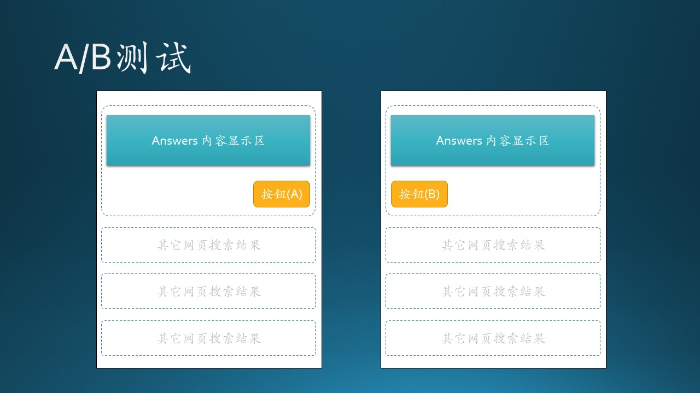

# 5.3 木头与需求调研的故事

## 5.3.1 需求调研方法

图 5.3.1 - 需求调研方法

需求调研有很多种方法，如图 5.3.1 所示。总结起来，不外乎是在两个维度上的组合：
1. 在左右方向上，是靠向内容语义理解，还是靠向量化数字化理解；
2. 在上下方向上，是通过行为观察，还是通过语言文字观察。

常用的方法有：

- 观察法 
  
  现场从旁观察客户工作情况。

- 体验法
  
  现场参与客户的工作流程。

  缺点：很多工作是无法亲自体验的，或者体验的成本特别高。

- 访谈法
  
  与客户进行谈话，了解需求。

- 问卷调查法
  
  事先设计一系列问题，通过纸或电子表格方式，收集客户对问题的答案。

- A/B 测试法

  开发者设想两种解决方案，实现后部署上线，让部分客户（10%左右）去使用。

  缺点：需要事先做技术实现，成本高、周期长。

有一些书上提到的小组讨论法、单据报表分析法、卡片分类法等，不应该算作需求调研范畴，而是需求分析范畴。我们后面会讲到。

下面的木头的故事中描述了观察法、访谈法、问卷调查法、A/B测试法等几种方法。

## 5.3.2 观察法

木头每天坐城铁上下班，城铁上的乘客只有三种状态：

1. 看手机；
2. 闭目养神（可能是在听音乐，木头自己就是这样）；
3. 熟人聊天。

木头好奇第1类人都在手机上做什么事情。经过一段时间的观察，得到了表 5.3.1（样本数从多到少）：

表 5.3.1 - 城铁手机用户行为观察

|排名|使用软件|百分比|
|--|--|--|
|1|微信、QQ 聊天|30%|
|2|看新闻、刷微博|25%|
|3|看小说、视频|20%|
|4|打游戏斗地主|15%|
|5|刷淘宝买衣服|7%|
|6|其它|3%|

其它是一些个别人在背单词、看电子书、看股票大盘的，但是数量极少。

虽然这个例子没有联系到软件开发的需求调研，但是也与手机软件相关的，目的是想说明这种观察是一种基本能力。做这类观察时，我们虽然不会顾虑到有量子观察效应的波函数坍塌，但是也要注意不要打扰到被观察者的行为，不是因为礼貌或者隐私问题，而是因为准确性的问题。

为了解决这个问题，设计界特意制作了一个观察室，里外两间屋子，中间有个大玻璃，单向透光，外侧的设计师能看到里侧的志愿者的行为（主要是鼠标、键盘操作等），当然是要提前让志愿者知情的。

下面是木头亲身体验的另外一个“观察”法的例子。

MSRA 有很多的实习生，招聘、管理实习生是一个很重要的工作内容。木头经常看到邮件如下：

*由于招聘管理的需要，请发送邮件至：xxx@microsoft.com。*

或者是：

*由于评估管理的需要，请发送邮件至：xxx@microsoft.com。*

木头发现，几乎所有的关于实习生管理的邮件，都要发到同一个邮箱。开始时，木头以为 xxx@microsoft.com是一个超级牛的后台应用，直到有一天，木头发现自己发送的邮件被漏掉了（对方没有响应），才意识到这个邮箱后面有一堆人在手工处理邮件。于是木头发邮件给相关的管理者，表达了愿意帮助做一个管理软件的意愿。

从另一个角度看，这些电子邮件其实就是电子化的单据，只不过是通过电子邮件的方式递交而已。这种情况持续了很多年，也让木头感到很困惑，无纸化办公的概念可不是这样的。

这类关于“人”的管理软件其实很复杂，但是木头有过在 Microsoft Power Platform 上的开发经验，那是一个 low code（低代码）平台，只需要很少的努力就可以搭建一个像模像样的流程管理系统。

过了几天，木头收到了邮件回复，说是已经在半年前启动了开发计划，目前已经处于开发尾声了。木头一打听，那个负责管理系统开发的是后面的故事中提到的军儿哥。木头跑到军儿哥那里看了看，实现方式还是传统的网站式管理，没有集成 Power Platform，感觉稍微有些遗憾。

这个例子告诉我们，观察可以通过各种手段，不一定必须观察到行为举止，也可以间接地通过其它信息进行推理。生活工作中处处有线索，只要你用心，总能发现需求。

## 5.3.3 访谈法

微软在北京中关村有两座大厦，南北相望，南侧的是1号楼，北侧的是2号楼。每个楼都有12部电梯，位于大堂东西两侧，各6部。

出于部门安排的一些考虑，1号楼的电梯是分层配置的，1-10层乘坐东侧电梯，11-17层乘坐西侧电梯。而2号楼的电梯就是普通的配置，即可以达到任意楼层。

木头在2号楼工作，感觉平时乘坐电梯时有个痛点：

中午吃饭时，一部电梯里面都“装满”人了，门还是在较低楼层打开了，里面十几双眼睛“怒视”着门外，而电梯外面的人往往是尴尬地摇摇手，去等另外一部电梯。其实最尴尬的不是电梯外的人，而是电梯里面的人，因为在下面较低的楼层，几乎层层都会停。

木头想：应该有“满员”运行的策略呀？于是木头找到了电梯公司的人，进行了面对面的深入访谈。

经了解，电梯的满载质量是1350千克，18人满员，这是按平均每人75公斤计算的。但是，电梯又不是城铁，里面的人不会挤得满满的。为了保证舒适度，木头建议10~12人就算做满员，也就是900公斤左右。

原本以为就是一个软件设置问题，没想到电梯公司的人这样答复：

1. 降低到900公斤，需要减少电梯的配重块重量。
   
   *注：为了让电梯平稳运行，电梯轿厢和配重块是悬挂在一个定滑轮的两侧的，当两侧的重量越接近时，电梯就运行得越平稳，不会忽悠忽悠的。*

2. 需要配模拟负载进行安全测试，即搬来900公斤的铅块放在电梯里。

    *注：不能用真人测试，而且需要12部电梯都做同样的测试，比如调节失控抱死装置的摩擦系数等等，来模拟掉电或失控坠落状态。*

3. 整个大楼调试完毕需要至少两周的时间。

    *注：这就牵涉到费用问题了，负责楼宇管理的大哥当时就苦笑着说：“你们不会又要收费才能做吧？”*

木头听完后也傻了，原来这是一个工程问题，而不是简单地动动鼠标把1350改成900就行！

木头的另外一个痛点是，早晨上班时乘坐电梯，电梯里6个人，其它5个人分别在6、7、8、9、10层下了电梯，木头在11层，只能目送同志们一个一个下了电梯，本来10秒能到达11层，现在变成了30秒，因为电梯的启动和停止需要很长的缓冲时间，同时也会更费电，增加开关门的损耗。

木头的实习生毛毛提出：如果在大堂里放一个楼层选择器，在同一时间段内相同楼层的人就会被分配到同一部电梯；并且，调度系统会知道一共有几个人等候，就会放下足够的电梯数到一层。

木头感觉这简直就是个天才的想法啊，可以申请专利了！访谈时，怀着激动的心情和电梯公司的人说了这个想法，得到了这样的答复：

“这个技术我们已经有了！”

负责楼宇管理的大哥急了：“那赶紧给我装上呀！”

电梯公司：“这个系统需要100万人民币。”

大哥：“......这个投入太大了......”

电梯公司：“现在电梯行业的竞争也是很激烈的，我们卖硬件基本上赚不到什么钱，就靠这种增值服务赚钱了。”

木头：“现在都讲究大数据，能不能给我们开放一些电梯运行数据，用于科学研究？”

电梯公司：“这个我们和德国总部联系过了，总部不同意开放数据。”

访谈法在上面的例子中，并没有得到理想的结果，但是通过访谈，木头知道了行业应用的困难所在。

访谈法，要求双方的沟通能力较强：

1. 客户（甲）方要主动描述清楚需求的关键，而且要用比较通俗的语言讲解给乙方；
2. 软件制作（乙）方需要提前了解甲方的行业、领域背景，主动提出自己的问题。

访谈也不见得必须是面对面的实时沟通，也可以通过电子邮件等方式沟通，这样做的好处是：乙方可以事先设计几个关键性问题（与问卷调查法结合），并且可以进行多轮。

## 5.3.4 问卷调查法

传统的调查问卷都是把问题打印在纸上，发放给用户，用送一支精美的圆珠笔的代价让用户填写，回收后手工统计。

现在很多网站都有电子化的问卷，微软的 Microsoft Forms 更是支持多种表单格式，具有丰富的调查手段，图 5.3.2 举了其中的几个例子：

图 5.3.2 - 调查问卷的样式

- 问题1：一共10颗星代表满意度，用户选择了满意度为7颗星，那么前7颗星高亮。
- 问题2：是一个单项选择。
- 问题3，4：略。
- 问题5：类似满意度，但是选择7后，7会高亮，其它不变。
- 问题6：用户自由填写文字。

用户提交后，后台会自动统计所有问卷结果，对于纯文本型的回答，如问题6，还可以有 NLP 模型进行语义、情感分析。

## 5.3.5 A/B测试法
 
这种方法一般用于网站服务，前提是修改网页的代价较小，一般是页面排版上的微小改变，不能是针对一个非常大的需求变更来实现两种方案，最后抛弃一种实现，那就得不偿失了。

通常情况下，一个客户只会看到一种解决方案，并不知道另外一种解决方案的存在。通过其它一些收集数据的手段，来判断那种解决方案更好，比如页面停留时间、跳转率等等。

木头曾经为必应搜索的前端工作。有一次在做一个展示结构化数据的搜索结果（学名叫做 Answers）时，对于其中的一个按钮的位置是放在结果下方的左侧还是右侧，大家有不同意见，于是使用了A/B测试法。对于前端工程师来说，只是改一下 css，代价不会很大。当然还要记录点击行为，以及在系统中注册 Flight 信息（必应搜索平台用 Flight 方式来实现A/B测试）。

图 5.3.3 - A/B 测试界面

上线一周后，数据下来了：放在左侧（B）会得到更多的用户点击，虽然放在右侧（A）整个版面会好看一些。

