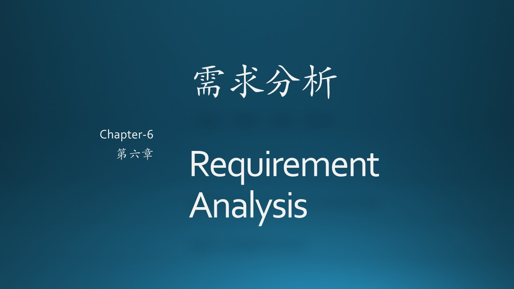
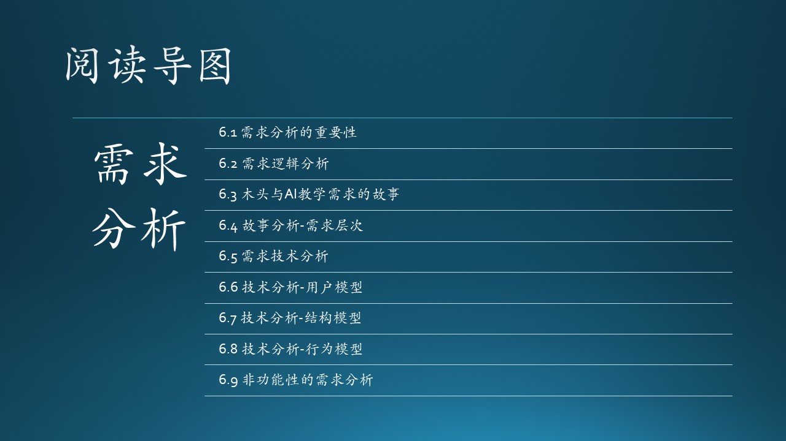

（插入一些说明性文字，重点在介绍上下文，串连）

需求分析解决“做什么”的问题，系统设计解决“怎么做”的问题。

需求调研的任务，就是通过各种方法，根据业务需求获得用户需求。
需求分析的任务，就是通过各种方法，根据用户需求得到行为需求。

这一章我们讲述需求分析的各种方法。

需求分析的准则：

 1. 必须理解和表示问题的信息域，根据这条准则应该建立静态结构模型。
 2. 必须定义软件应完成的功能，这条准则要求建立功能流程模型。
 3. 必须表示作为外部事件结果的软件行为，这条准则要求建立动态行为模型。
 4. 必须对描述信息、功能和行为的模型进行分解，用层次的方式展示细节

从数据角度对现实世界建立信息模型。大型软件较复杂；很难直接对其分析和设计，常借助模型。模型是开发中常用工具，系统包括数据处理、事务管理和决策支持。实质上，也可看成由一系列有序模型构成，其有序模型通常为功能模型、信息模型、数据模型、控制模型和决策模型。有序是指这些模型是分别在系统的不同开发阶段及开发层次一同建立的。建立系统常用的基本工具是E—R图。经过改进后称为信息建模法，后来又发展为语义数据建模方法，并引入了许多面向对象的特点。

需求调研的任务，就是通过各种方法，根据业务需求获得用户需求。
需求分析的任务，就是通过各种方法，根据用户需求得到行为需求。

### 参考资料

- [1] 《软件工程》，清华大学出版社
- [2] 周金根，《软件需求的三个层次》http://www.zhoujingen.cn/itbang/352.html
- [3] 李鸿君，大话软件工程《需求分析与软件设计》，清华大学出版社
- [4] Difference Between Aggregation and Composition, https://techdifferences.com/difference-between-aggregation-and-composition.html
- [5] 杨长春，《实战需求分析》，清华大学出版社
