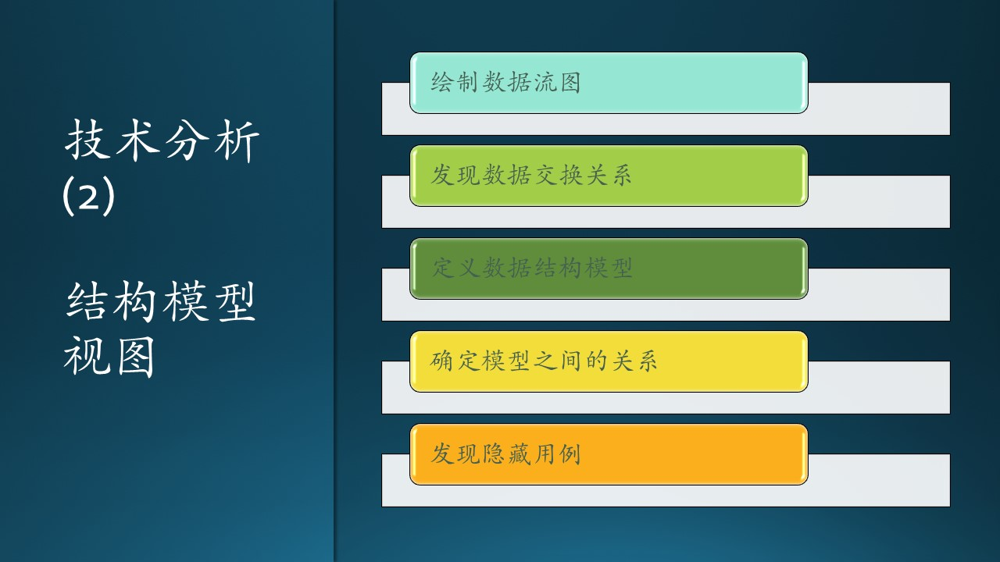
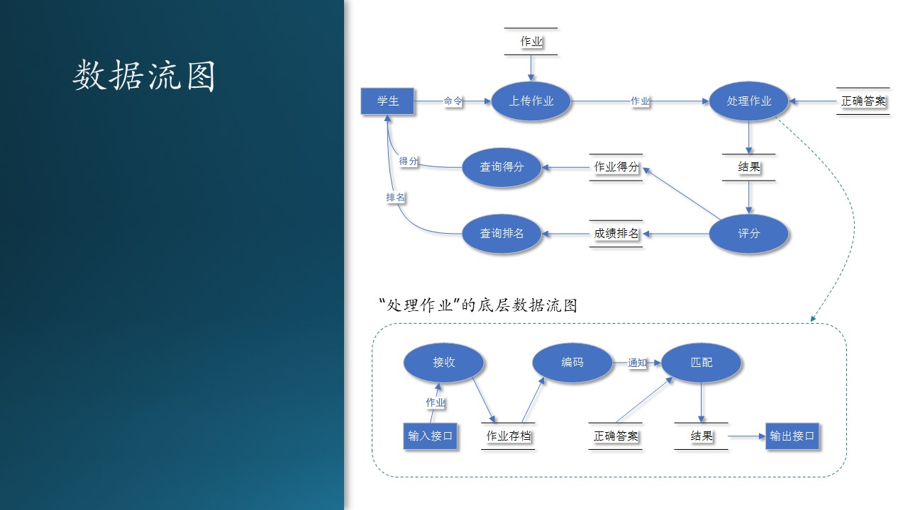
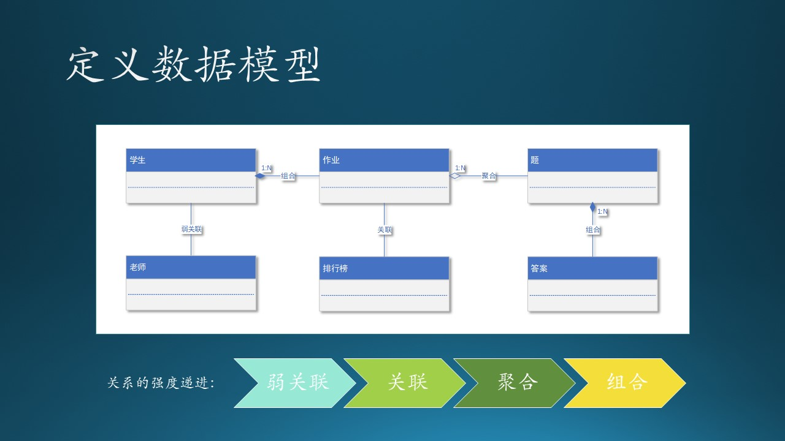

# 6.8 数据流图与结构模型

这是需求分析的第二步，在这一步中，我们要建立“结构模型”。步骤如图6.8.1：

图 6.8.1 - 结构模型

1. 首先通过数据流图把上一阶段的每个用例都串联起来；
2. 发现用例之间的数据交换关系；   
3. 根据这些数据定义数据结构模型；
4. 确定各个模型之间的关系；
5. 发现隐藏用例，以建立功能模块的集合，形成子系统。

## 6.8.1 数据流图

每个系统或功能都会涉及到不同角色、业务概念和物品等，这些事物之间会有很多关系，发生很多事情。特别是当我们刚接触新的业务时，最急迫需要解决的问题就是理清楚这些业务概念以及他们之间的关系。数据流图可以帮助我们做到这一点。

数据流图（DFD，Data Flow Diagram），它从数据传递和加工角度，以图形方式来表达系统的逻辑功能、数据在系统内部的逻辑流向和逻辑变换过程，是结构化系统分析方法的主要表达工具及用于表示软件模型的一种图示方法。

### 作业自动评分的数据流图

我们看看 AI 教育系统的例子中，关于学生作业上传后自动评分的功能是如何实现的，请看图 6.8.2 中的上半部分。

图 6.8.2 - 数据流图

图 6.8.2 中一共有4种图例：

1. 矩形框图，外部交互方，数据的起点或者终点；
2. 椭圆，数据加工逻辑，是对数据进行处理的单元，接收数据、处理、输出，在目前阶段，不需要考虑具体用什么语言、算法、代码来实现；
3. 双边线，数据存储，可以是文件或数据库，在目前阶段，不需要考虑具体用什么设备来存储。
4. 连线，数据流，如果是处于交互方与加工逻辑之间，或者处于两个加工逻辑之间，则在线上有说明，表明是一种内存数据流。箭头表示流动方向。

图中描绘了系统逻辑模型，没有具体的物理元素，只描绘数据信息在系统中流动处理情况。是非常好的软件设计出发点，因为它反应系统的业务逻辑，确定了模块/函数边界。

我们把“上传作业”、“查询得分”、“查询排名”叫做功能（Function），把这三个的组合叫做“自动判作业”的特性（Feature）。

### 底层数据流图

在上图中，名称为“处理作业”的加工逻辑可能很复杂，那就需要进一步细化，绘制下一层的数据流图，如图 6.8.2 的下半部分。

大家可以不必纠结图中的加工逻辑的具体细节，比如为什么要有“编码”这一步骤，只需要理解这种分解形式即可。

再比如，我们确实需要“作业存档”这一存储吗？这也属于细节实现，在具体设计时，再根据“需求”进一步讨论。这里说的“需求”并不是用户需求，而是技术需求，如：系统要求每个上传的作业都需要存档，便于后续做分析模型。

### 小结

画数据流图需要注意的要点：

1. 一个加工的数据不应与输入数据流同名，即使他们的组成成分相同。
2. 保持数据守恒。简单点说，加工处理后的输出数据必须是从加工的输入数据流获得，或者是其产生的数据。
3. 加工必须有输入输出数据流，因为系统不会凭空出现不明数据，这个还是比较好理解的。
4. 所有数据必须由一个外部实体开始，也要从一个外部实体结束。比如图xx中，
5. 外部实体之间不允许存在数据流。
6. 提高数据流图的易懂性。注意合理分解，要把一个加工分解成几个功能相对独立的子加工，这样可以减少加工之间输入、输出数据流的数目，增加数据流图的可理解性。

第5点很有趣，因为会有这样的场景发生：老师训练完一个模型后，用微信通知学生们可以开始推理了。这就是两个外部实体之间存在了数据流，但是，这个数据流（微信）不属于这个系统。我们要想克服这个缺点（即，不使用微信通知），必须给系统增加一个“自动通知”机制：当新模型生成后，系统会自动通过电子邮件、短信等可控方式通知学生们。

我们回忆一下6.6节中的用例图，里面有很多椭圆形的用例，通过名称的对比，我们可以在数据流图中看到同样的椭圆形的“用例”，只不过在这里叫做“加工”。用例图只与外部系统和参与者有关，而数据流图更进一步发掘用例背后的故事，包括逻辑和数据，这样才能形成完整的功能。

数据流图的作用：

1. 数据流图中的数据起点终点，实际上是系统的用户。
2. 数据流图中的加工，就是下一步要设计和编码的模块。
3. 数据流图中的数据，就是下一步要设计的数据库、文件。
4. 数据流中数据源（矩形）与加工（椭圆）的交互，就是下一步要设计的用户界面或者接口。

## 6.8.2 数据模型

“数据流图”的名称本身就非常明确地告诉我们它是着眼于数据的，在画数据流图的时候，一定要仔细考虑实体之间存在的是内存数据流还是外部数据存储，如果是后者，那么就要做进一步的数据模型定义了。

我们仍然用作业自动评分的功能能来举例，分析一下老师、学生、作业、题目、答案、排行榜之间的关系，见图 6.8.4。

图 6.8.4 - 定义数据模型

笔者强烈反对在目前的需求分析阶段就给每个数据实体填上属性（字段），那应该是在设计阶段才完成的事情。所以在图6.6.4中，大家可以看到每个数据实体的属性字段都是空着的。

### “老师”与“学生” - 关联（Association）

- 老师和学生没有强相关关系；
- 一个老师可以有多个学生；
- 一个学生可以有多个老师。

从严格的数据建模问题上看，老师和学生甚至都没有关系。人们通常所说的“师生关系”，实际上是一种社会关系，而我们这个系统不是为“社会学”而开发的。在教育系统的软件中，除了“班主任”这一特殊职务外，老师和学生实际上是通过课程联系在一起的，即：王老师是学生毛毛的数学课老师。

### “学生”与“作业” - 组合（Composition）

- 一个学生可以写很多份作业；
- 一份作业只属于一个学生；
- 没有学生，就没有作业。

以上观点是从实例角度来看的，即，有一个叫毛毛的学生，他写了很多份作业，他和作业之间符合有上述三个描述。

### “作业”与“排行榜” - 关联（Association）

- 作业会得到一个分数，所有的作业的分数按大小排序后，会得到排行榜。所以作业和排行榜是一个关联关系；
- 缺失一个学生的作业，其它学生的作业依然可以形成排行榜；
- 没有排行榜的话，作业依然有它存在的意义。

### “作业”与“题” - 聚合（Aggregation）

- 作业由很多不同的题聚合而成；
- 题可以脱离作业而存在。

### “题”与“答案” - 组合（Composition）

- 一个题目可以有多个答案（当然通常只有一个答案）；
- 答案脱离了题目就没有意义了，必须说“这个答案是那个题目的答案之一，而不是别的题目的答案”。

下面我们专门说说组合和聚合的区别，见表6.8.1：

表6.8.1 - 组合和聚合的区别$^{[4]}$

|比较项目|聚合 Aggregation|组合 Composition|
|--|--|--|
|存在|从类独立地存在于主类之外|从类不能独立存在|
|关系|has-a，主类中有一个从类|part-of, contains-a，从类是主类的一部分|
|程度|弱|强|
|图例|空心菱形|实心菱形|
|功能|删除主类不会影响从类|删除主类，从类将无从依靠|
|举例|汽车 vs 轮子和发动机、雁群 vs 大雁|人 vs 大脑和身体，树 vs 树叶|

## 6.8.3 结构模型

模块划分，层级划分

图 6.8.5 - 定义数据模型

