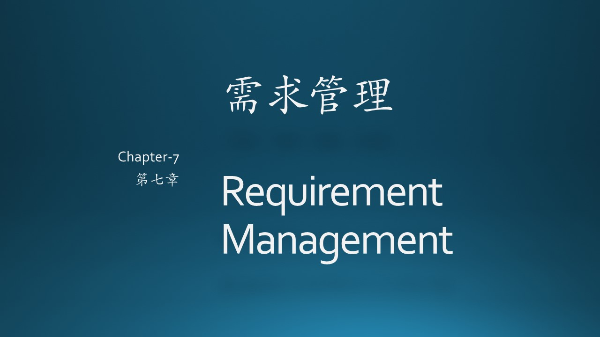
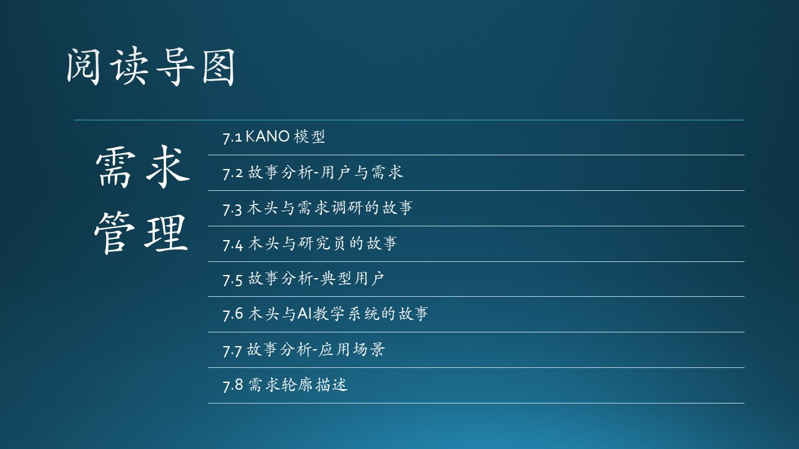

### 参考资料

- [1] KANO用户满意度模型 https://en.wikipedia.org/wiki/Kano_model
- [2] KANO分析模型 https://baike.baidu.com/item/KANO%20%E6%A8%A1%E5%9E%8B/19907824
- [3] https://www.jianshu.com/p/9fa5abc666f7
- [4] https://www.zhihu.com/question/27855883/answer/133766533
- [5] 马斯洛理论 https://www.simplypsychology.org/maslow.html
- [6] 百度百科《今日头条》https://baike.baidu.com/item/%E4%BB%8A%E6%97%A5%E5%A4%B4%E6%9D%A1/4169373
- [7] 《构建之法》，邹欣，人民邮电出版社
- [8] 《刷新》，萨提亚·纳德拉
- [9] 王佳亮，http://www.woshipm.com/pmd/4196067.html
