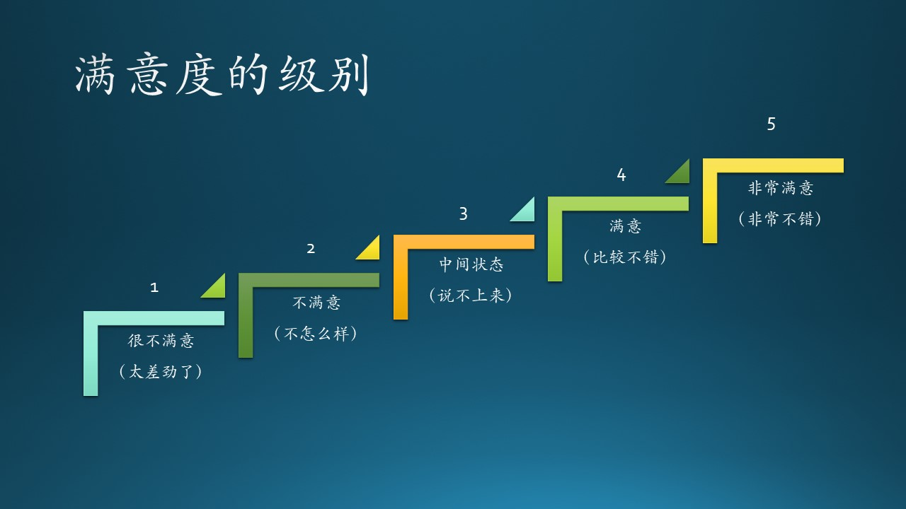
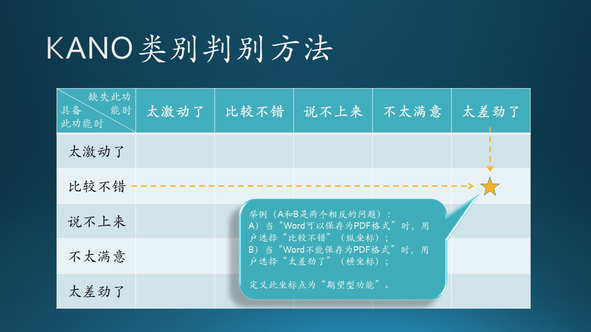
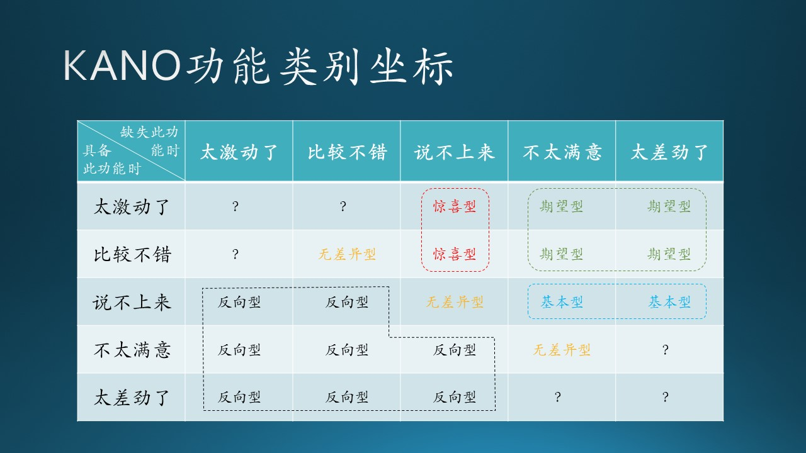
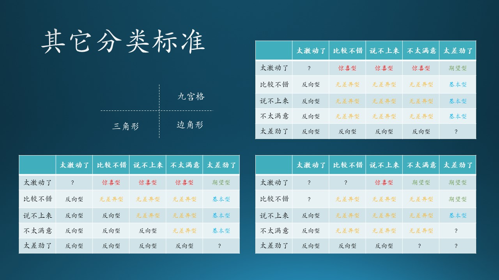
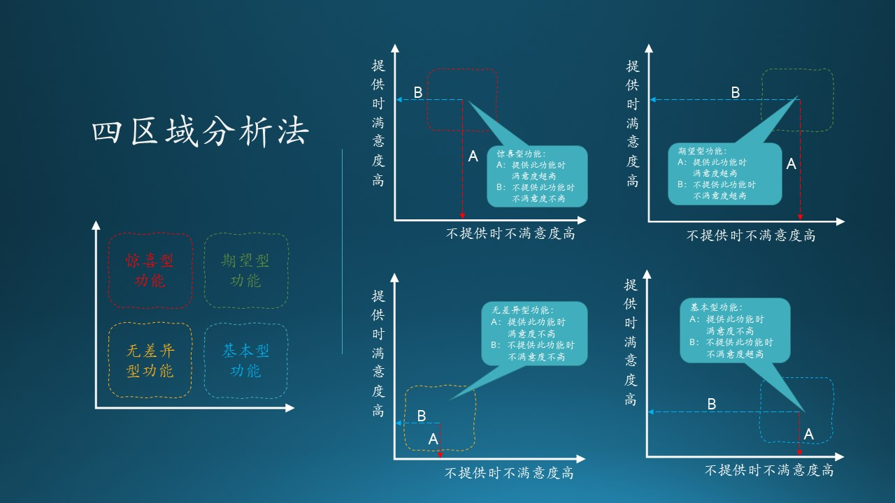

# 7.2 满意度分析

## 7.2.1 用户满意度的五种级别

对任何事物的好坏的判断，用户的态度一般不是非此即彼的0/1问题，而是有一个过渡。在微软面试中，要求面试官给“Hire”或“No hire”，但有时候太难选择了，所以会出现一个“Weak hire”的选择，尽管不是官方要求的。

由于笔者喜欢流行音乐（还在微软内部组建了一支乐队），所以经常看一些音乐节目，如《歌手》、《乐队的夏天》。节目组通常让普通观众选择“是否喜欢一个歌手或一支乐队”，其实这非常的不合理。观众并非总是理智的，往往凭借一些非常奇怪的原因决定“喜欢”还是“不喜欢”，比如“我不喜欢那个贝斯手的发型”，这就偏离了比赛的本来用意。

但是另一方面，在《乐队的夏天》中，节目组会给专业乐迷五分制的投票权力。同理，在调查用户的满意度时，一般也会使用五种级别作为一个平滑过渡的设计。图 7.2.1 就是五种级别和对应的口语化形象描述。

图 7.2.1 - 满意度级别

在使用 KANO 模型时，一般采用调查问卷的形式，即正反两个方向的问题：

- 正向问题 A：如果Word可以保存为PDF格式，用户的感觉是什么？
- 反向问题 B：如果Word不能保存为PDF格式，用户的感觉是什么？

我们在表 7.2.1 中记录下这两个问题的答案，一个是第 2 行，一个是第 5 行。

表 7.2.1 - A/B 两个问题的答案

|级别|描述|正向问题 A|反向问题 B|
|:--:|--|:--:|:--:|
|1|太激动了||
|2|比较不错|$\sqrt{}$|
|3|说不上来||
|4|不怎么样||
|5|太差劲了||$\sqrt{}$|

然后我们在图 7.2.2 中的坐标（2，5）做一个标记，表示问题 A 和问题 B 的交点位置。

图 7.2.2 - KANO 模型中的类别判别方法

## 7.2.2 定性分析

再进一步，通过对问题 A 和 B 的分析，结合上一节所述的产品的五类功能，我们认为“Word 可以保存为 PDF 格式”这个功能是一个期望型功能。这样，就可以得到一个功能的分类了。

为什么定位为“期望型”功能呢？我们看看“期望型”功能的定义：

*也称为意愿型功能，是指用户的满意状况与功能的满足程度成比例关系的功能，此类功能得到满足或表现良好的话，用户满意度会显著增加。当此类功能得不到满足或表现不好的话，用户的不满也会显著增加。*

再看一下本例：

- 问题 A 的用户反馈是“比较不错”，即“此类功能得到满足或表现良好的话，用户满意度会显著增加”；

- 问题 B 的用户反馈是“太差劲了”，即“当此类功能得不到满足或表现不好的话，用户的不满也会显著增加”。

正反两个方面的回答完全符合期望型功能的定义。

通过对不同的问题得到的交点位置做分析，我们可以得到图 7.2.3 中所有25个交点所属的功能分类。

图 7.2.3 - 功能类别坐标

可以看到：
- 中间有两个红色的“惊喜型”；
- 右上角是绿色的“期望型”；
- 右侧有两个蓝色的“基本型”；
- 对角线上有三个黄色的“无差异型”；
- 左下角是一堆“反向型”。

以此方法，我们就得出了每个功能所属的分类。

还有几个问号所处的位置，是不可能出现的分类。比如左上角的那个问号，相当于问：
- A) 如果有功能F，用户满意吗？用户答“太激动了”；
- B) 如果没有功能F，用户满意吗？用户答“太激动了”。

从逻辑上分析，如果问题A得到肯定的回答，那么不可能也会对问题B有肯定的回答。其它几个问号都是类似的情况。

不同的人对图中交叉点的位置所属的类型持有不同的观点，见图 7.2.4。

图 7.2.4 - 其它分类标准

## 7.2.3 定量分析

KANO 图还可以有定量分析，但是需要大量的调查问卷数据，比较难以实现，所以我们在此只是讲解一下定量分析的结论：四区域分类法。至于定量分析的过程，有兴趣的同学可以参考相应的资料$^{[2]}$。

关于“四区域分类法”，在很多资料中，包括笔者给的参考资料中，有的写四象限法，有的写四分位法，这都是错误的命名。我们先解释四区域法的分析过程，后面再说上面两种叫法为什么是错误的。

笔者发现，即使不计算 better-worse 系数$^{[2]}$，也可以得到同样的结果：在图 7.2.3 中，各个区域有明显的分割线：

- 首先，我们不考虑问号的情况，因为它无意义；
- 其次，我们不考虑反向型的功能，因为它比较容易分辨；
- 在惊喜型和期望型之间，有一条竖的分割线；
- 在期望型和基本型之间，有一条横的分割线；
- 把无差异型的范围稍微缩小一些。

然后我们可以得到一个四部分的区域图，如图 7.2.5所示。

图 7.2.5 - 四区域法

四个图中的坐标轴的含义是相同的：

- 横坐标：不提供某个功能时，用户会的不满意程度，从左到右增加，用线 B 的长度表示；
- 纵坐标：提供某个功能时，用户的满意程度，从下到上增加，用线 A 的长度表示。

### 惊喜型功能

处于左上角的区域。

- 当提供此功能时，A 的长度显著增加，表示满意度剧增；
- 当不提供此功能时，B 的长度没有显著增加，表示没有很大的不满意。

### 期望型功能

处于右上角的区域。

- 当提供此功能时，A 的长度显著增加，表示很满意；
- 当不提供此功能时，B 的长度显著增加，表示很不满意。

### 基础型功能

处于右下角的区域。

- 当提供此功能时，A 的长度没有显著增加，表示满意度不高；
- 当不提供此功能时，B 的显著增加，表示有很大的不满意。
  
### 无差异功能

处于左下角的区域。

- 当提供此功能时，A 的长度没有显著增加，表示满意度不高；
- 当不提供此功能时，B 的长度没有显著增加，表示没有很大的不满意。

我们再回过头说说上面提到的两种错误叫法：

- 四象限法：象限是指平面直角坐标系上，由横纵坐标轴所分割的四个区域，以零点为中心。我们所面对的问题虽然是处于平面直角坐标系上，但是零点在左下角，四个区域都是在第一象限。

- 四分位法：四分位是统计学的一个名词，是指处于一维坐标上的数据中，处于25%分位和75%分位的数值。我们所面对的问题是一个二维平面上的分类问题，不能使用四分位的叫法。

