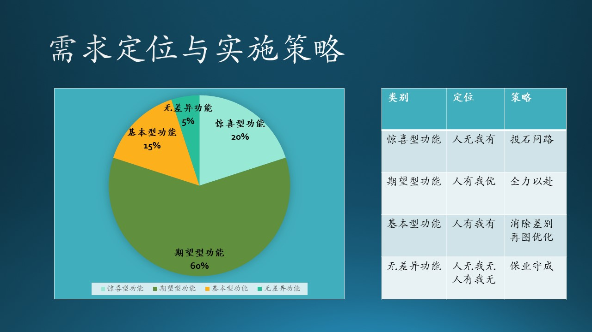
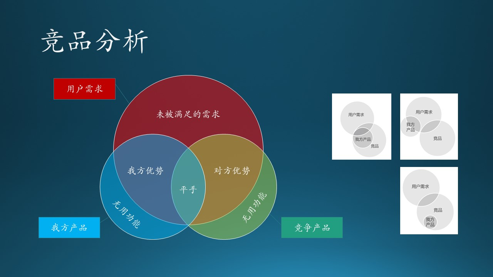
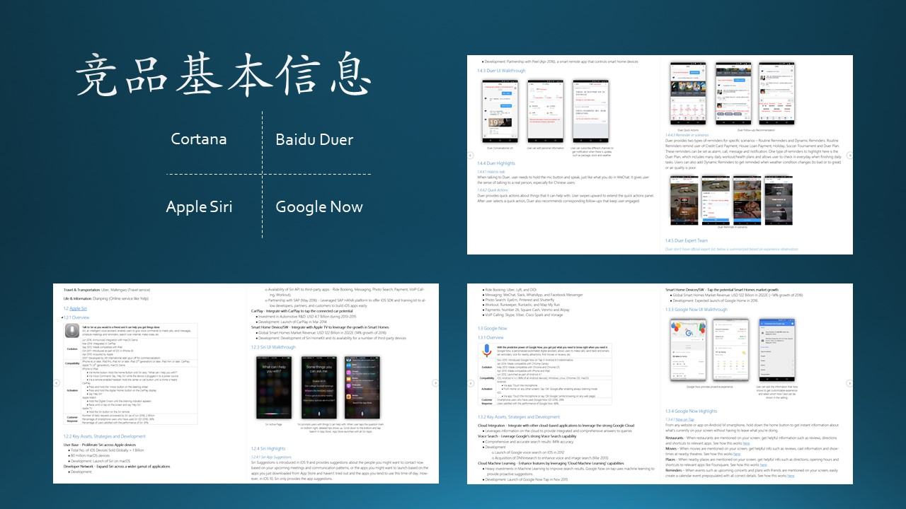
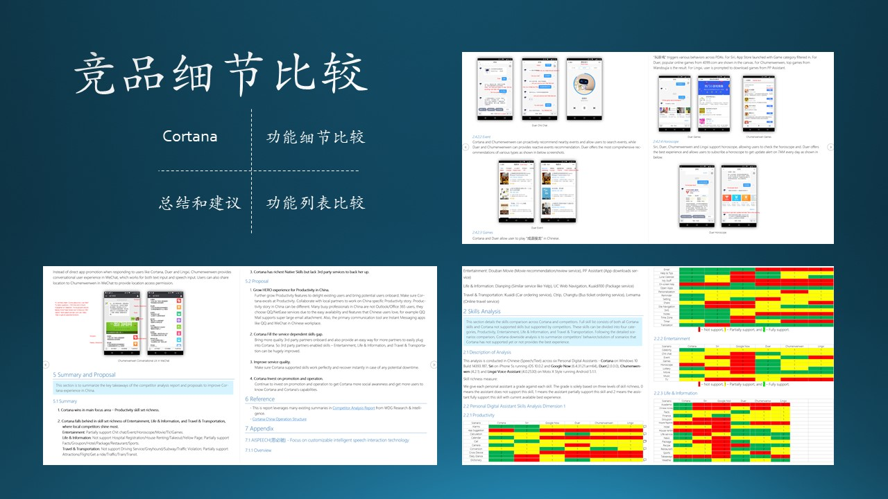

# 7.3 竞争策略

## 7.3.1 定位与实施策略

根据 KANO 模型，我们得到了四个区域的功能划分，这其实和传统的“紧急/重要四象限法则”是同一个道理。

图 7.3.1 - 需求定位与实施策略

### 惊喜型功能

人无我有。

惊喜型功能属于不紧急但重要的。“不紧急”指的是在商业利益上，该类功能目前还不是主力创收来源，但是放眼未来的赢利点，实现差异化优势，它们却是最重要的。

佛教中有个说法叫做“顿悟”，就是忽然发明/发现了一个新功能，但实际上是不可能有顿悟的事件发生的，历史上所有的发明/发现，都是水滴石穿、集腋成裘的结果。宋词中的名句：“崆峒访道至湘湖，万卷诗书看转愚。踏破铁鞋无觅处，得来全不费功夫。” 很多人只看到了“不费功夫”，却没有看到“踏破铁鞋”。

惊喜型功能，是建立在对产品的熟悉、对技术的追求基础上的，厚积薄发，才有可能出现一个突破。比如 Windows Hello face（人脸识别）登录技术，是建立在以下技术基础上的：

- 高分辨率摄像头，并且是双通道，可以识别景深；
- 人脸数字化特征提取技术；
- CPU 的高速计算能力。

可以看到，其中有硬件、软件、算法的多方面结合，才能实现这个功能。

在这类功能上的投入力度建议：20%。

### 期望型功能

人有我优。

期望型功能属于紧急且重要的，这是软件产品的核心竞争力所在，需要花大力气来做，并保持行业领先。

在微软必应搜索产品的开发上，必应团队为了从谷歌的搜索市场中抢到份额，先是经历了痛苦的“基本型”功能的开发，当时讲的最多的一句话就是“fix the gap”，即弥补差距。到了后来，系统逐步完善，也积累了一定的用户量，产品团队改变了关注焦点，口号变成为“钢需、痛点、海量”，即解决用户的真正需求。

钢需、痛点，这两个衡量点都容易理解，“海量”的意思是用户量，由于必应搜索的用户量是千万级别的，所以如果一个功能不能满足百万级别以上的用户，这个功能就不要考虑花资源去做了。

在这类功能上的投入力度建议：60%。

### 基本型功能

人有我有。

基本型功能属于紧急不重要的。不重要不代表不做，而是说赶紧做完后，就不要再费心思考虑它们了。

不同的软件的基本功能都有不同的定义，这主要取决于“业界”的共识，即你的产品和其它竞争对手的产品所共有的功能。如果有新加入的竞争者，它也必须实现这些基础功能才能站稳脚跟。

对于这个类别的功能，我们主要以低成本维持为主，不需要超过竞争对手的品质。比如，Chrome 浏览器可以容纳4096个网页收藏，那么 Edge 浏览器非要容纳8192个网页收藏也没什么意义，因为没有用户需要那么多网页收藏。

在这类功能上的投入力度建议：15%。

### 无差异功能

人有我无或人无我无。

最简单的就是无差异功能了，属于不紧急不重要。

这类功能，如果已经存在了的话，就放在那里不要动了吧，两个原则：

1. 只要它不影响新功能实现，或者说和新功能没有矛盾；
2. 它还能正常工作，不会被某一次的软件更新破坏掉。

这也是满足一些老用户的需要，向后（低版本）兼容。如果通过统计发现使用率太低了，那就可以干脆去掉了。使用率需要通过两方面来衡量：

1. 百分比，比如低于0.01%，即万分之一；
2. 同时，低于一个绝对值，比如每个月仅有100次使用。

这二者缺一不可，因为用户群总数是未知的，千万级的总用户量，即使是万分之一，用户量也还是客观的。如果总用户量少，每个月100次造访使用量（unique user）也是客观的，我们不能丢失掉这100个用户。

在这类功能上的投入力度建议：小于5%。

## 7.3.2 竞品分析

### 目的

做竞品分析的目的有三：

1. 学习领域知识

   在微软，一个刚刚入职的 PM，领导往往让其做一个与本团队相关的产品竞品分析，这对于刚进入一个领域的新手来说，是一个快速学习领域知识的良好途径。

   木头在做手机浏览器时，团队中的一个年轻的 PM 就被分配了一个任务：了解一下市面上所有的手机浏览器，做一个详细的分析。这位兄弟花了两周的时间，列了一张巨大的表格，把一些市场份额较大的品牌都列在里面，如：UC浏览器、QQ浏览器、360浏览器、夸克浏览器、百度浏览器、火狐浏览器、搜狗浏览器，等等。这张表为我们排出上百个功能的优先级起到了很大的参考作用。

2. 寻找功能灵感

   与其闭门造车苦思冥想一个新功能，不如出去走访客户，或使用一下竞争对手的产品，获得些灵感。

   木头在研究如何给必应搜索的广告商实现评分和推荐系统时，自然而然地去研究了一些谷歌的广告系统，一个合作的 PM 在谷歌搜索上注册了一个广告商账号，每月花几个小钱，了解谷歌的评分机制。最后得到的结论很让人失望：谷歌的评分机制是基于规则的静态算法，并没有多么高深。这也和广告商对于这种机制的负面评论相吻合。

   于是木头得到了灵感：我们为必应做一个基于统计的动态算法，可以让最终用户、广告商、必应搜索三方的盈利达到平衡。由于本项目还处于研发初期，一些细节还不方便透露。

3. 监视竞争对手

   一个惊喜型功能刚刚上线两周，其竞争对手也推出了类似的功能，使得惊喜型功能变成了期望型功能。这种竞争关系在国内市场屡见不鲜。软件产品的功能一般没有可以注册专利的点，模仿也不违法，这也迫使产品团队尽量找一些技术门槛高的功能做。

### 方法

有很多模型和理论可以帮助大家做竞品分析，比如波特五力模型、BCG Matrix、STP理论、德尔菲法、5W2H分析法、SWOT等。利用这些分析方法进行全面研究，同时还要依赖于大量的数据，往往都已经上升至一个公司的战略层面。$^{[9]}$

图 7.3.2 - 竞品分析

一种朴素的定性分析方法如图 7.3.2 所示，图中用三个圆示意出了用户需求、我方产品、竞争产品的关系：

- 要发挥的是我方优势
- 要避免的是无用功能
- 要弥补的是未满足的需求
- 要追赶的是对方优势
- 要保持的是平手部分

Cortana 发展到现在已经不是什么秘密了，木头还曾经参与过 Windows Cornata 的开发工作，PM 们也曾经做过竞品分析。当时的竞争对手有Apple Siri、Google Now、Baidu Duer等等。

我们以 Cortana 竞品分析为例，简述一种详细的但是便于理解和操作的方法，可以从以下几个方面着手：

1. 竞品基本信息，包括产品简介、进化过程、应用平台、用户评价、市场份额，等等。如图 7.3.3 所示。

图 7.3.3 - 竞品基本信息

2. 功能列表，一般是取所有竞品的功能合集作为基线，在某竞品的相应列上打勾，表示有此功能。如图 7.3.4 右下角的子图。

图 7.3.4 - 竞品分析

3. 用户界面与交互，列出主要功能的界面，并指出该界面上存在的优缺点，提醒我方产品注意的地方。如图 7.3.4 右上角的子图。

4. 总结和建议，以产品形态、推广方法、竞争策略等为主要内容。如图 7.3.4 左下角的子图。
