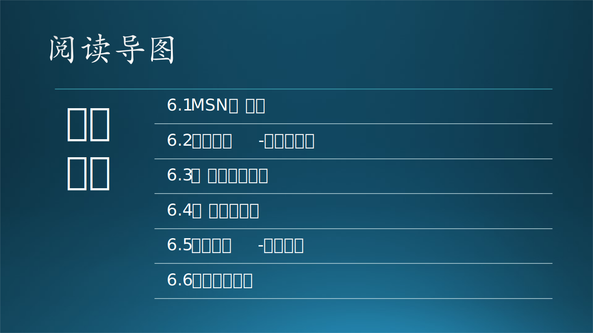

本章中讲述了很多故事：先回顾了 MSN 的兴衰历史，利用这个故事引出了需求的重要性，不尊重用户的需求，那么用户就会用脚投票。然后用研究员的故事讲解了典型用户的概念，接着讲了 AI 课堂教学的故事和应用场景的关系，最后给出了需求轮廓描述的方法。

### 参考资料

- 科技怪人：曾经有一个聊天工具叫MSN，https://mini.eastday.com/a/190821074638925-8.html
- 我们在为谁做产品，https://zhuanlan.zhihu.com/p/25230310
- 《构建之法》，邹欣
- 《软件需求分析实战》，杨长春，清华大学出版社
- 英语词源 https://www.tjxz.cc/26456
- 用户画像 http://www.woshipm.com/operate/707658.html
