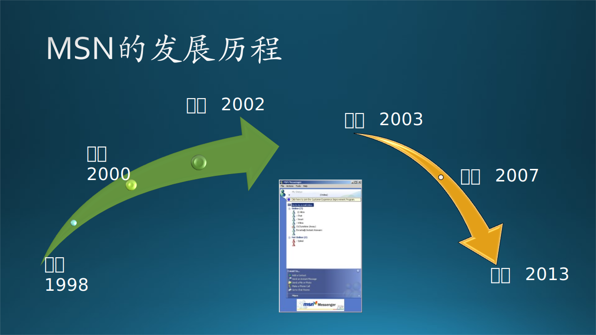

## 6.1 木头与 MSN 的故事

其实木头与 MSN 的陨落没有什么直接关系，只是恰巧亲眼目睹而已。下面的这些真实历史事件，可以让大家清醒地看到，无论软件公司或软件产品有多么的牛，不符合用户需求的话，最终仍然会失败，即使它曾经成功过。以此为鉴，让读者充分认识到软件产品的需求挖掘与分析是多么的重要。

我们先给读者一个时间线$^{[1]}$，如图 6-1 所示，可以在后面阅读时大概计算一下各个阶段所经历的时长。

图 6-1 MSN 的发展历程

### 6.1.1 上线

二十世纪的最后几年发生了很多事，其中移动通信和互联网的崛起，让整个世界经历了第三次工业革命。

互联网的兴起是在 1998 年的前后 5 年内，在那之前，木头想找朋友聊天的话，只能通过电话或者寻呼：

- 电话是指固定电话，那时移动电话还非常贵，只有大老板才能消费得起，俗称大哥大。很多电影里还能看到这样的场景：一个粗脖子男人带着小手指般粗的金项链，手里捧着一个黑色带天线的大砖头粗鲁地喊话。

- 寻呼机（Pager）是人们带在身上的一种电子设备，单向接收无线信号。有人想找木头，就给寻呼台打电话：“你好！请呼叫 9048，让机主回电话到 59175120”。

与此同时，在 IM（Instant Messaging，即时通信）领域，发生了几件大事：

- ICQ（I seek you 的谐音，我找你）是整个互联网聊天工具的鼻祖，是三个以色列人在1996年推出的一个软件，即在互联网上可以随时随地找到你。
   
- 1998年，AOL（American Online，美国在线）收购了ICQ。1999年，AOL 推出了他们收购 ICQ 后的第一个版本：ICQ 99a，准备让自己原本就排名全美第一的网上寻呼业务来一把“烈火烹油”。
   
- 同年，马化腾在深圳科技园一个小厂房里，模仿 ICQ 推出了一款中文的即时通讯工具，取名 OICQ（Opening ICQ，开放的ICQ），后来由于和 ICQ 有同名嫌疑，与 AOL 的官司败诉，改名为 QQ。

- 同年 7 月日，微软公司（Microsoft）正式上线了 MSN Messenger，在它服务开通的 6 天内，就获得了 70 万注册用户。
   
- 木头开始使用 MSN，并对微软产生了强烈的好奇心。

### 6.1.2 增长

MSN 与 QQ 的用户增长的对比：

- 到了 2000 年 7 月 17 日的时候，微软方面宣布，MSN已经拥有了 2.1 亿独立用户，成为了全世界排名第一的网站，而借这股东风，2001 年 3 月 16 日，MSN Messenger 在全世界范围内拥有了 3000 万在线用户。

- QQ 上线后，花了整整 9 个月的时间，到 1999 年 11 月，注册用户数才达到 6 万。

MSN 与 QQ 的用户构成对比：

- 在当时拥有 qq.com 邮箱，在招聘会上或面试中（尤其是外企或 500 强企业），会被面试官认为没有眼界。

- 而如果你留的是“xxx@hotmail.com”，至少证明了你是追随互联网潮流的。木头就是那时申请的 hotmail.com 邮箱，而且一直使用到现在。

- 在大学里用 QQ 的大学生，毕业后会自然而然地申请一个 MSN 账号，以便和公司里的同事交流，与商业合作伙伴通信。

- 与很多一线大城市的写字楼里的公司一样，木头所在的公司的局域网是封锁 QQ 登录端口的，但却允许使用 MSN Messenger。在很多人眼里看来，QQ 是个聊天玩具，而 MSN 是正经用来工作或商务社交的。

### 6.1.3 停滞

MSN 在经过高速增长后，很快就陷入了停滞。这种“停滞”并不是体现在用户增长上的，而是在需求持续挖掘方面。它对越来越多的细节问题视而不见，拒绝作出改变。这是最可怕，也是最致命的“停滞”。

用户对即时通讯的需求也开始渐渐提高了，可以轻而易举地列出当时这款软件的几大缺点：

- 传输文件非常不方便，大一点的文件在传输过程中很容易发生中断。以至于白领之间经常会出现一个滑稽的场景：用 MSN 聊天，让对方留下 QQ 号来传文件。
  
- “群”的功能非常弱，基本就是抓一些人进来聊天而已。而 QQ 在“建群”这件事上下了非常深的功夫，服务也做得非常好，成了黏住用户的一大法宝。

- 没有离线留言功能，也就是必须“即时通信”，不能“存储转发”。

- 每一个人的对话只能显示在下面的状态栏，无法像 QQ 那样收缩进屏幕右下角的一个闪烁图标。

- 没有脱机状态，没有隐身功能。

类似的细节其实还是有非常多，MSN Messenger 在给人“逼格”的同时，也给人在用户体验上一种高冷的感觉——你要适应我，不是我适应你。

### 6.1.4 傲慢

微软的名头使整个MSN的业务迅猛发展，MSN 也自带“富二代”光环，让商务人士和白领产生一种天然的亲近感。但是，对于海外市场的需求，位于总部的团队是根本不能理解的，是出于无知吗？肯定不是！那只能归结为傲慢。

MSN Messenger 身上各种毛病，也都找到了根源：

- 传输文件太慢且容易中断？那是因为微软长期不肯把 MSN 的服务器放到中国。甚至有一次因为海底光缆断裂，造成了中国 MSN 用户的集体断网，使得用户体验大打折扣。

- 缺少各种看似简单的细节功能？其实 MSN 中国的内部对很多细节改进打过各种报告，但一系列的邮件经过抄送和转发，层层审批，周游全球，最终要么被拒绝，要么等批下来时，黄花菜都凉了。

- 始终给人一种不肯改进的印象？那是MSN在中国的市场长期被忽视。举个很简单的例子：MSN Messenger 的更新是在中国白领白天的工作时间进行的，为什么？因为那是欧美用户的非工作时间。那能分区域更新吗？不行，必须全球同步更新。

### 6.1.5 沉沦

2007 年末，MSN Messenger 在中国的各项数据开始掉头向下。除了 MSN 本身臃肿和效率低下的决策体系之外，外部的竞争环境也开始发生了巨大的变化：

- 从国际方面来看，Google、Facebook、Twitter 等巨头迅速崛起，“同步聊天”的人群渐渐被分流到了“异步聊天”乃至互联网社区；

- 从国内来看，当年那个弱小的QQ已经变成了“巨无霸”，成为了全世界屈指可数的即时通讯工具和社区；

- 同时，开心网、人人网以及之后的新浪微博快速崛起，又分流了大批网民。

在国际和国内各种力量的夹击之下，原本就已经反应迟钝，船大难调头的 MSN 不可避免地开始沉沦。

到了 2012 年， MSN Messenger 在中国的用户数跌到了 4500 万，而与之相比的是，QQ 的用户数超过了 6 亿。

### 6.1.6 隐退

2013 年 3 月 15 日，微软正式宣布：关闭全球范围内 MSN，除了中国。这个时候，中国市场反而成了MSN仅剩的独苗。

但是，“独苗”也不能存活多久。2014 年 8 月 28 日，每一个中国 MSN Messenger 的用户收到了来自微软的一封邮件：中国的 MSN Messenger 将于 2014 年 10 月 31 日正式关闭，所有人可以转向早先微软收购的 Skype。

木头当时还郁闷了一阵，因为不用 QQ，MSN 又关闭了，没法通信了。用了一阵 Skype，没有熟人，但是在微软内部通信还是可以的。所以就变成了工作时用 Skype，下班后用微信。

