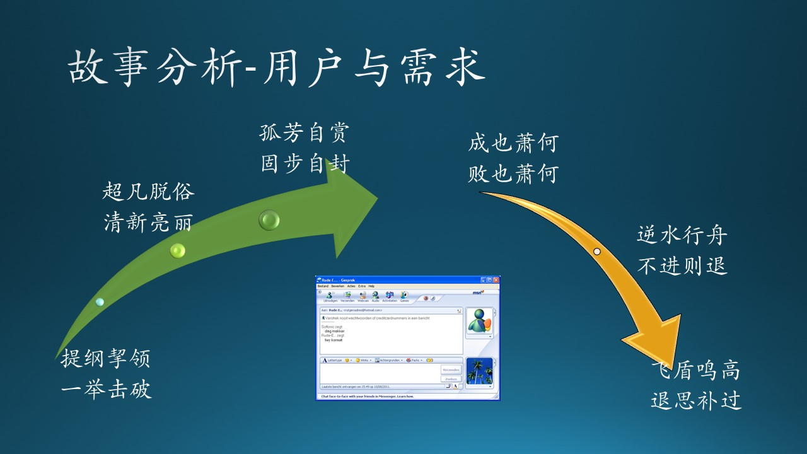

## 6.2 故事分析-用户与需求

图 6.2.1 - 故事分析-用户与需求

### 6.2.1 上线

提纲挈领，一举击破。

MSN（Microsoft Service Network，微软服务网络）是个门户网站，负责互联网接入。Messenger 是运行在该网站上的一个即时通信软件，所以大家都简称 MSN Messenger 为 MSN。

因为当时外企刚刚进入中国没多久，外企员工待遇很好，成为真正的精英白领：
- 外企需要英文界面的通信软件，MSN 提供了，而 QQ 作为国产软件是不可信的；
- 外企需要欧美的工作习惯，微软本身作为外企，开发出的软件自然具备。

向外企看齐也成为了一种潮流，因此很多企业也纷纷效仿，使用 MSN 作为通信软件。这说明 MSN Messenger 真正地把握住了用户的钢需与痛点，“一夜暴富”。

### 6.2.2 增长

超凡脱俗，清新亮丽。

可能让微软自己也没想到的是：在3000万用户中，有相当一部分来自他们并未正式开展 MSN 业务的中国大陆。因为 MSN Messenger 的成绩摆在那里：2005年，在还没正式进入中国且没做任何宣传的情况下，MSN Messenger 已经在2000万中国高端商务人士中拿到了53%的市场占有率。

在当时的中国，MSN Messenger 有自己非常清晰的标签：“小孩才用QQ，大人们都用 MSN。” 而这个“大人”，专指白骨精（白领人士，骨干力量，职场精英）。这就说明 MSN 的产品定位非常明确，需求把握得恰到好处：

- MSN 功能简单，界面简洁漂亮，没有 QQ 一些虚头八脑的无用功能，也就是说只做有用的功能；
  
- MSN 的蓝绿小人 LOGO 是水晶图标的前身，比小企鹅漂亮得多；
  
- MSN 接收信息时的“登登”声听上去也比 QQ “滴滴”声音要悦耳得多，木头后来玩起了音乐才知道因为那是“和弦”。

### 6.2.3 停滞

孤芳自赏，固步自封。

随着用户的增长以及竞争对手的进步，MSN 的一些功能已经过了“蜜月期”，而一些缺点及其背后的原因如下：

- 传输文件非常不方便：这应该是网络在国外比较稳定的原因，所以老外不认为这是个问题。

- “群”的功能非常弱：老外就是把这款软件定位在个人通信上，另外，群组管理和通信非常耗费资源。

- 没有离线留言功能：老外可能认为：即时通信就是上班时用的，不在线时就不要找我。

- 每一个人的对话只能显示在下面的状态栏：这应该是老外对 Windows 的使用方式理解不同，很可能 Windows Team 的人说：我们不建议那样做。类似这样的所谓“Guideline”在微软有很多例子。

- 没有脱机状态和隐身功能：这可能是中外文化的不同，中国人有时候不想被别人打搅，即使在上班时间。

这很大程度上取决于产品经理或团队对软件产品定位的理解。团队只看到了海量用户的活跃，没有充分地进一步获得用户反馈，巩固胜利成果。

### 6.2.4 傲慢

成也萧何，败也萧何。

微软的这棵树实在太大了，它根本没精力，也觉得没必要去特别照顾 MSN 这棵小树杈。对于微软而言，Windows 和 Office 才是最大的根基，而其他的小树杈，都必须服从根基的整体发展战略。木头不得不随大流儿地承认，鲍尔默时代的战略是有问题。

对于微软来说，MSN Messenger只是他们家诸多业务中几乎不产生现金流的一块小业务，但对于腾讯来说，QQ 几乎就是这个公司的全部家当。所以，在提高用户体验这方面：

- 腾讯愿意锱铢必较，有求必应，不断优化各种体验，增加各种用户呼吁的功能，因为这关系到他们这家公司的生死。

- 而 MSN 则是微软诸多业务中的一块，所以也没多少精力改变高冷的形象，到后面甚至给用户这样一种感觉：我就是这个样子，要用就用，不用拉到！

### 6.2.5 沉沦

逆水行舟，不进则退。

在这期间，MSN Messenger有过一次绝佳的翻身机会：

奇虎360与腾讯开始进行一场奇怪却又激烈异常的争斗。在这场前后持续四年、被网民称为“3Q大战”的互联网界著名大争斗中，不少网民长久以来对腾讯公司一些行为的不满被激发了出来，网上当时出现了不少“不用QQ，用回MSN”的号召。

有相当一部分用户卸载了QQ，用回了MSN Messenger了，但除了熟人关系链的缺失外，他们很快发现，MSN Messenger 种种功能上的落后与缺失，已经让他们无法习惯了。

就在一些诸如新浪这样的公司都在趁机推介自己的即时通讯工具的时候，MSN却颇为君子的做“壁上观”，没有进行任何行动。

以 MSN 在中国市场的反应速度，随之他们又很自然地失去了第一批跻身移动互联网的机会，回想起来，木头依然感到非常后怕：

- 微软为了返身跻回互联网，投入大量人力物力开发必应搜索（Bing Search）系统，侥幸成功了，否则将会一蹶不振。木头还参与了必应的开发，虽然贡献的代码不多；

- 为了移动领域，斥巨资购买诺基亚，不幸失败了，导致了后来的 Windows Mobile 战略失败，木头的青春也埋葬在里面。

### 6.2.6 隐退

飞盾鸣高，退思补过。

现在我们可以用上帝视角来看看 MSN 陨落的故事全貌了。所有的成功都不是偶然的，所有的失败也一样。

MSN 的崛起，是缘于当时国内对外企潮流的跟随行为。但是国内互联网的发展速度快于国外，新的需求不断涌现，国内的竞争者为了生存，不断地满足这些新需求，而 MSN 却视而不见，不持续跟随用户的需求更新自己的产品。

微软在 MSN 上的战略错误，同样延申到了移动市场。因为当时微软的所有应用产品其实都是面向企业用户的，对于个人用户的需求把握能力很差。而且把精力投入到了互联网的接入和内容上，忽视了 Rich Client（强客户端）软件的开发，以及 Smart Device（智能手持设备）的开发。

在 Rich Client 上，收购并改进 Skype 也算是一种补偿吧，因为 Skype 具备语音、视频通信功能，可以代替 MSN。但是微软在 Skype 上犯了同样的错误——不懂用户需求，导致月活用户量大幅度下跌。

在 Smart Device 上，收购 Nokia 是一个失败的策略。

而国内的软件公司却对用户需求把握得非常到位，尤其是一些大体量的应用，以已经具有觉得的优势，但仍然努力变得更好。以微信为例，作为一个月活已经超过10亿的即时通讯工具，微信还在努力地进行变化，时不常地推出一些新功能，比如为了抗衡抖音而发布的视频号功能，在新冠疫情期间突飞猛进。

在这个充满变化的时代，唯变不变，拥抱变化、快速更新，是软件从业者唯一的选择。
