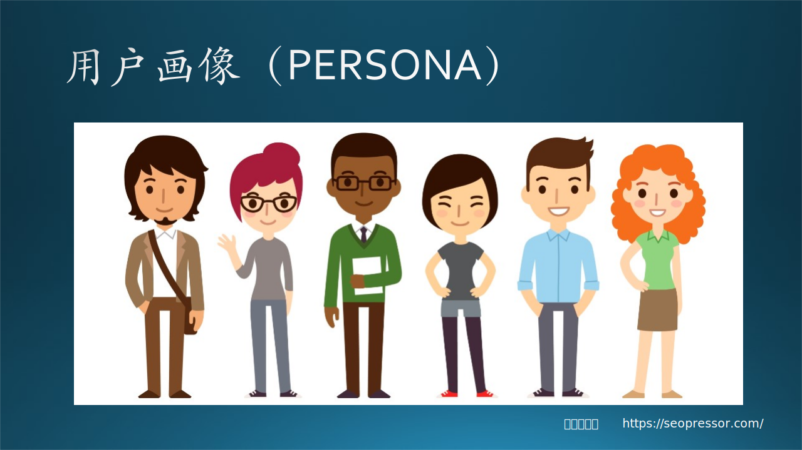
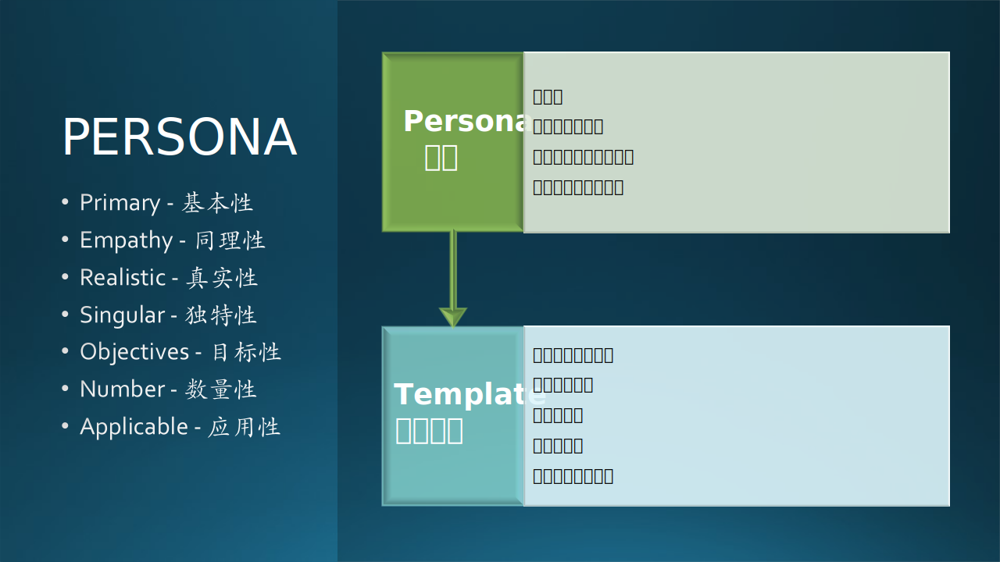
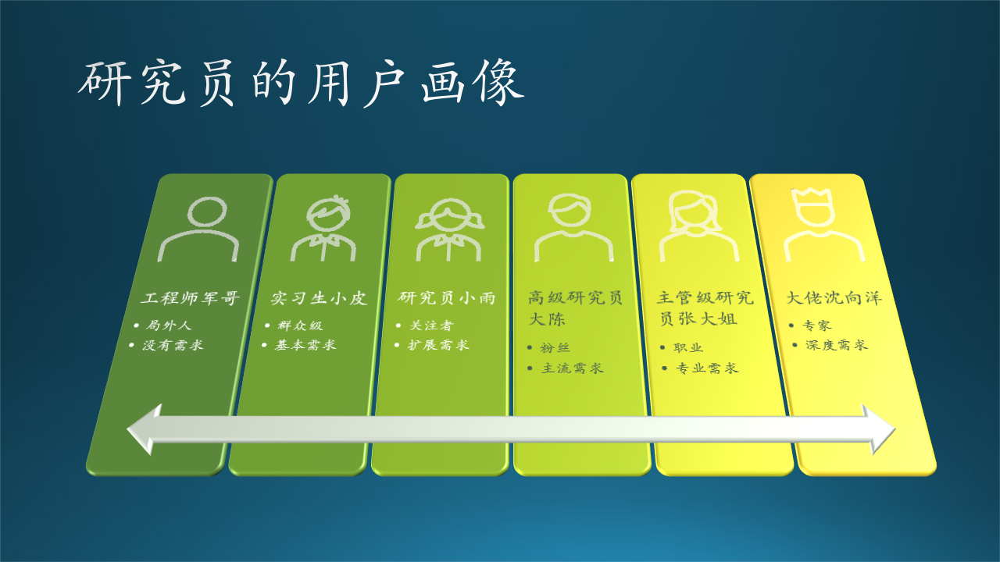

## 6.5 故事分析-典型用户

### 6.5.1 用户画像（PERSONA）

我们在需求讨论中，经常会说起“用户”如何如何，其实这是不准确的，因为你了解的“用户”也许只是一个个例，并不能代表真正的“用户群体”。

Persona，用户画像，古希腊罗马戏剧中的面具。

中国的传统戏剧如京剧中有所谓的脸谱，不同的人物性格就用不同的脸谱予以直观的表示。古代希腊、罗马的戏剧中也有类似的表现手法，不过不是脸谱，而是面具，不同角色戴不同面具。佩戴面具可以解决一人分饰多角的问题，还能克服剧场条件限制，使远处的观众辨别出角色的形象和表情。

这种面具，拉丁文就叫做 persona 。正因为如此，persona 渐渐成了戏剧中的“人物角色”的意思。由于每个人在社会生活中都要扮演一定的人格角色，所以 persona 就从戏剧中的“人物角色”延伸为表示人在社会生活中的人格角色，从而产生了英语单词 person$^{[5]}$。

图 6-7 用户画像（PERSONA）

图 6-7 示意性地展示了用户画像的概念，比如：

- 第一个人像旅行者；
- 第二个人像职员；
- 第三个人看上去像是老师；
- 第四个人像是运动员；
- 第五、六个人是年轻都市青年。

我们知道了用户群的分类，才能有针对性地为不同群体提供不同的功能。

在用户界面设计领域，阿兰·库伯（Alan Cooper）提出来的一种通过调研和问卷获得的典型用户模型，用于产品需求挖掘与交互设计的方法。把这个词分解为 7 个单词的词头，如图 6-8 所示，虽然略为勉强，但也起到了帮助人们记忆的作用$^{[6]}$。

图 6-8 PERSONA 含义分解

表 6-2 展示了阿兰的具体解释。

表 6-2 阿兰对 PERSONA 的解释

|字头|单词|直译|解释|
|--|--|--|--|
|P|Primary|基本性|该用户角色是否基于对真实用户的情景访谈|
|E|Empathy|同理性|用户角色中包含姓名、照片和产品相关的描述，该用户角色是否引同理心|
|R|Realistic|真实性|对那些每天与顾客打交道的人来说，用户角色是否看起来像真实人物|
|S|Singular|独特性|每个用户是否是独特的，彼此很少有相似性|
|O|Objectives|目标性|该用户角色是否包含与产品相关的高层次目标，是否包含关键词来描述该目标|
|N|Number|数量性|用户角色的数量是否足够少，以便设计团队能记住每个用户角色的姓名，以及其中的一个主要用户角色|
|A|Applicable|应用性|设计团队是否能使用用户角色作为一种实用工具进行设计决策|

图 6-8 中给了我们一个有用的模板，用于描述用户的具体人物、行为细节，为后面的应用场景故事做准备。

### 6.5.2 研究员的用户画像

从外界看起来，研究员都应该是同一类人。但是研究员群体也是可以再细分的。

豌豆荚用户研究团队对全国9个城市143个样本进行深入访谈$^{[2]}$，收集了关于用户的生活和手机使用行为等的大量素材结合定量的数据挖掘，将内容消费用户定义成了五个角色，分别是：职业鉴赏家、专业发烧友、业余爱好者、匆忙路人、围观群众。

可以在这个分类上做进一步抽象，就可应用到几乎所有需要用户等级粗略划分的系统中，从而对需求发掘和功能设计有一定的指导意义：大家不会再盲目地猜测用户想做什么事情，而是有方向性地去主动探查和设计。

抽象的结果对应到研究员群体上，如表 6-3 所示：

表 6-3 用户分类抽象描述

|序号|角色|需求层次|举例|
|--|--|--|--|
|0|局外人，非用户|没有需求|军儿哥|
|1|群众，普通用户|基本需求|实习生小皮|
|2|关注，活跃用户|扩展需求|研究员小雨|
|3|粉丝，贡献用户|主流需求|高级研究员大陈|
|4|职业，专业用户|专业需求|主管级研究员老张|
|5|专家，资深用户|深度需求|大佬 Harry|

由此，我们可以得到研究员的用户画像，如图 6-9 所示。

图 6-9 研究员的用户画像

对比一下图 6-6 和图 6-9，可以看到后者的一些变化：

- 形象地用一个卡通头像来表示用户；
- 给出了该类用户的分类名称；
- 确定了该类用户的需求层次。

下面具体分析一下各类用户的需求差别。

#### 0. 工程师军儿哥

*注：以 0 为标号是想说明工程师不是正确的目标客户。*

军儿哥根本不是我们这个软件的使用对象，所以就不要费力气了，和他聊聊天气就可以了。

对于“局外人”应该如何对待呢？这个问题让笔者想起了那个卖鞋的故事：一个岛上的原住民都不穿鞋，商人甲很失望，说：“鞋在这里没有需求市场”，商人乙却说：“如果这些人培养出穿鞋的习惯，这里将会是一个很大的市场”。

所以，对于软件设计者来说，在照顾到已有用户的同时，不要放弃对“局外人”的吸纳，因为其潜力巨大。

#### 1. 实习生小皮

小皮的关注点在：

- 提高英文阅读水平；
- 理解未知词汇的含义；
- 打开文中引用到的其它论文。

前两个是初学者的基本需求，第三个需求虽然花一定的力气也可以实现，但会带来一个问题：假设论文A引用了10篇论文，这10篇论文里又各自引用了10篇论文，这是几何级数的扩充，发散了。最后的结果会是：小皮将会陷入到论文的海洋之中被淹没。

这么做有帮助吗？我们要不要实现这个功能？笔者的观点是：用户有需求，应该做，但是可以用一种比较高级的做法。

- 先找出引用关系，实现一个“引用关系图”；
- 观察这个图中的引用路径，看看它们是不是会追溯到一个或几个原始论文（即所谓的开山之作）；
- 建议小皮先阅读原始论文，再根据需要阅读“二代”论文，这样会非常有条理，学习路径清晰。

#### 2. 研究员小雨

小雨的关注点在于：

- 界面好看；
- 多页阅读模式；
- 交互友好。

小雨显然已经不再纠结于基本的论文阅读技巧，而是更关注使用这个软件的愉悦程度。软件的“可用性”不是说“可以使用”的意思，而是尽量地“容易使用”。其中，用户界面和交互是非常重要的两个方面，也可以统称为“用户体验”。但是“用户体验”这个说法比较虚，通常用于说不出细节但是又想标榜自己很懂的时候，比如：“这个软件用户体验太差了，不好用。”

多页阅读模式是一个很好的建议。想象一下我们平时读纸质书时，由于书有厚度，我们知道自己读了多少，还有多少没读；而且我们在读左侧时，右侧的书页会给人一种莫名其妙的“安全感”。所以，在计算机上，虽然没有厚度的概念，但是左右页的排版方式会是一种很好的“用户体验”。

#### 3. 高级研究员大陈

大陈的关注点是：

- 论文多，需要收藏功能；
- 可以做电子标记；
- 可以大家交流。

大陈的主要目标是利用工具的帮助把个人的能力发挥到极致，同时，上升到了一定的层次，也开始关注交流问题了。但是大陈的需求并不会与小雨的需求产生矛盾，而是一种递进的关系。

#### 4. 主管级研究员老张

张老师的关注点是：

- 如何快速搜集历史论文集；
- 如何分类排序标重点；
- 如何分享观点。

张老师更多地关注团队的成长、合作、效率等问题，所以会从这方面给与建议。

#### 5. 大佬沈向洋

Harry 大佬的关注点是：

- 阅读论文的阶段；
- 阅读技巧与方法；
- 高端交流的手段。

从文字上看，Harry 的思路有高屋建瓴、醍醐灌顶的感觉，可以引领广大研究员尤其是年轻的研究员更好地阅读论文，但是，真的不容易实现，没有什么直接的办法可以把 Harry 的理论变成具体的可操作的功能。这就需要 PM 的智慧了。
