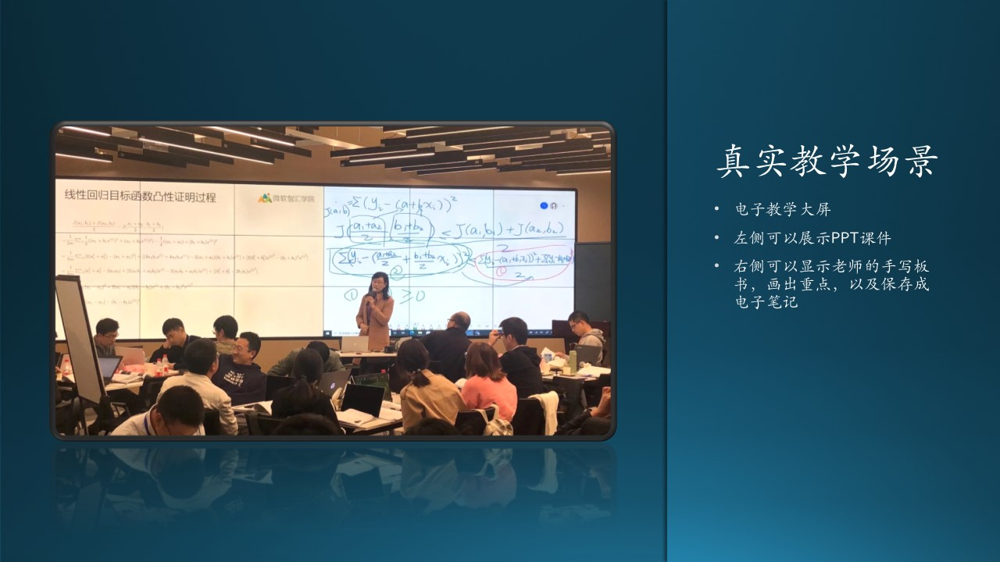

## 6.6 木头与 AI 教学的故事

从上一节的内容我们知道，典型用户是需要应用场景故事来具体描述的，这一节我们就举例说明什么是应用场景故事。

人物：
-	毛毛作为一个大三的学生，正在学习深度学习的相关知识。
-	木头是一名老师，讲授神经网络基本原理课程。

图 6.6.1 - 真实的 AI 教学场景

图 6.6.1 展示了微软在上海仪电做的真实的 AI 教学场景。

### 6.6.1 老师和学生预习的场景

2020/10/13 晚。

毛毛已经上了10节关于神经网络入门的课程，明天该进入卷积网络的学习了。

在前面的深度学习基础中，循序渐进的课程设置，让毛毛感觉学习起来很轻松，似乎学习曲线没有那么陡峭。而示例代码和课后作业，由于代码的高度优化，他用自己的笔记本完全可以跑起来，很快地就跑出了实验数据。他打开了课程网站，用自己的学号和密码登录后，进入提交作业的页面，填写了自己的实验数据，点击“提交”按钮，看到“提交成功”的信息后，毛毛猜想着自己的作业成绩，会不会像以往那样名列前茅。

果真，一会儿毛毛的微信收到了作业系统通知消息，自动评分系统已经统计了全班同学的作业成绩，由于毛毛的模型预测数据的准确率为98.1%，名列第二名，仅比第一名低0.1个百分点。毛毛不满意地摇摇头，暗下决心一定要在卷积网络这一部分的成绩超过那个名叫金二的但总得第一的家伙。

毛毛想预习一下卷积网络的知识，打开了课件。看了20分钟后，毛毛的觉得很沮丧，什么单入单核，多入单核，单入多核，多入多核……一大堆卷积类型，越看越晕。算了，明天上课好好听木头老师讲吧。

而木头老师此时也还没有休息，他先浏览了一下全班同学的作业成绩，在讨论区里回答了几个问题后，调出卷积神经网络的PPT课件，开始备课。在PPT的note中标记了几处需要重点说明的环节后，Office 365已经替他把文档自动保存到服务器上，这样其它老师也可以看到他的分享。

然后，木头又用教师账号在Azure上申请了两台带GPU卡的计算VM，选择了OpenPAI的镜像，5分钟后，两台服务器正常启动，他便关闭了服务器，避免在没人使用时发生不必要的费用。

### 6.6.2 老师和学生上课的场景

2020/10/14 上午。

第二天，木头准时来到电教室，同学们已经都到齐了，毛毛像往常一样坐在第一排，他想仔细听听老师如何讲解复杂的卷积神经网络。

木头没有带电脑，因为电教室的Surface Hub S2所连接的主机，早已经连接到了Azure上。他打开Edge浏览器，输入http://openaiedu.azure.microsoft.com网址，输入了自己的教职员工号码登录，电教系统已经自动开始录音录像他的讲课内容了。

木头打开了PPT，放在屏幕左侧，而右侧则是书写区，便于注释与重点讲解。45分钟之内，4种卷积类型在左侧依次一个个地被讲解，并最终做了比较，而右侧的白板区则写满了木头的Ink笔记，使得毛毛清晰地理解了它们的原理。木头把Ink笔记保存为文件后，上传到了服务器，便于同学们复习。

课间休息，木头在Azure上激活了昨天准备好的两台虚拟机，准备给同学在课堂上跑卷积神经网络的训练过程示例。此时OpenPAI已经严阵以待，就等Job的提交了。

木头先用交互式图形界面，在屏幕上妥妥拽拽，只用了5分钟就生成了一个神经网络，包括两层卷积、两层池化和两层全连接，最后又选择了Softmax分类函数和交叉熵损失函数后，把准备好的MNIST数据集输入，并点击“提交Job”按钮，OpenPAI瞬间活跃起来，数据流在K80 GPU中疯狂运转，10分钟后，50个epoch跑完了。与此同时，同学们也分组搭建自己的神经网络，在图形界面上设置了自己想试验的超参，然后点击“提交Job”按钮。

OpenPAI管理的两块GPU现在满负荷运行了，在任务区中有10组同学的排队请求，每隔1分钟，会有一个任务状态信息反馈到用户界面上。20分钟后，同学们的手机依次收到了任务结束通知，纷纷去看结果，有的高兴有的沉思，毛毛似乎又不太顺利，琢磨着为什么4个卷积核只能得到89%的准确率呢？

正踌躇间，下课的铃声响了，木头老师提醒同学们保存好自己的model，便关闭了GPU服务器，看看Azure上的账单，一共只花费了2美元！（美国西2区当前价每小时0.9美元每台单卡K80服务器）

故事讲完了，但毛毛还在郁闷中。
