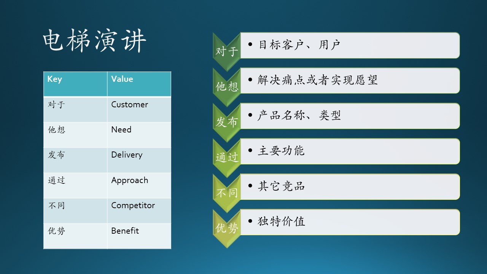
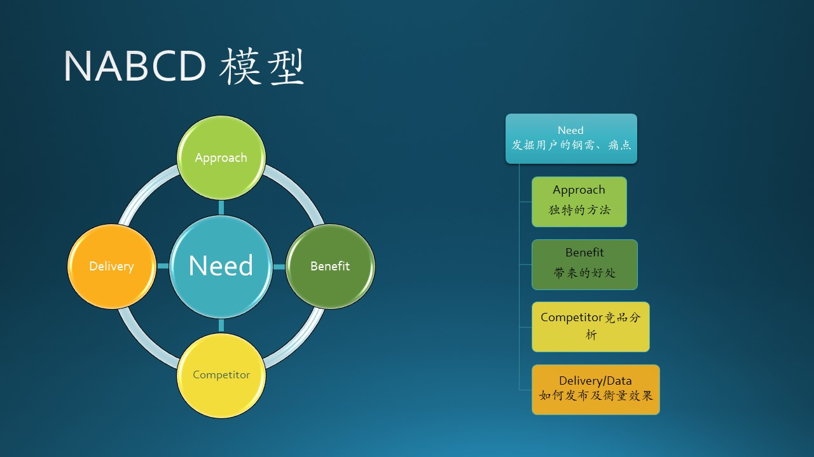

## 6.8 需求轮廓描述

### 6.8.1 电梯演讲（Elevator Speech）

麦肯锡公司曾经得到过一次沉痛的教训：该公司曾经为一家重要的大客户做咨询。咨询结束的时候，麦肯锡的项目负责人在电梯间里遇见了对方的董事长，该董事长问麦肯锡的项目负责人：“你能不能说一下现在的结果呢？”

由于该项目负责人没有准备，而且即使有准备，也无法在电梯从30层到1层的30秒钟内把结果说清楚。最终，麦肯锡失去了这一重要客户。从此，麦肯锡要求公司员工凡事要在最短的时间内把结果表达清楚，凡事要直奔主题、直奔结果。麦肯锡认为，一般情况下人们最多记得住一二三，记不住四五六，所以凡事要归纳在3条以内。这就是如今在商界流传甚广的“30秒钟电梯理论”或称“电梯演讲”。

我们用论文阅读 APP 举例说明：

“对于我们 MSRA 的**研究员**们，他/她们想**解决论文管理的问题**。我们要做的这个叫做 **Papera** 的产品，是一个**客户端软件工具**，它可以通过**本地存储、检索、智能搜索**等功能，为用户提供**论文阅读平台**。它不同于市场上的只能做标记工作**普通 PDF 阅读器**，它可以帮助研究员**很方便地从上百篇已经读过的论文中快速准确地找到曾经做过标记的最有价值的那篇论文，提高阅读论文的效率及与它人分享心得**。”

大家可以尝试着以正常语速念出上面的文字，大概只需要30秒的时间，但是这段文字基本上清晰扼要地把 Papera 这个产品的特点全方位地表述了出来。

图 6.8.1 - 电梯演讲

图 6.8.1 中的一列向下的箭头，可以想象成电梯从30层楼开始向下运行，每5秒钟就要说出一句话来。其中的关键信息（Key）标在箭头的位置上，可以用程序员熟悉的 Key/Value Pair（键/值对）来表示，见表 6.8.1：

表 6.8.1 - 电梯演讲关键词

|Key|Value|语义英文表示|实例|
|--|--|--|--|
|对于|我们的目标客户/用户|Customer|MSRA的研究员|
|他们想|目标客户的痛点或者希望|Need|快速找出论文|
|我们发布|产品名称、类型（平台/工具）|Name，Delivery|Papera，客户端软件|
|它可以|通过什么样的功能帮助用户|Approach|存储、检索、智能搜索|
|不同于|市场上的竞品及其特点|Competitior|PDF阅读器|
|它的优势是|我们产品的独特价值|Benifit|提高效率、分享心得|

### 6.8.2 NABCD 模型

我们把表 6.8.1 中的英文单词的首字母提出来，再按顺序排序，就形成了 ABCCDNN。由于一般先把目标客户和需求放在最前面，所以是 NNABCCD 的顺序，简称为 NABCD。

从电梯演讲方法发展出来的 NABCD 方法$^{[4]}$，是一种有效的可以全面快速地表达你的需求和基本构想方法，所以也可以成为是一种模型。见图 6.8.2。

我们在本书中提到了很多模型，并不是为了显得高大上，而是因为这些模型是前人经验的总结，通过实践来理解这些模型，熟练掌握后，可以在实际工作中得心应手，不会遗漏什么重要的部分。

图 6.8.2 - NABCD 模型

### N（Need，需求）

你的产品要解决用户的什么需求（Need）。一般来说，听众也就是你的目标客户（Customer），或者是你的同事。首先说服你的同事，才能去说服客户。

还有一个 N 是 Name，即产品名称，这个在需求阶段并不重要，只是个代号而已。

名字为 Papera 的软件就是要解决**论文管理的问题**。

可以看到在图 6.8.2 中，想表达 N 处于核心（左侧子图）和领导（右侧子图）地位，一定要真实可信，如果 N 是虚假的、臆想的，那么后边的一切都是不可靠的。

#### A（Approach，做法）

做法可以有很多方面，如：

- 技术上的：可以开发一个新的软件，比如 Papera 论文阅读工具，或者在现有软件上提供新的特性。
  
- 商业模式上的：可以通过在 App 中增加广告，来激发广大商户的参与积极性。
  
- 地域的：通过在欧美地区部署服务器，来满足当地用户对 TikTok（短视频平台）的性能需求。
  
- 人脉的：通过提供“红包”和“接龙”功能，增加社交 App 中的用户群的粘度。
  
- 行业的：我们提出一种 ONNX 架构，来解决不同的深度学习框架之间的模型交换问题。

#### B（Benefit，好处）

描述这个新产品/服务会给客户/用户带来什么好处。客户（Customer）是指运营软件/服务的企业，用户是指软件/服务的最终使用者（End User）。

一般我们要阐述对用户的好处，比如在 Papera 中，它可以帮助用户（研究员）**提高阅读论文的效率及与它人分享心得**。

另外一种好处是给客户（即运营商）的，比如“增加社交 App 的用户黏度”，“降低不同深度学习框架的模型交换成本”。还有一个节约成本（Cost）的例子，比如：通过增加一个 AI 模型，可以预测网站流量，减少不必要的 Azure 云资源占用的开销。

#### C（Competitors，竞争）

在前面的章节中，也提到了市场和竞争对手的问题。关注客户和用户是最主要的方面，关注竞争对手是另外一个方面，从对手身上学习有用的经验。

在进入一个领域之前，你至少应该搞清楚，这个市场有多大，目前有多少竞争者在瓜分，预计会有多少新加入竞争的对手？比如 Papera 这个产品，目前市场上的竞争对手寥寥无几，而且已有的产品形态都不符合我们的设想，所以我们有信心做出一个让用户满意的产品来。

但是，过于关注竞争对手会忽视用户的利益，带来灾难性的后果。比如当年的 3Q 大战，两个大软件厂商专门针对对方的产品做一些限制，用户安装了甲的软件，就不能使用乙的软件，或者是系统性能急剧下降，导致很多用户卸载了甲乙两个软件。

这让笔者想起了一个问题，在电商领域有了巨无霸淘宝、京东，为什么还可以有拼多多？拼多多 CEO 黄峥的见解很值得关注：“我们一直关注的是经营以及如何更好地服务于我们的用户，而不是去关注竞争对手在做什么。这个行业的竞争一向非常激烈，但是我们依然在这样的局势中成长到了如今的规模。”

关注竞争的前提，是先要关注用户需求。

#### D（Delivery/Data，交付/数据）

Delivery 的问题是提醒软件产品决策者要第一时间想到如何发布产品，是通过网页服务呢，还是通过手机客户端呢，或者是传统的桌面应用？不同的方式会有不同的宣传手段，让目标用户都知道你的产品，并且让产品的用户量快速提高。

Data 的问题是提醒软件产品要收集用户使用数据，通过分析来改善并衡量软件特性的效果。市场上有很多类似的数据采集平台，客户端（包括桌面和移动）软件可以直接使用这些平台来采集数据，后期以在线形式得到分析报表。

在微软，Windows、Office、Bing 都有自己的数据采集平台，还有专门的数据分析岗位来定期做出图表，汇报给软件特性小组（包括领导、PM 和开发人员）。

要提醒的是这牵涉到用户隐私问题，国内很多厂商对此并不很重视。微软则采用了最严格的欧洲数据保护条例，含有隐私的数据一律不允许采集，公司内部每个部门都有专人负责审查日志数据的采集和保存，避免违规。

### 6.8.3 错误的 NABCD 用法

这是笔者在 cnblogs.com 上看到的一个真实的作业，虽然每一条都填上了内容，但是过于空洞，根本无法看明白具体要干什么。

1. N（need需求）

   我们的产品解决了用户由于工作或者压力较大而得不到缓解的问题，近年来我国生活节奏快，如果有太多的压力得不到释放，对身心都会造成伤害，我们的产品可以来缓解这种情况。

   *点评：这个说法可以接受，但是不够具体，比如具体到“听音乐”也可以是缓解手段。*

2. A（Approach做法）

   人们的压力过大得不到释放，所以需要一些方法来转移注意力，来达到减压的目的，所以我们需要让人们在短时间里从工作中走出来，不再去想工作中的事。

   *点评：并没有描述具体的做法，比如“我们要制作一个游戏”，才算是做法。*

3. B（Benefit好处）

   我们制作的软件成本低，目前几乎所有类型的人群都可以使用，你只需要很短的时间就可以沉浸在里面，但又不会沉迷，是非常适合那些只有很少的空闲时间但是压力却很大的人群用来解压。

   *点评：可以接受。*

4. C（Competitors竞争）

   我们并不是第一个做这个的，但是这种类型的产品所适合的人很多，类型也很多，所以市场还是非常大的，只要自己有创意，可以在这个领域站稳脚步，做出自己的产品。

   *点评：没有说出“创意”是什么，太空洞，这样无法说服客户。*

5. D（Delivery交付）

   目前我们可以做小范围的推广，软件并不大只要几分钟就可以体验它的内容，随后在通过人群传播让更多的人可以了解到。

   *点评：并没有提及如何发布、宣传这个软件，甚至连是手机 App 还是桌面 App 都不知道。“通过人群传播”又是如何做到呢？软件又不是新冠病毒，况且现在大家都戴了口罩。*
