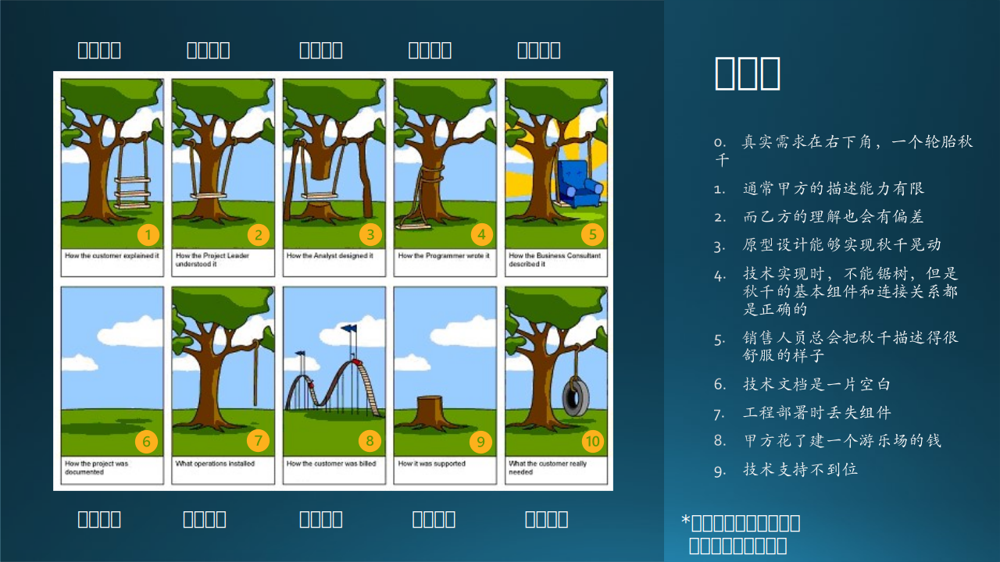

## 7.1 需求分析的重要性

### 7.1.1 需求的故事

#### 1. 国外故事：秋千图

我们先请出软件业界著名的秋千图$^{[1]}$，如图 7-1，表 7-1 中有解释。

图 7-1 秋千图

表 7-1 秋千图的解释

|序号|标题|解读|
|--|--|--|
|1|客户的描述|挂在树上供三个孩子一起玩耍的秋千|
|2|项目经理的理解|两根绳子拴在树上，挂一个木板|
|3|分析员的设计|修改支撑系统的结构以便让秋千能晃动|
|4|程序员的实现|实现了静态拓扑结构设计：绳、树、木板|
|5|商业顾问的描述|舒适无比、光芒四射|
|6|项目文档|空空如也，如云如烟|
|7|上线的产品|缺东少西，不知所云|
|8|客户投资|巨大得可以修建一个游乐场了|
|9|技术支持|少之又少，无依无靠|
|10|用户的真实需求|树杈+绳子+轮胎，可以供该客户的三个孩子玩耍|

需求调研与分析是一切软件的起源，差之毫厘，谬之千里。在秋千图的例子中，各个环节的误差导致了彻底的失败。

（1）首先，客户的描述是“我的三个孩子可以一起玩耍”，根据客户的描述，这个秋千必须可以同时容纳三人。显然这个描述是不准确的：“一起”的含义并不是三个孩子同时在秋千上，有可能是一个孩子在秋千上，两个孩子在地上推秋千。

（2）项目经理没见过三层的秋千，但是他觉得只要秋千的踏板足够宽，可以站好几个孩子。另外，如果想保证安全的话，两根绳子最好能拴在两个树杈上，这样可以分担承重。

（3）分析师认为分担承重的需求很重要，但是如果秋千需要前后晃动，必须有空间，那就不得不把树锯开（改变已有系统的结构）。当然左右各加一个支撑是必须的，这样原系统可以保持稳定。

（4）程序员认为，改变已有系统（大树）的代价太高了，绝对不能动，所以最后的实现完全符合秋千的静态拓扑结构：两根绳子拴住树干上，下面挂一个踏板。至于秋千的动态模型可以后期再考虑。
 
（5）产品快成型了，市场人员虽然还没有看到成品，但是已经坐不住了，开始到处宣传：我们的产品非常的安全和舒适，孩子们就好像是坐在沙发里一样，家长不必有任何担心。
 
（6）没有人写文档，需求、设计都是口口相传，最后是一片空白，导致各个环节都出现误差。

7. 工程人员自己家里也有简易秋千，一根绳子就可以搞定。所以在安装产品时忘记带踏板了，那就索性只挂一个绳索，这样孩子们依旧可以愉快地攀爬。另外还富余出一根绳子，工程人员向客户解释说那只是个替换品。

8. 客户抱怨：为此项目一再增加投入，最后发现累计投入很大，还不如把树砍掉后建造一座游乐场呢。

9.  后期的技术支持认为：客户的抱怨是有道理的，我们应该把树砍掉，让客户建造游乐场。

10. 其实客户的真实需求只是一根绳索下面挂一个旧轮胎。

#### 2. 国产故事：烟囱和深井

如图 7-2 所示。

图 7-2 烟囱和深井

在郭德纲的相声《梦中婚》里，客户郭师傅需要挖一口井，但是工程人员把图纸拿反了，最后建了一个烟囱，一边干一边还纳闷儿：这个烟囱为什么设计的这么粗？

### 7.1.2 需求分析阶段的重要性

#### 1. 现实

需求分析是软件生命周期中相当重要的一个阶段。

1999 年，美国专门从事跟踪 IT 项目成功或失败的权威机构 Standish Group，对 23000 个项目进行的研究结果表明，28% 的项目彻底失败，46%的项目超出经费预算或者超出工期，只有约 26% 的项目获得成功。见图 7-3。

图 7-3 IT 项目成功率调查

而在这些高达 74%（28% + 46%）的不算成功项目中，有约 60% 的失败是源于需求问题，也就是多于一半的项目都遇到了需求问题，这一可怕的现象引起人们对需求分析的高度重视。

需求分析阶段的主要任务是通过需求分析人员与用户之间的广泛交流，不断澄清一些模糊的概念，最终形成一个完整的、清晰的、一致的需求说明。

需求调研的任务，就是通过各种方法，根据业务需求获得用户需求。需求分析的任务，就是通过各种方法，根据用户需求得到行为需求。需求分析解决“做什么”的问题，系统设计解决“怎么做”的问题。

#### 2. 避免错误

其实，有很多机会可以避免这个错误，而且可以轻易觉察。但是如果对应到软件开发上，就没有那么容易了，这要求在软件开发中有严格的流程管理和及时（通过scrum meeting）沟通。

图 7-4 Scrum 的沟通作用

【最佳实践】以烟囱和深井的故事为例：

1. 客户首先要有需求诉求，一般来说客户不认识直接干活的人，而是找到了包工头。包工头在这里可以对应到**需求人员**。

2. 包工头作为中间环节没有给上下游交代清楚。他如果拿着图纸（需求文档）和客户做一个**确认需求**，或者直接告诉施工方（**开发人员**）客户是要挖一口井，也不会出现这样的错误。

3. 文档不严格，不完整。如果在图的上方注明《郭师傅家的深井挖建工程图》，除非工人是文盲，否则也不会拿反图纸。

4. 施工人员（开发人员）拿到图纸后，针对对图中的疑点，及时和包工头沟通。开发人员看到需求规格说明书后，可能有他自己的理解（和秋千图的例子一样），针对任何疑点，都要及时与需求分析人员沟通。

5. 施工人员及时与客户现场沟通。在软件开发中，客户通常是看不到软件的样子的，这和烟囱的例子不可类比。所以，更要求开发人员及时做好产品原型（prototype）交给需求分析人员（包工头）和客户（郭师傅）进行确认。

6. 客户要对产品原型进行确认。在本例中不完全适用，但是可以在挖井挖了两米深的时候，和客户确认一下。

7. 包工头经常来现场检查工程进展。需求分析人员在完成文档后，并非就完成工作了，而是要阶段性地和开发人员进行交流，监督、检查进度、质量以及需求满足情况。

#### 3. 需求分析的特点及难点

尽管可以用一些手段避免需求分析阶段的错误，但是仍然存在很多陷阱，其特点及难点主要体现在图 7-5 所示的几个方面。

图 7-5 需求分析的特点与难点

（1）定位困难
   
   主要原因一是应用领域的复杂性及业务变化，难以具体确定；二是用户需求所涉及的多因素引起的，比如运行环境的复杂性，以及系统功能的多样性等。这就要求需求调查、分析人员具备一定的领域知识，可以从客户并不明确的描述中抓住本质。

   用福特汽车的故事举例，福特问一个马车夫需要什么，马车夫说需要更快的马车，其实马车夫的需求是需要更快的交通工具。另外一个例子是在办公软件普及之前，人们需要更大的档案柜来保存档案，需要更好用的钢笔来书写。人们总是会被当前的现实限制在一个区域内进行思考和行为。

（2）需求常变
   
   软件的需求在整个软件生存周期，常会随着时间和业务而有所变化，如客户环境和业务流程的改变，市场趋势的变化等，也会随着分析、设计和实现而不断深入完善，可能在最后重新修订软件需求。界面变动还算是小事情，功能的重排也能接受，可怕的是业务流程变化，或者是方向性的变化。

   比如，有个软件开发了半年了，眼看就要成型了，忽然接到上级通知，由于相关政策法规的变化，原有的一些流程都废弃了，需要开发新的流程。

（3）认知矛盾
   
   由于不同人员对系统的要求认识不尽相同，所以对问题的表述不够准确，各方面的需求还可能存在着矛盾，难以消除矛盾并形成完备和一致的定义。同样的客户群中，有的个体认为功能 A 重要，有的个体认为功能 B 重要，或者是对于同样的功能的输入输出有不同的理解。

   比如一个小例子，在实现深度学习中的批归一化算子时，需要返回三个值：归一化后的数据、均值、方差。有的人会认为均值和方差是针对当前批数据而言的，另外的人会认为是针对以前的所有批次的数据计算平均值或动量值。

（4）交流困难
   
   需求分析涉及的人事物及相关因素多，与用户、业务专家、需求工程师和项目管理员等进行交流时，不同的背景知识、角色和角度等，使交流共识较难。这一点主要依靠需求人员的沟通能力来解决。比如，对于客户中的基层个体，应该用录音的方式把他们说的话都录下来，回去后整理出条目来；而对于客户中的高层个体，要求他们给出一个书面的文字需求更加切合实际。

#### 4. 需求分析的几个阶段

（1）第一步：层次分析

  在该阶段，主要区分出来自客户的需求的层次归属，在 7.3 节中会讲到。

（2）第二步：用户需求分析

  该阶段是做“用户需求”分析，从应用场景故事描述中提取出用户需求。

（3）第三步：功能需求分析

  该阶段做“功能需求”分析，可以使用的方法有小组讨论、卡片分类、单据分析、报表分析等。

（4）第四步：非功能需求分析

  该阶段做非功能性的需求分析，包括模糊需求，质量熟悉，约束条件。

（5）第五步：技术分析

  该阶段是用技术分析手段得到各种视图和文档，以指导后期的开发工作。
