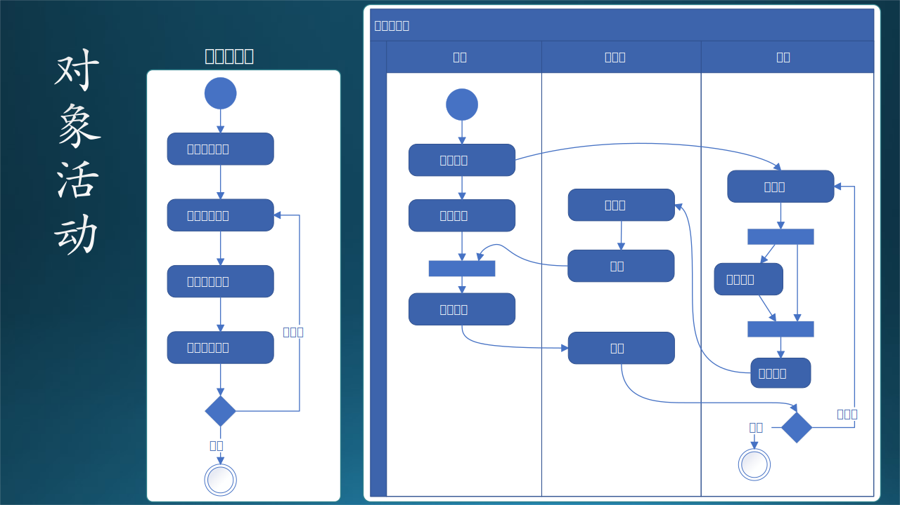

## 7.10 需求技术分析 3：行为模型

这是需求分析的第三步，在这一步中，我们要建立“行为模型”。行为模型表示瞬时的、行为化的系统的“控制”性质，规定了对象模型中对象的合法变化序列。即对象的动态行为。步骤如图7.10.1：

图 7-39 行为模型

步骤如下：

（1）发现状态

有些对象具有复杂的内部状态，随着外部事件而变化。

（2）捕捉事件

分析出什么样的事件会造成状态的转换。

（3）细节分析

 有一些中间状态在最开始时不容易被发现。比如，我们经常使用的计算机，平时具有“开机”和“关机”两种状态，但实际上它们还具有“开机中”和“关机中”两种状态，甚至还有“死机”状态。

（4）发现动作

对象之间是存在交互动作的，代表着将来要实现的方法调用。

（5）动作描述
   
描述每个动作的起始对象和作用对象，携带的消息，以及动作的先后顺序。

这种模型可以用于表示：

- 系统动态和行为，或者是对象的状态和行为；
- 描述了在用户模型和结构模型中所描述的各种结构元素之间的交互和协作。

### 7.10.1 对象状态转换

用状态图来描绘对象的状态、触发状态转换的事件、以及对象的行为（对事件的响应）。每个类的动态行为用一张状态图来描绘，各个类的状态图通过共享事件合并起来，从而构成系统的动态模型。

#### 1. 需求分析阶段

State Machine，状态转换（迁移）图是描述对象的状态在响应外部的信号后进行转换的一种图形表示。

我们以作业对象为例，绘制出状态转换图，如图 7-40 左侧上方所示。我们可以看到四种图例：

（1）起始状态，实心圆形；
（2）终止状态，小实心圆形外套空心圆；
（3）状态，被观察到的对象行为模式，用圆角矩形表示；
（4）事件或行为，引起状态转换的外界事件，用有方向的连接线表示；
（5）菱形，判断条件。

在需求分析阶段，是对现实世界做状态转换分析。图 7-40 左侧下方是状态转换表。

（1） “起始”状态：老师布置作业。比如，老师在课堂上布置作业：“同学们回去后把 CNN 的模型在 Cifar-10 数据集上再跑一遍，自己调参，看看准确率如何”；
（2）学生听到后，把内容记录在小本子上，状态为“已接收”；
（3）学生课下做试验，调整参数，把自己最满意的结果记录下来，成为作业上交，状态为“已提交”；
（4）老师接收到作业后进行批改评测，并把分数记录在案，状态为“已批改”；
（5）如果有不合格的作业，则打回给学生重新做，状态变回“已提交”；
（6）合格的作业最后会回到“终止”状态。

图 7-40 对象级别的状态转换

#### 2. 系统设计阶段

在需求分析阶段，很容易犯的错误是绘制图 7-40 右侧。与左侧比较，可以看到后者多出来几个状态：

- 未完成
- 已完成
- 批改中

这是为什么呢？

因为左侧是现实世界中的状态转换图，是一种（客观）需求分析的结果；而右侧是软件世界的状态转换图，是（主观）系统设计的结果。

我们用“未完成”状态为例说明：

- 在现实世界中，未完成的状态确实存在，但是它对环境来说毫无意义：老师最后只看你是不是及时完成了作业，而家长会一直督促你，直到你完成作业。所以，“未完成”状态在现实世界中，从老师的角度来看，是一个不可接受的状态；

- 在软件世界中，如果处于“未完成”状态，学生是可以临时保存作业，留着以后再完成的，所以“未完成”状态对于软件系统（环境）来说，是有意义的：可以保存入磁盘，并可以再次从磁盘加载到内存。

而“已完成”状态的意义是：到达这个状态后，软件系统才会允许提交作业进入下一个状态，相当于软件代替了老师和家长的监督作用：学生没有完成作业就必须完成后才能提交。

“批改中”的作用和“未完成”类似，也是可以保存入磁盘，以后再次加载的。

依赖于软件系统的支持，学生还可以决定：

- 是否在完成作业后，在回过头来修改；
- 是否在提交作业后，在老师还没有批改的前提下，收回作业，做进一步的修改。

也可以用表格来表示这种转换关系，但是不如状态转换图方便理解。

### 7.10.2 对象活动（Activity）

状态转换图的关注点在状态上，保证状态是完备正确的。而对于状态转换的触发条件——活动，由活动图来完成。活动图有两种：简单活动图，泳道活动图。

活动图是UML用于对系统的动态行为建模的另一种常用工具，它描述活动的顺序，展现从一个活动到另一个活动的控制流。活动图在本质上是一种流程图，活动图着重表现从一个活动到另一个活动的控制流。

活动图和流程图的区别：
- 流程图着重描述处理过程，它的主要控制结构是顺序、分支和循环，各个处理之间有严格的顺序和时间关系。
- 活动图描述的则是对象活动的顺序关系所遵循的规则，它着重表现的是系统的行为，而非系统的处理过程。
- 活动图能够表示并发活动的情形，流程图不能。

活动图和状态图的区别：
- 活动图着重表现从一个活动到另一个活动的控制流，是内部处理驱动的流程。
- 状态图着重描述从一个状态到另一个状态的流程，主要有外部事件的参与。

#### 1. 简单活动图

图 7-41 左侧是简单活动图，它把不同的角色混在一起，以作业为线索，构成一个完整的流程。

（1）开始。
（2）老师在课堂布置作业。
（3）学生收到作业，记录在作业本上。
（4）学生回去做作业，完成后统一上交。
  
   该图省去了“上交作业”的步骤，因为它在需求中并不重要。但是，如果在系统设计时，“提交作业”就是一个很重要的计算机操作步骤。

（5）老师批改作业，如果合格则结束，如果不合格，发回给学生修改，直到合格为止。

图 7-41 对象活动图

#### 2. 泳道活动图

如果把不同的对象的活动放在不同的“泳道”中，共同完成一个完整的流程，则称为泳道活动图。如图 7-41 右侧所示。

该图中把老师和学生的活动（用例）分别画在两个泳道上，另外，读者上学时都知道每一门课都有课代表，用泳道图可以方便地把课代表这个角色也画出来。

- 老师布置作业后，可以进行课外辅导。因为课外辅导与学生做作业可以同时进行，所以这在简单的活动图中无法绘制出来。等到收到学生上交的作业后，再进行批改。
- 学生在收到作业后，可以选择参加课外辅导，也可以很有把握地自己直接完成作业。但是无论是否参加辅导，不合格的作业都需要重写。
- 课代表在老师和学生之间充当代理，帮助老师完成收发作业的工作。

### 7.10.3 对象交互

#### 1. 需求分析阶段的通信图

我们仍然以“课后作业”业务为例，分析一下现实中的对象交互流程，用通信图来表示，如图 7-42 左侧所示。

与图 7-41 中的泳道图相同的是，在本图中仍然有三个角色，他们各自完成的动作是（箭头向外的线）：

- 老师：布置作业、批改作业、发回作业。
- 课代表：收作业、转交作业、转发作业。
- 学生：做作业、交作业。

在此图中，我们略去“课外辅导”这一交互动作，因为它不是必须的。与泳道图不同的是：

- 泳道图侧重于用流程来描述行为。
- 通信图侧重于消息及其方向。

从最终效果上看，通信图所包含的信息更多，而且更简洁。但是，通信图的缺点就是不知道消息发生的条件和顺序。当然，可以给每个消息带上顺序标号，但是阅读起来仍然会有些困难。为了解决这个问题，下面会用顺序图来做同样的分析。

图 7-42 对象交互中的通信图和顺序图

#### 2. 需求分析阶段的顺序图

图 7-42 右侧就是该问题的顺序图，可以按照从上到下的顺序依照箭头的方向清楚地得到下面的细节：

（1）老师布置作业；
（2）学生做作业；
（3）课代表收作业；
（4）学生交作业；
（5）课代表把作业转交给老师；
（6）老师批改作业；
（7）老师发回作业给课代表；
（8）课代表把作业转发给每个学生；
（9）loop：如果作业不合格，则返回到 2。

#### 3. 系统设计阶段

但是到了系统设计阶段，完全和需求分析的流程不同，因为作业电子化，也不需要课代表，而且批改作业都变成了自动化的流程。如图 7-43 所示。

图 7-43 设计阶段的顺序图

这个流程中的第 0 步应该是“老师发布作业，学生下载作业”，没有在图中画出，请读者明了。后续的流程在图中讲述得非常清楚，需要注意的是，在该设计中，数据存储是分成两个部分的：

- 索引部分存放在数据库。
- 内容部分存放在块存储中。

至于为什么这么设计，不是本章的讨论范围，读者可以在阅读后续的章节后再做判断。

图中的红色虚线表示作业是否合格的分界线（不是标准图例），不合格的话就回到第 1 步修改并重新上传作业。

#### 4. 三种图的比较

我们在上面讲了三种图：活动图、通信图、顺序图。在实际的需求分析工作中，用哪一个比较合适呢？

表 7-12 三种图的比较

||活动图|通信图|顺序图|
|-|-|-|-|
|类别|流程图的一种|交互图的一种|交互图的一种|
|侧重|用流程把用例连接起来|用消息把对象连接起来|用时序把对象连接起来|
|内容|只有用例使用顺序|有对象和消息|有对象、消息、顺序|
|场合|适合于搞清楚一种业务流程|适合于搞清楚对象之间的通信关系|适合于搞清楚所有细节|
|用于|发现用例|发现行为|发现关系|

表 7-12 展示了这三种图的比较信息，需要解释的是最后一行“用于”：

- 活动图用于发现用例，可以在前期的数据流图基础上，把数据部分去掉，只保留用例。因为在数据流图阶段是以数据为侧重点的，难免有些用例会被遗漏。而流程图以用例为侧重点，再加上泳道图增加了对象的维度，可以避免遗漏用例（既功能，包括一些后台自动运行的功能）。

- 通信图用于发现对象的行为，在对象之间发生的任何交互行为都是有明确的起始-终止点的，它也不包含数据，侧重在通信消息（既对象所拥有的方法）上。

- 顺序图用于发现对象之间的协作关系。在用户模型中的数据流图阶段还没有对象的概念，结构模型建立了对象，泳道图和通信图建立了功能，顺序图梳理“对象+功能+顺序”。

读者会有疑问：既然顺序图功能最全面，那么为什么不在一开始就使用顺序图？两个原因：

- 需求分析不是一蹴而就的，需要一步一步进行。对于简单的需求，直接使用顺序图是没有问题的。对于复杂的需求，没有前面的铺垫就直接画顺序图的话，会遇到困难。
- 如图 7-43 所示，顺序图更多地用于系统设计阶段，绘制过程比较复杂精细，需要反复调整。
