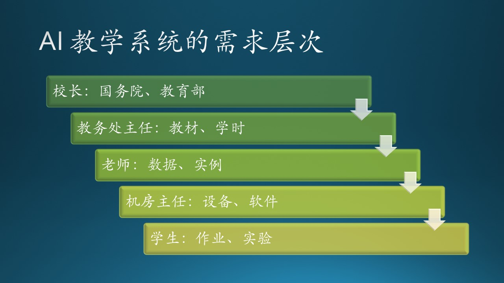

## 7.3 木头与 AI 教学需求的故事

这一天，木头和几个微软的同事来到一所高校调研，受到了校长、老师和同学的热情接待。在一个可以容纳 10 几个人的会议室里，大家围坐在桌前，一边品着刚刚下来的毛尖茶，一边聊着 AI 教育。

图 7.3.1 - AI 教学系统的需求层次

### 7.3.1 校长和教务处主任的发言

首先当然是请校长发言。

“首先感谢微软的相关同志来我校做调研，我们这边今天参会的有分管校长、教务处刘主任、机房赵主任、老师代表和学生代表。下面我先说说大形式（校长端起杯子喝了一口茶水）。

“国务院2017年印发了《新一代人工智能 发展规划》，标志着人工智能作为产业变革的核心驱动力和引领未来的战略技术，已上升为国家战略......构建包含智能学习、交互式学习的新型教育体系。

“对于AI教育企业而言，去年的政策环境足够振奋人心。教育部发布的《高等学校人工智能创新行动计划》提出......人工智能+X的复合特色专业，解决AI的人才问题。

“近日，教育部网站发布了《教育部2019年工作要点》，提出......AI+教育和互联网教育注入一剂强心针。

......（省略1000字）

“微软公司一直在软件领域执牛耳地位，而且也一直支持高校的教育，所以我们想听听微软在这方面有什么想法。”

木头：“感谢您的信任！支持高校的教育一直是我们的宗旨。刚才校长先生的讲话已经给我们指明了方向，这次来其实还是想听听各位一线老师目前在 AI 教育上有什么需求和痛点。”

教务处主任：“那我先说说吧！现在市面上的教材很多，国内的国外的都有，最知名的就是周志华老师的“西瓜书”《机器学习》，李航老师的《统计学习方法》，还有一本国外翻译过来的“花书”《深度学习》。但是我总觉得这些书做为教材的话，难度有点儿大，老师首先要自己学习，做课件，然后再讲给学生听，但学生们往往反映听不懂。”

### 7.3.2 老师的发言

木头：“那为什么学生听不懂呢？”

张老师：“首先是这些书本身的内容难度偏大，教课的老师们也是刚刚接触这方面的知识，自己理解起来还需要时间，讲课时也做不到融会贯通。”

王老师：“学时比较紧张，一般的32课时的安排，只能紧巴巴地讲完，赶进度，所以也讲不细。”

李老师：“还有一个问题，这些教材上大多没有例子，老师们也想不出合适的例子，找不到合适的数据集，也没有合适的实验环境，这样干巴巴地讲公式，学生当然听不懂了。”

木头：“对对对，实验环境非常重要，学生动手学习的话，比了解书本知识更容易。”

教务处刘主任：“我们目前还没有可以做数据科学实验的环境，听说建设这么一套环境需要不少资金和技术支持。校长，您看看能不能批一些费用？”

校长：“这个没问题！只要大家有可行方案，我这里全力支持！”

教务处刘主任：“好好好！那么微软方面在实验环境建设方面有什么好的建议吗？”

木头：“我们有成熟的解决方案，服务器端架设在 Azure 上，但是需要校方购买一些必须的客户端设备，比如可以支持手写的电子显示屏，建立到 Azure 的互联网连接，校园网上可以部署专用的实验和作业系统，在机房的客户端机器上安装 Python 等必要的第三方环境。”

机房赵主任：“这些问题都可以解决，只是现在机房的计算机的操作系统还是 Windows XP，有些陈旧了。另外，我们也没有 GPU，听说非常昂贵？”

木头：“如果是 Windows 10 操作系统是最好的。关于 GPU，如果初期资金紧张或者不想维护这么昂贵的设备，可以使用 Azure 上的科学技术虚拟机，相当云租赁 GPU，按使用时长付费，平时不用就关掉。”

张老师：“学习 AI 看起来必须要 GPU 了？那么贵的话，普通人怎么学得起？门槛太高了！”

木头：“哦，这个忘记说了，当前流行的深度学习要想到达 SOTA（state of the art，最先进的）水平，确实需求 GPU。但是，学习传统的机器学习和入门级别的深度学习，完全不需要 GPU。”

教务处刘主任：“那太好了！有没有相关的教材或案例可以供老师参考的？”

木头：“我们最近出了一本《智能之门》的书，由高等教育出版社出版，又名‘九步学习法’，意思是一共用9步就可以入门深度学习，里面有通俗的文字、详尽的公式推导、完整的配套代码、有代表性的实验数据、可解释的实验结果，普通人用 CPU 计算机就可以学习。”

张老师：“如果有配套的代码的话，学生们可以上机动手亲自体验，这样会大大降低学习的门槛。”

王老师：“对！CPU 就能做简单实验的话，同样会降低门槛。”

李老师：“配套的 PPT 应该有的吧？赵主任，咱们机房有没有可以手写的显示大屏，这样可以一侧放 PPT 课件，另一侧写板书，一方面不用吸粉笔末了，另一方面板书可以以图片方式课后发给学生们复习，学生不用自己记笔记了。”

赵主任：“手写显示屏已经下单了微软的Surface Hub 2，正在安装调试。Windows 10 操作系统，天然支持访问 Azure 以及 Office 办公软件。”

### 7.3.3 学生的发言

毛毛同学：“那太好了！同学们听课时忙着记笔记，有时候就会漏掉一些重点讲解。我还有个问题，这个 AI 教育系统能留作业和判作业吗？”

木头：“好问题！由于 AI 课程的特殊性，留作业和判作业，打分、排名，是这个系统的一大特色。”

毛毛同学：“请问老师，这个系统能够平时使用吗？因为我们想课余时间训练一些模型练练手，比如练习调参、熟悉多种神经网络模型等等。”

木头：“这个要看咱们学校对 GPU 的使用计划了，如果自己买一块 GPU 的话，当然使用越多越好；如果是租用 Azure 上的 GPU 的话，就是不一样的策略了，比如定时开放使用权限等等。”

### 7.3.4 外部系统

教务处刘主任：“我们学校吧，目前已经建设了不少管理系统了，比如说这个学生管理系统，这个教师管理系统，还有这个课程管理系统。赵主任，您那里是不是还有别的？”

机房赵主任：“是的，我这里还负责机房管理系统。咱们这个 AI 教学系统和这些已有的系统是什么关系呢？”

木头：“现有的这些系统对 AI 教学系统来说，都非常有帮助，这样我们就不用从头儿开始建设这些基础数据库了。比如学生想使用 AI 教学系统，首先要登录，这个用户名和密码呢，就依靠学生管理系统来验证了，验证通过后，给 AI 教学系统一个 Token（令牌），学生就可以开始使用教学系统了，不需要二次登录。”

......

大家还聊了很多，木头把后来的一些细节放到了“木头与 AI 教学的故事”中，为老师和同学们描述了一下 AI 教学系统的真实体验。
