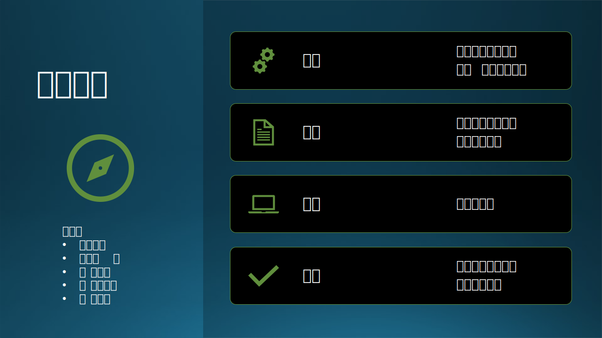
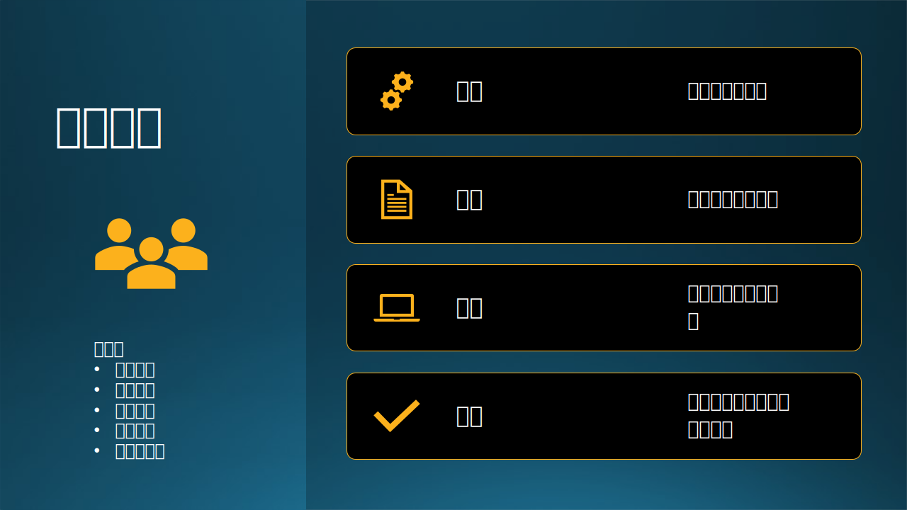
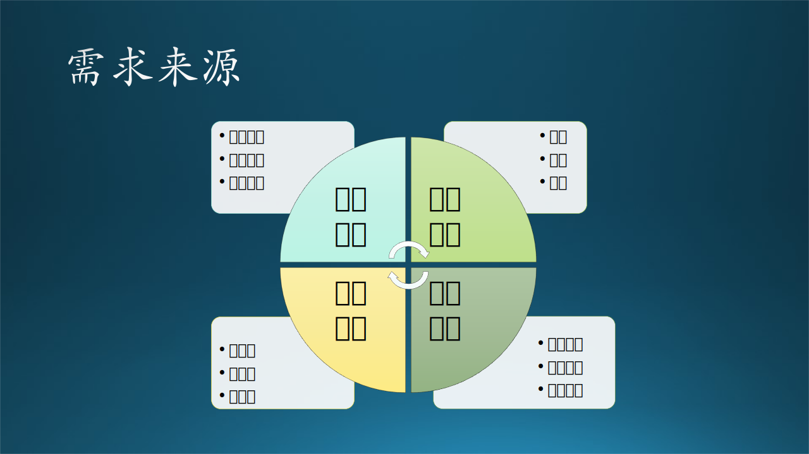

## 7.3 第一步：需求层次分析

### 7.3.1 需求的三个层次

从需求讲述人来看，不同人所处的位置不同，从而给出不同层次的需求，按照业界惯例，我们一般定义三个层次，如图 7-8 所示，即：

- 业务需求。
- 用户需求。
- 功能需求。

图 7-8 需求层次分析

7.2 节中的故事虽然是面向学校教育系统软件的需求分析，而面向企业的软件需求层次也是大同小异，同样可以分为三个层次。面向大众的软件，比如我们常用的办公软件、手机软件，也符合这三个层次特征，我们将在第八章讲述。简单的概述是：

- 业务需求描述产品目标，是一个比较虚的概念，无法具体操作。比如在秋千图中，父母需要让三个孩子感到童年的快乐。
- 用户需求描述应用场景，是对角色和工作流程的描述，了解系统运行后能达到的效果。比如在秋千图中，三个孩子可以一起在一个挂在树上的秋千上玩耍，体会在空中飘荡的感觉，同时保证安全。
- 功能需求描述操作细节，是非常具体的功能点的描述，从用户需求中抽取。比如在秋千图中，可以是各种具体细节：绳子要结实，可拆卸，距离地面半米高，不怕雨水，柔软舒适，有扶手等等。

#### 1. 业务需求（Business Requirement）

我们先来看看校长和教务处主任的需求。

- 校长主要是讲政策方面的内容，以及国家对学校、企业的期望，是一个宏观的大需求，即：培养出一名优秀的学生。
- 教务处主任从教材入手，反映了目前高校存在的 AI 教育的普遍问题，比如：难度大，学生不易听懂。所以，主任的需求很简明扼要：提供一门让学生能够听懂的 AI 课程。

我们把这种需求叫做**业务需求**（因为需求来自业务管理者）或**客户需求**（客户代表一个法人或者一个企业，并非指某个具体的人）。

图 7-9 第一层次：业务需求

业务需求（Business requirement）标志组织或客户高层次的目标。业务需求通常来自项目投资人、购买产品的客户、实际用户的管理者、市场营销部门或产品策划部门。

业务需求描述了组织为什么要开发一个系统，即组织希望达到的目标。使用前景和范围（vision and scope）文档来记录业务需求，这份文档有时也被称作项目轮廓图或市场需求（project charter 或 market requirement）文档，这类文档超出了本书的讨论范围。

- 来源：投资人、负责人、管理者、市场营销部门、产品策划部门等等，非直接用户。
- 内容：说明需求的背景原因、系统目标、战略理念，描述了为什么要开发一个系统，即希望达到的目标。
- 作用：指导系统构建的根本基础和原则。当后续的工作中有任何可能发生歧义、争论的地方时，要用这个来做最终评判标准。
- 输出：这一层次需求应该出具产品的前景和范围说明，也可以叫做项目轮廓图或市场需求文档。

也有一些观点认为这一层叫做目标需求，下一层叫做业务需求。还有另外一种分类方法，把校长的宏观需求称作“组织级需求”，把教务处主任的需求称作“业务需求”。我们在这里按照大多数文献的命名方式，以便读者可以方便地相互对照。

比如，该需求中有一条说明是：“软件系统应该根据市场和用户的变化而不断调整，以满足利益最大化的目标。” 那么为了完成这个比较虚的目标，需要软件在提供基础功能之外，还要做很实现很多辅助的功能，比如需要收集用户的操作信息便于后期优化界面，同时又要符合政府关于保护个人隐私的规定。

#### 2. 用户需求（User Requirement）

我们再来看看老师们和机房主任的需求。

- 老师们对教材、时间、讲课方法等都有自己的一些看法，因为 AI 相关课程的难度是一些传统课程不能比拟的，实际上也是变相地表达了对 AI 教育系统的期望（需求）。
- 机房主任关心的机房软硬件设备对系统的支持，是否需要升级、如何维护等等问题。
- 学生们对上课的体验、作业的体验有自己的要求。

我们把这种需求叫做用户需求，因为需求来自直接用户。读者可能会觉得会奇怪：难道校长合教务处主任不是用户吗？-- 他们是用户，但他们更多的时候是客户。用户与客户的区别在本节最后一个部分讲解。

图 7-10 第二层次：用户需求

它描述的是用户的目标，或用户要求系统必须能完成的任务。用例、场景描述、事件/响应表都是表达用户需求的有效途径。也就是说用户需求描述了用户能使用系统来做些什么。

- 来源：系统的实际操作、使用者。
- 内容：从岗位自身的实际工作内容出发，以完整的故事链的形式讲述系统可以完成什么任务。
- 作用：指导系统设计、功能优化。
- 输出：通过对这一层次需求的理解，应该画出“用例图”和“用例说明”作为输出。

在 7.4 节中的“AI 课堂教学的故事”中，就是用对场景的描述来表达用户需求的。通过这个故事中的诸多细节，可以实际分析出用户需求。比如，故事中说“老师浏览了一下全班同学的作业成绩”，那么就需要系统可以提供关于电子版作业的一整套功能。

#### 3. 功能需求（Functional/Behavior Requirement）

第三层次的需求，有些直接来自用户，更多的来自需求分析人员的需求分析结果。

图 7-11 第三层次：功能需求

功能需求描述开发人员需要实现什么，习惯上总是用“应该”对其进行描述：“系统应该发送电子邮件来通知用户已接受其预定”，有时也被称作行为需求（behavioral requirement）。用户利用这些功能来完成任务，满足业务需求和用户需求。

- 来源：系统的操作、使用者，以及需求分析结果。
- 内容：描述系统提供的功能或功能组，以及对每个功能的具体描述。
- 作用：指导系统后续的设计和开发，是需求分析的完成标志。
- 输出：通过对这一层次需求的分析，应该输出《需求规格说明书》，还有其它一些重要的图和模型，将会在下几节中详细说明。

这些需求分析人员被称为系统分析员，在微软没有为这个角色专门设立岗位，而是由资深的开发人员担任。系统分析员一般被要求在领域和技术两个方面都有较深的理解，才能够架起从需求到设计的桥梁。需求分析的结果就是《需求规格说明书》。

### 7.3.2 需求来源

#### 1. 需求来源

从上面的故事中，虽然所有的“需求”都是从客户的语言文字描述中得到的，但其实是有背后的领域知识的。更进一步地，我们可以挖掘整理出真正的需求来源，如图 7-12 所示。

图 7-12 需求的来源

需求的来源可以分成四类：

- 市场需求

  最终用户、甲方客户、产品人员。

  比如客户要求每隔 60 个交易日，股票预测系统就需要用最近的历史数据重新训练一个新模型。那么这个 60 个交易日的定义是否合理呢？是不是 45 个交易日更合理？这些问题是市场定义的，不需要技术人员去考虑，只需要服从。当然，技术人员可以根据技术条件提出建议。

- 监管需求

  政府、行业、企业。
  
  比如政府规定不允许收集个人隐私信息，那么软件产品就不能收集用户的姓名、手机号码、家庭住址等信息，但是（也许）可以收集年龄、职业、性别等模糊的个人信息，这些信息不能反向定位到某个人。

- 技术需求

  软件开发团队、合作团队、外部系统。

  比如，技术要求所有系统必须运行在 Azure 上，那么就不能使用 Azure 之外的技术。

- 质量需求

  性能、可靠性、安全性等等。

  比如，用户要求股票预测系统性能要在 30 分钟内给出结果。那么在设计系统时，就要考虑分布式运算等手段。为了保证可靠性，还需要多台计算机做备份，那么数据存储的设计就需要满足多点访问的一致性。

有了需求来源的明确定义，才能够有挖掘的基础和引导的目标。其中：
- 监管需求是自上而下的，软件产品要服从；
- 技术需求是有章可循的，软件产品只有服从；
- 质量需求是客观存在的，软件产品也只有服从。
- 只有市场需求是丰富多彩、富于变化的，所以需求的演进与引导都是从用户、客户、产品人员而来的。

笔者从长期的软件工程实践中发现，需求的演进动力，往往不是来自用户的，而是来自产品团队的。来源有几个方面：

- 对现有产品的附加功能。
- 技术创新带来的新功能。
- 多个产品的融合。

所以，需求的引导也一般是由产品团队来完成的。就如同前面的一个故事中讲到的，用户需要快马，福特就制造了汽车。在福特那个年代，养马当然比买车便宜，但是现在养马反而是件奢侈的事情了，养马的需求从快速通行的需要变成了财大气粗的任性。

#### 2. 客户和用户的区别

在日常生活中我们经常混用“客户”和“用户”这两个词汇。希望读者在学习完需求分析后能够有个明确的认识。在软件工程需求分析中：

- 客户，也可以叫做甲方，提供软件项目资金的一方。可以是一个组织、一个群体，少数情况下是个人。

- 用户，一般是指最终用户，使用软件的组织、群体或个人。有可能和甲方是同一个实体，也可能不同。用户付费或免费使用软件，在使用过程中可能发生费用，费用都由甲方收取。

相对于甲方客户，软件开发者是乙方。有些公司自己开发软件自己使用，这种情况下，甲方（客户）=乙方=用户，三位一体，比如我司内部使用的一些工具，提高生产力。有时这些内部工具可以进化成产品供其它用户使用。

如果发放给最终用户使用，则甲方=客户=乙方，比如微信、微博、Office 办公软件。
