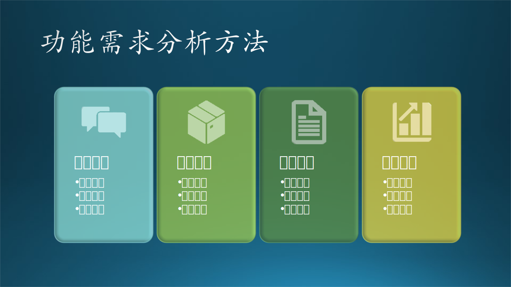
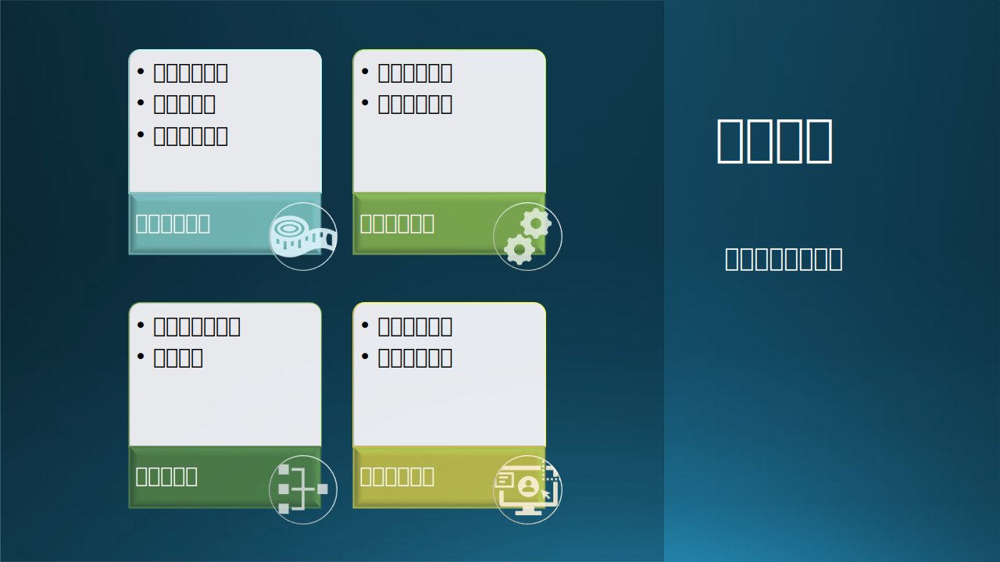
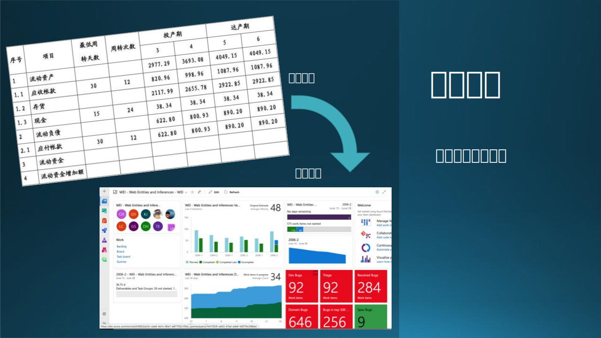

## 7.5 第三步：功能需求分析

### 7.5.1 功能需求分析方法

对需求的第三个层次，即功能需求分析，就是通过记录用户诉求（文字的或语言的），仔细领会用户的真实意图和工作流程。具体的方法可以有以下几种$^{[2]}$：

- 小组讨论，从语义上搞清需求。
- 卡片分类，整理功能需求集合。
- 单据分析，业务流程逻辑需求。
- 报表分析，数据汇总统计需求。

见图 7-16。

图 7-16 需求功能分析

下面对这四种方法逐一说明。

#### 1. 小组讨论

图 7-17 需求分析之小组讨论

项目小组成员通过任何形式获得用户需求，回来后自己内部开会，对需求进行讨论，目的如下：
（1）把抽象的需求具体化
  - 用户：“这么多论文乱七八糟的，根本没法找！”
  - 毛毛：“我觉得用户并不喜欢读很多论文。”
  - 木头：“需要论文分类管理功能，可能是根据类别、会议或者日期。”
  
 【最佳实践】用户的需求有时是用情绪化的语言形式表达出来的。

（2）用计算机专业词汇描述需求
  - 用户：“这个论文很有价值，以后还要再看。”
  - 毛毛：“给论文加一个类似豆瓣评分的级别。”
  - 木头：“按日期保存论文到系统指定的存储位置，并可以根据日期和名称检索。”

【最佳实践】需求文档要明确指出存储、检索的功能。

（3）避免需求理解偏差
  - 用户：“这个游戏软件主要是面对儿童的，比如我，希望家里的三个分别为7岁、10岁、12岁的孩子都可以玩。”
  - 毛毛：“用户希望如果一个家庭有三个孩子的话，可以同时玩这个游戏。”
  - 木头：“别闹，用户是希望各个年龄段的孩子都可以玩。”
  
【最佳实践】用户的举例通常带有实例化性质，需求文档需要泛化这些需求。比如该用户家的三个孩子恰巧都是男孩儿，或者该用户家的孩子的身高比同龄人的平均身高要高，这些都需要广泛调查后再确定目标用户。其实在著名的秋千图的例子里，用户的原始想法是用一个橡胶轮胎挂在树上做秋千，这样他的三个孩子都可以玩儿。但是需求分析人员把“三个孩子都可以玩儿”理解为“三个孩子可以同时玩儿”，于是设计了一个三层的木板结构。

（4）确定需求边界
  - 用户：“能不能加两个人手，在这个月就把那个云端同步的功能也一起做了？”
  - 毛毛：“云端同步的功能，只是把客户端的注释标记上传到云端保存而已，好像没有很大的工作量。”
  - 木头：“对不起，我们本期的需求已经确定了‘论文注释’功能只在客户端保存，开发计划已经排满了。况且云端同步功能还需要购买 Azure 资源，这部分也不在预算内。”

【最佳实践】用户总希望少花钱多办事，而市场人员往往为了订单随口承诺一些事情，需求文档需要明确这些边界。做计划外的功能，会影响计划内的软件的质量，和一些不可预估的如预算、设备、部署等方面的麻烦。

（5）判别错误需求
  - 用户：“这个论文最好还能保存成 docx 格式，便于修改。”
  - 毛毛：“保存成 docx 功能还能用 Word 打开阅读，很方便。”
  - 木头：“你......我......人家发表的论文你改什么改？”
  
【最佳实践】对用户的一些需求，需要分析它的背后的含义，再确定其正确性。

（6）识别潜在需求

  - 用户：“我批改了这篇论文，我想把我的意见通过电子邮件转达给其它人。”
  - 毛毛：“电子邮件是无纸办公的重要手段，倒是可以考虑增加这个功能。”
  - 木头：“用户实际上是想通过网络的方式把自己的意见快速准确地转达给其它人，那不如我们后期考虑在 Azure 上搭建一个服务器吧，这样大家都可以分享自己的见解。”
  
【最佳实践】就如同亨利·福特遇到的情况：福特问用户在交通方面有什么需求，用户说“希望有一匹快马”。但其实用户需要的只是“快”，而不是“马”，“快”是真正的需求，“马”只是载体，所以福特开始造新的载体——汽车。理解用户的真实意图，用自己的专业知识提供解决方案。

#### 2. 卡片分类

用户在述说需求时，一般是杂乱无章的，整理成体系会有些困难。此时，无论用何种需求调研方法，我们可以先把从用户那里听到的每个需求，都记录在一张小卡片上面。积攒了一定程度后，把这些小卡片根据内容或者来源进行分类，就形成了一些模块或子系统的雏形。

微软内部有一种做法类似于卡片分类，叫做 Backlog，就是使用软件把一些想法记录下来，在下一阶段的需求分析开始时，把这些想法拿出来分类整理，大家评估一下需求属性，再排一下优先级，成为真正的功能写到文档中等待开发。

图 7-18 需求分析之卡片分类

木头在做 Edge Mobile Browser 的需求分析时，使用了卡片分类法来归纳总结一些浏览器上的功能的分类，这样做的好处是：

（1）应用场景分类

【最佳实践】帮助客户理清思路。

从客户角度可以清楚这个软件可以提供什么类型的功能，而不是看到乱糟糟堆砌的一堆功能，这可以帮助客户建立对这个软件的质量方面的信心。

【最佳实践】发现新功能。

需求分析人员可以从已有分类中开拓思路，设计出一个惊喜型的功能。

分类设定，其实对人类的思维是一个双刃剑。木头的感觉是，很容易陷入已定类别中不能或者不敢突破。另一方面，也可以帮助需求分析人员仔细研究每个类别里的功能，找出缺失的部分，或者找出缺失的类别，来开发出惊喜型功能。

【最佳实践】学习领域知识。

开发人员可以快速学习领域知识，理解真正的需求。

木头自己就通过这次分类整理，真正地认识到了浏览器功能的全貌，一旦有了“上帝视角”，会不由自主地感叹到：“原来如此！那么浏览器那个组的几百号儿人，这些年都做了什么，为什么 Edge 浏览器口碑越来越差？”。话音未落，浏览器组先是换了一个大老板，紧接着决定用 Chromium 做引擎，重新写 Edge 浏览器的 Shell，而这个大老板，就是以前在 Windows Team 负责 Shell 的，这说明了一个问题—上层已经决定用 Chromium 做引擎，让一个对 Shell 很有经验的人去领导 Edge 项目的开发，在 Chromium 的基础上做一个微软风格的 Shell，成为新的 Edge 浏览器。
  
（2）模块功能整合
  
【最佳实践】底层模块规划。

相近的功能可以共用底层模块，减少代码重复。

比如浏览器里常用的两个功能：网页收藏，浏览历史。从外观上看，很明显都是一个列表，里面存放一些网页记录。最起码，那个列表控件就是可以重用的部分。
  
【最佳实践】合理分配任务。

合理地分配开发资源，让一个人或小组负责一类功能。
    
木头在 Edge Mobile Browser 项目中，担任的是质量管理任务，亲眼目睹了当时的 Dev Manager 是如何分配工作的：先给甲乙丙三个开发人员各分配一个任务模块 A、B、C，假设甲先做完了，就分配另外一个任务模块D，而 D 和 A 是两个不相关的模块。

上面只假设有三个开发人员，实际上当时有10几个人，每个人都是在功能类别之间跳来跳去，需要熟悉每一个功能模块的底层代码，造成资源上的浪费。

（3）子系统划分

【最佳实践】理清子系统边界。

相互之间有较强关系的模块聚合在一起，可以形成子系统。子系统划分其实不是设计阶段才开始的任务，而是在需求阶段就已经形成雏形了。

【最佳实践】规划接口。

用卡片分类法，在视觉上就可以直接形成功能聚类，理清子系统的边界，便于后面做接口设计。

（4）界面设计指导
  
【最佳实践】统一菜单入口。

同一类功能放在一个菜单入口里，用户容易找到。

在京东、淘宝等软件里，作为软件从业人员的木头，可以明显感觉到界面菜单是经过精心设计的。但是在使用一些银行的手机软件时，就会觉得功能不容易找到，缺乏设计。

【最佳实践】规划入口位置。

不同使用率的菜单入口在屏幕上的位置不一样，体现了重要程度。

尤其是在手机上，屏幕小，寸土寸金，所以按钮的位置需要非常精细的设计：
  - 是否需要在首页上显示
  - 如果需要显示，放在什么位置，方便用户单手操作
  - 按钮的尺寸多大，才能即明显，又不影响美观，又能很容易地点击

#### 3. 单据分析法

传统行业中，往往存在一些手工填写的单据或报表，可以给流程控制提供很好的抽象信息，比如：银行的存款单、取款单，仓库的入库单、出库单，海关的报关单、提货单，企业的采购单、验货单，财务的资产负债表、损益表等等。

图 7-19 需求分析之单据分析

单据分析法，分析用户当前使用的纸质或电子单据，通过研究这些单据所承载的信息，分析其产生、流动的方式，从而熟悉业务，挖掘需求。一个组织，在没有信息化管理系统时，它的单据体系其实就是它的信息体系，填写单据的过程就是信息录入的过程，单据传递的过程就是信息流转的过程，最终单据进入的档案室就是数据库。因此，通过分析单据来获得关于信息管理的需求可以收到事半功倍之效。单据分析法是获取需求过程中使用得相当普遍的方法，值得仔细研究。

（1）理清业务逻辑

想读懂一张单据，需要搞清下面四个问题：

  - 单据源头
  - 流动途径
  - 字段含义
  - 备注信息  

  分析好现在使用的这些报表，可以深入到管理者的管理神经，弄清楚当前公司管理者感兴趣的信息，最终给各级管理者带来真正的价值。报表是一个信息系统的集大成者，提前做好报表分析，可以加深理解管理脉络，理解信息系统的最终需求。

（2）数据设计的依据
  
这些单据其实就是数据流图中的数据/文件部分，也可以做为数据设计的依据，但是其中肯定有很多冗余的项，需要用范式知识来解决。范式知识我们将在后面介绍。

表 7-2 入库单示例

|品名|型号|单位|数量|生产日期|批号|入库日期|备注|
|--|--|--|--|--|--|--|--
|鼠标|LG302|个|1000|2020/09/01|12|2020/09/22|限量版|
|键盘|C104|个|200|2020/09/02|9|2020/09/23|京东专供|

如表 7-2，作为一张纸质的原始表单来说，已经比较完善了。但是作为软件用的表单，有两个地方要注意：

- 还缺一个唯一的入库单号做主键，否则无法索引。
- 另外就是型号字段是个外键，需要设计另外一张表来描述 LG302 和 C104 的具体特性，如重量、体积、颜色、无线/有线、是否人体工程学设计等等。

#### 4. 报表分析法

报表分析法，通过分析用户使用的报表获取需求。报表跟单据是有本质区别的。单据是在业务处理过程中用户填写的纸质文件，往往是一个信息采集、传递的过程，而报表则是根据一定的规则对批量数据进行检索、统计、汇总，是一个信息加工、分析的过程。

图 7-20 需求分析之报表分析

生成报表的数据来源，是需求分析的重要手段，这些数据必须在需求链前端存在，不能到最后环节凭空产生。要做到“报表中需要展示什么，就去收集什么数据”，而不是“已经有什么数据，就在报表中展示什么”。

分析好现在使用的这些报表，可以深入到管理者的管理神经，弄清楚当前公司管理者感兴趣的信息，最终给各级管理者带来真正的价值。报表是一个信息系统的集大成者，提前做好报表分析，可以加深理解管理脉络，理解信息系统的最终需求。

对一些报表类的需求，软件除了可以做到比纸质报表更精美的格式、字体外，需求分析人员应该设计出对应的可视化数据图版（Dashboard），让数据展示更生动。

### 7.5.2 需求分析实例

我们用一个简单的实例来进行说明：用户自助寄件的需求。

甲方：快递公司

需求描述：目前很多城市的小区都已经有了快递柜，但快递柜主要是用于送件使用，而对于快递公司收件，用得比较少，某快递公司，就希望利用快递柜，来实现用户自助寄件的需求。

#### 1. 业务需求

首先，我们来分析其业务需求
这个案例的业务建设方是：快递公司，其业务需求也很明确，就是：用户自助寄件。

业务方之所以要建设这个需求，其目的是：希望利用快递柜，实现更高效的收件服务，减少人工上门收件的等待、低效、人力投入成本高等问题。

#### 2. 用户需求

其次，我们来看用户需求
这个案例的用户，就是每一个要寄快递的人，那么他们的需求是什么了？

他们的需求，其实就是在进行“自助寄件”的过程中，你尽量让我简单、易用，高效、快捷。

#### 3. 功能需求转化

接下来，我们进行需求分析的转化。

需求分析的转化，核心是两个点，一是对这个业务的场景进行充分的理解和认知，二是想明白业务场景中需求点，要通过何种方式来满足它。

业务需求是“用户自助寄件”，这个业务要实现，我们结合寄快递的实际场景，其实还是蛮容易就能想到，有3个关键环节：

用户要填写单据：即填写收发件人的相关信息；
用户要能找到周边的快递柜，并且能打开它；
还需要进行计量、支付快递费的问题
这三个环节，基本把这个业务的三个关键阶段说明出来了，它就是：填单——>找柜子放件——>支付。

然后，逐一对三个阶段进行具体的分析。

（1）填单阶段

业务方需求：必须收件人、联系电话、寄件人信息清楚、明确等等。
用户需求：能选的就选，能简单填写的就简单填。
转化为功能需求，你发现，无非是通过表单形式让用户把相关信息填上来，而为了满足用户需求，你肯定需要设计对收件人的记忆功能，让用户填写一次，后续每次只需要选择而已（相关的细节还很多，这里只做举例）。

（2）找柜子放件阶段

业务需求：把最方便最合适的柜子告诉用户，并确保用户能安全、准确的找到快递柜、放入快递件；
用户需求：我就想知道我要把快递件放到哪里，别让我多走；
这个业务需求和用户需求说起来简单，转化成功能需求时，其实里面还蛮多细节的：

位置服务肯定需要，一是为满足发现柜子的需求，二是也有导航的需求；
如何打开柜子呢？从我们的产品经验或者竞品参考来看，可以有扫描开启、验证码等方式；
如何保证用户去到快递柜，一定就有其空的柜子可以给他放了，这里面就涉及一个快递柜忙闲资源的管理；
所以，这里转化为功能需求时，你发现：有位置服务功能、扫描开启/验证码开启功能，柜子资源分配管理功能等；

（3）支付阶段

业务需求：根据收费标准，准确无误、及时收到用户快递费。
用户需求：支付方便。
功能需求：
如何来计量，由于是自助寄件，称重显然不合适，那么按体积是一种较简便的方式，而如何按体积了，其实根据可快递柜的柜子；
如何支付，这个还简单，可以使用比较常用的几种支付方式就好；
以上，都只是简单的需求分析和转化的过程，实际的需求过程中，我们经常讲需要结合业务场景、用户场景把一些关键细节挖掘出来，并能在产品设计时考虑进去，以给用户一个良好的体验。

#### 4. 业务场景细节的挖掘

比如：在上面的开启柜子的方式中，到底用扫描开启还是验证码的方式呢？

其实用“验证码开启”会更合适，因为会存在很多这样的场景，某个寄快递的人，刚好家里有人下楼，或者认识的邻居下楼，而快递柜就在小区门口，那么找人代劳一下放件是一种很正常的事情，那么这时候，使用验证码就是一种最合适、简便的方式。

又比如：某用户希望自己的快递能更快的被寄出去。

那么，如果在给用户呈现周边分布的快递柜的同时，还告诉用户，该快递柜的收件时间，目前快递员的分布位置，是不是能让用户更好的去选择呢。

这样的细节还很多，需要在实际分析中，更好的去理解用户场景、挖掘细节，并逐步的完善。

通过上面的分析，我们发现，只要你充分认清楚业务需求方的诉求、用户在执行具体任务时的诉求，并对产品的常规实现方式有了解的话，需求分析并不是一个多复杂的过程，就是这么一步步去推理、去转化的过程。

而要把每个细节做透，就必须在实际中多去磨练，在生活中多体验，学会场景化的思维方式。
