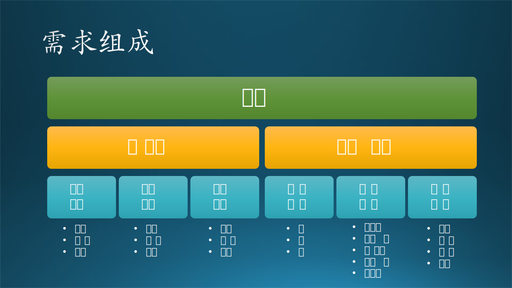

## 7.6 第四步：非功能性的需求分析

在前面几节中，我们分析了来自学校的教职员工的各个不同层次的需求，使我们清楚地认识到了业务、用户、功能三个层次的需求的区别和联系。在本节中，我们将会学习如何发现出一些隐形需求，以便能够更全面准确地把握需求。

### 7.6.1 需求组成

图 7-21 需求组成

我们先只看左侧分支，可以得到四个公式：

$$
需求 = 功能性的需求 + 非功能性的需求 \tag{7.6.1}
$$

在工程实践中，功能性的需求占的比重很大，但是非功能性的需求也是非常重要的组成部分，而且这些非功能性的需求不能满足的话，更有可能造成整个项目的失败。所以我们有了公式 7.6.1。

$$
功能性的需求 = 业务需求+用户需求+行为需求 \tag{7.6.2}
$$

注意，式 7.6.2 中的“行为需求”既“功能需求”，但是和“功能性的需求”不是一码事。

而公式 7.6.3 则说明了非功能性的需求的组成：

$$
非功能性的需求 = 模糊需求 + 质量属性 + 约束条件  \tag{7.6.3}
$$

接下来我们了解一下非功能性的需求的各个组成部分。

### 7.6.2 模糊需求（Overall Requirements）

模糊需求一般在业务需求层次提出，常见的就是三个字：快、好、省。所以，**也可以把它看作业务需求的一部分**。面对这种需求，我们的策略就是尽量量化它，把它转化成可以操作的功能需求或质量需求。如图 7-22 和式 7.6.4 所示。

图 7-22 模糊需求

$$
模糊需求 = 快 + 好 + 省 \tag{7.6.4}
$$

对于业务级投资人、负责人等领导来说，预期的质量需求就是三个字：快、好、省。这和当年的“多快好省”经济发展总路线如出一辙，实践证明是不能兼顾的。

- 快，可以理解为开发速度快，或者软件运行速度快。
- 好，可以理解为开发质量好，或者软件功能好。
- 省，可以理解为开发成本低，或者软件价格低。

这三者并存的话，会形成悖论：

- 速度又快、功能又好的产品，价格肯定不低（要钱），做不到省。
   
  比如说我们训练一个深度学习模型，如果用 GPU 的话，训练速度快，效果好，但是 GPU 的价格非常的昂贵。

- 功能又好、成本又省的产品，不是开发周期长，就是运行速度慢（要等）。
   
  同样是训练一个深度学习模型，用 CPU 当然也可以完成任务，但是使用 GPU 可以一小时搞定的东西，用 CPU 却需要两天。

- 速度又快、成本又省的产品，用膝盖想一想都能知道好不到哪里去（要忍）。

  还是训练深度学习模型，为了便宜就用 CPU 搞，为了速度快就少训练几轮，那么最后的模型效果肯定不好。

- 如果不顾实际三者都要的话，就是“要命”，该项目无法满足甲方要求。

在图 7-22 的右侧，举例说明了“提高用户满意度”的需求的对策。

【最佳实践】模糊需求普遍存在，甲方在潜意识中想少花钱多办事，于是就会提出一些比较飘渺的需求。对于模糊需求，一定要把它们落实在量化标准上。比如，乙方说“现在系统完成一次预测的时间只需要 15 分钟，已经很快了”，而甲方却说“我们本以为应该在 5 分钟内完成”。这就造成了双方的分歧。

### 7.6.3 质量属性（Quality Attribute）

质量属性包含很多内容，我们将会在后面的章节中专门介绍，在本节中可以用式 7.6.5 和图 7-23 来简单表述。

ISO 的质量属性定义是：

$$
质量属性=功能性+可靠性+易用性+效率+可维护性+可移植性 \tag{7.6.5}
$$

图 7-23 质量属性的组成

质量属性的项目非常多，但通常我们都用下面 6 个主要的属性来衡量软件的质量，而且是可以写在《需求规格说明书》中的。

- 功能性（Functionality）

  即正确性，程序满足需求说明的程度。这是第一要素。

- 可靠性（Reliability）
  
  软件系统在一定的时间内无故障运行的能力，比如：

  - 72小时小负载下可稳定运行；
  - 30分钟内的超负荷运行；
  - 4小时内负载从10%增加到100%的运行情况。
  

- 易用性（Usability）
   
  是一种有关用户体验质量的描述，关注的是对用户来说完成某个期望任务的容易程度和系统所提供的用户支持的种类，把用户作为开发过程的中心。

- 效率（Efficiency）
  
  静态效率指程序完成其功能所需的资源及代码数量。但是这种效率通常不是用户所关心的，而且也无法衡量，所以，一般用运行时的性能来代替。比如，我们可以要求一个软件：

  - 用户登录响应时间不超过0.5秒；
  - 可以支持并发访问用户数至少10000个；
  - 系统至少可以存储100M的用户文件。

- 可维护性（Maintainability）
  
  一般甲方会提出可维护性要求，但通常是比较虚的，比如：

  - 要求乙方给甲方人员培训，熟悉系统架构和模块；
  - 乙方在一年内保证软件顺利运行；
  - 软件提供 API 接口，可以二次开发。

- 可移植性（Portability）

  移植当前程序到另一个硬件配置或软件系统环境所付出的努力。比如 Office 办公软件要在 Windows 操作系统和 Mac 操作系统上都能运行，这在需求、设计、实现时就已经考虑到了，而不是一种临时行为。笔者认为这种传统的考察方法不太适合现代软件工程的要求。

还有一种划分方法，如图 7-23 右侧所示，把质量属性按软件生命周期分成五个阶段来考察：

- 设计时质量属性

   设计应该表现出整体的协调、一致、可预测性，其中包括**可维护性**。

- 开发时质量属性

   保持**功能**与需求匹配程度的完整、准确，代码和文档的可读性、完备性。

- 运行时质量属性

   其中包括**性能、可靠性**，即系统保持长时间内的快速响应，主要是指后台支持系统。

- 使用时质量属性

   主要指面向用户使用的**易用性**，是一种有关用户体验质量的描述，关注的是对用户来说完成某个期望任务的容易程度和系统所提供的用户支持的种类，把用户作为开发过程的中心。

- 变更时质量属性

   其中包括**可移植性**：从一种环境转移到另一种环境的能力。子特性包括适应性、共存性、易替换性、易安装性。

### 7.6.4 约束条件（Constraint）

约束条件可以用图 7-24 和式 7.6.6 来描述。

图 7-24 约束条件

$$
\begin{aligned}
约束条件=& 甲方约束（资源） \\
+& 乙方约束（开发） \\
+& 环境约束（技术） \\
+& 领域约束（业务） \tag{7.6.6}
\end{aligned}
$$

#### 1. 来自甲方 - 资源约束

客户总是会在下面几个问题上“斤斤计较”：

- 时间
  
  - 即软件开发完毕交付的时间，而且如果客户不懂得软件开发的规律，往往会要求在不可能的时间内一次性交付。
  - 而对于开发者来说，一定要争取宽裕的开发时间，通常是把预估的时间乘以2.比如预估3个月完成，那么就要和客户承诺6个月完成。
  - 在交付问题上，一次性地不可能搞定所有需求，至少需要3次以上的迭代，在没有新需求出现的前提下，才有可能完成。

- 金钱
  
  即开发软件、部署软件、后期宣传、运营所需要的费用。

【最佳实践】替客户省钱是要时刻牢记的原则，但是要事先告诉客户由此带来的问题，比如效率低下。而在开发时间上，一定不能让步。

#### 2. 来自乙方 - 开发约束

主要是乙方要考虑自己的开发团队的具体情况，比如：

- 领域知识
  
  开发人员对于目标软件所在的领域知识是否足够了解。比如要做一个银行系统的应用软件，一般银行都会找一个长期合作的软件开发商合作，避免领域知识的培训等额外工作。

- 技术水平
  
  - 技术岗位繁多
  
    如前端、后端，完全是不一样的编程思路。后端：入门难，深入更难，枯燥乏味，没有太大成就感，看一堆业务逻辑代码。前端：入门简单，先易后难，能看到自己做出来的展示界面，有成就感。
  
  - 开发语言繁多
  
    PHP 并不是最好的编程语言（这是业界流行的一个笑话），但是它和Java、C、C++、Python、C#、JavaScript等成为最流行的编程语言，一个开发人员能够熟练使用（不是精通）三种以上的编程语言，就已经很不错了。
  
  - 框架平台繁多
    
    会用 React 的就不用 Vue（二者都是JS前端框架），会用 Struts 的就不用 GWT（二者都是 Java 框架），会用 .NetFramework的就不用 .NetFramework Core（二者都是 C# 框架），等等。

- 团队情况
    
  - 成员磨合程度，主要是在工作习惯、沟通能力方面的考量。一个团队有新人加入的话，在初期，往往是拉低团队的生产力；如果新人很多，磨合期就要预计长一些。
  
  - 成员地理分布，主要是指像微软这种跨国公司，经常有跨区域合作的情况。比如做手机上的 Edge 浏览器时，PM 主要在美国，开发人员主要在中国，但是分在北京和苏州两个地方，还有一些依赖模块在欧洲开发。这需要制定好接口，并协调多方的进度保持一致。

【最佳实践】一个糟糕的经验是：三个臭皮匠，顶个诸葛亮。一个合理的做法是：一个诸葛亮带三个臭皮匠。

#### 3. 来自环境 - 技术约束

- 批准的技术清单

  许多大型组织在开发之前，都会列出一个可以使用的技术清单。如果你需要使用清单上没有的技术，就需要申请。

- 现有系统的互操作性

  在整合已有系统的时候可以使用的协议和技术。

- 目标部署平台
  
  目标部署平台是影响技术决策的主要因素之一。比如 Windows 和 Linux 的不同，再比如桌面软件和移动软件的区别。
 
  另外一个例子是目前的深度学习框架，如TensorFlow, PyTorch，MXNet等，都有自己的模型结构，无法互操作。微软开发了 ONNX（Open Neural Network Exchange，开放神经网络交换）格式的模型标准，可使得模型在不同的框架下使用，并使用标准的方式来部署，而不需要按照框架。目前官方支持 ONNX 格式的框架有：Caffe2、PyTorch、MXNet、ML.NET、CNTK，而TensorFlow非官方（开源方式）支持。

- 使用开源软件
 
  GPL（General Public License）协议规定，如果使用了它人的开源软件，那么自己的软件必须也开源。

【最佳实践】做商业软件时，不是任何开源软件都可以用的。一个负责任的开发者通常都很小心，尽量避免使用第三方产品。

#### 4. 来自领域 - 业务约束

- 行业标准
  
  - 比如中国的财务软件就有自己的数据接口标准，否则会出现任意两个软件之间的数据交换困难。这就要求在需求中提及“输出必须符合接口标准”。

  - 在金融股票市场中，如果想提供换仓建议，那么软件必须根据历史数据（比如过去60天的），在周一上午 9:30 之前跑出结果来。

- 政策法规
  
  举两个例子：

  - 微软对用户的隐私问题非常的重视，所以在任何系统中，都不能保存能够反向映射到一个自然人的用户日志；
  
  - 中国对地图数据的安全性有要求，不能存放在中国境外的服务器上。所以当年笔者得到了一个进入微软做国内地图数据处理的工作机会，从心里感激这个政策法规。

【最佳实践】一个新来者对领域知识不熟悉，要通过多问、多观察、多思考来尽快弥补差距。比如，请老同志吃饭。
