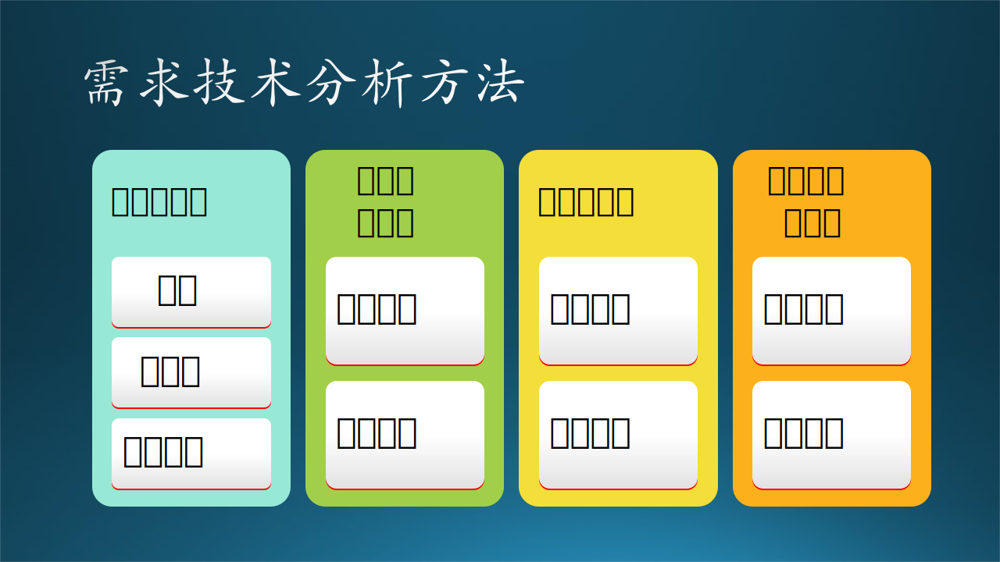
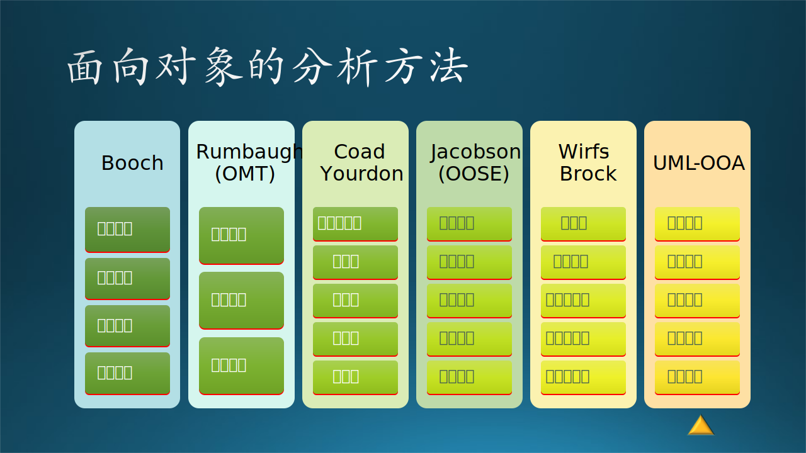
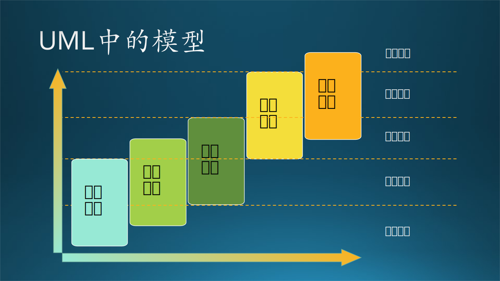
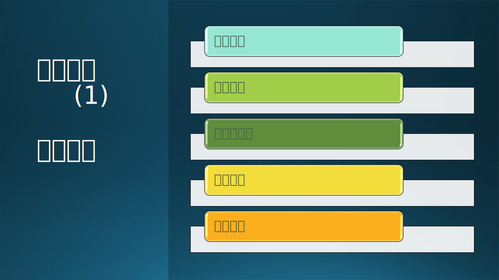

## 7.7 第五步：需求技术分析

目前，软件需求的技术分析方法较多，如图 7-25 所示，有一些大同小异，而有的则基本思路相差很大，比如有自下而上的，也有自上而下的，这两者的思路正好相反。笔者提倡自上而下由全局出发全面规划分析，然后逐步设计实现。

图 7-25 需求技术分析的各种方法

在这一节中，我们泛泛地介绍各种需求技术分析方法，只要求大家知道有这些方法存在，不要求全部掌握，有兴趣的读者可以自己做深入研究。最后我们会详细介绍面向对象的分析方法，这是本书中要重点介绍的方法。

### 7.7.1 软件需求分析方法

从系统分析出发，可将需求分析方法大致分为功能分解方法、结构化分析方法、信息建模法和面向对象的分析方法。

#### 1. 功能分解方法

将系统作为多功能模块的组合，各功能也可分解为若干子功能及接口，子功能再继续分解，便可得到系统的雏形，即公式 7.7.1 所示：

$$
功能分解 = 功能 + 子功能 + 功能接口 \tag{7.7.1}
$$

对于一个比较小的软件，或者是一个大系统中的局部功能，可以使用这种简便的方法。

#### 2. 结构化分析方法

结构化分析方法是由数据流图和数据词典构成并表示，所以此分析法又称为数据流法。其基本策略是跟踪数据流，即研究问题域中数据流动方式及在各个环节上所进行的处理，从而发现数据流和加工方法。结构化分析可定义为数据流、数据处理或加工、数据存储、端点、处理说明和数据字典。

$$
\begin{aligned}
结构化分析 &= 数据流图 + 数据说明 
\\
数据流图 &= 数据流 + 数据处理 + 数据存储 + 端点 
\\
数据说明 &= 端点说明 + 处理说明 + 数据字典 
\end{aligned} \tag{7.7.2}
$$

【最佳实践】结构化分析法和下面要说的面向对象分析法，并不是对立的，二者可以配合使用。因为在刚开始进行分析时，不可能马上就能发现真正的“对象”，而用数据流图可以重现真实需求，帮助分析人员逐步进入状态，这也是笔者多年的经验。

#### 3. 信息建模方法

信息建模可定义为实体或对象、属性、关系、父类型/子类型和关联对象。此方法的核心概念是实体和关系，最初由 P.P.S. Chen 在1976年提出，基本工具是 E-R 图。1981年 M.Flavin 改进后称之为信息建模法，后来又发展为语义数据建模法，并引入了面向对象的特定。其基本元素由实体、属性和联系构成。该方法的基本策略是从现实中找出实体，然后再用属性进行描述。

$$
\begin{aligned}
信息建模 &= 内部信息 + 外部信息
\\
内部信息 &= 实体或对象 + 属性
\\
外部信息 &= 关系 + 父子类型 + 关联对象
\end{aligned} \tag{7.7.3}
$$

#### 4. 面向对象的分析方法
 

面向对象主要考虑类或对象、结构与连接、继承和封装、消息通信，只表示面向对象的分析中几项最重要特征。类或对象是对问题域中事物的完整映射，包括事物的数据特征（即属性）和行为特征（即服务）。

$$
\begin{aligned}
面向对象分析 &= 实体分析 + 特征分析
\\
实体 &= 对象或类 + 结构与连接 
\\
特征 &= 继承 + 封装 + 消息通信 
\\
 &= 数据特征 + 行为特征
\end{aligned} \tag{7.7.4}
$$

由于面向对象分析方法的先进性和重要性，我们在下面着重介绍一下。

### 7.7.2 面向对象的分析方法

OOA（Objec-Oriented Analysis），面向对象的分析方法，目前已经衍生出许多方法，每种方法都有各自的进行产品或系统分析的过程，都有一组可描述过程演进的图形标识，以及能使得软件工程师可以理解一致的符号体系。

在图 7-26 中，虽然标题是“面向对象的分析方法”，但实际上，所列出的各种方法都包含了分析和设计两个部分。

图 7-26 面向对象的分析方法

现在广泛使用的 OOA 方法有以下几种：

#### 1. Booch 方法

Booch 由Grady Booch 在 Rational Software 公司工作时提出。方法包含“微开发过程”和“宏开发过程”。微开发过程定义了一组任务，并在宏开发过程的每一步骤中反复使用它们，以螺旋上升的方式维持演进途径。Booch OOA 宏开发过程的任务包括四个步骤：

（1）标识类和对象。
（2）确定类和对象的含义。
（3）定义类与类、对象与对象间的关系。
（4）说明每个类的接口和实现。

#### 2. Rumbaugh-OMT 方法

该方法是 1991 年由 James Rumbaugh 等 5 人提出来的，其经典著作为"面向对象的建模与设计"。Rumbaugh 和他的同事提出的对象模型化技术（OMT）用于分析、系统设计和对象级设计 。分析活动建立三个模型：对象模型（描述对象、类、层次和关系），动态模型（描述对象和系统的行为），功能模型（类似于高层的 DFD，描述穿越系统的信息流）。

（1）建立对象模型

   面向对象分析首要的工作，是建立问题域的对象模型。这个模型描述了现实世界中的“类与对象”以及它们之间的关系，表示了目标系统的静态数据结构。静态数据结构对应用细节依赖较少，比较容易确定；当用户的需求变化时，静态数据结构相对来说比较稳定。因此，用面向对象方法开发绝大多数软件时，都首先建立对象模型，然后再建立另外两个子模型。

   对象模型通常有5个层次，基本的工作步骤是：1）确定对象和类（object and class），2）确定结构（structure），3）确定主题（subject），4）确定属性（attribute），5）确定方法（method）。

（2）建立动态模型

   包括四个步骤：1）编写典型交互行为的脚本；2）从脚本中提取出事件，确定触发每个事件的动作对象以及接受事件的目标对象；3）排列事件发生的次序，确定每个对象可能有的状态及状态间的转换关系，并用状态图描绘它们；4）最后，比较各个对象的状态图，检查它们之间的一致性，确保事件之间的匹配。

（3）建立功能模型

   功能模型表明了系统中数据之间的依赖关系，以及有关的数据处理功能，它由一组数据流图组成。其中的处理功能可以用 IPO（Input/Processing/Output，输入/处理/输出）图（或表）、伪码等多种方式进一步描述。通常在建立对象模型和动态模型之后再建立功能模型。

#### 3. Coad/Yourdon 方法

该方法是 1989 年 Coad 和 Yourdon 提出的面向对象开发方法。Coad 和 Yourdon 方法常常被认为是最容易学习的 OOA 方法。建模符号相当简单，而且开发分析模型直接明了。其 OOA 过程概述如下：

（1）标识类和对象，可以从应用领域开始，逐步确定形成整个应用的基础的类和对象。
（2）标识结构，典型的结构有两种，一般/特殊结构和整体/部分结构。
（3）标识属性，找出在目标系统中对象所需要的属性，而后将属性安排到适当的位置，找出实例连接。
（4）标识服务，对象收到消息后执行的操作称为对象提供的服务，它描述了系统需要执行的处理和功能。
（5）标识主题，对模型进行划分，给出模型的整体框架，划分出层次结构。

Coad/Yourdon方法中的 OOD 模型对应于面向对象设计的四个主要活动步骤，分别是：

（1）设计问题域子系统：主要是对OOA模型中的主题层进行细化，将系统划分为若干个问题域子系统，每个子系统包含一组相关的类和对象，负责一定的功能。
（2）设计人机界面：主要是对OOA模型中的服务层进行细化，设计用户与系统交互的界面，包括菜单、窗口、对话框、按钮等。
（3）设计任务管理：主要是对OOA模型中的结构层进行细化，设计系统的并发和同步机制，包括进程、线程、信号量、消息队列等。
（4）设计数据管理：主要是对OOA模型中的属性层进行细化，设计系统的数据存储和访问方式，包括文件、数据库、缓存等。

#### 4. Jacobson-OOSE 方法

也称为 OOSE（面向对象软件工程）。Jacobson 方法与其他方法的不同之处在于他特别强调使用实例（use case）描述用户与系统之间如何交互的场景。Jacobson 方法概述如下：

（1）建立需求模型：定义系统的参与者、用例、用例图、用例说明和系统顺序图，描述系统的功能需求和外部交互。
（2）建立分析模型：定义系统的分析类、分析类图、分析类之间的关系和协作，描述系统的静态结构和动态行为。
（3）建立设计模型：定义系统的设计类、设计类图、设计类之间的关系和协作，描述系统的实现细节和设计决策。
（4）建立实现模型：定义系统的源代码、编译单元、组件和组件图，描述系统的物理结构和部署方式。
（5）建立测试模型：定义系统的测试用例、测试套件、测试结果和测试报告，描述系统的测试计划和测试执行。

#### 5. Wirfs-Brock 方法

Rebecca Wirfs-Brock于1990年提出，它以“责任驱动设计”（Responsibility-Driven Design）的思想而著称，强调从类、责任和合作关系对应用进行建模。Wirfs-Brock 方法不明确区分分析和设计任务。从评估客户规格说明到设计完成，是一个连续的过程。与 Wirfs-Brock 分析有关的任务概述如下：

（1）评估客户规格说明，使用语法分析从规格说明中提取候选类。
（2）定义每一个类的职责，或将职责赋予每个类。
（3）标识类之间的关系，基于职责定义类之间的协作。
（4）建立类的层次表示，构造系统的协作图。
（5）把类聚合在一起形成子系统。

能看出它是一种自底向上的方法。

#### 6. 统一的OOA方法（UML）

统一的建模语言（UML）已经被广泛使用，它把 Booch、Rumbaugh 和 Jacobson 等各自独立的 OOA 和 OOD 方法中最优秀的特色组合成一个统一的方法。在 UML 中用 5 种不同的视图来表示一个系统，这些视图从不同的侧面描述系统。每一个视图由一组图形来定义。这些视图形成一个序列，如图 7-27 所示：

图 7-27 UML 中的模型

（1）用户模型
   
   说明：从用户（ 在UML中叫做参与者）角度来表示系统。它使用用例（use case）来建立模型，并用它来描述来自终端用户方面的可用的场景。
   位置：位于需求调研、需求分析阶段。
   UML 视图：系统上下文图、用例图。
   
（2）结构模型

   说明：从系统内部来看对象和数据，即对静态结构（类、对象和关系）模型化。
   位置：位于需求调研、需求分析、系统设计阶段，主要是需求分析阶段。
   UML 视图：对象图、类图、包图。
   
（3）行为模型
   
   说明：表示了系统状态和行为，还描述了在用户模型和结构模型中所描述的各种结构元素之间的交互和协作。
   位置：位于需求分析、系统设计阶段。
   UML 视图：状态图、活动图、交互图（顺序图、通信图）。
   
（4）实现模型
   
   说明：将系统的结构和行为表达成为易于转换为实现的方式，在本书的第 6 部分中讲述。
   位置：位于系统设计、编码实现阶段。
   UML 视图：包图（包图不限于结构模型，可以灵活使用）、构件图。
   
（5）环境模型
   
   说明：表示系统实现环境的结构和行为，在本书的第 6 部分中讲述。
   位置：位于系统设计、编码实现、安装部署阶段。
   UML 视图：部署图。

图 7-27 中，可以看到五个模型是呈阶梯状向上延申的，因为这一套模型不仅仅是为了 OOA（面向对象分析） 而定制的，同时也为 OOD（面向对象设计）而服务。通常：

- UML 需求分析的主要注意力放在系统的用户模型，兼顾一部分结构模型、行为模型。
- UML 系统设计则定位在结构模型、行为模型、实现模型和环境模型。

但是正如 7.8 节中将要学习到的，结构模型和行为模型都有两种：

- 一种是还原现实世界的行为，属于需求分析的范畴，可以叫做现实结构模型和现实行为模型。
- 另外一种是在计算机的数字世界中设计新的结构模型和行为模型，是对前者（现实行为模型）的抽象和扩充，可以叫做系统行为模型。

### 7.7.3 三要素

#### 1. 各种需求分析方法的比较

上面介绍了很多中需求分析方法，各有各的侧重点。笔者仔细分析了整个需求分析的脉络后发现，其实这些方法都是遵从表 7-3 中的基本要素：元素、结构、功能。

表 7-3 各种需求方法的比较

|需求分析方法|元素|结构|功能|
|:-:|-|-|-|
|**功能分解法**|子功能|功能接口|功能|
|**结构化分析法**|数据存储，端点|系统关系图，顶层数据流图|数据处理，数据流|
|**信息建模法**|实体对象和属性|关系类型，关联对象|
|**Booch**|标识对象，确定含义|定义关系|接口实现|
|**Rumbaugh**|对象模型|对象模型中的结构信息|动态模型、功能模型|
|**Coad/Yourdon**|类和对象层，属性层|结构层|服务层，主题层|
|**Jacobson**|分析类|静态结构|动态行为|
|**Wirfs-Brock**|提取类，定义职责|关系协作、层次与结构|子系统|
|**UML**|用户模型|结构模型|行为模型|

表 7-3 的内容，需要对各种方法仔细研究后才能理解，但是不是我们的重点，读者只需要知道最后的结论是：无论哪种方法，都可以异曲同工地达到需求分析的目的，所以在实践中可以选取一种方法为主导，混用一些其它的自己熟悉的分析方法。

其中：
- Rumbaugh 方法的动态模型放在“结构”列中有些牵强，它实际上在对象模型中有结构信息。从另一方面解释，它是利用动态模型来展现结构。
- Jacobson 方法只列出了其“分析模型”中的一些步骤。
- Wirfs-Bock 不只是分析，而是包含分析、设计的共五个步骤，它所描述的“层次与结构、子系统”是针对设计的。

#### 2. 元素、结构、功能

这一部分有些偏向系统论和哲学了，但是对于理解软件工程中的分析与设计，具有指导性的作用。

元素、结构和功能包含了系统的全部内容，所以它们可以构成分析、设计系统的充分必要条件。具有类似的三要素的词汇有很多，如表 7-4 所示。在同类词中，每三个竖向排列的词都可以构成描述特定领域知识的一组词，比如“控件、界面、交互”。

表 7-4 与三要素同类的词汇

|三要素|同类词|设计模式|OOA|
|:-:|-|-|-|
|元素|基色，数据，要素，对象，控件，构件，内容，组成，用户|创建模式|用户模型|
|结构|配比，框架，模型，关系，界面，架构，外观，静态，群体|结构模式|结构模型|
|功能|情感，逻辑，能力，服务，交互，业务，作用，动态，行为|行为模式|行为模型|

表 7-4 中：

- 第一组“基色、配比、情感”指的是美术绘画中的红绿蓝三基色、不同的颜色比例、表达的情感。
- 第五组“控件、界面、交互”指的是软件中的人机界面的基本控件组成界面及其交互功能。
- 倒数第二组“创建模式、结构模式、行为模式”是 23 种常用设计模式中的三个分类。
- 最后一组“用户模型、结构模型、行为模型”是面向对象分析方法中的三个模型。

下面我们说说三要素：

（1）元素

定义了系统中都有什么。

元素是构成事物的必要因素，当然也是系统的组成部分。元素与系统的关系就是整体与部分的相对关系，所以元素可大可小，也就是说系统可以如下拆解：系统，子系统。子系统，子系统部分就是元素，而由子系统构成的系统中，下一级的子系统就成了元素。理论上来说元素的分解是可以到原子级别的，在软件工程中到对象和类级别。

（2）结构

定义了系统中元素之间的关系。

一个大系统，应该以整体结构来加以认识，整体大于部分之和。结构具有非常重要的地位和作用，构成事物的成分在排列次序和结构组合上有所不同，那么，事物的性质就会不同。经常举例的就是石墨和金刚石，他们元素相同，不同的地方在于碳原子排列的结构。

如 3.4 节中所述，结构决定了系统的模型，比如串行、星形、网状等等。

（3）功能

定义了系统的功效、能力和作用。

简单来说就是这个系统对外部环境统产生影响的能力，或者是响应来自于外部交互的方式与结果。正是因为系统元素的结构不同，所以才会体现出各种不同的属性和性质，但这只是静态的，而在软件工程中，强调的是行为能力，即给它一个输入，它会产生什么输出。

图 7-28 左侧展示了一个示意图：同样是“方块、圆、三角”三个元素，可以组合成各种不同的结构，从而提供不同的功能，形成了 $1+1+1 > 3$ 的效果。当然，这只是一个示意图，如果用原子、电子组成不同的化学元素做例子更加合适，所以大家还是参考化学老师总说的金刚石和石墨的区别。

图 7-28 需求分析三要素

我们举一个日常生活中的简单例子。比如：家人在网上买了一个鞋架子，包装里都是零散的零件，需要自己组装。商家提供的说明书有可能是以下几种：

- 啥说明都没有，只有一个组装好之后的样子。
- 有各个零部件的数量和序号，并配有印刷好的安装说明。
- 提供一个视频，告诉用户安装步骤。

你觉得哪个更管用呢？

对于笔者来说：

- 首先能看到组装好后的样子，心里有一个预期的目标。
- 其次是观察每个零部件的尺寸、接口等，阅读安装说明。但是由于实物和图片的颜色、比例等有差异的原因，这一步通常需要反复试验。
- 最后如果能通过视频看到动态的安装步骤，是最容易理解的。

以上三点其实和 3.2 节中的事实知识、概念知识、过程知识类似，最后通过完成安装，读者大概可以得到一些元认知知识，比如：

- 安装接口如何设计？这和软件接口是可以类比的。
- 如何让整个架构更稳定？比如有没有横梁或者三角形支撑？
- 如何安装各个零部件的顺序才是最合理性的？这取决于系统的架构是串行的还是星形的？
- 安装场地如何选择？假设最后鞋架子是用在二层阳台的，你却在一层安装，最后还需要整体搬到二层去。
- 安装的工具是否完备？这和开发工具和语言的选择具有可比性。

#### 3. 问题、目标、手段

有一种观点从另外一个角度出发，把需求分成“问题、目标、手段”三个要素，由此构成完整的需求分析过程。

（1）“问题”指的是要解决的问题，是出发点。比如：“对于该软件产品的用户满意度低，评分只有 3 分”。
（2）“目标”是根据“问题”制定的。比如：“提升满意度到 4.5 星标准（应用商店评分）”。
（3）“手段”是为了解决问题、达成目标推导而出的。比如：“修补现有缺陷的基础上，增加两个新功能”。

换句话说，“问题”决定了“目标”，“问题”和“目标”共同决定了“手段”。如图 7-28 右侧所示。

现实情况中，很多需求分析都花了较大精力描述“手段”部分，对于“问题”和“目标”部分描述不足。当遇到这种情况时，要尽可能详细地先与需求方（通常是 PM）明确“问题”和“目标”两个要素，这样才有利于判断“手段”是否合理。如果不够合理，设计师应提出优化方案。事实上，在需求澄清的阶段，需求本身也是不稳定的，需要设计师共同参与进来，帮助判断需求的合理性。

#### 4. 需求分析与系统设计的分界线

在面向对象法中，要求建立用户模型、结构模型、行为模型。其实这个理论本身已经偏向系统分析/设计了，对很多需求分析的内容并不涵盖。在很多资料上并没有介绍具体如何做，导致很多人在实践中把分析和设计阶段的任务混为一谈。

为什么这种情况能一直持续下去呢，一个重要原因是在一般的软件公司里，总会有一位“领域专家”，往往是他/她既做需求分析，又做系统设计。在微软其实也是这样，没有各自独立的角色分别做需求分析和系统设计两件事，往往是一个从底层做起的程序员，逐渐成长为领域专家后，再去负责需求分析与系统设计的工作。

这样做的好处显而易见：合并需求分析和系统设计两个过程，能够敏捷开发，快速迭代，用 MVP（Minimum Viable Product，最小可行产品）理念实现软件产品，逐步完善。

但问题也是存在的：

- 他/她在做需求分析（做什么）的时候，脑子里会不自觉地想到如何去实现（如何做），这样就混淆了“做什么”和“如何做”；
- 写出来的文档没有边界；
- 定义出来的类会让后续的开发人员感觉到限制；
- 隐藏了一些真实的用户需求，而用自己的理解直接代替。

这会带来什么问题呢？该员工一旦离职，这个项目就垮掉了，因为所有的东西都在他脑子里。

用一个简单的比喻帮助大家理理解它们的分界线：我们在做需求分析的时候，可以把每个角色、实体、模块等等都看作一个鸡蛋，它们在需求分析阶段都是不透明的，我们也不需要在需求分析阶段去窥探鸡蛋内部的构造，否则的话，我们会得到一堆破鸡蛋——所有的蛋液流出来并混在一起，造成无法进行下一步的分析。

这个鸡蛋壳，就处于图 7-27 中的四根分界线的从下向上数的第二根上。

【最佳实践】如果你实在是觉得没有必要把需求和设计完全分开，那么你可以采用 Rumbaugh、Coad/Yourdon、Wirfs-Brock 中的任何一个方法。另外，对于小系统来说，确实没有必要把需求和设计分开。

#### 5. 需求分析之最佳实践

上面林林总总讲了很多，第一次接触这些内容的读者难免会有以下感觉：

- 内容很多，有些东西是重复的。
- 有些名词一样，但是解释却不完全一样。
- 我不想听什么发展历史，只要告诉我哪种方法最简单有效即可。
- 需求和设计通常混在一起说比较容易，感觉没必要分得太刻板。

是的，笔者也曾经有过上面的困惑，但是既然 UML OOA 已经列出了 5 个模型，我们不如就彻底理解并活学活用它们，不需要创造什么新的概念。所以，根据三要素的系统理论，笔者建议：

（1）使用**用户模型**来做需求调研与需求分析，画出系统上下文图、用例图、数据流图，展示现实情况。
（2）使用**结构模型**来做需求分析与初步的系统设计建议，画出业务场景图，展示静态的总体概貌。
（3）使用**行为模型**来做需求分析与初步的系统设计建议，画出现实行为模型图，展示动态的交互与功能。

【最佳实践】其实，如果需求和设计是两个不同的人来完成的话，就不会有上面那些苦恼，做需求分析的人在充分描述清楚现实的基础上，完全可以把自己的一些设计建议带入，最后是否采用这些设计建议是系统设计的人要决定的事。当二者实在是不容易划分清楚时，只要记住**需求分析尽量反映现实情况**这一准则就可以了。
