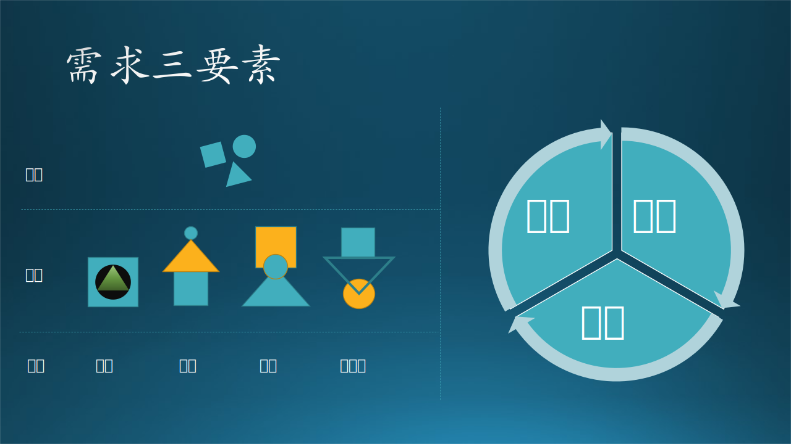
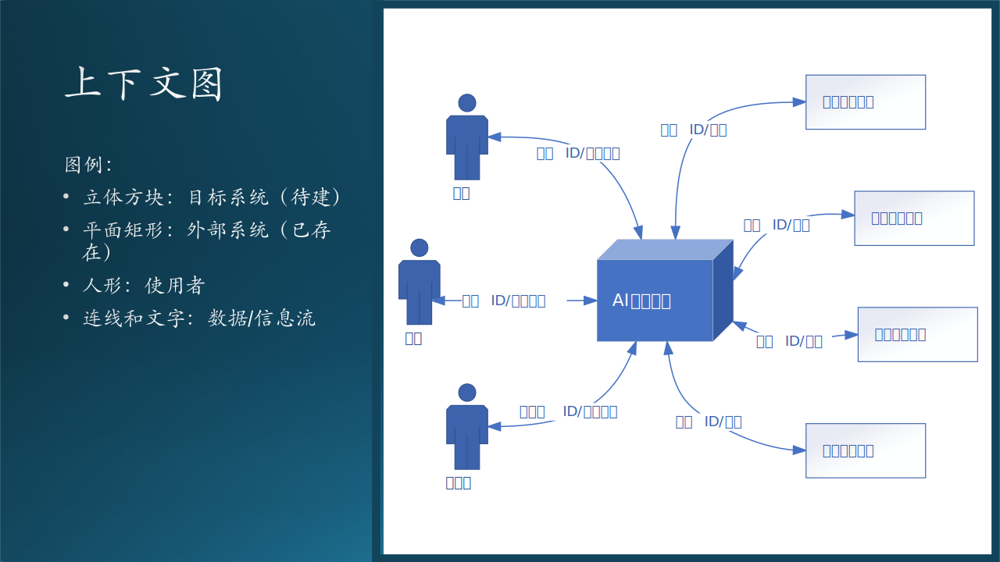
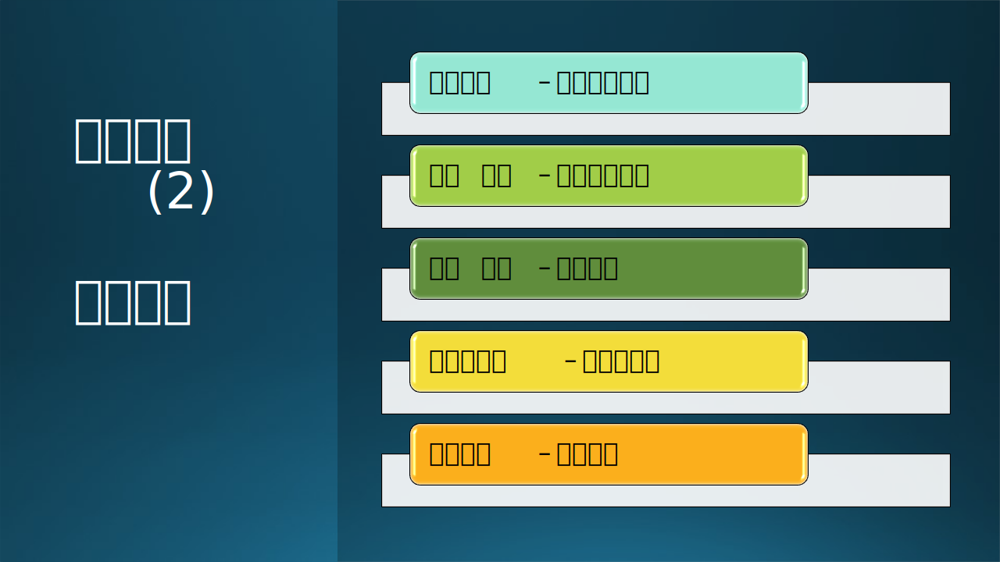
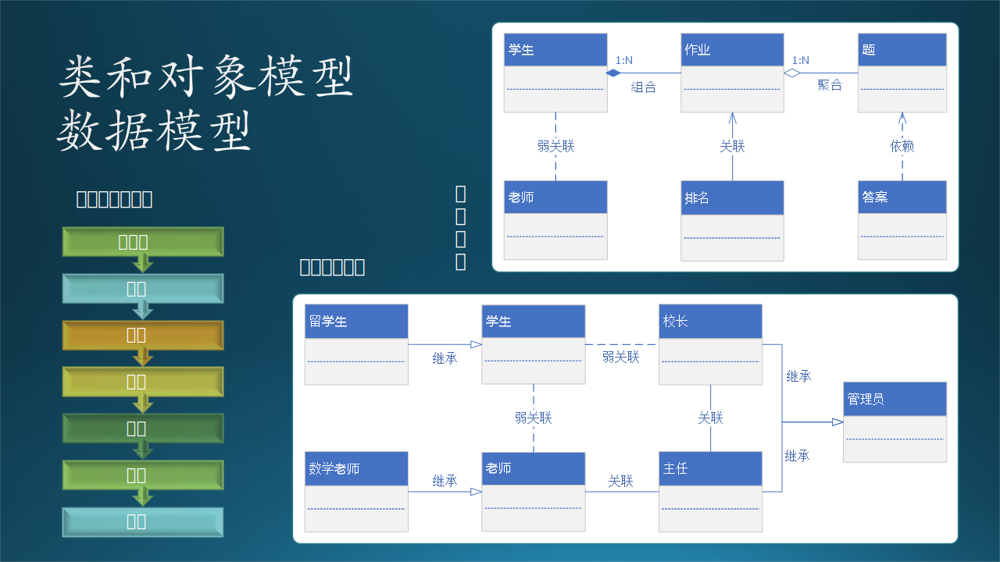
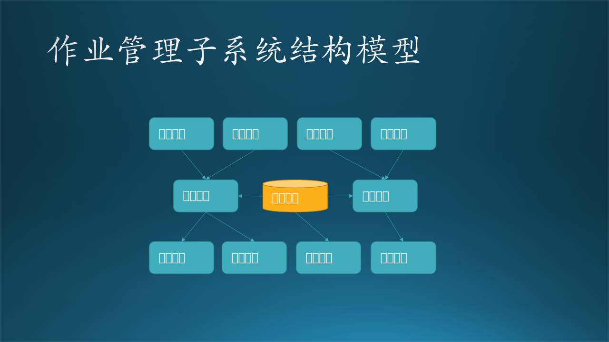

## 7.8 需求分析实例

### 7.8.1 用户模型

这是做技术需求分析的第一步，在这一步中，我们要建立“用户模型视图”。我们使用 6.3 节中的 AI 教学需求来作为例子进行分析，步骤如下：

图 7.7.1 用户模型的建立方法

1. 这个视图从用户（在UML中叫做参与者）角度来审视系统，通过上下文图来确定系统边界，我们可以用一个“空的鸡蛋筐”来比喻这个系统。

2. 使用用例图来建立模型，每个用例好比一个鸡蛋，在这一阶段我们不需要探查鸡蛋内部的构造，只需要把所有鸡蛋都放进筐里即可。

3. 有紧密联系的用例可以组织在一起形成子系统，有可能的话，我们尽量把这些子系统也发掘出来，并规划它们的边界。这就好比一堆红皮（含有卵壳卟啉）鸡蛋要和另外一堆白皮鸡蛋分开。

4. 对于复杂的用例，可以进一步细化，定义一些子用例。这就好比鸡蛋堆里混进来一枚大鹅蛋，一口吃不掉，需要拆成几份鸡蛋大小的部分。

5. 用例说明可以帮助后续的人员深入理解，避免理解偏差。相当于给每个鸡蛋注明要做什么菜品和口味。

#### 1. 系统上下文图（Context Diagram）

上下文图是需求分析的第一站，用于确定系统的边界，这对于整个系统的目标/非目标（Go/Non Goal）是非常关键的。

#### 正确的上下文图

我们先看第一张图：

图 7.7.2 上下文图

图7.7.2中有三种图例：

1. 待建系统本身

   中心位置是“AI教学系统”，我们把它看成黑盒子，因为在这个阶段，我们还没有对其进行分析，所以得不到细节。

2. 外部合作者
   
   包括两类：
   - 用户：人机交互。
   - IT 系统：使用计算机网络协议传递消息。

3. 数据/信息流

   有以下几个特点：
   
   - 信息流是双向的；
   - 都是名词，表示信息或者数据；也可以使用动词短语，比如“发送登录请求”，但要求所有信息流的文字是相同的形式，全是名词或者全是动词短语；
   - 可以是协议，也可以是数据格式；
   - 特定规范，如安全性、可用性、吞吐量等。
   
   这些信息将成为设计外部数据接口的依据。当然，在此图中，我们并没有写出所有的信息流，比如：

   - 学生可以提交作业，然后获得作业评分；
   - 老师可以发起命令保存手写板书，然后以邮件形式发送给学生；
   - 管理员可以开启/关闭教学系统。

#### 错误的上下文图

我们再看第二张图：

图 7.7.3 错误的上下文图

根据前面讲述的关于系统上下文图的绘制规则，我们可以看到这张图中存在以下错误：

1. AI教学系统不是黑盒子，多画了两个内部的子系统；
2. 在学生与学生管理系统之间，不应该有那条虚线表示的联系，因为那不属于待建系统的范畴；
3. 在右侧弧形虚线之外，还有一些其它的用例，也不属于待建系统的范畴。

#### 小结

系统上下文图是软件需求分析中的一项很重要的内容，属于DFD（Data Flow Diagram，数据流图）中的最高层次的图，是系统功能的最高抽象。系统上下文图将整个系统看做是一个过程，这个过程实现系统的所有功能。所以上下文图中存在且仅存在一个过程，表示整个系统。

将整个系统功能抽象为单一过程之后，系统本身就变成了一个黑盒，此时只有依据系统与外界的所有交互才能准确界定系统的功能。所以，系统上下文图中需要表示出所有和系统有交互的外部实体，并描述交互的数据流，包括系统输入和输出。

#### 2. 用例图（Use Case）

获得了系统上下文后，我们应该进一步进入待建系统进行分析，这就需要用例图。用例图主要用来描述“用户、需求、系统功能单元”之间的关系。它展示了一个外部用户能够观察到的系统功能模型图。

#### 简单的例子

图 7.7.4 系统与子系统用例

上图中，左侧是一个顶层的用例，表示在 AI 教学系统包含有两个顶层用例：
- 作业子系统
- 实验子系统

当然还会包含其它子系统，我们只用这两个子系统举例说明。

在右侧的图中，深入到作业子系统中，可以看到需要至少4个用例来支持：

- 浏览作业
- 提交作业
- 获得评分
- 获得提升

在上面的图中，一共有四种图例：

1. Actor（参与者），用人形表示，在这里是“学生”。它描述与系统交互的人或物，代表外部实体（如用户，硬件、设备等）；
2. 系统或者子系统边界，用矩形框表示。这里是AI教学系统和作业子系统；
3. 用例，包括子系统用例（作业子系统、实验子系统）和功能用例（浏览作业、提交作业、获得评分、获得提示）。它是执行者与计算机一次典型交互，代表系统某一完整功能。
4. 关联线，表示参与者与用例的交互关系。注意这是一条直线，没有箭头，在旧的版本的UML中是一条指向用例的三角箭头线。

如何发现参与者：

- 谁使用该系统；
- 谁改变系统的数据；
- 谁从系统取信息；
- 谁需要系统的支持以完成日常任务；
- 谁负责维护管理并保持系统正常运行；
- 系统需要应付那些硬件设备；
- 系统需要和哪些外部系统交互；
- 谁对系统运行产生的结果感兴趣。

如何发现用例：

- 参与者需要获取何种功能，需要做什么；
- 参与者需要读取产生、删除、修改或存储；
- 系统发生时间和执行者间是否要通信。

#### 复杂的例子

图 7.7.5 特殊关系的用例

1. 包含（include）关系

左图中，用“提交作业”作为基用例，首先，它“包含”了两个底层用例：

- 下载作业：做作业之前，先要把作业下载下来，包括描述、数据、模型等等；
- 保存作业：作业做了一半，还没到提交的地步，可以先保存起来，留着明天做。

这里用的是“包含”的关系，从基用例指向被包含用例，虚线短箭头，即一个基本用例包含另一个用例行为（要实现基本用例必须满足另一个用例行为）。

2. 泛化（Generalization）关系

其次，提交作业还有可能只是一个抽象的概念，它实际上可以“泛化”为两个实际的用例：
- 提交课堂训练结果作业
- 提交课后复习作业

这里用的是“泛化”的关系，从子用例指向基用例，实线三角箭头，是“一般情况”与“特殊情况”的关系（特殊者指向一般执行者）。

3. 依赖（Dependency）关系

右图中，如果想“获得评分”，必须先“提交作业”，所以这是一个依赖的关系，用虚线长箭头，从向基用例指向被依赖用例，表示没有后者的话，前者无法执行。

4. 扩展（Extend）关系

右图中，在“获得评分”之后，还可以看看整体得分情况，以得到自己的排名，所以“查看成绩排名”是“获得评分”的一个扩展。

这种情况允许一个用例扩展另一个用例提供的功能，与泛化类似，但有更多限制：基本用例必须声明“扩展点”，扩展用例只能在扩展点上增加新行为。

在参与者之间，也可能存在泛化关系，比如“学生”可能会泛化为“本地学生”和“留学生”，“老师”可能会泛化为“本校老师”和“访问学者”。

#### 3. 用例说明

用例说明通常与用例图配合使用，以进一步描绘用例功能，见表 7.7.1。

表7.7.1 - 用例说明表

|项目|内容|
|--|--|
|用例编号|如：ASE-01|
|用例名称|即用例图中的描述，如“浏览作业”|
|参与者|在本例中为“学生”|
|优先级|高、中、低（三者选一）|
|用例说明|如：学生可以浏览老师布置的所有作业历史及最新作业。|
|前置条件|执行本用例前的系统状态，如：学生必须先输入学生ID和课程ID。|
|基本事件流|说明在正常情况下，最常用的流程。如：学生点击“浏览作业”按钮，系统根据课程ID查询作业历史，然后以列表形式在界面上显示。|
|异常事件流|说明在出现错误和其它异常时，和基本流程的不同之处。如：登录失败，课程已到达上限，该课程尚无作业，等等。|
|后置条件|数据库的变化、系统界面变化等，如：学生可以看到作业列表。|

### 7.8.2 结构模型

这是需求分析的第二步，在这一步中，我们要建立“结构模型”。步骤如图7.8.1：

图 7.8.1 结构模型

1. 首先通过数据流图把上一阶段的每个用例都串联起来；
2. 发现用例之间的数据交换关系；   
3. 根据这些数据定义数据结构模型；
4. 确定各个模型之间的关系；
5. 发现隐藏用例，以建立功能模块的集合，形成子系统。

#### 1. 数据流图

每个系统或功能都会涉及到不同角色、业务概念和物品等，这些事物之间会有很多关系，发生很多事情。特别是当我们刚接触新的业务时，最急迫需要解决的问题就是理清楚这些业务概念以及他们之间的关系。数据流图可以帮助我们做到这一点。

数据流图（DFD，Data Flow Diagram），它从数据传递和加工角度，以图形方式来表达系统的逻辑功能、数据在系统内部的逻辑流向和逻辑变换过程，是结构化系统分析方法的主要表达工具及用于表示软件模型的一种图示方法。

#### 作业自动评分的数据流图

我们看看 AI 教育系统的例子中，关于学生作业上传后自动评分的功能是如何实现的，请看图 7.8.2 中的上半部分。

图 7.8.2 数据流图

图 7.8.2 中一共有4种图例：

1. 矩形框图，外部交互方，数据的起点或者终点；
2. 椭圆，数据加工逻辑，是对数据进行处理的单元，接收数据、处理、输出，在目前阶段，不需要考虑具体用什么语言、算法、代码来实现；
3. 双边线，数据存储，可以是文件或数据库，在目前阶段，不需要考虑具体用什么设备来存储。
4. 连线，数据流，如果是处于交互方与加工逻辑之间，或者处于两个加工逻辑之间，则在线上有说明，表明是一种内存数据流。箭头表示流动方向。

图中描绘了系统逻辑模型，没有具体的物理元素，只描绘数据信息在系统中流动处理情况。是非常好的软件设计出发点，因为它反应系统的业务逻辑，确定了模块/函数边界。

我们把“上传作业”、“查询得分”、“查询排名”叫做功能（Function），把这三个的组合叫做“自动判作业”的特性（Feature）。

#### 底层数据流图

在上图中，名称为“处理作业”的加工逻辑可能很复杂，那就需要进一步细化，绘制下一层的数据流图，如图 7.8.2 的下半部分。

大家可以不必纠结图中的加工逻辑的具体细节，比如为什么要有“编码”这一步骤，只需要理解这种分解形式即可。

再比如，我们确实需要“作业存档”这一存储吗？这也属于细节实现，在具体设计时，再根据“需求”进一步讨论。这里说的“需求”并不是用户需求，而是技术需求，如：系统要求每个上传的作业都需要存档，便于后续做分析模型。

#### 小结

画数据流图需要注意的要点：

1. 一个加工的数据不应与输入数据流同名，即使他们的组成成分相同。
2. 保持数据守恒。简单点说，加工处理后的输出数据必须是从加工的输入数据流获得，或者是其产生的数据。
3. 加工必须有输入输出数据流，因为系统不会凭空出现不明数据，这个还是比较好理解的。
4. 所有数据必须由一个外部实体开始，也要从一个外部实体结束。比如图xx中，
5. 外部实体之间不允许存在数据流。
6. 提高数据流图的易懂性。注意合理分解，要把一个加工分解成几个功能相对独立的子加工，这样可以减少加工之间输入、输出数据流的数目，增加数据流图的可理解性。

第5点很有趣，因为会有这样的场景发生：老师训练完一个模型后，用微信通知学生们可以开始推理了。这就是两个外部实体之间存在了数据流，但是，这个数据流（微信）不属于这个系统。我们要想克服这个缺点（即，不使用微信通知），必须给系统增加一个“自动通知”机制：当新模型生成后，系统会自动通过电子邮件、短信等可控方式通知学生们。

我们回忆一下6.6节中的用例图，里面有很多椭圆形的用例，通过名称的对比，我们可以在数据流图中看到同样的椭圆形的“用例”，只不过在这里叫做“加工”。用例图只与外部系统和参与者有关，而数据流图更进一步发掘用例背后的故事，包括逻辑和数据，这样才能形成完整的功能。

数据流图的作用：

1. 数据流图中的数据起点终点，实际上是系统的用户。
2. 数据流图中的加工，就是下一步要设计和编码的模块。
3. 数据流图中的数据，就是下一步要设计的数据库、文件。
4. 数据流中数据源（矩形）与加工（椭圆）的交互，就是下一步要设计的用户界面或者接口。

### 7.8.2 数据模型

“数据流图”的名称本身就非常明确地告诉我们它是着眼于数据的，在画数据流图的时候，一定要仔细考虑实体之间存在的是内存数据流还是外部数据存储，如果是后者，那么就要做进一步的数据模型定义了。

我们仍然用作业自动评分的功能能来举例，分析一下老师、学生、作业、题目、答案、排行榜之间的关系，见图 7.8.4。

图 7.8.4 定义数据模型

笔者强烈反对在目前的需求分析阶段就给每个数据实体填上属性（字段），那应该是在设计阶段才完成的事情。所以在图6.6.4中，大家可以看到每个数据实体的属性字段都是空着的。

#### “老师”与“学生” - 关联（Association）

- 老师和学生没有强相关关系；
- 一个老师可以有多个学生；
- 一个学生可以有多个老师。

从严格的数据建模问题上看，老师和学生甚至都没有关系。人们通常所说的“师生关系”，实际上是一种社会关系，而我们这个系统不是为“社会学”而开发的。在教育系统的软件中，除了“班主任”这一特殊职务外，老师和学生实际上是通过课程联系在一起的，即：王老师是学生毛毛的数学课老师。

#### “学生”与“作业” - 组合（Composition）

- 一个学生可以写很多份作业；
- 一份作业只属于一个学生；
- 没有学生，就没有作业。

以上观点是从实例角度来看的，即，有一个叫毛毛的学生，他写了很多份作业，他和作业之间符合有上述三个描述。

#### “作业”与“排行榜” - 关联（Association）

- 作业会得到一个分数，所有的作业的分数按大小排序后，会得到排行榜。所以作业和排行榜是一个关联关系；
- 缺失一个学生的作业，其它学生的作业依然可以形成排行榜；
- 没有排行榜的话，作业依然有它存在的意义。

#### “作业”与“题” - 聚合（Aggregation）

- 作业由很多不同的题聚合而成；
- 题可以脱离作业而存在。

#### “题”与“答案” - 组合（Composition）

- 一个题目可以有多个答案（当然通常只有一个答案）；
- 答案脱离了题目就没有意义了，必须说“这个答案是那个题目的答案之一，而不是别的题目的答案”。

下面我们专门说说组合和聚合的区别，见表7.8.1：

表7.8.1 - 组合和聚合的区别$^{[4]}$

|比较项目|聚合 Aggregation|组合 Composition|
|--|--|--|
|存在|从类独立地存在于主类之外|从类不能独立存在|
|关系|has-a，主类中有一个从类|part-of, contains-a，从类是主类的一部分|
|程度|弱|强|
|图例|空心菱形|实心菱形|
|功能|删除主类不会影响从类|删除主类，从类将无从依靠|
|举例|汽车 vs 轮子和发动机、雁群 vs 大雁|人 vs 大脑和身体，树 vs 树叶|

#### 3. 结构模型

模块划分，层级划分

图 7.8.5 定义数据模型

### 7.8.3 行为模型

这是需求分析的第三步，在这一步中，我们要建立“行为模型”。步骤如图7.9.1：

图 7.9.1 结构模型

这种模型可以用于表示：

- 系统动态和行为，或者是对象的状态和行为；
- 描述了在用户模型视图和结构模型视图中所描述的各种结构元素之间的交互和协作。

请注意：到了这里已经快接近设计范畴了，也就是说，我们已经快破开鸡蛋壳了，一旦破壳，就会进入设计的大门。所以到了这一步，是需求分析的最后一个环节了。说到底，需求分析和系统设计也不是完全隔离的，所以在这一步里有些交融也是合理的。

行为模型视图：这种视图表示了系统动态和行为。它还描述了在用户模型视图和结构模型视图中所描述的各种结构元素之间的交互和协作。

动态模型表示瞬时的、行为化的系统的“控制”性质，规定了对象模型中对象的合法变化序列。即对象的动态行为。
用状态图来描绘对象的状态、触发状态转换的事件、以及对象的行为（对事件的响应）。
每个类的动态行为用一张状态图来描绘，各个类的状态图通过共享事件合并起来，从而构成系统的动态模型

#### 1. 对象状态转换（需求分析阶段）

State Machine，状态转换（迁移）图是描述对象的状态在响应外部的信号后进行转换的一种图形表示。

图 7.9.2 对象级别的状态转换（需求分析阶段）

我们以作业对象为例，绘制出状态转换图，如图 7.9.1。我们可以看到四种图例：

1. 起始和终止状态，圆形；
2. 状态，被观察到的对象行为模式，用圆角矩形表示；
3. 事件或行为，引起状态转换的外界事件，用有方向的连接线表示；
4. 菱形，判断条件。

在需求分析阶段，是对现实世界做状态转换分析。

1. “启示”状态：老师布置作业。比如，老师在课堂上布置作业：“同学们回去后把 CNN 的模型在 Cifar-10 数据集上再跑一遍，自己调参，看看准确率如何”；

2. 学生听到后，把内容记录在小本子上，状态为“已接收”；

3. 学生课下做试验，调整参数，把自己最满意的结果记录下来，成为作业上交，状态为“已提交”；

4. 老师接收到作业后进行批改评测，并把分数记录在案，状态为“已批改”；

5. 如果有不合格的作业，则打回给学生重新做，状态变回“已提交”；

6. 合格的作业最后会回到“终止”状态。

#### 2. 对象状态转换（系统设计阶段）

图 7.9.3 对象级别的状态转换（需求分析阶段）

在需求分析阶段，很容易犯的错误是绘制如图 7.9.3。与图 7.9.2 比较，我们可以看到后者多出来几个状态：

- 未完成
- 已完成
- 批改中

这是为什么呢？

因为前者是现实世界中的状态转换图，是一种（客观）需求分析的结果；而后者是软件世界的状态转换图，是（主观）系统设计的结果。

我们用“未完成”状态为例说明：

- 在现实世界中，未完成的状态确实存在，但是它对环境来说毫无意义：老师最后只看你是不是及时完成了作业，而家长会一直督促你，直到你完成作业。所以，“未完成”状态在现实世界中，从老师的角度来看，是一个不可接受的状态；

- 在软件世界中，如果处于“未完成”状态，学生是可以临时保存作业，留着以后再完成的，所以“未完成”状态对于软件系统（环境）来说，是有意义的：可以保存入磁盘，并可以再次从磁盘加载到内存。

而“已完成”状态的意义是：到达这个状态后，软件系统才会允许提交作业进入下一个状态，相当于软件代替了老师和家长的监督作用：学生没有完成作业就必须完成后才能提交。

“批改中”的作用和“未完成”类似，也是可以保存入磁盘，以后再次加载的。

依赖于软件系统的支持，学生还可以决定：

- 是否在完成作业后，在回过头来修改；
- 是否在提交作业后，在老师还没有批改的前提下，收回作业，做进一步的修改。

也可以用表格来表示这种转换关系，但是不如状态转换图方便理解，如表 7.9.1。

表 7.9.1 - 状态转换表

|从\到|->已接收|->未完成|->已完成|->已提交|->批改中|->已批改|->终止|
|--|--|--|--|--|--|--|--|
|起始->|学生收到作业|||||
|已接收->|x|学生正在写作业|||
|未完成->||x|学生完成作业||
|已完成->||学生修改作业|x|学生提交作业||
|已提交->|||学生收回作业|x|老师批改作业|
|批改中->|||||x|老师完成批改|
|已批改->|||||不合格，学生修改作业|x|作业合格|

#### 3. 系统状态转换（需求分析阶段）

前面我们介绍的是某个对象（类）的微观状态转换，对于一个大系统来说，也是有状态转换的，比如传统的机房系统，如图 7.9.3 所示：

图 7.9.4 系统状态转换

转换过程解释：

1. 平时，机房处于关闭状态，节省电力，封闭管理硬件资源；
2. 机房管理员可以开启机房，达到空闲状态；
3. 也可以关闭系统，从空闲状态返回关闭状态；
4. 有学生上机时，系统进入繁忙状态；
5. 所有学生完成实验后，系统从繁忙状态返回空闲状态；
6. 如果有紧急情况发生，比如火灾、地震等，机房管理员会直接关闭所有电源，回到关闭状态。

这种系统级别的状态转换，是属于需求分析阶段还是属于系统设计阶段呢？有两种看法：

- 可以算作需求的一部分：需求方根据以往的经验，或者借鉴它人的经验，提出这个需求。当然，用户的需求可能是很简单的一句话：“当系统太忙的时候，我们需要得到通知。”
- 也可以算作设计的一部分：需求方没有想到这一点，而是需求分析人员或者系统设计人员从技术角度给与的建议，需要征求用户的同意后，成为技术需求的一部分。

笔者倾向于后一种看法，即它是系统设计的一部分，所以在需求分析阶段，可以不绘制这张图，而是留在系统设计阶段再拿出来。

#### 4. 系统状态转换（系统设计阶段）

前面我们介绍的是某个对象（类）的微观状态转换，对于一个大系统来说，也是有状态转换的，比如AI教育系统中的训练子系统，如图 7.9.5 所示，图中左侧列出了状态转换表。

图 7.9.5 系统状态转换

转换过程解释：

1. 平时，训练子系统处于关闭状态，因为计划租用 Azure GPU 硬件，所以关闭时并不付费；
2. 管理员可以开启系统，达到空闲状态；也可以关闭系统，从空闲状态返回关闭状态；
3. 有新的任务进入队列后，系统进入繁忙状态；所有任务处理完毕后，系统从繁忙状态返回空闲状态；
4. 如果队列超长，系统会报警而进入“过热”状态，其实并非硬件温度过热，而是指系统的使用程度“过热”。这种报警的目的是让系统管理员知道情况，便于后期调整资源安排，比如忙时多加几台机器。当队列缩短后，系统返回“繁忙”状态。
5. 如果有硬件损坏或者掉电等情况，或者是管理员强制关闭系统，会返回到“关闭”状态，但是此事件极少发生。

