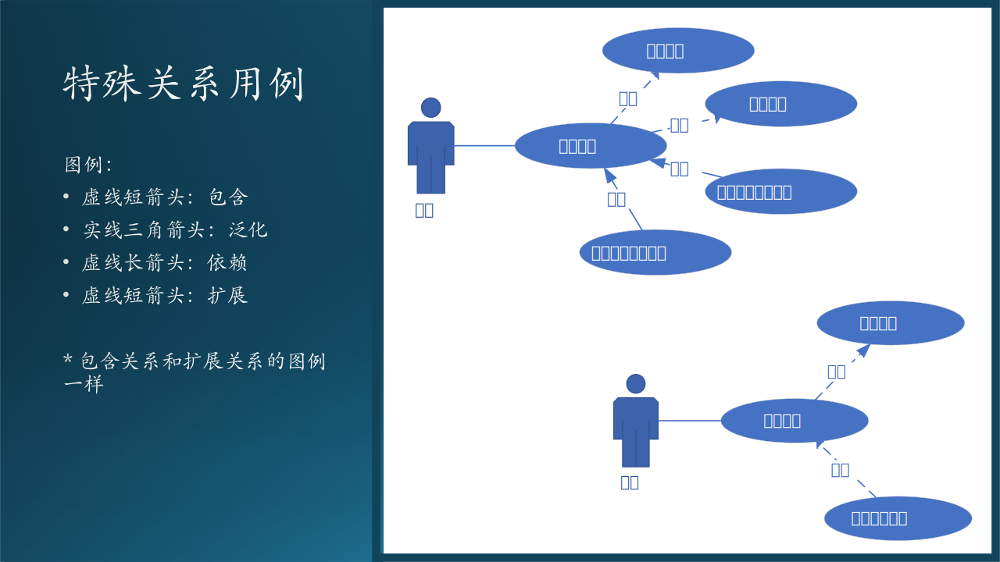
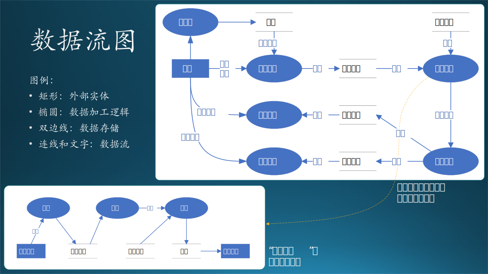

## 7.8 需求技术分析 1：用户模型

这是做技术需求分析的第一步，这是技术分析三部曲中最重要的一步。在这一步中，我们要建立“用户模型视图”。我们使用 7.2 节中的 AI 教学需求来作为例子进行分析，步骤如图 7-29 所示：

图 7-29 用户模型的建立方法

步骤如下：

（1）确定边界

   首先要确定系统的边界，把待建系统看作一个黑盒子，绘出系统上下文图。

（2）寻找用例

   - 在需求调研时，每个参与者都会描述自己要做的事情，叫做用例，把参与者和几个用例联系起来建立用例图。
   - 有紧密联系的用例可以组织在一起形成子系统，有可能的话，我们尽量把这些子系统也发掘出来，并规划它们的边界。
   - 对于复杂的用例，可以进一步细化，定义一些子用例。

（3）描述细节

   用例说明可以帮助后续的人员深入理解，避免理解偏差。

（4）寻找数据

   使用数据流图把用例联系起来，并进一步发现数据，因为用例一般都会产生数据，并且会有别的用例来处理数据。

（5）描述数据

   数据字典可以把第 4 步中的数据整理成表格，便于后续设计开发。

### 7.8.1 系统上下文图（Context Diagram）

上下文图是需求分析的第一站，用于确定系统的边界，这对于整个系统的目标/非目标（Go/Non Goal）是非常关键的。

#### 1. 正确的上下文图

图 7-30 正确的上下文图

图 7-30 中有三种图例：

- 待建系统本身

   中心位置是“AI教学系统”，我们把它看成黑盒子，因为在这个阶段，我们还没有对其进行分析，所以得不到细节。

- 外部合作者，包括两类：
   - 用户：人机交互。
   - IT 系统：使用计算机网络协议传递消息。

- 数据/信息流，有以下几个特点：
   
   - 信息流是双向的；
   - 都是名词，表示信息或者数据；也可以使用动词短语，比如“发送登录请求”，但要求所有信息流的文字是相同的形式，全是名词或者全是动词短语；
   - 可以是协议，也可以是数据格式；
   - 也可以是特定规范，如安全性、可用性、吞吐量等。
   
   这些信息将成为设计外部数据接口的依据。当然，在此图中，我们并没有写出所有的信息流，比如：

   - 学生可以提交作业，然后获得作业评分；
   - 老师可以发起命令保存手写板书，然后以邮件形式发送给学生；
   - 管理员可以开启/关闭教学系统。

#### 2. 错误的上下文图

图 7-31 错误的上下文图

根据前面讲述的关于系统上下文图的绘制规则，我们可以看到这图 7-31 中存在以下错误：

- AI 教学系统不是黑盒子，多画了两个内部的子系统；
- 在学生与学生管理系统之间，不应该有那条虚线表示的联系，因为那不属于待建系统的范畴；
- 在右侧弧形虚线之外，还有一些其它的用例，也不属于待建系统的范畴。

【最佳实践】

- 系统上下文图是软件需求分析中的一项很重要的内容，属于DFD（Data Flow Diagram，数据流图）中的最高层次的图，是系统功能的最高抽象。系统上下文图将整个系统看做是一个过程，这个过程实现系统的所有功能。所以上下文图中存在且仅存在一个过程，表示整个系统。

- 将整个系统功能抽象为单一过程之后，系统本身就变成了一个黑盒，此时只有依据系统与外界的所有交互才能准确界定系统的功能。所以，系统上下文图中需要表示出所有和系统有交互的外部实体，并描述交互的数据流，包括系统输入和输出。

### 7.8.2 用例图（Use Case）与子系统

获得了系统上下文后，我们应该进一步进入待建系统进行分析，这就需要用例图。用例图主要用来描述“用户、需求、系统功能单元”之间的关系。它展示了一个外部用户能够观察到的系统功能模型图。

#### 1. 简单的例子

图 7-32 用例与子系统

图 7-32 中，左侧是一个顶层的用例，表示在 AI 教学系统包含有两个顶层用例：

- 作业子系统
- 实验子系统

当然还会包含其它子系统，我们只用这两个子系统举例说明。有时候子系统并不是自然存在的，或者说它不反映客观世界的真实存在，而是人为创建出来的。比如，作业子系统可以包含评分功能，也可以单独创建一个评分子系统，取决于评分功能是否很复杂、是否可以被其它上层系统共用。

在图 7-32 右侧下角，深入到作业子系统中，可以看到需要至少 4 个用例来支持：

- 浏览作业
- 提交作业
- 获得评分
- 获得提示

在上面的图中，一共有四种图例：

- Actor（参与者），用人形表示，在这里是“学生”。它描述与系统交互的人或物，代表外部实体（如用户，硬件、设备等）；
- 系统或者子系统边界，用矩形框表示。这里是AI教学系统和作业子系统；
- 用例，包括子系统用例（作业子系统、实验子系统）和功能用例（浏览作业、提交作业、获得评分、获得提示）。它是执行者与计算机一次典型交互，代表系统某一完整功能。
- 关联线，表示参与者与用例的交互关系。注意这是一条直线，没有箭头，在旧的版本的UML中是一条指向用例的三角箭头线。

【最佳实践】如何发现参与者：

- 谁使用该系统；
- 谁改变系统的数据；
- 谁从系统取信息；
- 谁需要系统的支持以完成日常任务；
- 谁负责维护管理并保持系统正常运行；
- 系统需要应付那些硬件设备；
- 系统需要和哪些外部系统交互；
- 谁对系统运行产生的结果感兴趣。

【最佳实践】如何发现用例：

- 参与者需要获取何种功能，需要做什么；
- 参与者需要读取产生、删除、修改或存储；
- 系统发生时间和执行者间是否要通信。

#### 2. 复杂的例子

图 7-33 特殊关系的用例

图 7-33 是一些包括特殊关系的用例。

- 包含（include）关系

   左图中，用“提交作业”作为基用例，首先，它“包含”了两个底层用例：

   - 下载作业：做作业之前，先要把作业下载下来，包括描述、数据、模型等等；
   - 保存作业：作业做了一半，还没到提交的地步，可以先保存起来，留着明天做。

   这里用的是“包含”的关系，从基用例指向被包含用例，虚线短箭头，即一个基本用例包含另一个用例行为（要实现基本用例必须满足另一个用例行为）。

- 泛化（Generalization）关系

   其次，提交作业还有可能只是一个抽象的概念，它实际上可以“泛化”为两个实际的用例：
   - 提交课堂训练结果作业
   - 提交课后复习作业

   这里用的是“泛化”的关系，从子用例指向基用例，实线三角箭头，是“一般情况”与“特殊情况”的关系（特殊者指向一般执行者）。

- 依赖（Dependency）关系

   右图中，如果想“获得评分”，必须先“提交作业”，所以这是一个依赖的关系，用虚线长箭头，从向基用例指向被依赖用例，表示没有后者的话，前者无法执行。

- 扩展（Extend）关系

   右图中，在“获得评分”之后，还可以看看整体得分情况，以得到自己的排名，所以“查看成绩排名”是“获得评分”的一个扩展。

   这种情况允许一个用例扩展另一个用例提供的功能，与泛化类似，但有更多限制：基本用例必须声明“扩展点”，扩展用例只能在扩展点上增加新行为。

   在参与者之间，也可能存在泛化关系，比如“学生”可能会泛化为“本地学生”和“留学生”，“老师”可能会泛化为“本校老师”和“访问学者”。

【最佳实践】最开始时，这四种关系不是很容易分清楚，可以先不分青红皂白地把所有用例都罗列出来，然后再把有关联的用例放到一起，看看它们是什么关系。因为这些关系将来在设计时会变成继承、扩展、关联、组合、聚合等具体实现手段。

### 7.8.3 用例说明

用例说明通常与用例图配合使用，以进一步描绘用例功能，见表 7-5。

表 7-5 用例说明表

|项目|内容|
|--|--|
|用例编号|如：ASE-01|
|用例名称|即用例图中的描述，如“浏览作业”|
|参与者|在本例中为“学生”|
|优先级|高、中、低（三者选一，高：必须做；中：最好做；低：有时间再做）|
|用例说明|如：学生可以浏览老师布置的所有作业历史及最新作业。|
|前置条件|执行本用例前的系统状态，如：学生必须先输入学生ID和课程ID。|
|基本事件流|说明在正常情况下，最常用的流程。如：学生点击“浏览作业”按钮，系统根据课程ID查询作业历史，然后以列表形式在界面上显示。|
|异常事件流|说明在出现错误和其它异常时，和基本流程的不同之处。如：登录失败，课程已到达上限，该课程尚无作业，等等。|
|后置条件|数据库的变化、系统界面变化等，如：学生可以看到作业列表。|

### 7.8.4 数据流图

严格来说，数据流图不属于面向对象分析方法，而是结构化分析方法。但是，面向对象分析方法中没有任何一种图可以代替数据流图的作用，反之，数据流图非常适合于在需求分析阶段用流程化的方式寻找对象、加工、数据流和数据存储。有些人说数据流图有缺点，但是又没有说清楚有哪些缺点，单纯地因为它不属于 OOA 体系而弃用，这种做法不可取。

每个系统或功能都会涉及到不同角色、业务概念和物品等，这些事物之间会有很多关系，发生很多事情。特别是当我们刚接触新的业务时，最急迫需要解决的问题就是理清楚这些业务概念以及他们之间的关系。数据流图可以帮助我们做到这一点。

数据流图（DFD，Data Flow Diagram），它从数据传递和加工角度，以图形方式来表达系统的逻辑功能、数据在系统内部的逻辑流向和逻辑变换过程，是结构化系统分析方法的主要表达工具及用于表示软件模型的一种图示方法。

#### 1. 上层数据流图

我们一起看看在 AI 教学系统的例子中，关于学生作业上传后自动评分的功能是如何实现的。请看图 7-34 中右上部分。

图 7-34 数据流图

图 7-34 中一共有 4 种图例：

- 矩形框图：外部实体，等同于用例图中的参与者，是流程的起点或者终点。
- 椭圆：数据加工逻辑，是对数据进行处理的单元，接收数据、处理、输出，在目前阶段，不需要考虑具体用什么语言、算法、代码来实现；
- 双边线：数据存储，可以是文件或数据库，在目前阶段，不需要考虑具体用什么设备来存储。
- 连线和文字：数据流，如果是处于交互方与加工逻辑之间，或者处于两个加工逻辑之间，则在线上有说明，表明是一种内存数据流。箭头表示数据流动方向。

我们把“上传作业”、“查询得分”、“查询排名”叫做功能（Function），把这三个的组合叫做“自动判作业”的特性（Feature）。

【最佳实践】数据流图中包含了系统逻辑模型，没有具体的物理元素，只描绘数据信息在系统中流动处理情况。它是非常好的软件设计出发点，因为它反应系统的业务逻辑，确定了模块/函数边界，同时确定了数据存储内容。

#### 2. 底层数据流图

名称为“处理作业”的加工逻辑可能很复杂，那就需要进一步细化，绘制下一层的数据流图，如图 7-34 的左下部分。有两点需要简单说明一下：

- 大家可以不必纠结图中的加工逻辑的具体细节，比如为什么要有“编码”这一步骤，只需要理解这种分解形式即可。

- 再比如，我们确实需要“作业存档”这一存储吗？这也属于细节实现，在具体设计时，再根据“需求”进一步讨论。这里说的“需求”并不是用户需求，而是技术需求，如：系统要求每个上传的作业都需要存档，便于后续做分析模型。而从用户角度看，这个存档可能没啥用。

【最佳实践】底层数据流图不是必须有，最好是能在一个图里画出来所有的内容。如果需要上下两层数据流图，最好能尽量拉开两层之间的“距离”，即业务分层。

#### 3. 最佳实践

画数据流图需要注意的要点：

- 一个加工的数据不应与输入数据流同名，即使他们的组成成分相同。
- 保持数据守恒。简单点说，加工处理后的输出数据必须是从加工的输入数据流获得，或者是其产生的数据。
- 加工必须有输入输出数据流，因为系统不会凭空出现不明数据，这个还是比较好理解的。
- 所有数据必须由一个外部实体开始，也要从一个外部实体结束。
- 外部实体之间不允许存在数据流。
- 提高数据流图的易懂性。注意合理分解，要把一个加工分解成几个功能相对独立的子加工，这样可以减少加工之间输入、输出数据流的数目，增加数据流图的可理解性。

第 5 点很有趣（外部实体之间不允许存在数据流），因为会有这样的场景发生：老师训练完一个模型后，用微信通知学生们可以开始推理了。这就是两个外部实体（老师和学生）之间存在了数据流。但是，这个数据流（微信消息）不属于这个系统。我们要想克服这个缺点（即，不使用手工发送微信通知），必须给系统增加一个“自动通知”机制：当新模型生成后，系统会自动通过电子邮件、短信等可控方式通知学生们。这就帮助我们完善了系统设计。

我们回忆一下上面的用例图，里面有很多椭圆形的用例，通过名称的对比，我们可以在数据流图中看到同样的椭圆形的“用例”，只不过在这里叫做“加工”。用例图只与外部系统和参与者有关，而数据流图更进一步发掘用例背后的故事，包括逻辑和数据，这样才能形成完整的功能。

最后总结一下数据流图的作用：

- 数据流图中的数据起点终点，实际上是系统的用户。
- 数据流图中的加工，就是下一步要设计和编码的模块。
- 数据流图中的数据，就是下一步要设计的数据库、文件。
- 数据流中数据源（矩形）与加工（椭圆）的交互，就是下一步要设计的用户界面或者接口。

### 7.8.5 数据字典（Data Dictionary）

用例有用例说明来做详细说明，而对于数据流图中的数据，同样可以有数据字典来做详细说明。尤其是面对数据量大的软件系统，如企业信息管理系统，如果没有数据字典的帮助，没有人可以记住所有数据项的来龙去脉，在后期的设计和开发中会产生歧义。

数据字典的格式非常容易理解，下面我们把图 7-34 右上图的数据流图的数据字典作为例子，分成 5 类条目列在下面。在 5 张表中，有些条目看似重复，但作用不同。

#### 1. 数据项条目

表 7-6 数据项条目

|数据项名|含义|别名|类型|举例|取值含义|
|-|-|-|-|-|-|
|学生编号|唯一识别一个学生|学号|字符+数字|J086301|J-计算机系,08年,63专业,01号学生|
|作业编号|唯一标识一个作业|N/A|字符+数字|NZ0001|N-神经网络课,0001号作业|
|题目编号|唯一表示一个题目|题号|字符+数字|NQ001|N-神经网络课,Q-题目,001号题目|
|答案编号|唯一表示题目的答案||字符+数字|NA001|N-神经网络课,A-答案,001号答案|
|分数|作业的分数||数字|95|0-100之间的整数|
|排名|作业成绩的排名||数字|11|1-N之间的整数,N是学生总数|
|作业数据|作业的内容||字符||
|......|

数据项条目中的每一条都是一个原子级别的数据，不可再分，它用来组下面的其它数据。

#### 2. 数据结构条目

表 7-7 数据结构条目

|数据结构名|数据项组成|
|-|-|
|成绩|学生编号,作业编号,分数|
|作业|学生编号,作业编号,作业内容数据|
|名次|学生编号,作业编号,全院排名,年级排名,班级排名,历史排名|
|答案|答案编号,答案内容数据|
|......|

数据结构中的数据项都由表 7-7 中的条目组成。当然，也可以直接把数据结构中的各项展开，把数据项条目纳入进来。

#### 3. 数据流条目

表 7-8 数据流条目

|数据流名|来源|去向|说明|
|-|-|-|-|
|作业|学生|作业存储|电子版，数据文件|
|得分|自动评分模块|得分存储|作业得分（写）|
|成绩|得分存储|查询成绩加工|作业得分（读）|
|排名|自动评分模块|排名存储|成绩排名（写）|
|排名|排名存储|查询名次加工|成绩排名（读）|
|答案|题库|处理作业加工|每道题的电子答案|
|匹配结果|处理作业加工|自动评分加工|作业与标准答案的匹配程度|
|......|

数据流条目基本上就是数据结构，但是它的侧重点在来源和去向上。

#### 4. 数据存储条目

表 7-9 数据存储条目

|数据存储名|说明|
|-|-|
|作业存储|每个学生的每次作业都以系统内部的自定义格式单独存储|
|题目与答案|题目和答案存放在一起，每个题目对应一个答案|
|作业得分|每个学生的每个作业的得分|
|成绩排名|每个学生的每个作业的年级排名|

数据存储中也主要是保存数据结构中描述的东西，在本例中，每个数据结构对应一个存储表。

#### 5. 加工条目

表 7-10 加工条目

|加工名称|输入数据流|输出数据流|说明|
|-|-|-|-|
|上传作业|学号，电子版作业文件|作业编号|学生登录系统后上传自己的作业文件|
|查询得分|学号|作业得分|学生登陆后查询自己的作业得分|
|处理作业|作业编号，正确答案|题目与答案|系统后台自动处理积压的作业|
|......|

加工条目需要把处理逻辑讲清楚。
