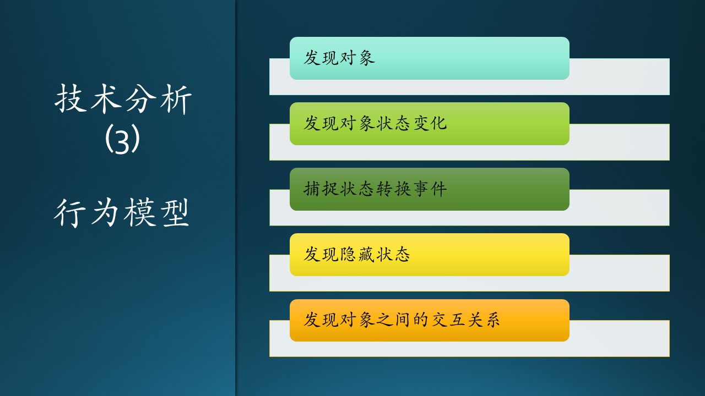
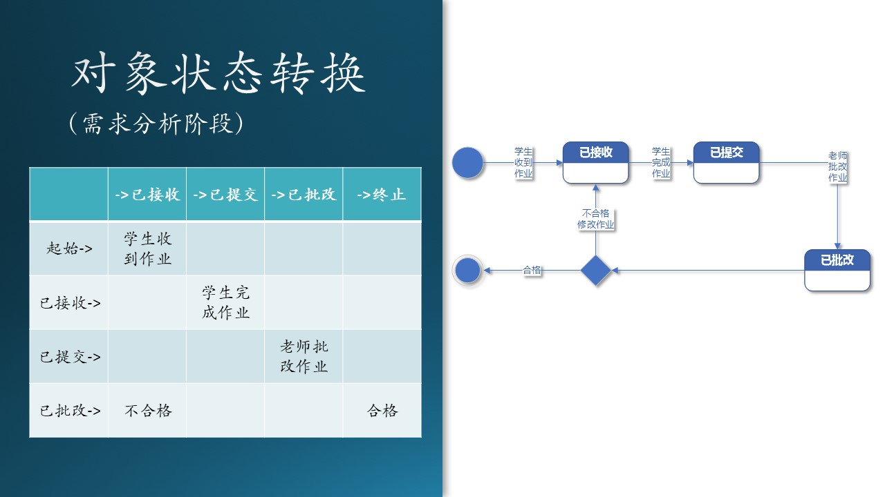
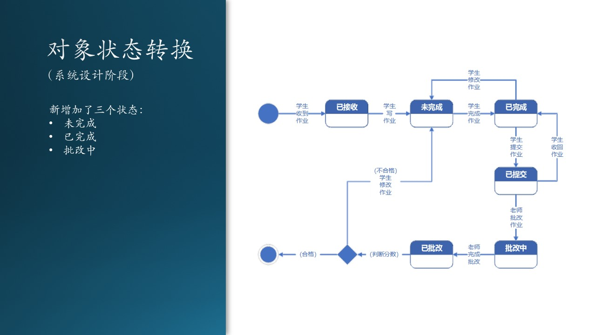
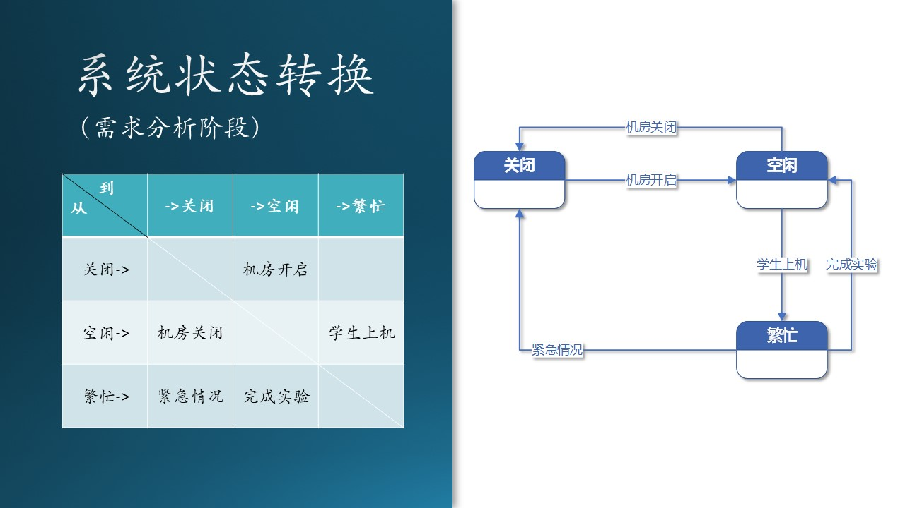
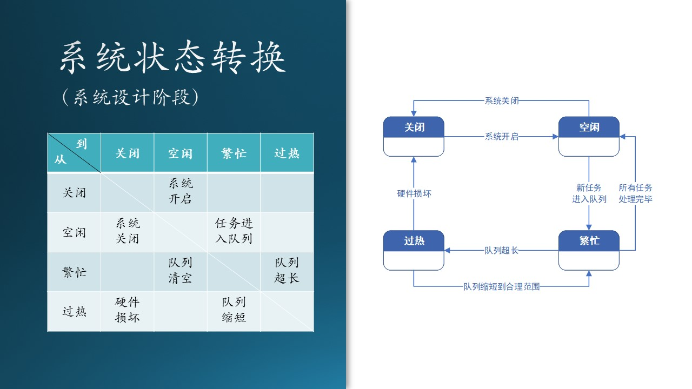

## 7.9 状态转换与行为模型

这是需求分析的第三步，在这一步中，我们要建立“行为模型”。步骤如图7.9.1：

图 7.9.1 - 结构模型

这种模型可以用于表示：

- 系统动态和行为，或者是对象的状态和行为；
- 描述了在用户模型视图和结构模型视图中所描述的各种结构元素之间的交互和协作。

请注意：到了这里已经快接近设计范畴了，也就是说，我们已经快破开鸡蛋壳了，一旦破壳，就会进入设计的大门。所以到了这一步，是需求分析的最后一个环节了。说到底，需求分析和系统设计也不是完全隔离的，所以在这一步里有些交融也是合理的。

行为模型视图：这种视图表示了系统动态和行为。它还描述了在用户模型视图和结构模型视图中所描述的各种结构元素之间的交互和协作。

动态模型表示瞬时的、行为化的系统的“控制”性质，规定了对象模型中对象的合法变化序列。即对象的动态行为。
用状态图来描绘对象的状态、触发状态转换的事件、以及对象的行为（对事件的响应）。
每个类的动态行为用一张状态图来描绘，各个类的状态图通过共享事件合并起来，从而构成系统的动态模型

### 7.9.1 对象状态转换（需求分析阶段）

State Machine，状态转换（迁移）图是描述对象的状态在响应外部的信号后进行转换的一种图形表示。

图 7.9.2 - 对象级别的状态转换（需求分析阶段）

我们以作业对象为例，绘制出状态转换图，如图 7.9.1。我们可以看到四种图例：

1. 起始和终止状态，圆形；
2. 状态，被观察到的对象行为模式，用圆角矩形表示；
3. 事件或行为，引起状态转换的外界事件，用有方向的连接线表示；
4. 菱形，判断条件。

在需求分析阶段，是对现实世界做状态转换分析。

1. “启示”状态：老师布置作业。比如，老师在课堂上布置作业：“同学们回去后把 CNN 的模型在 Cifar-10 数据集上再跑一遍，自己调参，看看准确率如何”；

2. 学生听到后，把内容记录在小本子上，状态为“已接收”；

3. 学生课下做试验，调整参数，把自己最满意的结果记录下来，成为作业上交，状态为“已提交”；

4. 老师接收到作业后进行批改评测，并把分数记录在案，状态为“已批改”；

5. 如果有不合格的作业，则打回给学生重新做，状态变回“已提交”；

6. 合格的作业最后会回到“终止”状态。

### 7.9.2 对象状态转换（系统设计阶段）

图 7.9.3 - 对象级别的状态转换（需求分析阶段）

在需求分析阶段，很容易犯的错误是绘制如图 7.9.3。与图 7.9.2 比较，我们可以看到后者多出来几个状态：

- 未完成
- 已完成
- 批改中

这是为什么呢？

因为前者是现实世界中的状态转换图，是一种（客观）需求分析的结果；而后者是软件世界的状态转换图，是（主观）系统设计的结果。

我们用“未完成”状态为例说明：

- 在现实世界中，未完成的状态确实存在，但是它对环境来说毫无意义：老师最后只看你是不是及时完成了作业，而家长会一直督促你，直到你完成作业。所以，“未完成”状态在现实世界中，从老师的角度来看，是一个不可接受的状态；

- 在软件世界中，如果处于“未完成”状态，学生是可以临时保存作业，留着以后再完成的，所以“未完成”状态对于软件系统（环境）来说，是有意义的：可以保存入磁盘，并可以再次从磁盘加载到内存。

而“已完成”状态的意义是：到达这个状态后，软件系统才会允许提交作业进入下一个状态，相当于软件代替了老师和家长的监督作用：学生没有完成作业就必须完成后才能提交。

“批改中”的作用和“未完成”类似，也是可以保存入磁盘，以后再次加载的。

依赖于软件系统的支持，学生还可以决定：

- 是否在完成作业后，在回过头来修改；
- 是否在提交作业后，在老师还没有批改的前提下，收回作业，做进一步的修改。

也可以用表格来表示这种转换关系，但是不如状态转换图方便理解，如表 7.9.1。

表 7.9.1 - 状态转换表

|从\到|->已接收|->未完成|->已完成|->已提交|->批改中|->已批改|->终止|
|--|--|--|--|--|--|--|--|
|起始->|学生收到作业|||||
|已接收->|x|学生正在写作业|||
|未完成->||x|学生完成作业||
|已完成->||学生修改作业|x|学生提交作业||
|已提交->|||学生收回作业|x|老师批改作业|
|批改中->|||||x|老师完成批改|
|已批改->|||||不合格，学生修改作业|x|作业合格|

### 7.9.3 系统状态转换（需求分析阶段）

前面我们介绍的是某个对象（类）的微观状态转换，对于一个大系统来说，也是有状态转换的，比如传统的机房系统，如图 7.9.3 所示：

图 7.9.4 - 系统状态转换

转换过程解释：

1. 平时，机房处于关闭状态，节省电力，封闭管理硬件资源；
2. 机房管理员可以开启机房，达到空闲状态；
3. 也可以关闭系统，从空闲状态返回关闭状态；
4. 有学生上机时，系统进入繁忙状态；
5. 所有学生完成实验后，系统从繁忙状态返回空闲状态；
6. 如果有紧急情况发生，比如火灾、地震等，机房管理员会直接关闭所有电源，回到关闭状态。

这种系统级别的状态转换，是属于需求分析阶段还是属于系统设计阶段呢？有两种看法：

- 可以算作需求的一部分：需求方根据以往的经验，或者借鉴它人的经验，提出这个需求。当然，用户的需求可能是很简单的一句话：“当系统太忙的时候，我们需要得到通知。”
- 也可以算作设计的一部分：需求方没有想到这一点，而是需求分析人员或者系统设计人员从技术角度给与的建议，需要征求用户的同意后，成为技术需求的一部分。

笔者倾向于后一种看法，即它是系统设计的一部分，所以在需求分析阶段，可以不绘制这张图，而是留在系统设计阶段再拿出来。

### 7.9.4 系统状态转换（系统设计阶段）

前面我们介绍的是某个对象（类）的微观状态转换，对于一个大系统来说，也是有状态转换的，比如AI教育系统中的训练子系统，如图 7.9.5 所示，图中左侧列出了状态转换表。

图 7.9.5 - 系统状态转换

转换过程解释：

1. 平时，训练子系统处于关闭状态，因为计划租用 Azure GPU 硬件，所以关闭时并不付费；
2. 管理员可以开启系统，达到空闲状态；也可以关闭系统，从空闲状态返回关闭状态；
3. 有新的任务进入队列后，系统进入繁忙状态；所有任务处理完毕后，系统从繁忙状态返回空闲状态；
4. 如果队列超长，系统会报警而进入“过热”状态，其实并非硬件温度过热，而是指系统的使用程度“过热”。这种报警的目的是让系统管理员知道情况，便于后期调整资源安排，比如忙时多加几台机器。当队列缩短后，系统返回“繁忙”状态。
5. 如果有硬件损坏或者掉电等情况，或者是管理员强制关闭系统，会返回到“关闭”状态，但是此事件极少发生。

