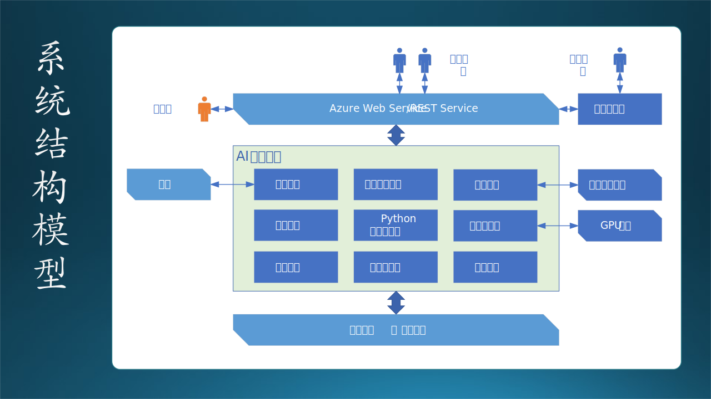

## 7.9 需求技术分析 2：结构模型

在上一步中，我们把在需求调研过程中的所有信息都用各种图及其说明表示了出来

这是需求分析的第二步，在这一步中，我们要建立“结构模型”。步骤如图 7-35：


图 7-35 结构模型

步骤如下：

（1）发现类和对象

   从参与者和待建系统中发现类和对象，定义类和对象的模型。

（2）发现数据
 
   从数据流图和数据字典中，定义数据模型。

（3）细化关系

   一共有七种关系，对于后面的设计和实现工作有着重要的指导意义。

（4）子系统结构

   就某个子系统（对象和功能的集合）建立起静态结构。

（5）系统结构

   子系统结构建立起来后，若干个子系统构成系统。

### 7.9.1 类和对象模型

如 7.7.3 节中所述，在系统三要素中，类和对象属于元素。所以，为了后面的结构和功能的准确性，对于类和对象的要求就是：找全，找准。

关于对象和类，很多教科书上都有丰富的内容可供读者阅读参考，在此不再赘述。这里只拿出一个有趣的问答来启发读者，这个例子是一位网名叫做 daponi 的同行在 CSDN 上的一篇博客。

```txt
面试官：男人和女人是同一个类吗？
应聘者：是同一类。

面试官：钢笔和铅笔是同一个类吗？
应聘者：是同一类。

面试官：男人和钢笔是同一个类吗？
应聘者：（犹豫了3秒钟）不是同一类。
面试官：看来你对基础概念理解的还不到位啊！

面试官：若我是一个完全不懂IT和编程的人，你能给我解释一下什么是对象吗？
应聘者：在JAVA中，对象就是一类数据的实例化，他们有着一种或几种的相同特征。
面试官：你认为一个普通人听得懂这个吗？你只需要说万物皆对象就好，再举几个生活中的例子，没必要去背概念。
```
对于上面这段对话的分析：

- 首先要懂得万物皆对象，对象都是类的实例，而类是对象的抽象。那么我在 Java 中就可以定义男人和钢笔都是 A 类或 B 类或 C 类，而这个类都是看的见或摸的着的特征，亦或是什么都不描述的但就是用来实例化男人和钢笔的类（类可以是你随性定义的），即男人和钢笔是同一类。同理，时间和水是一类吗？思维和手是一类吗？都是的。

其实面试官在这也埋了一个坑：没有交代问题的前提条件。完美的答案应该是：

- 从生活常识角度讲，男人和女人是同一类，钢笔和铅笔是同一类，但男人和钢笔不是同一类。
- 从 Java 中类与对象的关系来说，男人和女人是同一类，钢笔和铅笔是同一类，男人和钢笔也是同一类。
- 从性别角度讲，男人和女人不是一类。
- 女人是单独的一大类，但只有其中一个女人是我的女朋友，即“对象”。

回到本例中，我们需要找出的类都有哪些呢？

- 从参与者和角色的角度可以找到：老师、学生、校长、教务处主任、机房主任等等。系统管理员是不是类？从用户需求上看，它不是；但是从功能需求上看，它是。
- 从系统的角度可以找到：AI 教学系统、作业子系统、实验子系统、外部系统等等。

在图 7-36 中的右下方简单画了一下对象模型的示意图，实际的系统中对象数量和关系肯定要比这个复杂得多。


图 7-36 对象模型和数据模型

类及其关系如下：

- 留学生继承自学生。

  留学生与学生的差别，也就是前者多出来一个国籍、护照号码等，可以在“学生”数据中增加这些冗余的信息来解决继承问题。

- 数学老师继承在老师。
  
  数学老师和老师的区别，在系统中实践上是权限的区别，如：数学老师不能操作英语老师的课件数据和成绩数据，反之亦然。所以可以用权限管理来解决继承问题。

- 老师和学生是弱关联。
- 学生和校长是弱关联。
- 老师和教务处主任是强关联。
- 教务处主任和校长是强关联。
- 老师和校长是弱关联（没有画出）。
- 校长和主任继承自管理员（权限）。

关于类和对象，在需求阶段到了这一步就可以了，下一步我们看看关于数据的问题。

### 7.9.2 数据模型

“数据流图”的名称本身就非常明确地告诉我们它是着眼于数据的，在画数据流图的时候，一定要仔细考虑实体之间存在的是内存数据流还是外部数据存储，如果是后者，那么就要做进一步的数据模型定义了。

从具体业务的数据流图中可以找到关于数据的类：作业、答案、题库、题目、排名等等。

我们仍然用作业自动评分的功能能来举例，分析一下老师、学生、作业、题目、答案、排名之间的关系，见图 7-36 的右上图。

笔者强烈反对在目前的需求分析阶段就给每个数据实体填上属性（字段），那应该是在设计阶段才完成的事情。所以在图 7-36 中，大家可以看到每个数据实体的属性字段都是空着的。

（1）“老师”与“学生”：关联（Association）

老师和学生没有强相关关系，因为：
   - 一个老师可以有多个学生。
   - 一个学生可以有多个老师。

从严格的数据建模问题上看，老师和学生甚至都没有关系。人们通常所说的“师生关系”，实际上是一种社会关系，而我们这个系统不是为“社会学”而开发的。在教育系统的软件中，除了“班主任”这一特殊职务外，老师和学生实际上是通过课程联系在一起的，如：**王老师**是**学生毛毛**的**数学课老师**。

（2）“学生”与“作业”：组合（Composition）

- 一个学生可以写很多份作业；
- 一份作业只属于一个学生；
- 没有学生，就没有作业。

以上观点是从实例角度来看的，即，有一个叫毛毛的学生，他写了很多份作业，他和作业之间符合有上述三个描述。

（3）“作业”与“排行榜”：关联（Association）

- 作业会得到一个分数，所有的作业的分数按大小排序后，会得到排行榜。所以作业和排行榜是一个关联关系；
- 缺失一个学生的作业，其它学生的作业依然可以形成排行榜；
- 没有排行榜的话，作业依然有它存在的意义。

（4）“作业”与“题”：聚合（Aggregation）

- 作业由很多不同的题聚合而成；
- 题可以脱离作业而存在。

（5）“题”与“答案”：依赖（Dependency）

- 一个题目通常只有一个答案；
- 答案脱离了题目就没有意义了，必须说“这个答案是那个题目的答案之一，而不是别的题目的答案”。

### 7.9.3 结构中的组合与聚合

在图 7-36 中左侧，还列出了 7 种对象之间的关系及其强弱程度，由弱到强依次是：弱关联、强关联、聚合、组合、依赖、扩展、继承。下面我们专门说说组合和聚合的区别，见表 7-11：

表 7-11 组合和聚合的区别

|比较项目|聚合（Aggregation）|组合（Composition）|
|--|--|--|
|存在|从类独立地存在于主类之外|从类不能独立存在|
|关系|has-a，主类中有一个从类|part-of, contains-a，从类是主类的一部分|
|程度|弱，低内聚高耦合|强，高内聚低耦合|
|主类|删除主类不会影响从类|删除主类，从类将无从依靠|
|从类|从类随时可以离开主类|从类是主类必不可少的一部分|
|图例|空心菱形|实心菱形|
|举例|汽车/轮子和发动机、雁群/大雁|人/大脑和身体，乐队/吉他|

对于聚合：
- 一只大雁可以在雁群 A 里，也可以在雁群 B 里。
- 拆掉汽车，轮子和发动机还可以放在其它汽车上用。

对于组合：
- 人不能没有大脑和身体，否则不健全甚至死亡。
- 乐队里如果没有吉他会被人笑死，但是在初期可以没有贝斯（尽管也会被嘲笑）。

示例代码如下：

```java
class Band {               // 乐队主类
   private Guitar guitar;  // 吉他，组合
   private Bass bass;      // 贝斯，聚合
   public Band(bassB)       // 贝斯可以临时从外面借，也可以是“空”
   {
        guitar = new Guitar();  // 吉他对乐队很重要，成立乐队时必须有吉他
        bass = bassB            // “黑”贝斯一下
   }
}
```
只有在需求分析阶段定义好这种关系，在设计和实现阶段才能做对。

有些读者可能会较真儿：乐队也可以换吉他手。但我们说的是吉他这个**角色（类）**，而不是指具体的**人（对象）**。

### 7.9.4 子系统结构模型

【最佳实践】一个有经验且负责任的需求分析人员，会把以上的信息最终归结为一张图，让后续的设计人员按图索骥，查找任何信息都很方便。另外一个好处是，可以拿着这张图找客户去做需求确认，这比只拿着一堆密密麻麻的文字去让客户看的效果要好得多。

对于作业管理子系统，我们最终绘制了一张简单的模块静态结构图，如图 7-37 所示。


图 7-37 子系统结构模型

在这个子系统中，简单地列出了一些功能模块，这些模块都是用户要求有的。还象征性地画了一个数据中心，至于存储什么内容、具体什么格式，都需要在设计阶段敲定。如果不画这个数据中心，设计人员可能会认为所有数据都存储在服务器本地硬盘上。

### 7.9.5 系统结构模型

在分析完诸多对象、数据、关系、子系统结构之后，我们在脑海中已经形成了对整个待建系统的轮廓，所以在这个阶段应该把它清晰地绘制出来，以便和客户、用户、开发团队达成共识。如图 7-38 所示。



图 7-38 系统结构模型

在后面第十三章中，我们将会讲到业务场景架构，其实图 7-38 就是业务场景架构的前身，是需求分析人员根据甲方的描述绘出的一种比较原始的系统结构模型。在该图中，描绘了一个宏大的系统结构（架构），给甲方画了一张大饼。但是饭要一口一口地吃，系统要一个一个地做，合同要一个一个地签，对于乙方来说，千万不能在没有任何基础的情况下就给出这么大的一个承诺。

【最佳实践】这种图一般称作蓝图，所以以蓝色为主要色调（kidding）。蓝图主要是给甲方吃定心丸的，表明乙方的实力，但是不能承诺这些东西能被一次搞定。明明每个子系统都可以报价 50 万的，结果乙方把整个系统报价 100 万，这就得不偿失了。
