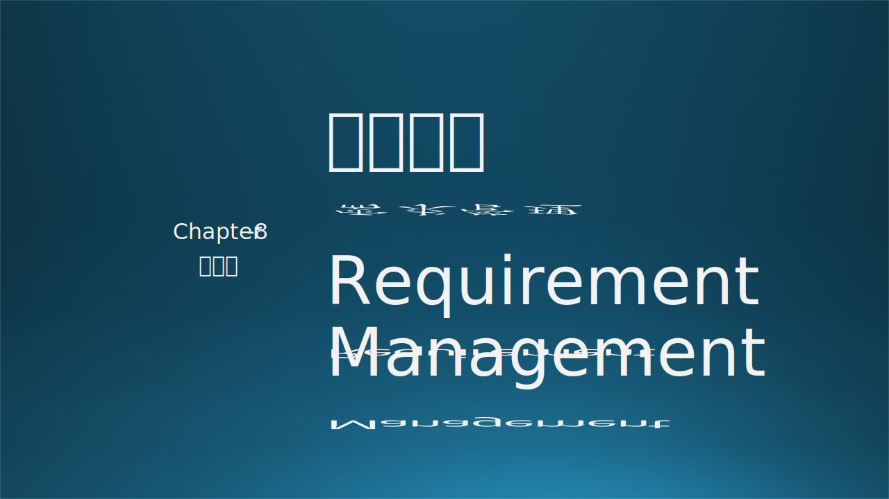
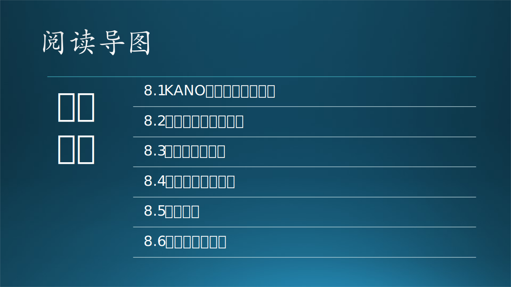

需求分析并非需求阶段最终的任务，最难以把握的其实是本章中讲述的需求管理。本章先用著名的 KANO 模型来分析用户满意度，然后用马斯洛理论讲了竞争策略与软件定位，接下来讲解了需求的正常变更与非正常变革，最后讲述了项目经理的职责，以及需求规格说明书的内容。

### 参考资料

- KANO用户满意度模型 https://en.wikipedia.org/wiki/Kano_model
- KANO分析模型 https://baike.baidu.com/item/KANO%20%E6%A8%A1%E5%9E%8B/19907824
- 马斯洛理论 https://www.simplypsychology.org/maslow.html
- 百度百科《今日头条》https://baike.baidu.com/item/%E4%BB%8A%E6%97%A5%E5%A4%B4%E6%9D%A1/4169373
- 《构建之法》，邹欣，人民邮电出版社
- 《刷新》，萨提亚·纳德拉
